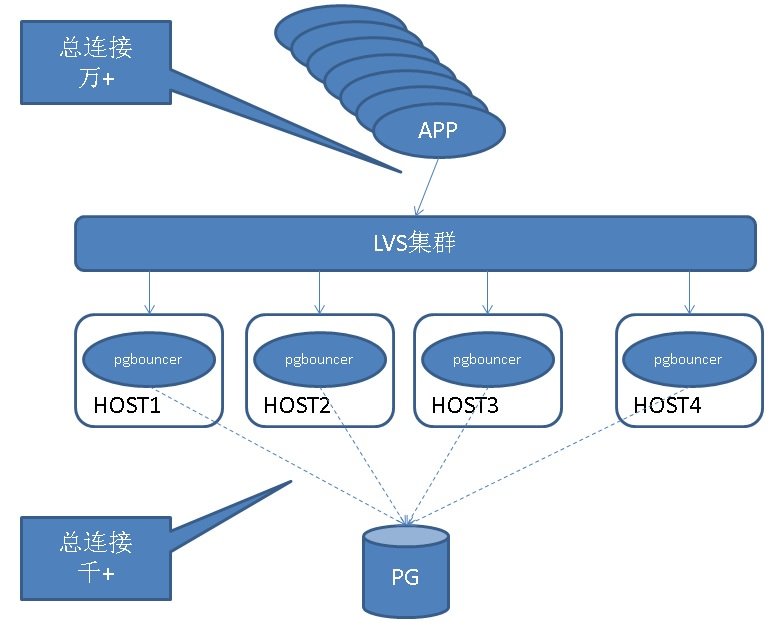

## PostgreSQL 连接池 pgbouncer 使用      
                              
### 作者                              
digoal                              
                              
### 日期                              
2010-05-11                             
                              
### 标签                              
PostgreSQL , pgbouncer , 连接池 , 短连接 , 大并发         
                              
----                              
                              
## 背景       
PostgreSQL与Oracle一样，都是进程模式，每个连接，有一个独立的PROCESS与之交互，所以如果应用有几千个以上的连接连数据库，可能会开始有性能下降（或者有内存浪费的问题，发生OOM）。  
  
[《PostgreSQL Huge Page 使用建议 - 大内存主机、实例注意》](../201803/20180325_02.md)    
  
[《PostgreSQL relcache在长连接应用中的内存霸占"坑"》](../201607/20160709_01.md)    
  
为了解决这个问题，建议使用连接池。    
    
[《PostgresPro buildin pool(内置连接池)版本 原理与测试》](../201805/20180521_03.md)    
  
[《阿里云 RDS PostgreSQL 高并发特性 vs 社区版本 (1.6万并发: 3倍吞吐，240倍响应速度)》](../201805/20180505_07.md)    
    
另外介绍一些postgresql资源网站:     
    
http://pgfoundry.org/    
    
http://pgxn.org/    
    
https://github.com/topics/postgres?l=c&o=desc&s=stars    
    
这里面有非常多和POSTGRESQL相关的资源。      
    
## Pgbouncer 源码    
    
https://pgbouncer.github.io/downloads/     
    
## Pgbouncer 介绍    
### 连接池模式    
1、Session pooling    
    
Most polite method. When client connects, a server connection will be assigned to it for the whole duration it stays connected. When client disconnects, the server connection will be put back into pool.    
    
会话模式，当会话结束时，被会话占用的pgbouncer到PGDB的连接可以被其他会话复用。    
    
适用于短连接，或者其他模式不适用的场景。    
    
不能解决大并发场景连接打满或性能下降的问题（到后端的连接依旧会很多）。    
    
2、Transaction pooling    
    
Server connection is assigned to client only during a transaction. When PgBouncer notices that transaction is over, the server will be put back into pool. This is a hack as it breaks application expectations of backend connection. You can use it only when application cooperates with such usage by not using features that can break. See the table below for breaking features.    
    
事务模式，当事务结束时，被会话占用的pgbouncer到PGDB的连接可以被其他会话复用。    
    
适用于大并发、未使用（游标、绑定变量、消息队列、特殊参数）的场景。    
    
3、Statement pooling    
    
Most aggressive method. This is transaction pooling with a twist multi-statement transactions are disallowed. This is meant to enforce “autocommit” mode on client, mostly targeted for PL/Proxy.    
    
语句模式，当SQL执行完成后，被会话占用的pgbouncer到PGDB的连接可以被其他会话复用。    
    
适用于大并发、未使用（游标、绑定变量、消息队列、特殊参数），并且不需要多语句事务的场景（或者说autocommit的场景）    
    
Feature |Session pooling        |Transaction pooling    
---|---|---    
Startup parameters|     Yes 1|  Yes 1    
SET/RESET|      Yes|    Never    
LISTEN/NOTIFY|  Yes|    Never    
WITHOUT HOLD CURSOR|    Yes|    Yes    
WITH HOLD CURSOR|       Yes 2|  Never    
Protocol-level prepared plans|  Yes 2|  No 3    
PREPARE / DEALLOCATE|   Yes 2|  Never    
ON COMMIT DROP temp tables|     Yes|    Yes    
PRESERVE/DELETE ROWS temp tables|       Yes 2|  Never    
Cached plan reset|      Yes 2|  Yes 2    
LOAD statement| Yes|    Never    
    
### 连接复用    
被会话占用的pgbouncer到PGDB的连接被复用前，（通过pgbouncer.ini配置文件）可以设置重置命令（重置一些会话状态），使用discard即可(配置，执行计划缓存，序列，临时表等)。    
    
```    
postgres=# \h discard    
Command:     DISCARD    
Description: discard session state    
Syntax:    
DISCARD { ALL | PLANS | SEQUENCES | TEMPORARY | TEMP }    
```    
    
## Pgbouncer 使用    
    
### 安装    
https://pgbouncer.github.io/install.html    
    
以PostgreSQL 10, CentOS 7.x为例    
    
root    
    
```    
yum install -y https://dl.fedoraproject.org/pub/epel/epel-release-latest-7.noarch.rpm     
    
yum install -y c-ares-devel openssl-devel libevent-devel make gcc    
```    
    
digoal(PostgreSQL user)    
    
```    
pg_config     
BINDIR = /home/digoal/pgsql10.4/bin    
DOCDIR = /home/digoal/pgsql10.4/share/doc    
HTMLDIR = /home/digoal/pgsql10.4/share/doc    
INCLUDEDIR = /home/digoal/pgsql10.4/include    
PKGINCLUDEDIR = /home/digoal/pgsql10.4/include    
INCLUDEDIR-SERVER = /home/digoal/pgsql10.4/include/server    
LIBDIR = /home/digoal/pgsql10.4/lib    
PKGLIBDIR = /home/digoal/pgsql10.4/lib    
LOCALEDIR = /home/digoal/pgsql10.4/share/locale    
MANDIR = /home/digoal/pgsql10.4/share/man    
SHAREDIR = /home/digoal/pgsql10.4/share    
SYSCONFDIR = /home/digoal/pgsql10.4/etc    
PGXS = /home/digoal/pgsql10.4/lib/pgxs/src/makefiles/pgxs.mk    
CONFIGURE = '--prefix=/home/digoal/pgsql10.4' '--enable-profiling' '--enable-debug' '--enable-dtrace'    
CC = gcc    
CPPFLAGS = -DFRONTEND -D_GNU_SOURCE    
CFLAGS = -Wall -Wmissing-prototypes -Wpointer-arith -Wdeclaration-after-statement -Wendif-labels -Wmissing-format-attribute -Wformat-security -fno-strict-aliasing -fwrapv -fexcess-precision=standard -g -pg -DLINUX_PROFILE -O2    
CFLAGS_SL = -fPIC    
LDFLAGS = -L../../src/common -Wl,--as-needed -Wl,-rpath,'/home/digoal/pgsql10.4/lib',--enable-new-dtags    
LDFLAGS_EX =     
LDFLAGS_SL =     
LIBS = -lpgcommon -lpgport -lpthread -lz -lreadline -lrt -lcrypt -ldl -lm      
VERSION = PostgreSQL 10.4    
```    
    
编译    
    
```    
wget https://pgbouncer.github.io/downloads/files/1.8.1/pgbouncer-1.8.1.tar.gz    
    
tar -zxvf pgbouncer-1.8.1.tar.gz     
    
cd pgbouncer-1.8.1    
    
./configure --prefix=/home/digoal/pb    
    
make    
    
make install    
```    
    
### 配置    
1、配置模板    
    
/home/digoal/pb/share/doc/pgbouncer/pgbouncer.ini    
    
2、帮助文档    
    
/home/digoal/pb/share/man    
    
3、配置文件    
    
```    
cd /home/digoal/pb    
mkdir etc    
mkdir log    
cp share/doc/pgbouncer/pgbouncer.ini ./etc    
cp share/doc/pgbouncer/userlist.txt ./etc    
```    
    
假设数据库有如下（监听、用户、密码）这样的配置    
    
```    
postgres=# show port;    
 port     
------    
 1921    
(1 row)    
    
postgres=# create role test1 login encrypted password 'abc';    
CREATE ROLE    
postgres=# create role test2 login encrypted password 'abcde';    
CREATE ROLE    
postgres=# create role sup login encrypted password 'hello sup';    
CREATE ROLE    
    
-- 所有已有库，执行如下(用于自动获取密码)    
    
create or replace function get_shadow(inout i_usename name, out i_passwd text) returns record as $$     
declare    
begin    
  select usename, passwd into i_usename,i_passwd from pg_shadow where usename=i_usename;     
  return;    
end;    
$$ language plpgsql strict security definer;    
    
revoke ALL ON FUNCTION get_shadow(name) from public;    
    
grant execute on function get_shadow(name) to sup;    
```    
    
配置pgbouncer.ini (自动获取密码)   
    
```    
vi /home/digoal/pb/etc/pgbouncer.ini     
    
[databases]    
* = host=127.0.0.1 port=1921 pool_size=56     
    
[pgbouncer]    
reserve_pool_size=14     
logfile = /home/digoal/pb/log/pgbouncer.log    
pidfile = /home/digoal/pb/etc/pgbouncer.pid    
listen_addr = 0.0.0.0    
listen_port = 4001    
unix_socket_dir = /home/digoal/pb/etc    
unix_socket_mode = 0700    
auth_type = md5    
auth_file = /home/digoal/pb/etc/userlist.txt    
auth_user = sup    
auth_query = select i_usename,i_passwd from get_shadow($1)    
admin_users = pb    
stats_users = pbstat    
pool_mode = transaction    
server_reset_query = DISCARD ALL    
server_check_query = select 1    
max_client_conn = 10000    
default_pool_size = 28    
```    
    
4、密码配置文件    
    
```    
postgres=# select i_usename,i_passwd from get_shadow('sup');    
 i_usename |              i_passwd                   
-----------+-------------------------------------    
 sup       | md5910fab49de61da4ddf3ca8751c1e6257    
(1 row)    
```    
    
```    
vi /home/digoal/pb/etc/userlist.txt    
    
"sup" "md5910fab49de61da4ddf3ca8751c1e6257"    
"pb" "pgbouncer123"    
"pbstat" "test"    
    
chmod 700 /home/digoal/pb/etc/userlist.txt    
```    
    
也可以把所有业务需要用到的DB用户、密码都配到userlist.txt去。    
    
因为目前使用auth_query获取其他用户密码，每个连接会消耗一个额外连接用来获取md5密码（可能是目前pgbouncer的BUG或者缺陷，原本不应该如此）。       
    
    
5、启动pgbouncer    
    
```    
/home/digoal/pb/bin/pgbouncer -d /home/digoal/pb/etc/pgbouncer.ini     
2018-07-15 22:14:57.812 15981 LOG File descriptor limit: 1024000 (H:1024000), max_client_conn: 10000, max fds possible: 10010    
```    
    
### pgbouncer 状态信息、监控    
1、管理pgbouncer    
    
```    
export PGPASSWORD="pgbouncer123"    
    
psql -h 127.0.0.1 -p 4001 -U pb pgbouncer    
    
Password for user pb:     
psql (10.4, server 1.8.1/bouncer)    
Type "help" for help.    
    
pgbouncer=# show help;    
NOTICE:  Console usage    
DETAIL:      
        SHOW HELP|CONFIG|DATABASES|POOLS|CLIENTS|SERVERS|VERSION    
        SHOW FDS|SOCKETS|ACTIVE_SOCKETS|LISTS|MEM    
        SHOW DNS_HOSTS|DNS_ZONES    
        SHOW STATS|STATS_TOTALS|STATS_AVERAGES    
        SET key = arg    
        RELOAD    
        PAUSE [<db>]    
        RESUME [<db>]    
        DISABLE <db>    
        ENABLE <db>    
        KILL <db>    
        SUSPEND    
        SHUTDOWN    
SHOW    
```    
    
2、查看pgbouncer状态，统计信息    
    
```    
export PGPASSWORD="test"    
    
psql -h 127.0.0.1 -p 4001 -U pbstat pgbouncer    
    
psql (10.4, server 1.8.1/bouncer)    
Type "help" for help.    
    
pgbouncer=# show help;    
NOTICE:  Console usage    
DETAIL:      
        SHOW HELP|CONFIG|DATABASES|POOLS|CLIENTS|SERVERS|VERSION    
        SHOW FDS|SOCKETS|ACTIVE_SOCKETS|LISTS|MEM    
        SHOW DNS_HOSTS|DNS_ZONES    
        SHOW STATS|STATS_TOTALS|STATS_AVERAGES    
        SET key = arg    
        RELOAD    
        PAUSE [<db>]    
        RESUME [<db>]    
        DISABLE <db>    
        ENABLE <db>    
        KILL <db>    
        SUSPEND    
        SHUTDOWN    
SHOW    
```    
    
3、连接示例    
    
```    
export PGPASSWORD=abc    
    
psql -h 127.0.0.1 -p 4001 -U test1 template1    
```    
    
### 短连接压测    
1、初始化数据    
    
```    
export PGPASSWORD=abc    
    
pgbench -i -s 100 -h 127.0.0.1 -p 4001 -U test1 postgres    
```    
    
2、使用连接池测试(qps : 11485)    
    
```    
pgbench -M extended -v -r -P 1 -S -C -c 112 -j 112 -T 120 -h 127.0.0.1 -p 4001 -U test1 postgres    
    
transaction type: <builtin: select only>    
scaling factor: 100    
query mode: extended    
number of clients: 112    
number of threads: 112    
duration: 120 s    
number of transactions actually processed: 1378270    
latency average = 3.704 ms    
latency stddev = 0.683 ms    
tps = 11485.135372 (including connections establishing)    
tps = 30075.154406 (excluding connections establishing)    
script statistics:    
 - statement latencies in milliseconds:    
         0.008  \set aid random(1, 100000 * :scale)    
         3.696  SELECT abalance FROM pgbench_accounts WHERE aid = :aid;    
```    
    
3、不使用连接池测试(qps : 294)    
    
```    
pgbench -M extended -v -r -P 1 -S -C -c 112 -j 112 -T 120 -h 127.0.0.1 -p 1921 -U test1 postgres    
    
transaction type: <builtin: select only>    
scaling factor: 100    
query mode: extended    
number of clients: 112    
number of threads: 112    
duration: 120 s    
number of transactions actually processed: 35498    
latency average = 2.880 ms    
latency stddev = 7.096 ms    
tps = 294.256452 (including connections establishing)    
tps = 32220.172124 (excluding connections establishing)    
script statistics:    
 - statement latencies in milliseconds:    
         0.004  \set aid random(1, 100000 * :scale)    
         2.873  SELECT abalance FROM pgbench_accounts WHERE aid = :aid;    
```    
    
### 大并发压测    
[《PostgreSQL pgbench 支持100万连接》](../201805/20180516_02.md)      
    
1、使用连接池测试(qps : 46948)    
    
```    
pgbench -M extended -v -r -P 1 -S -c 1000 -j 1000 -T 120 -h 127.0.0.1 -p 4001 -U test1 postgres    
    
transaction type: <builtin: select only>    
scaling factor: 100    
query mode: extended    
number of clients: 1000    
number of threads: 1000    
duration: 120 s    
number of transactions actually processed: 5635962    
latency average = 21.285 ms    
latency stddev = 0.911 ms    
tps = 46948.818229 (including connections establishing)    
tps = 46954.000336 (excluding connections establishing)    
script statistics:    
 - statement latencies in milliseconds:    
         0.002  \set aid random(1, 100000 * :scale)    
        21.283  SELECT abalance FROM pgbench_accounts WHERE aid = :aid;    
```    
    
2、不使用连接池测试(qps : 162690)    
    
```    
pgbench -M prepared -v -r -P 1 -S -c 1000 -j 1000 -T 120 -h 127.0.0.1 -p 1921 -U test1 postgres    
    
transaction type: <builtin: select only>    
scaling factor: 100    
query mode: prepared    
number of clients: 1000    
number of threads: 1000    
duration: 120 s    
number of transactions actually processed: 19525930    
latency average = 5.996 ms    
latency stddev = 5.220 ms    
tps = 162690.344979 (including connections establishing)    
tps = 166416.141297 (excluding connections establishing)    
script statistics:    
 - statement latencies in milliseconds:    
         0.018  \set aid random(1, 100000 * :scale)    
         6.204  SELECT abalance FROM pgbench_accounts WHERE aid = :aid;    
```    
  
## 建议架构lvs+pgbouncer  
  
  
  
如果是阿里云的客户，可以使用ecs+slb服务。    
  
    
    
## QUICK-START    
    
```    
       Basic setup and usage as following.    
    
       1. Create a pgbouncer.ini file.  Details in pgbouncer(5).  Simple example:    
    
             [databases]    
             template1 = host=127.0.0.1 port=5432 dbname=template1    
    
             [pgbouncer]    
             listen_port = 6543    
             listen_addr = 127.0.0.1    
             auth_type = md5    
             auth_file = users.txt    
             logfile = pgbouncer.log    
             pidfile = pgbouncer.pid    
             admin_users = someuser    
    
       2. Create users.txt file that contains users allowed in:    
    
             "someuser" "same_password_as_in_server"    
    
       3. Launch pgbouncer:    
    
             $ pgbouncer -d pgbouncer.ini    
    
       4. Have your application (or the psql client) connect to pgbouncer instead of directly to PostgreSQL server:    
    
             $ psql -p 6543 -U someuser template1    
    
       5. Manage pgbouncer by connecting to the special administration database pgbouncer and issuing show help; to begin:    
    
             $ psql -p 6543 -U someuser pgbouncer    
             pgbouncer=# show help;    
             NOTICE:  Console usage    
             DETAIL:    
               SHOW [HELP|CONFIG|DATABASES|FDS|POOLS|CLIENTS|SERVERS|SOCKETS|LISTS|VERSION]    
               SET key = arg    
               RELOAD    
               PAUSE    
               SUSPEND    
               RESUME    
               SHUTDOWN    
    
       6. If you made changes to the pgbouncer.ini file, you can reload it with:    
    
             pgbouncer=# RELOAD;    
```    
    
## 小结    
pgbouncer是一个轻量级的连接池，效率高。有效解决了高并发(上下文切换或锁冲突)，短连接(连接开销)场景的性能问题。       
    
建议用户活跃连接超过PostgreSQL实例实际CPU核数20倍(经验值，如果是select only业务，可以更多一些)时，使用pgbouncer缓解压力。配置连接池个数时，建议PB到PG的连接数为数据库实际CPU核数的2~4倍。        
    
对于长事务用户，可以单独配置其POOL（使用pgbouncer database alias配置，防止长事务，短事务连接干扰）       
    
目前pgbouncer的弊端：由于pgbouncer使用单进程模式，一个pgbouncer服务本身最多只能使用1核(本文测试可以看出，pgbouncer本身能处理的流量约5万qps)。要解决这个弊端，可以使用多个pgbouncer服务(再使用slb/lvs对pgbouncer做一下负载均衡)，或者可以使用数据库内核层面的连接池例如：        
    
[《阿里云 RDS PostgreSQL 高并发特性 vs 社区版本 (1.6万并发: 3倍吞吐，240倍响应速度)》](../201805/20180505_07.md)       
    
[《PostgresPro buildin pool(内置连接池)版本 原理与测试》](../201805/20180521_03.md)       
      
## 参考    
    
[《阿里云 RDS PostgreSQL 高并发特性 vs 社区版本 (1.6万并发: 3倍吞吐，240倍响应速度)》](../201805/20180505_07.md)      
    
[《PostgresPro buildin pool(内置连接池)版本 原理与测试》](../201805/20180521_03.md)      
    
[《PostgreSQL pgbench 支持100万连接》](../201805/20180516_02.md)      
    
[《Greenplum 连接池实践》](../201801/20180128_04.md)      
        
      
    
    
    
    
    
    
    
    
  
  
  
#### [免费领取阿里云RDS PostgreSQL实例、ECS虚拟机](https://free.aliyun.com/ "57258f76c37864c6e6d23383d05714ea")
  
  
#### [digoal's PostgreSQL文章入口](https://github.com/digoal/blog/blob/master/README.md "22709685feb7cab07d30f30387f0a9ae")
  
  

  
  
  
  
  
  
#### 打赏都逃不过老婆的五指山 －_－b  

  
