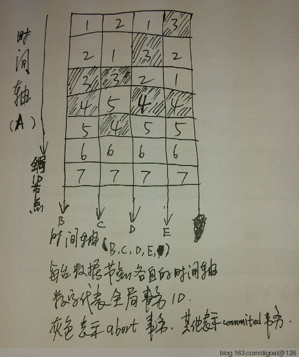

## PostgreSQL Distributed|Sharded Databases Consistent PITR Thinking  
                                        
### 作者                                           
digoal                                   
                                    
### 日期                                                                                                       
2013-02-06                                 
                                       
### 标签                                    
PostgreSQL , 分布式数据库全局一致性恢复   
                                                                                                          
----                                                                                                    
                                                                                                             
## 背景                                
前言, 建议先了解一下PostgreSQL 的PITR再看本文.  
    
[PostgreSQL recovery target introduce](../201301/20130130_01.md)  
  
[PostgreSQL PITR THREE recovery target MODE: name,xid,time USE CASE - 1](20130204_01.md)    
  
[PostgreSQL PITR THREE recovery target MODE: name,xid,time USE CASE - 2](20130205_01.md)    
    
最近几天收到一位网友wsxsl的EMAIL, 在他们的应用场景中有跨库事务的需求。  
  
数据库做了sharding后, 就可能会引入跨库的事务. 当然也有不跨库的事务。  
  
有跨库的事务必然会同时要求数据库可以实现全局一致的还原。  
  
shard 后数据库的一致性还原可以这么来理解(首先需要对事务进行分解, 分为跨库事务和 非跨库事务也就是本地事务) :   
  
1\. 对于跨库事务必须确保它在各个shard节点中的操作都提交或者都回滚.(all committed, or all abort.)  
  
2\. 对于单个shard节点, 必须确保一致性. (本地事务操作的原子性(all committed or all abort), 同时确保时序性(不能出现后提交的事务已恢复但是先提交的事务未恢复).)  
  
以上两点, 第二点PostgreSQL自身的PITR就可以满足这个需求.  
  
第一点, 则是需要处理的重点.  
  
在谈第一点之前, 来看一个图, 跨库事务可能存在的交错现象 :   
  
  
  
解释一下上图 :   
  
## 1  
1\. ABCDE是五个节点, 其中A为产生全局ID的节点, BCDE为数据节点.  
  
2\. 每个节点有各自的时间轴.  
  
3\. 格子里面的数字代表全局事务ID(跨库事务), 以及在各自的时间轴上的事务提交位置(其实就是各节点PG_XLOG中的位置).  
  
4\. 全局事务ID对应的本地事务ID为节点号_id , 例如全局事务1在B节点的本地事务ID为B1. 图中未标出, 后面讲解需要用到.  
  
5\. 灰色格子代表该事务是回滚掉的. 白色格子代表该事务是提交掉的.  
  
6\. 同一个时间轴上, 两个事务之间可能还有非跨库事务(本地事务), 这些在图中没有画出, 因为不影响全局一致性还原. 但是大家要知道一下.  
  
注意跨库事务1, 在B节点是第一个提交的. 但是在C节点, 它是在跨库事务2的后面提交的 .   
  
如果以跨库事务1为PITR的目标, 以PostgreSQL recovery.conf中配置recovery_target_xid为例, 如下 :   
  
```  
recovery_target_xid=B1, recovery_target_inclusive=true  
recovery_target_xid=C1, recovery_target_inclusive=true  
recovery_target_xid=D1, recovery_target_inclusive=true  
recovery_target_xid=E1, recovery_target_inclusive=true  
```  
  
恢复后的全局事务状态 :   
  
```  
B : B1 committed  
C : C2,C1 committed  
D : D1 committed  
E : E2,E1 committed  
```  
  
整体来看, 全局事务2出现了不一致的现象, 在B,D节点未提交, 但是在C,E节点已提交.  
  
## 2  
还有一种情况是, 跨库事务可能出现在部分节点, 例如 :   
  
跨库事务7 发生在2个节点 : B7, D7;   
  
跨库事务8 发生在2个节点 : E8, C8;  
  
那么这两个跨库事务则不可能存在交叉. 因为他们没有发生在同一个shard节点上的事务.  
  
## 3  
1\. 对于上图, 6号和7号跨库事务显然是可以作为PITR的还原目标的, 因为不会出现跨库事务交错.  
  
2\. 5号事务其实也可以作为PITR的还原目标, 为什么呢? 因为4号事务是回滚的. 所以也不会有影响.  
  
综上所述, 全局一致性还原的重点在如何找到合适的还原点。下面列举几种方法 :   
  
## 方法1  
计算现成的一致性还原点, 必要的要素 :   
  
1\. 唯一的全局事务ID, 这个可以使用统一的shard算法, 也就是说全局事务ID的产生节点也可以做成分布式的, 不会成为瓶颈.   
  
算法举例 :   
  
[PostgreSQL sharding有序UUID最佳实践 - serial global uuid stored in 64bit int8](../201301/20130122_01.md)  
  
2\. 全局事务ID对应的shard节点上的xid, 以及shard节点上该XID COMMIT或ABORT的时间 (是shard节点的时间, 这个时间必须取PG_XLOG中存储的时间). 请参见本文末尾的参考部分.   
  
例如在B,C,D,E节点执行如下SQL, 创建记录GID的信息表.  
  
还原点可以从这个表里面分析出来.  
  
```  
postgres=# create type xstatus as enum ('commit', 'abort');  
CREATE TYPE  
postgres=# create table gid   
postgres-# (gid int8 primary key, -- 跨库事务ID, 由统一的算法产生. 参考前面的算法举例  
postgres(# gxstatus xstatus, -- 跨库事务状态, 业务APP负责写入  
postgres(# nodes text[], -- 跨库事务涉及的节点, 业务APP负责写入  
postgres(# lxid int[], -- 跨库事务节点上对应的本地事务ID, 业务APP负责写入  
postgres(# lxcompletetime timestamptz[], -- 跨库事务节点上对应的本地事务完成时记录在XLogRecord上的时间. 从XLOG中解析, 需更新记录.  
postgres(# lxstatus xstatus[] -- 跨库事务节点上对应的本地事务的状态, 业务APP负责写入  
postgres(# );  
NOTICE:  CREATE TABLE / PRIMARY KEY will create implicit index "gid_pkey" for table "gid"  
CREATE TABLE  
```  
  
为什么要在数据节点创建这个表呢?  
  
因为全局ID信息如果丢失（假设因为业务APPs Crash）, 分两种情况.  
  
1\. 该全局ID对应的跨库事务状态是abort的. 也就是数据节点事务全部abort;   
  
这种情况这个全局ID的信息丢失对一致性还原不会造成影响.  
  
2\. 该全局ID对应的跨库事务状态是commit的.  
  
这在情况下, 如果该全局ID的信息丢失, 会影响最终的全局一致性还原点解析, 导致数据库逻辑上全局不一致.  
  
所以解决办法是将全局ID数据的写入合并到业务的二阶事务中, 这样能够保证业务的处理和全局ID数据的处理的原子性.  
  
放到数据节点一来省了服务器, 二来减少了交互, 第三由于分布了也降低了全局ID处理产生瓶颈的概率.  
  
如果跨库事务ID的存储也是分布式的, 那么计算全局一致性还原点时, 需要在所有数据中分析.  
  
全局一致性还原点算法 :   
  
1\. nodes没有与其他任何记录的nodes相交的记录, 该gid可以作为一致性还原点.  
  
可能性几乎为0  
  
2\. nodes与其他记录有相交时的算法, 仅对比相交的node. :   
  
2\.1\. lxcompletetime[]转换成gtime_range, gtime_range不与其他任何gtime_range相交.  
  
2\.2\. 如果有相交, 则lxcompletetime[]每个对应元素必须完全相等.  
  
2\.3\. 过滤abort的记录, 重新执行2.1和2.2.  
  
对于一个跨库事务频繁执行的业务, 第二种方法能找到的一致性还原点也几乎为0. 所以需要修复算法 :   
  
修复算法 :   
  
业务层必须记录事务的undo和redo. 还原到有跨库事务交叉的点时，使用undo或redo修复有交叉的事务。  
  
## 方法2  
主动创建一致性还原点  :   
  
1\. 发出指令禁止新发起跨库事务的操作请求, 并等待所有的跨库事务完结.  
  
2\. 等待所有的跨库事务完结后.  
  
3\. 在所有数据库节点上创建同名的还原点(recovery_target_name). 注意多次创建的还原点的名字不要重复.   
  
4\. 释放冻结,允许新发起跨库事务的操作请求(barrier).  
  
具体的实现方法可以参考PostgreS-XC的做法.  
  
使用这种方法对数据库有轻微的堵塞, 堵塞跨库事务的操作. 所以最好加个超时机制. 如果全局不能在一个时间段内达到堵塞状态, 则放弃堵塞.  
  
举例 :   
  
跨库事务, 以两个节点为例 :   
  
所有的跨库事务必须先获得所有涉及节点的一个共享锁, 否则不进行下去.   
  
```  
NODE A :   
begin;  
select 1 from barrier where id=1 for share nowait;  
... 业务SQL.  
  
NODE B :   
begin;  
select 1 from barrier where id=1 for share nowait;  
... 业务SQL.  
插入还原点(所有的sharding节点都必须先获得排他锁, 以此来拒绝新发起的跨库事务, 确保数据逻辑状态一致) :   
  
NODE A :   
begin;  
select 1 from barrier where id=1 for update;  
  
NODE B :   
begin;  
select 1 from barrier where id=1 for update;  
只有当NODE A,B都获得独占锁后方可插入还原点.  
注意控制超时, 不能for update太久, 否则堵塞影响时间就太长了.  
  
NODE A, B :   
select * from pg_create_restore_point('node A,B 相同的唯一值');  
  
NODE A, B :   
释放barrier where id=1 for update.  
```  
  
## 方法3, Postgres-XC的做法  
与上面类似.参考 :   
  
http://postgres-xc.sourceforge.net/docs/1_0/barriers.html  
  
http://postgres-xc.sourceforge.net/docs/1_0/sql-createbarrier.html  
  
src/backend/pgxc/barrier/barrier.c  
  
src/include/pgxc/barrier.h  
  
## 参考  
1\. [《PostgreSQL's two-phase commit used with dblink example》](../201102/20110214_01.md)  
  
2\. [《PostgreSQL recovery target introduce》](../201301/20130130_01.md)  
  
3\. [《PostgreSQL PITR THREE recovery target MODE: name,xid,time USE CASE - 1》](../201302/20130204_01.md)  
  
4\. [《PostgreSQL PITR THREE recovery target MODE: name,xid,time USE CASE - 2》](../201302/20130205_01.md)  
  
5\. [《PostgreSQL sharding有序UUID最佳实践 - serial global uuid stored in 64bit int8》](../201301/20130122_01.md)    
  
6\. http://postgres-xc.sourceforge.net/  
  
7\. http://postgres-xc.sourceforge.net/docs/1_0/barriers.html  
  
8\. http://postgres-xc.sourceforge.net/docs/1_0/sql-createbarrier.html  
  
9\. src/backend/pgxc/barrier/barrier.c  
  
10\. src/include/pgxc/barrier.h  
  
11\. src/backend/storage/lmgr/README  
  
12\. src/backend/storage/lmgr/README.barrier  
  
13\. src/include/storage/barrier.h  
  
14\.   
  
XLogRecord中的COMMIT/ABORT的时间信息相关代码 :   
  
src/backend/utils/adt/timestamp.c  
  
```  
01262 /*  
01263  * GetCurrentTimestamp -- get the current operating system time  
01264  *  
01265  * Result is in the form of a TimestampTz value, and is expressed to the  
01266  * full precision of the gettimeofday() syscall  
01267  */  
01268 TimestampTz  
01269 GetCurrentTimestamp(void)  
01270 {  
01271     TimestampTz result;  
01272     struct timeval tp;  
01273   
01274     gettimeofday(&tp, NULL);  
01275   
01276     result = (TimestampTz) tp.tv_sec -  
01277         ((POSTGRES_EPOCH_JDATE - UNIX_EPOCH_JDATE) * SECS_PER_DAY);  
01278   
01279 #ifdef HAVE_INT64_TIMESTAMP  
01280     result = (result * USECS_PER_SEC) + tp.tv_usec;  
01281 #else  
01282     result = result + (tp.tv_usec / 1000000.0);  
01283 #endif  
01284   
01285     return result;  
01286 }  
```  
  
src/backend/access/transam/xact.c  
  
```  
/*  
 * xactStartTimestamp is the value of transaction_timestamp().  
 * stmtStartTimestamp is the value of statement_timestamp().  
 * xactStopTimestamp is the time at which we log a commit or abort WAL record.  
 * These do not change as we enter and exit subtransactions, so we don't  
 * keep them inside the TransactionState stack.  
 */  
static TimestampTz xactStartTimestamp;  
static TimestampTz stmtStartTimestamp;  
static TimestampTz xactStopTimestamp;  
  
/*  
 *      transaction states - transaction state from server perspective  
 */  
typedef enum TransState  
{  
        TRANS_DEFAULT,                          /* idle */  
        TRANS_START,                            /* transaction starting */  
        TRANS_INPROGRESS,                       /* inside a valid transaction */  
        TRANS_COMMIT,                           /* commit in progress */  
        TRANS_ABORT,                            /* abort in progress */  
        TRANS_PREPARE                           /* prepare in progress */  
} TransState;  
  
/*  
 *      GetCurrentTransactionStopTimestamp  
 *  
 * We return current time if the transaction stop time hasn't been set  
 * (which can happen if we decide we don't need to log an XLOG record).  
 */  
TimestampTz  
GetCurrentTransactionStopTimestamp(void)  
{  
        if (xactStopTimestamp != 0)  
                return xactStopTimestamp;  
        return GetCurrentTimestamp();  
}  
  
/*  
 *      SetCurrentTransactionStopTimestamp  
 */  
static inline void  
SetCurrentTransactionStopTimestamp(void)  
{  
        xactStopTimestamp = GetCurrentTimestamp();  
}  
  
/*  
 *      RecordTransactionCommit  
 *  
 * Returns latest XID among xact and its children, or InvalidTransactionId  
 * if the xact has no XID.      (We compute that here just because it's easier.)  
 */  
static TransactionId  
RecordTransactionCommit(void)  
....  
  xlrec.xact_time = xactStopTimestamp;  
  
/*  
 *      RecordTransactionAbort  
 *  
 * Returns latest XID among xact and its children, or InvalidTransactionId  
 * if the xact has no XID.      (We compute that here just because it's easier.)  
 */  
static TransactionId  
RecordTransactionAbort(bool isSubXact)  
....  
        /* Write the ABORT record */  
        if (isSubXact)  
                xlrec.xact_time = GetCurrentTimestamp();  
        else  
        {  
                SetCurrentTransactionStopTimestamp();  
                xlrec.xact_time = xactStopTimestamp;  
        }  
```  

  
  
  
  
  
  
  
  
  
  
  
  
  
#### [免费领取阿里云RDS PostgreSQL实例、ECS虚拟机](https://free.aliyun.com/ "57258f76c37864c6e6d23383d05714ea")
  
  
#### [digoal's PostgreSQL文章入口](https://github.com/digoal/blog/blob/master/README.md "22709685feb7cab07d30f30387f0a9ae")
  
  

  
  
  
  
  
  
#### 打赏都逃不过老婆的五指山 －_－b  

  
