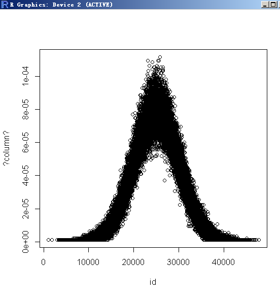
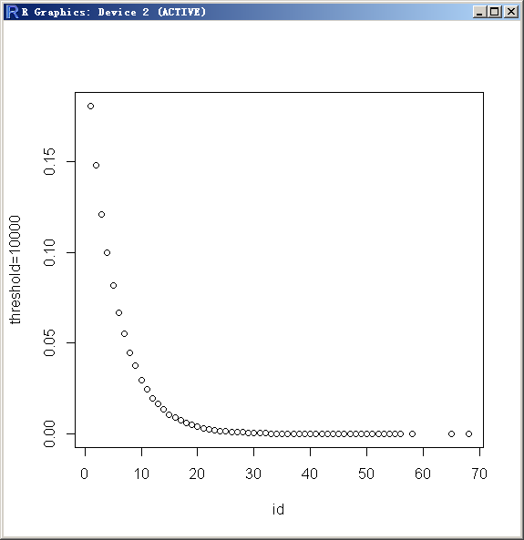
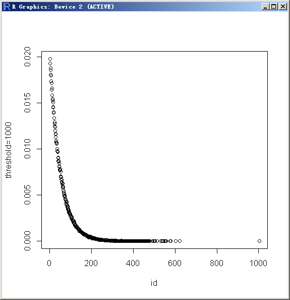
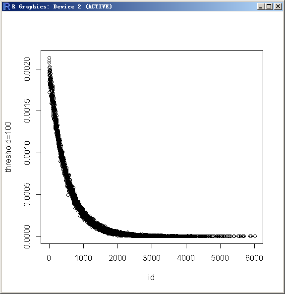
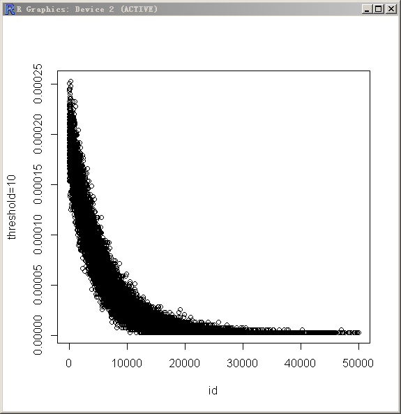
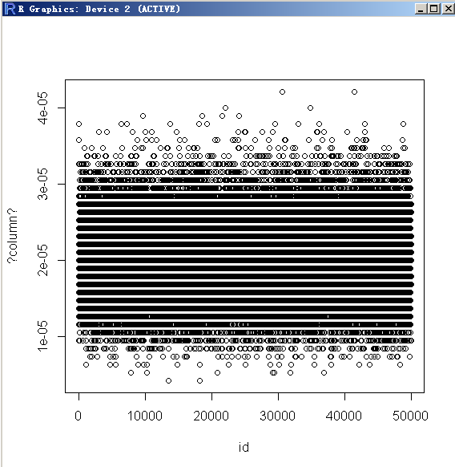

## 生成泊松、高斯、指数、随机分布数据 - PostgreSQL 9.5 new feature - pgbench improve, gaussian (standard normal) & exponential distribution      
                 
### 作者                
digoal                
                
### 日期                                
2015-06-18                               
                                
### 标签                                
PostgreSQL , pgbench , 泊松 , 正态 , 高斯 , 指数 , 随机         
                
----                
                
## 背景              
PostgreSQL 9.5 对pgbench的功能增强。  
  
```  
Allow counting of pgbench transactions that take over a specified amount of time (Fabien Coelho)  
  
This is controlled by new --latency-limit option.  
  
Allow pgbench to generate Gaussian/exponential distributions using \setrandom (Kondo Mitsumasa, Fabien Coelho)  
  
Allow pgbench's \set command to handle multi-operator expressions (Robert Haas, Fabien Coelho)  
```  
  
1\. 允许在\set中使用更复杂的表达式（正负，加减乘除余，括号）。  
  
```  
\set varname expression  
Sets variable varname to an integer value calculated from expression.   
  
The expression may contain integer constants such as 5432, references to variables :variablename,   
and expressions composed of unary (-) or binary operators (+, -, *, /, %) with their usual associativity, and parentheses.  
  
Examples:  
\set ntellers 10 * :scale  
\set aid (1021 * :ntellers) % (100000 * :scale) + 1  
```  
  
2\. 允许设置--latency-limit，执行时间超过限制的SQL将分开统计和显示为late，与--rate同时使用时，超出限制并且未发送到数据库执行的SQL记为skipped。  
  
```  
-L limit  
--latency-limit=limit  
Transaction which last more than limit milliseconds are counted and reported separately, as late.  
  
When throttling is used (--rate=...), transactions that lag behind schedule by more than limit ms,   
and thus have no hope of meeting the latency limit, are not sent to the server at all.   
They are counted and reported separately as skipped.  
  
-R rate  
--rate=rate  
  
Execute transactions targeting the specified rate instead of running as fast as possible (the default).   
The rate is given in transactions per second.   
If the targeted rate is above the maximum possible rate, the rate limit won't impact the results.  
  
The rate is targeted by starting transactions along a Poisson-distributed schedule time line.   
The expected start time schedule moves forward based on when the client first started,   
not when the previous transaction ended.   
That approach means that when transactions go past their original scheduled end time,   
it is possible for later ones to catch up again.  
  
When throttling is active, the transaction latency reported at the end of the run is calculated from the scheduled start times,   
so it includes the time each transaction had to wait for the previous transaction to finish.   
The wait time is called the schedule lag time, and its average and maximum are also reported separately.   
The transaction latency with respect to the actual transaction start time,   
i.e. the time spent executing the transaction in the database,   
can be computed by subtracting the schedule lag time from the reported latency.  
  
If --latency-limit is used together with --rate,   
  
a transaction can lag behind so much that it is already over the latency limit when the previous transaction ends,   
because the latency is calculated from the scheduled start time.   
Such transactions are not sent to the server, but are skipped altogether and counted separately.  
  
A high schedule lag time is an indication that the system cannot process transactions at the specified rate,   
with the chosen number of clients and threads.   
When the average transaction execution time is longer than the scheduled interval between each transaction,   
each successive transaction will fall further behind,   
and the schedule lag time will keep increasing the longer the test run is.   
When that happens, you will have to reduce the specified transaction rate.  
```  
  
3\. 可以生成正态分布 或 指数分布的测试数据。(原来只能生成概率一致的随机分布值)  
  
```  
\setrandom varname min max [ uniform | { gaussian | exponential } threshold ]  
  
Sets variable varname to a random integer value between the limits min and max inclusive.   
  
Each limit can be either an integer constant or a :variablename reference to a variable having an integer value.  
```  
  
### 高斯（正泰）分布  
  
高斯分布（正态分布）的概率峰值出现在min,max的数学期望值即(max + min) / 2.0。  
  
约67%的值分布在以min,max数学期望为中心的 1.0 / threshold 这个区间。  
  
约95%的值分布在以min,max数学期望为中心的 2.0 / threshold 这个区间。  
  
所以threshold越大，数据数据越集中在min,max的数学期望附近。  
  
```  
By default, or when uniform is specified, all values in the range are drawn with equal probability.   
  
Specifying gaussian or exponential options modifies this behavior;   
each requires a mandatory threshold which determines the precise shape of the distribution.  
  
For a Gaussian distribution, the interval is mapped onto a standard normal distribution   
(the classical bell-shaped Gaussian curve) truncated at -threshold on the left and +threshold on the right.   
  
To be precise, if PHI(x) is the cumulative distribution function of the standard normal distribution,   
with mean mu defined as (max + min) / 2.0,   
then value i between min and max inclusive is drawn with probability:   
```  
  
在min,max区间取i值的概率如下，(其中PHI(x)是正态分布的积分函数)：  
  
```  
(PHI(2.0 * threshold * (i - min - mu + 0.5) / (max - min + 1)) - PHI(2.0 * threshold * (i - min - mu - 0.5) / (max - min + 1))) / (2.0 * PHI(threshold) - 1.0).   
Intuitively, the larger the threshold, the more frequently values close to the middle of the interval are drawn, and the less frequently values close to the min and max bounds.   
About 67% of values are drawn from the middle 1.0 / threshold and 95% in the middle 2.0 / threshold;   
```  
  
约67%的值分布在以min,max数学期望为中心的 1.0 / threshold 这个区间。  
  
约95%的值分布在以min,max数学期望为中心的 2.0 / threshold 这个区间。  
  
```  
for instance, if threshold is 4.0, 67% of values are drawn from the middle quarter and 95% from the middle half of the interval.   
The minimum threshold is 2.0 for performance of the Box-Muller transform.   
  
(性能考虑，2.0为最小threshold值)。  
```  
  
### 指数分布：  
```  
For an exponential distribution, the threshold parameter controls the distribution by truncating   
a quickly-decreasing exponential distribution at threshold, and then projecting onto integers between the bounds.   
  
To be precise, value i between min and max inclusive is drawn with probability:   
```  
  
在min,max区间取i值的概率如下：  
  
```  
(exp(-threshold*(i-min)/(max+1-min)) - exp(-threshold*(i+1-min)/(max+1-min))) / (1.0 - exp(-threshold)).   
  
Intuitively, the larger the threshold, the more frequently values close to min are accessed, and the less frequently values close to max are accessed.   
```  
  
(threshold越大，随机值接近min的概率越大，反之，threshold越小，随机值接近max的概率越大)  
  
```  
The closer to 0 the threshold, the flatter (more uniform) the access distribution.   
```  
  
注意上面这句话，threshold 越接近0，则越趋于随机分布，而不是指数分布。看后面的图。  
  
```  
A crude approximation of the distribution is that the most frequent 1% values in the range, close to min, are drawn threshold% of the time.   
The threshold value must be strictly positive.  
  
Example:  
\setrandom aid 1 :naccounts gaussian 5.0  
```  
  
### 例子  
#### 高斯分布例子  
生成高斯分布的一组数据。  
  
约67%的值分布在以min,max数学期望为中心的 1.0 / 100 这个区间。  
  
约95%的值分布在以min,max数学期望为中心的 2.0 / 100 这个区间。  
  
```  
postgres=# create table test(id int);  
CREATE TABLE  
postgres=# \q  
  
pg95@db-172-16-3-150-> vi test.sql  
\setrandom id 1 50000 gaussian 100.0  
insert into test values (:id);  
```  
  
```  
--latency-limit=0.2 表示响应时间超过0.2毫秒的请求另外显示。  
```  
  
```  
pg95@db-172-16-3-150-> pgbench -M prepared -n -r -f ./test.sql -P 2 -c 16 -j 16 -T 10 --latency-limit=0.2  
progress: 2.0 s, 93423.3 tps, lat 0.164 ms stddev 0.122  
progress: 4.0 s, 95957.7 tps, lat 0.164 ms stddev 0.109  
progress: 6.0 s, 95074.0 tps, lat 0.166 ms stddev 0.116  
progress: 8.0 s, 95760.4 tps, lat 0.165 ms stddev 0.111  
progress: 10.0 s, 95711.8 tps, lat 0.165 ms stddev 0.108  
transaction type: Custom query  
scaling factor: 1  
query mode: prepared  
number of clients: 16  
number of threads: 16  
duration: 10 s  
number of transactions actually processed: 951872  
  
这里显示了请求响应时间超过0.2毫秒的占比。  
number of transactions above the 0.2 ms latency limit: 175929 (18.482 %)  
  
latency average: 0.165 ms  
latency stddev: 0.113 ms  
tps = 95165.492751 (including connections establishing)  
tps = 95694.059134 (excluding connections establishing)  
statement latencies in milliseconds:  
        -0.002321       \setrandom id 1 50000 gaussian 100.0  
        0.160266        insert into test values (:id);  
```  
  
使用R来绘制一下正态分布：  
  
```  
> install.packages("RPostgreSQL")  
> library(RPostgreSQL)  
  
  
载入需要的程辑包：DBI  
  
警告信息：  
  
1: 程辑包‘RPostgreSQL’是用R版本3.1.3 来建造的   
  
2: 程辑包‘DBI’是用R版本3.1.3 来建造的   
  
  
> drv <- dbDriver("PostgreSQL")  
> con <- dbConnect(drv, host='172.16.3.150', port='1922', dbname='postgres', user='postgres')  
> rs <- dbGetQuery(con, 'with t (cnt) as (select count(*) as cnt from test) select id,count(*)/(t.cnt::numeric) from test, t group by id,t.cnt')  
> plot(rs)  
```  
  
  
  
约67%的值分布在以min,max数学期望为中心的 1.0 / 100 这个区间(24750 至 25250)。  
  
约95%的值分布在以min,max数学期望为中心的 2.0 / 100 这个区间(24500 至 25500)。  
  
修改一下threshold, 改为5，将有95%的数据分布在2/5的区间内(15000 至 35000)。  
  
```  
postgres=# truncate test;  
TRUNCATE TABLE  
pg95@db-172-16-3-150-> vi test.sql  
\setrandom id 1 50000 gaussian 5.0  
insert into test values (:id);  
  
pg95@db-172-16-3-150-> pgbench -M prepared -n -r -f ./test.sql -P 2 -c 16 -j 16 -T 10 --latency-limit=0.2  
progress: 2.0 s, 93514.9 tps, lat 0.163 ms stddev 0.119  
progress: 4.0 s, 94764.7 tps, lat 0.167 ms stddev 0.117  
progress: 6.0 s, 95041.7 tps, lat 0.166 ms stddev 0.112  
progress: 8.0 s, 95312.3 tps, lat 0.166 ms stddev 0.112  
progress: 10.0 s, 95035.6 tps, lat 0.166 ms stddev 0.112  
transaction type: Custom query  
scaling factor: 1  
query mode: prepared  
number of clients: 16  
number of threads: 16  
duration: 10 s  
number of transactions actually processed: 947354  
number of transactions above the 0.2 ms latency limit: 176537 (18.635 %)  
latency average: 0.166 ms  
latency stddev: 0.114 ms  
tps = 94726.249444 (including connections establishing)  
tps = 95332.979889 (excluding connections establishing)  
statement latencies in milliseconds:  
        -0.002318       \setrandom id 1 50000 gaussian 5.0  
        0.160983        insert into test values (:id);  
```  
  
重新绘制曲线：  
  
  
  
#### 指数分布例子  
threshold越大，越多的值分布在min附近。  
  
threshold越小，当趋近于0时，接近随机分布，而不是曲线反转。  
  
threshold不能小于0。  
  
```  
postgres=# truncate test;  
TRUNCATE TABLE  
  
pg95@db-172-16-3-150-> vi test.sql  
\setrandom id 1 50000 exponential 50000  
insert into test values (:id);  
  
pg95@db-172-16-3-150-> pgbench -M prepared -n -r -f ./test.sql -P 2 -c 16 -j 16 -T 10  
progress: 2.0 s, 94095.8 tps, lat 0.162 ms stddev 0.112  
progress: 4.0 s, 95611.9 tps, lat 0.165 ms stddev 0.108  
progress: 6.0 s, 94929.7 tps, lat 0.166 ms stddev 0.121  
progress: 8.0 s, 96159.4 tps, lat 0.164 ms stddev 0.102  
progress: 10.0 s, 95586.2 tps, lat 0.165 ms stddev 0.109  
transaction type: Custom query  
scaling factor: 1  
query mode: prepared  
number of clients: 16  
number of threads: 16  
duration: 10 s  
number of transactions actually processed: 952791  
latency average: 0.164 ms  
latency stddev: 0.111 ms  
tps = 95271.583072 (including connections establishing)  
tps = 95879.681335 (excluding connections establishing)  
statement latencies in milliseconds:  
        -0.002375       \setrandom id 1 50000 exponential 1.0  
        0.160051        insert into test values (:id);  
  
postgres=# analyze test;  
ANALYZE  
```  
  
从most_common_vals和most_common_freqs可以观察到，threshold越大，越多的值分布在min附近 。  
  
```  
postgres=# select * from pg_stats where attname='id' and tablename='test';  
-[ RECORD 1 ]----------+-----------------------------------------------  
schemaname             | public  
tablename              | test  
attname                | id  
inherited              | f  
null_frac              | 0  
avg_width              | 4  
n_distinct             | 11  
most_common_vals       | {1,2,3,4,5}  
most_common_freqs      | {0.632533,0.231967,0.0867,0.0306333,0.0112333}  
histogram_bounds       | {6,6,6,6,7,12}  
correlation            | 0.458732  
most_common_elems      |   
most_common_elem_freqs |   
elem_count_histogram   |   
```  
  
如图：  
  
  
  
再提供几张图，threshold分别是1,10,100,1000,10000：  
  
注意纵坐标的概率值。  
  
  
  
  
  
  
  
  
  
  
  
  
threshold=0.000001：已经接近随机分布了。  
  
  
  
可以看出，当threshold越来越小时，开始接近随机分布。  
  
## 参考  
1\. http://www.postgresql.org/docs/devel/static/pgbench.html  
  
2\. src/bin/pgbench/pgbench.c  
  
产生一个随机值  
  
```  
/* random number generator: uniform distribution from min to max inclusive */  
static int64  
getrand(TState *thread, int64 min, int64 max)  
{  
        /*  
         * Odd coding is so that min and max have approximately the same chance of  
         * being selected as do numbers between them.  
         *  
         * pg_erand48() is thread-safe and concurrent, which is why we use it  
         * rather than random(), which in glibc is non-reentrant, and therefore  
         * protected by a mutex, and therefore a bottleneck on machines with many  
         * CPUs.  
         */  
        return min + (int64) ((max - min + 1) * pg_erand48(thread->random_state));  
}  
```  
  
产生一个指数分布的随机值  
  
```  
/*  
 * random number generator: exponential distribution from min to max inclusive.  
 * the threshold is so that the density of probability for the last cut-off max  
 * value is exp(-threshold).  
 */  
static int64  
getExponentialRand(TState *thread, int64 min, int64 max, double threshold)  
{  
        double          cut,  
                                uniform,  
                                rand;  
  
        Assert(threshold > 0.0);  
        cut = exp(-threshold);  
        /* erand in [0, 1), uniform in (0, 1] */  
        uniform = 1.0 - pg_erand48(thread->random_state);  
  
        /*  
         * inner expresion in (cut, 1] (if threshold > 0), rand in [0, 1)  
         */  
        Assert((1.0 - cut) != 0.0);  
        rand = -log(cut + (1.0 - cut) * uniform) / threshold;  
        /* return int64 random number within between min and max */  
        return min + (int64) ((max - min + 1) * rand);  
}  
```  
  
产生一个高斯分布（正态分布）的随机值  
  
```  
/* random number generator: gaussian distribution from min to max inclusive */  
static int64  
getGaussianRand(TState *thread, int64 min, int64 max, double threshold)  
{  
        double          stdev;  
        double          rand;  
  
        /*  
         * Get user specified random number from this loop, with -threshold <  
         * stdev <= threshold  
         *  
         * This loop is executed until the number is in the expected range.  
         *  
         * As the minimum threshold is 2.0, the probability of looping is low:  
         * sqrt(-2 ln(r)) <= 2 => r >= e^{-2} ~ 0.135, then when taking the  
         * average sinus multiplier as 2/pi, we have a 8.6% looping probability in  
         * the worst case. For a 5.0 threshold value, the looping probability is  
         * about e^{-5} * 2 / pi ~ 0.43%.  
         */  
        do  
        {  
                /*  
                 * pg_erand48 generates [0,1), but for the basic version of the  
                 * Box-Muller transform the two uniformly distributed random numbers  
                 * are expected in (0, 1] (see  
                 * http://en.wikipedia.org/wiki/Box_muller)  
                 */  
                double          rand1 = 1.0 - pg_erand48(thread->random_state);  
                double          rand2 = 1.0 - pg_erand48(thread->random_state);  
  
                /* Box-Muller basic form transform */  
                double          var_sqrt = sqrt(-2.0 * log(rand1));  
  
                stdev = var_sqrt * sin(2.0 * M_PI * rand2);  
  
                /*  
                 * we may try with cos, but there may be a bias induced if the  
                 * previous value fails the test. To be on the safe side, let us try  
                 * over.  
                 */  
        }  
        while (stdev < -threshold || stdev >= threshold);  
  
        /* stdev is in [-threshold, threshold), normalization to [0,1) */  
        rand = (stdev + threshold) / (threshold * 2.0);  
  
        /* return int64 random number within between min and max */  
        return min + (int64) ((max - min + 1) * rand);  
}  
```  
  
产生泊松分布随机值  
  
```  
/*  
 * random number generator: generate a value, such that the series of values  
 * will approximate a Poisson distribution centered on the given value.  
 */  
static int64  
getPoissonRand(TState *thread, int64 center)  
{  
        /*  
         * Use inverse transform sampling to generate a value > 0, such that the  
         * expected (i.e. average) value is the given argument.  
         */  
        double          uniform;  
  
        /* erand in [0, 1), uniform in (0, 1] */  
        uniform = 1.0 - pg_erand48(thread->random_state);  
  
        return (int64) (-log(uniform) * ((double) center) + 0.5);  
}  
```  
  
  
  
  
  
  
  
  
  
  
  
  
  
#### [免费领取阿里云RDS PostgreSQL实例、ECS虚拟机](https://free.aliyun.com/ "57258f76c37864c6e6d23383d05714ea")
  
  
#### [digoal's PostgreSQL文章入口](https://github.com/digoal/blog/blob/master/README.md "22709685feb7cab07d30f30387f0a9ae")
  
  

  
  
  
  
  
  
  
