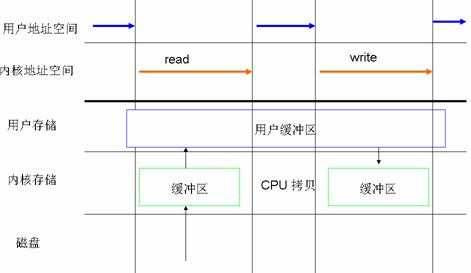
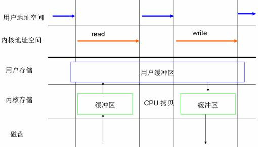
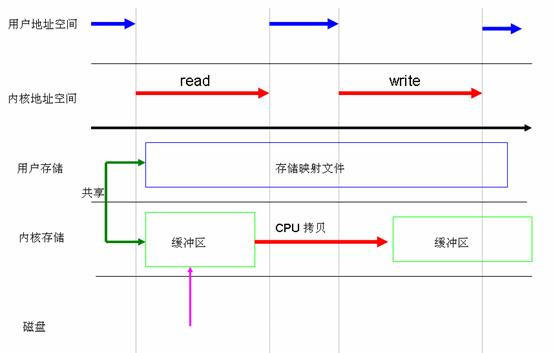
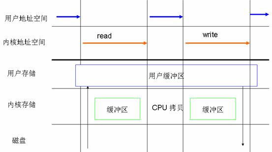
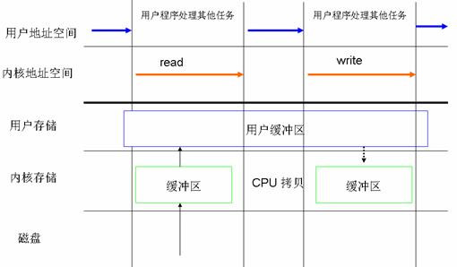

## DirectIO & BufferedIO    
                                                       
### 作者                                      
digoal                                      
                                      
### 日期                                       
2015-08-16                                 
                                        
### 标签                                      
PostgreSQL , direct io , buffer io    
                                                  
----                                                  
                                                   
## 背景                                       
## 原文  
http://blog.csdn.net/bengda/article/details/21871413  
  
正常情况下磁盘上有个文件，如何操作它呢？  
  
  
- 读取：硬盘->内核缓冲区->用户缓冲区  
  
- 写回：用户缓冲区->内核缓冲区->硬盘  
  
  
这里的内核缓冲区指的是page cache，说白了，也就是是DRAM。主要作用是它用于缓存文件内容，从而加快对磁盘上映像和数据的访问。  
  
  
正常的系统调用read/write的流程是怎样的呢？  
  
  
- 读取：硬盘->内核缓冲区->用户缓冲区;  
  
- 写回：数据会从用户地址空间拷贝到操作系统内核地址空间的页缓存中去，这是write就会直接返回，操作系统会在恰当的时机写入磁盘，这就是传说中的Buffered IO。  
  
  
然而对于[自缓存应用程序] [2]来说，缓存 I/O 明显不是一个好的选择。因此出现了DIRECT IO。然而想象一下，不经内核缓冲区，直接写磁盘，必然会引起阻塞。所以通常DIRECT　IO与AIO会一起出现。  
  
>Linux 异步 I/O 是 Linux 2.6 中的一个标准特性，其本质思想就是进程发出数据传输请求之后，进程不会被阻塞，也不用等待任何操作完成，进程可以在数据传输的时候继续执行其他的操作。相对于同步访问文件的方式来说，异步访问文件的方式可以提高应用程序的效率，并且提高系统资源利用率。直接 I/O 经常会和异步访问文件的方式结合在一起使用。  
  
对于nginx来说，是否开启AIO要看具体使用场景：  
  
-  正常写入文件往往是写入内存就直接返回，因此目前nginx仅支持在读取文件时使用异步IO。  
  
-  由于linux AIO仅支持DIRECT IO,AIO一定回去从磁盘上读取文件。所以从阻塞worker进程的角度上来说有一定的好处，但是对于单个请求来说速度是降低了的。  
  
>异步文件I/O是把“双刃剑”，关键要看使用场景，如果大部分用户的请求落到文件缓冲中，那么不要使用异步 I/O，反之则可以试着使用异步I/O,看一下是否会为服务带来并发能力上的提升。 -- [<<深入理解NGINX>> 陶辉著] [1]  
   
mmap   
  
mmap系统调用是将硬盘文件映射到用内存中，其实就是将page cache中的页直接映射到用户进程地址空间中，从而进程可以直接访问自身地址空间的虚拟地址来访问page cache中的页，从而省去了内核空间到用户空间的copy。  
  
## 原文  
http://www.ibm.com/developerworks/cn/linux/l-cn-directio/  
  
http://blog.chinaunix.net/uid-27714502-id-3482966.html  
  
### 直接 I/O 的动机  
在介绍直接 I/O 之前，这一小节先介绍一下为什么会出现直接 I/O 这种机制，即传统的 I/O 操作存在哪些缺点。  
  
什么是缓存 I/O (Buffered I/O)  
  
缓存 I/O 又被称作标准 I/O，大多数文件系统的默认 I/O 操作都是缓存 I/O。在 Linux 的缓存 I/O 机制中，操作系统会将 I/O 的数据缓存在文件系统的页缓存（ page cache ）中，也就是说，数据会先被拷贝到操作系统内核的缓冲区中，然后才会从操作系统内核的缓冲区拷贝到应用程序的地址空间。缓存 I/O 有以下这些优点：  
  
缓存 I/O 使用了操作系统内核缓冲区，在一定程度上分离了应用程序空间和实际的物理设备。  
  
缓存 I/O 可以减少读盘的次数，从而提高性能。  
  
当应用程序尝试读取某块数据的时候，如果这块数据已经存放在了页缓存中，那么这块数据就可以立即返回给应用程序，而不需要经过实际的物理读盘 操作。当然，如果数据在应用程序读取之前并未被存放在页缓存中，那么就需要先将数据从磁盘读到页缓存中去。对于写操作来说，应用程序也会将数据先写到页缓 存中去，数据是否被立即写到磁盘上去取决于应用程序所采用的写操作机制：如果用户采用的是同步写机制（ synchronous writes ）, 那么数据会立即被写回到磁盘上，应用程序会一直等到数据被写完为止；如果用户采用的是延迟写机制（ deferred writes ），那么应用程序就完全不需要等到数据全部被写回到磁盘，数据只要被写到页缓存中去就可以了。在延迟写机制的情况下，操作系统会定期地将放在页缓存中的数 据刷到磁盘上。与异步写机制（ asynchronous writes ）不同的是，延迟写机制在数据完全写到磁盘上的时候不会通知应用程序，而异步写机制在数据完全写到磁盘上的时候是会返回给应用程序的。所以延迟写机制本身 是存在数据丢失的风险的，而异步写机制则不会有这方面的担心。  
  
### 缓存 I/O 的缺点  
  
在缓存 I/O 机制中，DMA 方式可以将数据直接从磁盘读到页缓存中，或者将数据从页缓存直接写回到磁盘上，而不能直接在应用程序地址空间和磁盘之间进行数据传输，这样的话，数据在传 输过程中需要在应用程序地址空间和页缓存之间进行多次数据拷贝操作，这些数据拷贝操作所带来的 CPU 以及内存开销是非常大的。  
  
对于某些特殊的应用程序来说，避开操作系统内核缓冲区而直接在应用程序地址空间和磁盘之间传输数据会比使用操作系统内核缓冲区获取更好的性能，下边这一小节中提到的自缓存应用程序就是其中的一种。  
  
自缓存应用程序（ self-caching applications）  
  
对于某些应用程序来说，它会有它自己的数据缓存机制，比如，它会将数据缓存在应用程序地址空间，这类应用程序完全不需要使用操作系统内核中的 高速缓冲存储器，这类应用程序就被称作是自缓存应用程序（ self-caching applications ）。数据库管理系统是这类应用程序的一个代表。自缓存应用程序倾向于使用数据的逻辑表达方式，而非物理表达方式；当系统内存较低的时候，自缓存应用程序会 让这种数据的逻辑缓存被换出，而并非是磁盘上实际的数据被换出。自缓存应用程序对要操作的数据的语义了如指掌，所以它可以采用更加高效的缓存替换算法。自 缓存应用程序有可能会在多台主机之间共享一块内存，那么自缓存应用程序就需要提供一种能够有效地将用户地址空间的缓存数据置为无效的机制，从而确保应用程 序地址空间缓存数据的一致性。  
  
对于自缓存应用程序来说，缓存 I/O 明显不是一个好的选择。由此引出我们这篇文章着重要介绍的 Linux 中的直接 I/O 技术。Linux 中的直接 I/O 技术非常适用于自缓存这类应用程序，该技术省略掉缓存 I/O 技术中操作系统内核缓冲区的使用，数据直接在应用程序地址空间和磁盘之间进行传输，从而使得自缓存应用程序可以省略掉复杂的系统级别的缓存结构，而执行程 序自己定义的数据读写管理，从而降低系统级别的管理对应用程序访问数据的影响。在下面一节中，我们会着重介绍 Linux 中提供的直接 I/O 机制的设计与实现，该机制为自缓存应用程序提供了很好的支持。  
  
### Linux 2.6 中的直接 I/O 技术  
Linux 2.6 中提供的几种文件访问方式  
  
所有的 I/O 操作都是通过读文件或者写文件来完成的。在这里，我们把所有的外围设备，包括键盘和显示器，都看成是文件系统中的文件。访问文件的方法多种多样，这里列出下边这几种 Linux 2.6 中支持的文件访问方式。  
  
### 标准访问文件的方式  
  
在 Linux 中，这种访问文件的方式是通过两个系统调用实现的：read() 和 write()。当应用程序调用 read() 系统调用读取一块数据的时候，如果该块数据已经在内存中了，那么就直接从内存中读出该数据并返回给应用程序；如果该块数据不在内存中，那么数据会被从磁盘 上读到页高缓存中去，然后再从页缓存中拷贝到用户地址空间中去。如果一个进程读取某个文件，那么其他进程就都不可以读取或者更改该文件；对于写数据操作来 说，当一个进程调用了 write() 系统调用往某个文件中写数据的时候，数据会先从用户地址空间拷贝到操作系统内核地址空间的页缓存中去，然后才被写到磁盘上。但是对于这种标准的访问文件的 方式来说，在数据被写到页缓存中的时候，write() 系统调用就算执行完成，并不会等数据完全写入到磁盘上。Linux 在这里采用的是我们前边提到的延迟写机制（ deferred writes ）。  
  
图 1. 以标准的方式对文件进行读写   
  
  
  
### 同步访问文件的方式  
同步访问文件的方式与上边这种标准的访问文件的方式比较类似，这两种方法一个很关键的区别就是：同步访问文件的时候，写数据的操作是在数据完全被写回磁盘上才算完成的；而标准访问文件方式的写数据操作是在数据被写到页高速缓冲存储器中的时候就算执行完成了。  
  
图 2. 数据同步写回磁盘   
  
  
  
### 内存映射方式  
在 很多操作系统包括 Linux 中，内存区域（ memory region ）是可以跟一个普通的文件或者块设备文件的某一个部分关联起来的，若进程要访问内存页中某个字节的数据，操作系统就会将访问该内存区域的操作转换为相应的 访问文件的某个字节的操作。Linux 中提供了系统调用 mmap() 来实现这种文件访问方式。与标准的访问文件的方式相比，内存映射方式可以减少标准访问文件方式中 read() 系统调用所带来的数据拷贝操作，即减少数据在用户地址空间和操作系统内核地址空间之间的拷贝操作。映射通常适用于较大范围，对于相同长度的数据来讲，映射 所带来的开销远远低于 CPU 拷贝所带来的开销。当大量数据需要传输的时候，采用内存映射方式去访问文件会获得比较好的效率。  
  
图 3. 利用 mmap 代替 read   
  
  
  
### 直接 I/O 方式  
凡是通过直接 I/O 方式进行数据传输，数据均直接在用户地址空间的缓冲区和磁盘之间直接进行传输，完全不需要页缓存的支持。操作系统层提供的缓存往往会使应用程序在读写数据 的时候获得更好的性能，但是对于某些特殊的应用程序，比如说数据库管理系统这类应用，他们更倾向于选择他们自己的缓存机制，因为数据库管理系统往往比操作 系统更了解数据库中存放的数据，数据库管理系统可以提供一种更加有效的缓存机制来提高数据库中数据的存取性能。  
  
图 4. 数据传输不经过操作系统内核缓冲区   
  
  
  
### 异步访问文件的方式  
Linux 异步 I/O 是 Linux 2.6 中的一个标准特性，其本质思想就是进程发出数据传输请求之后，进程不会被阻塞，也不用等待任何操作完成，进程可以在数据传输的时候继续执行其他的操作。相 对于同步访问文件的方式来说，异步访问文件的方式可以提高应用程序的效率，并且提高系统资源利用率。直接 I/O 经常会和异步访问文件的方式结合在一起使用。  
  
图 5.CPU 处理其他任务和 I/O 操作可以重叠执行   
  
  
  
在下边这一小节中，我们会重点介绍 Linux 2.6 内核中直接 I/O 的设计与实现。  
  
### Linux 2.6 中直接 I/O 的设计与实现  
在块设备或者网络设备中执行直接 I/O 完全不用担心实现直接 I/O 的问题，Linux 2.6 操作系统内核中高层代码已经设置和使用了直接 I/O，驱动程序级别的代码甚至不需要知道已经执行了直接 I/O；但是对于字符设备来说，执行直接 I/O 是不可行的，Linux 2.6 提供了函数 get_user_pages() 用于实现直接 I/O。本小节会分别对这两种情况进行介绍。　  
  
内核为块设备执行直接 I/O 提供的支持  
  
要在块设备中执行直接 I/O，进程必须在打开文件的时候设置对文件的访问模式为 O_DIRECT，这样就等于告诉操作系统进程在接下来使用 read() 或者 write() 系统调用去读写文件的时候使用的是直接 I/O 方式，所传输的数据均不经过操作系统内核缓存空间。使用直接 I/O 读写数据必须要注意缓冲区对齐（ buffer alignment ）以及缓冲区的大小的问题，即对应 read() 以及 write() 系统调用的第二个和第三个参数。这里边说的对齐指的是文件系统块大小的对齐，缓冲区的大小也必须是该块大小的整数倍。  
  
这 一节主要介绍三个函数：open()，read() 以及 write()。Linux 中访问文件具有多样性，所以这三个函数对于处理不同的文件访问方式定义了不同的处理方法，本文主要介绍其与直接 I/O 方式相关的函数与功能．首先，先来看 open() 系统调用，其函数原型如下所示：  
  
```  
int open(const char *pathname, int oflag, … /*, mode_t mode * / ) ;  
```  
  
以下列出了 Linux 2.6 内核定义的系统调用 open() 所使用的标识符宏定义：  
  
表 1. open() 系统调用提供的标识符  
  
```  
标识符名	标识符描述  
O_RDONLY	以只读的方式打开文件  
O_WRONLY	以只写的方式打开文件  
O_RDWR	以读写的方式打开文件  
O_CREAT	若文件不存在，则创建该文件  
O_EXCL	以独占模式打开文件；若同时设置 O_EXCL 和 O_CREATE, 那么若文件已经存在，则打开操作会失败  
O_NOCTTY	若设置该描述符，则该文件不可以被当成终端处理  
O_TRUNC	截断文件，若文件存在，则删除该文件  
O_APPEND	若设置了该描述符，则在写文件之前，文件指针会被设置到文件的底部  
O_NONBLOCK	以非阻塞的方式打开文件  
O_NELAY	同 O_NELAY，若同时设置 O_NELAY 和 O_NONBLOCK，O_NONBLOCK 优先起作用  
O_SYNC	该描述符会对普通文件的写操作产生影响，若设置了该描述符，则对该文件的写操作会等到数据被写到磁盘上才算结束  
FASYNC	若设置该描述符，则 I/O 事件通知是通过信号发出的  
O_DIRECT	该描述符提供对直接 I/O 的支持  
O_LARGEFILE	该描述符提供对超过 2GB 大文件的支持  
O_DIRECTORY	该描述符表明所打开的文件必须是目录，否则打开操作失败  
O_NOFOLLOW	若设置该描述符，则不解析路径名尾部的符号链接  
```  
  
当应用程序需要直接访问文件而不经过操作系统页高速缓冲存储器的时候，它打开文件的时候需要指定 O_DIRECT 标识符。  
  
操作系统内核中处理 open() 系统调用的内核函数是 sys_open()，sys_open() 会调用 do_sys_open() 去处理主要的打开操作。它主要做了三件事情：首先， 它调用 getname() 从进程地址空间中读取文件的路径名；接着，do_sys_open() 调用 get_unused_fd() 从进程的文件表中找到一个空闲的文件表指针，相应的新文件描述符就存放在本地变量 fd 中；之后，函数 do_filp_open() 会根据传入的参数去执行相应的打开操作。清单 1 列出了操作系统内核中处理 open() 系统调用的一个主要函数关系图。  
  
清单 1. 主要调用函数关系图  
  
```  
sys_open() |-----do_sys_open() |---------getname() |---------get_unused_fd() |---------do_filp_open() |--------nameidata_to_filp() |----------__dentry_open()  
```  
  
函数 do_flip_open() 在执行的过程中会调用函数 nameidata_to_filp()，而 nameidata_to_filp() 最终会调用 __dentry_open() 函数，若进程指定了 O_DIRECT 标识符，则该函数会检查直接 I./O 操作是否可以作用于该文件。清单 2 列出了 __dentry_open() 函数中与直接 I/O 操作相关的代码。  
  
清单 2. 函数 dentry_open() 中与直接 I/O 相关的代码  
  
```  
if (f->f_flags & O_DIRECT) { if (!f->f_mapping->a_ops || ((!f->f_mapping->a_ops->direct_IO) && (!f->f_mapping->a_ops->get_xip_page))) { fput(f); f = ERR_PTR(-EINVAL); } }  
```  
  
当文件打开时指定了 O_DIRECT 标识符，那么操作系统就会知道接下来对文件的读或者写操作都是要使用直接 I/O 方式的。  
下边我们来看一下当进程通过 read() 系统调用读取一个已经设置了 O_DIRECT 标识符的文件的时候，系统都做了哪些处理。 函数 read() 的原型如下所示：  
  
```  
ssize_t read(int feledes, void *buff, size_t nbytes) ;  
```  
  
操作系统中处理 read() 函数的入口函数是 sys_read()，其主要的调用函数关系图如下清单 3 所示：  
  
清单 3. 主调用函数关系图  
  
```  
sys_read() |-----vfs_read() |----generic_file_read() |----generic_file_aio_read() |--------- generic_file_direct_IO()  
```  
  
函数 sys_read() 从进程中获取文件描述符以及文件当前的操作位置后会调用 vfs_read() 函数去执行具体的操作过程，而 vfs_read() 函数最终是调用了 file 结构中的相关操作去完成文件的读操作，即调用了 generic_file_read() 函数，其代码如下所示：  
  
清单 4. 函数 generic_file_read()  
  
```  
ssize_t generic_file_read(struct file *filp, char __user *buf, size_t count, loff_t *ppos) { struct iovec local_iov = { .iov_base = buf, .iov_len = count }; struct kiocb kiocb; ssize_t ret; init_sync_kiocb(&kiocb, filp); ret = __generic_file_aio_read(&kiocb, &local_iov, 1, ppos); if (-EIOCBQUEUED == ret) ret = wait_on_sync_kiocb(&kiocb); return ret; }  
```  
  
函数 generic_file_read() 初始化了 iovec 以及 kiocb 描述符。描述符 iovec 主要是用于存放两个内容：用来接收所读取数据的用户地址空间缓冲区的地址和缓冲区的大小；描述符 kiocb 用来跟踪 I/O 操作的完成状态。之后，函数 generic_file_read() 凋用函数 __generic_file_aio_read()。该函数检查 iovec 中描述的用户地址空间缓冲区是否可用，接着检查访问模式，若访问模式描述符设置了 O_DIRECT，则执行与直接 I/O 相关的代码。函数 __generic_file_aio_read() 中与直接 I/O 有关的代码如下所示：  
  
清单 5. 函数 __generic_file_aio_read() 中与直接 I/O 有关的代码  
  
```  
if (filp->f_flags & O_DIRECT) { loff_t pos = *ppos, size; struct address_space *mapping; struct inode *inode; mapping = filp->f_mapping; inode = mapping->host; retval = 0; if (!count) goto out; size = i_size_read(inode); if (pos < size) { retval = generic_file_direct_IO(READ, iocb, iov, pos, nr_segs); if (retval > 0 && !is_sync_kiocb(iocb)) retval = -EIOCBQUEUED; if (retval > 0) *ppos = pos + retval; } file_accessed(filp); goto out; }  
```  
  
上边的代码段主要是检查了文件指针的值，文件的大小以及所请求读取的字节数目等，之后，该函数调用 generic_file_direct_io()，并将操作类型 READ，描述符 iocb，描述符 iovec，当前文件指针的值以及在描述符 io_vec 　中指定的用户地址空间缓冲区的个数等值作为参数传给它。当 generic_file_direct_io() 函数执行完成，函数 __generic_file_aio_read（）会继续执行去完成后续操作：更新文件指针，设置访问文件 i 节点的时间戳；这些操作全部执行完成以后，函数返回。 函数 generic_file_direct_IO() 会用到五个参数，各参数的含义如下所示：  
  
```  
rw：操作类型，可以是 READ 或者 WRITE  
iocb：指针，指向 kiocb 描述符　  
iov：指针，指向 iovec 描述符数组  
offset：file 结构偏移量  
nr_segs：iov 数组中 iovec 的个数  
```  
  
函数 generic_file_direct_IO() 代码如下所示：  
  
清单 6. 函数 generic_file_direct_IO()  
  
```  
static ssize_t generic_file_direct_IO(int rw, struct kiocb *iocb, const struct iovec *iov, loff_t offset, unsigned long nr_segs) {   
struct file *file = iocb->ki_filp;   
  
struct address_space *mapping = file->f_mapping;   
  
ssize_t retval;   
  
size_t write_len = 0; if (rw == WRITE) { write_len = iov_length(iov, nr_segs);   
  
if (mapping_mapped(mapping))   
  
unmap_mapping_range(mapping, offset, write_len, 0);   
  
}   
  
retval = filemap_write_and_wait(mapping);   
  
if (retval == 0) {   
retval = mapping->a_ops->direct_IO(rw, iocb, iov, offset, nr_segs);   
if (rw == WRITE && mapping->nrpages)   
{   
pgoff_t end = (offset + write_len - 1) >> PAGE_CACHE_SHIFT;   
int err = invalidate_inode_pages2_range(mapping, offset >> PAGE_CACHE_SHIFT, end);   
if (err) retval = err;   
}   
}   
return retval;   
}  
```  
  
函数 generic_file_direct_IO() 对 WRITE 操作类型进行了一些特殊处理，这在下边介绍 write() 系统调用的时候再做说明。除此之外，它主要是调用了 direct_IO 方法去执行直接 I/O 的读或者写操作。在进行直接　 I/O 　读操作之前，先将页缓存中的相关脏数据刷回到磁盘上去，这样做可以确保从磁盘上读到的是最新的数据。这里的 direct_IO 方法最终会对应到 __blockdev_direct_IO() 函数上去。__blockdev_direct_IO() 函数的代码如下所示：  
  
清单 7. 函数 __blockdev_direct_IO()  
  
```  
fs/direct-io.c  
ssize_t  
__blockdev_direct_IO(int rw, struct kiocb *iocb, struct inode *inode,  
        struct block_device *bdev, const struct iovec *iov, loff_t offset,  
        unsigned long nr_segs, get_block_t get_block, dio_iodone_t end_io,  
        dio_submit_t submit_io, int flags)  
{  
        /*  
         * The block device state is needed in the end to finally  
         * submit everything.  Since it's likely to be cache cold  
         * prefetch it here as first thing to hide some of the  
         * latency.  
         *  
         * Attempt to prefetch the pieces we likely need later.  
         */  
        prefetch(&bdev->bd_disk->part_tbl);  
        prefetch(bdev->bd_disk->queue);  
        prefetch((char *)bdev->bd_disk->queue + SMP_CACHE_BYTES);  
  
        return do_blockdev_direct_IO(rw, iocb, inode, bdev, iov, offset,  
                                     nr_segs, get_block, end_io,  
                                     submit_io, flags);  
}  
```  
  
该函数将要读或者要写的数据进行拆分，并检查缓冲区对齐的情况。本文在前边介绍 open() 函数的时候指出，使用直接 I/O 读写数据的时候必须要注意缓冲区对齐的问题，从上边的代码可以看出，缓冲区对齐的检查是在 __blockdev_direct_IO() 函数里边进行的。用户地址空间的缓冲区可以通过 iov 数组中的 iovec 描述符确定。直接 I/O 的读操作或者写操作都是同步进行的，也就是说，函数 __blockdev_direct_IO() 会一直等到所有的 I/O 操作都结束才会返回，因此，一旦应用程序 read() 系统调用返回，应用程序就可以访问用户地址空间中含有相应数据的缓冲区。但是，这种方法在应用程序读操作完成之前不能关闭应用程序，这将会导致关闭应用程 序缓慢。  
  
接下来我们看一下 write() 系统调用中与直接 I/O 相关的处理实现过程。函数 write() 的原型如下所示： ssize_t write(int filedes, const void * buff, size_t nbytes) ; 操作系统中处理 write() 系统调用的入口函数是 sys_write()。其主要的调用函数关系如下所示：  
  
  
清单 8. 主调用函数关系图  
  
```  
sys_write() |-----vfs_write() |----generic_file_write() |----generic_file_aio_read() |---- __generic_file_write_nolock() |-- __generic_file_aio_write_nolock |-- generic_file_direct_write() |-- generic_file_direct_IO()  
```  
  
函数 sys_write() 几乎与 sys_read() 执行相同的步骤，它从进程中获取文件描述符以及文件当前的操作位置后即调用 vfs_write() 函数去执行具体的操作过程，而 vfs_write() 函数最终是调用了 file 结构中的相关操作完成文件的写操作，即调用了 generic_file_write() 函数。在函数 generic_file_write() 中， 函数 generic_file_write_nolock() 最终调用 generic_file_aio_write_nolock() 函数去检查 O_DIRECT 的设置，并且调用　 generic_file_direct_write() 函数去执行直接 I/O 写操作。  
  
函数 generic_file_aio_write_nolock() 中与直接 I/O 相关的代码如下所示：  
  
  
清单 9. 函数 generic_file_aio_write_nolock() 中与直接 I/O 相关的代码  
  
```  
if (unlikely(file->f_flags & O_DIRECT)) { written = generic_file_direct_write(iocb, iov, &nr_segs, pos, ppos, count, ocount); if (written < 0 || written == count) goto out; pos += written; count -= written; }  
```  
  
从上边代码可以看出， generic_file_aio_write_nolock() 调用了 generic_file_direct_write() 函数去执行直接 I/O 操作；而在 generic_file_direct_write() 函数中，跟读操作过程类似，它最终也是调用了 generic_file_direct_IO() 函数去执行直接 I/O 写操作。与直接 I/O 读操作不同的是，这次需要将操作类型 WRITE 作为参数传给函数 generic_file_direct_IO()。  
  
前边介绍了 generic_file_direct_IO() 的主体 direct_IO 方法：__blockdev_direct_IO()。函数 generic_file_direct_IO() 对 WRITE 操作类型进行了一些额外的处理。当操作类型是 WRITE 的时候，若发现该使用直接 I/O 的文件已经与其他一个或者多个进程存在关联的内存映射，那么就调用 unmap_mapping_range() 函数去取消建立在该文件上的所有的内存映射，并将页缓存中相关的所有 dirty 位被置位的脏页面刷回到磁盘上去。对于直接　 I/O 　写操作来说，这样做可以保证写到磁盘上的数据是最新的，否则，即将用直接　 I/O 　方式写入到磁盘上的数据很可能会因为页缓存中已经存在的脏数据而失效。在直接　 I/O 　写操作完成之后，在页缓存中相关的脏数据就都已经失效了，磁盘与页缓存中的数据内容必须保持同步。  
  
如何在字符设备中执行直接 I/O  
  
在字符设备中执行直接 I/O 可能是有害的，只有在确定了设置缓冲 I/O 的开销非常巨大的时候才建议使用直接 I/O。在 Linux 2.6 的内核中，实现直接 I/O 的关键是函数 get_user_pages() 函数。其函数原型如下所示：  
  
```  
int get_user_pages(struct task_struct *tsk, struct mm_struct *mm, unsigned long start, int len, int write, int force, struct page **pages, struct vm_area_struct **vmas);  
```  
  
该函数的参数含义如下所示：  
  
```  
tsk：指向执行映射的进程的指针；该参数的主要用途是用来告诉操作系统内核，映射页面所产生的页错误由谁来负责，该参数几乎总是 current。  
mm：指向被映射的用户地址空间的内存管理结构的指针，该参数通常是 current->mm 。  
start: 需要映射的用户地址空间的地址。  
len：页内缓冲区的长度。  
write：如果需要对所映射的页面有写权限，该参数的设置得是非零。  
force：该参数的设置通知 get_user_pages() 函数无需考虑对指定内存页的保护，直接提供所请求的读或者写访问。  
page：输出参数。调用成功后，该参数中包含一个描述用户空间页面的 page 结构的指针列表。  
vmas：输出参数。若该参数非空，则该参数包含一个指向 vm_area_struct 结构的指针，该 vm_area_struct 结构包含了每一个所映射的页面。  
```  
  
在使用 get_user_pages() 函数的时候，往往还需要配合使用以下这些函数：  
  
  
```  
void down_read(struct rw_semaphore *sem);   
  
void up_read(struct rw_semaphore *sem);   
  
void SetPageDirty(struct page *page);   
  
void page_cache_release(struct page *page);  
```  
  
首先，在使用 get_user_pages() 函数之前，需要先调用 down_read() 函数将 mmap 为获得用户地址空间的读取者 / 写入者信号量设置为读模式；在调用完 get_user_pages() 函数之后，再调用配对函数 up_read() 释放信号量 sem。若 get_user_pages() 调用失败，则返回错误代码；若调用成功，则返回实际被映射的页面数，该数目有可能比请求的数量少。调用成功后所映射的用户页面被锁在内存中，调用者可以通 过 page 结构的指针去访问这些用户页面。  
  
直接 I/O 的调用者必须进行善后工作，一旦直接 I/O 操作完成，用户内存页面必须从页缓存中释放。在用户内存页被释放之前，如果这些页面中的内容改变了，那么调用者必须要通知操作系统内核，否则虚拟存储子系 统会认为这些页面是干净的，从而导致这些数据被修改了的页面在被释放之前无法被写回到永久存储中去。因此，如果改变了页中的数据，那么就必须使用 SetPageDirty() 函数标记出每个被改变的页。对于 Linux 2.6.18.1，该宏定义在 /include/linux/page_flags.h 中。执行该操作的代码一般需要先检查页，以确保该页不在内存映射的保留区域内，因为这个区的页是不会被交换出去的，其代码如下所示：  
  
```  
if (!PageReserved(page)) SetPageDirty(page);  
```  
  
但是，由于用户空间所映射的页面通常不会被标记为保留，所以上述代码中的检查并不是严格要求的。  
  
最终，在直接 I/O 操作完成之后，不管页面是否被改变，它们都必须从页缓存中释放，否则那些页面永远都会存在在那里。函数 page_cache_release() 就是用于释放这些页的。页面被释放之后，调用者就不能再次访问它们。  
  
关于如何在字符设备驱动程序中加入对直接 I/O 的支持，Linux 2.6.18.1 源代码中 /drivers/scsi/st.c 给出了一个完整的例子。其中，函数 sgl_map_user_pages（）和 sgl_map_user_pages（）几乎涵盖了本节中介绍的所有内容。  
  
### 直接 I/O 技术的特点  
直接 I/O 的优点  
  
直接 I/O 最主要的优点就是通过减少操作系统内核缓冲区和应用程序地址空间的数据拷贝次数，降低了对文件读取和写入时所带来的 CPU 的使用以及内存带宽的占用。这对于某些特殊的应用程序，比如自缓存应用程序来说，不失为一种好的选择。如果要传输的数据量很大，使用直接 I/O 的方式进行数据传输，而不需要操作系统内核地址空间拷贝数据操作的参与，这将会大大提高性能。  
  
直接 I/O 潜在可能存在的问题  
  
直接 I/O 并不一定总能提供令人满意的性能上的飞跃。设置直接 I/O 的开销非常大，而直接 I/O 又不能提供缓存 I/O 的优势。缓存 I/O 的读操作可以从高速缓冲存储器中获取数据，而直接 I/O 的读数据操作会造成磁盘的同步读，这会带来性能上的差异 , 并且导致进程需要较长的时间才能执行完；对于写数据操作来说，使用直接 I/O 需要 write() 系统调用同步执行，否则应用程序将会不知道什么时候才能够再次使用它的 I/O 缓冲区。与直接 I/O 读操作类似的是，直接 I/O 写操作也会导致应用程序关闭缓慢。所以，应用程序使用直接 I/O 进行数据传输的时候通常会和使用异步 I/O 结合使用。  
  
## 总结  
Linux 中的直接 I/O 访问文件方式可以减少 CPU 的使用率以及内存带宽的占用，但是直接 I/O 有时候也会对性能产生负面影响。所以在使用直接 I/O 之前一定要对应用程序有一个很清醒的认识，只有在确定了设置缓冲 I/O 的开销非常巨大的情况下，才考虑使用直接 I/O。直接 I/O 经常需要跟异步 I/O 结合起来使用，本文对异步 I/O 没有作详细介绍，有兴趣的读者可以参看 Linux 2.6 中相关的文档介绍。  
  

  
<a rel="nofollow" href="http://info.flagcounter.com/h9V1"  ></a>  
  
  
  
  
  
  
## [digoal's 大量PostgreSQL文章入口](https://github.com/digoal/blog/blob/master/README.md "22709685feb7cab07d30f30387f0a9ae")
  
  
## [免费领取阿里云RDS PostgreSQL实例、ECS虚拟机](https://free.aliyun.com/ "57258f76c37864c6e6d23383d05714ea")
  
  

  
