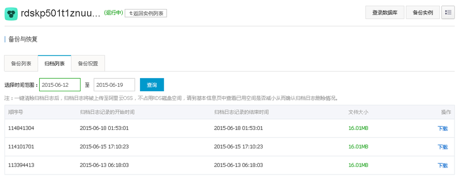

## 阿里云ApsaraDB RDS for PostgreSQL 最佳实践 - 6 任意时间点恢复  
##### [TAG 24](../class/24.md)
                                    
### 作者                                                                                 
digoal                               
                                      
### 日期                                 
2015-12-20                                 
                                  
### 标签                               
PostgreSQL , 阿里云RDS              
                                    
----                              
                                       
## 背景                     
阿里云的RDS for PostgreSQL目前提供的备份为物理备份，备份粒度可以自己设置，最频繁的基础备份可以做到一天一次。  
  
有了这个备份和归档日志，我们可以做到基于任意时间点（实际上是事务提交或回滚点的粒度）的恢复。  
  
在RDS的控制台可以看到：  
  
  
   
  
   
  
  
接下来我将演示一下如何实现以及如何设计一个好的恢复方案。  
  
甚至我们在了解其中的原理后，如果阿里云将来提供基于时间点的恢复服务，我们应该如何更好的与之结合来使用。  
  
要恢复到任意时间点，我们就必须告诉恢复进程一个点，这个点可以是时间，字符串，或者XID。  
  
1\. 时间很好理解，其实就是触及这个时间后的XLOG中的第一个事务结束位置作为停止点。  
  
2\. 字符串，这个是需要通过pg_create_restore_point函数来创建的一个还原点，需要超级用户调用这个函数。  
  
3\. XID也很好理解，就是恢复到指定事务的结束位置。  
  
既然我们已经知道了数据库可以恢复到指定的这几个位置，我们怎么来结合呢？  
  
例如我们在做一笔比较重要的操作前，可以创建一个还原点（但是需要超级用户），不适合阿里云RDS。  
  
```  
postgres=# select pg_create_restore_point('digoal');  
 pg_create_restore_point   
-------------------------  
 1D6/FB17EC08  
(1 row)  
```  
  
阿里云为了防止一些用户的误操作，只开放了普通用户给用户使用，所以有一些东西都无法操作，例如创建检查点，切换XLOG，创建还原点都无法操作。  
  
```  
postgres=> checkpoint;  
ERROR:  must be superuser to do CHECKPOINT  
postgres=> select pg_switch_xlog();  
ERROR:  must be superuser to switch transaction log files  
postgres=> select pg_create_restore_point('ab');  
ERROR:  must be superuser to create a restore point  
```  
  
时间其实是一个比较模糊的概念，所以也不建议使用，除非是我们没有其他信息，才使用时间。  
  
XID是一个很不错的信息，我们在阿里云RDS里就用它了。  
  
首先要创建一个记录还原点XID的表。记录XID，时间，以及描述信息。（来代替pg_create_restore_point 系统函数的功能）  
  
```  
postgres=> create table restore_point(id serial primary key, xid int8, crt_time timestamp default now(), point text);  
CREATE TABLE  
```  
  
创建一个函数，代替pg_create_restore_point的功能，插入还原点。  
  
```  
postgres=> create or replace function create_restore_point(i_point text) returns void as $$  
declare   
begin  
  insert into restore_point(xid,point) values (txid_current(),i_point);  
end;  
$$ language plpgsql strict;  
CREATE FUNCTION  
```  
  
插入一个还原点  
  
```  
postgres=> select create_restore_point('digoal');  
 create_restore_point   
----------------------  
   
(1 row)  
```  
  
查询这个表的信息：  
  
```  
postgres=> select * from restore_point;  
 id |  xid   |          crt_time          | point    
----+--------+----------------------------+--------  
  1 | 561426 | 2015-06-19 09:18:57.525475 | digoal  
(1 row)  
postgres=> select * from restore_point where point='digoal';  
 id |  xid   |          crt_time          | point    
----+--------+----------------------------+--------  
  1 | 561426 | 2015-06-19 09:18:57.525475 | digoal  
(1 row)  
```  
  
接下来要模拟一下还原：  
  
```  
postgres=> create table test(id int,info text);  
CREATE TABLE  
postgres=> insert into test select generate_series(1,1000),md5(random()::text);  
INSERT 0 1000  
```  
  
记录当前哈希值。用于恢复后的比对。  
  
```  
postgres=> select sum(hashtext(t.*::text)) from test t;  
     sum        
--------------  
 -69739904784  
(1 row)  
```  
  
接下来我要做一笔删除操作，在删除前，我先创建一条还原点信息。  
  
```  
postgres=> select create_restore_point('before delete test');  
 create_restore_point   
----------------------  
   
(1 row)  
postgres=> delete from test;  
DELETE 1000  
postgres=> select * from restore_point where point='before delete test';  
 id |  xid   |          crt_time          |       point          
----+--------+----------------------------+--------------------  
  2 | 561574 | 2015-06-19 09:45:28.030295 | before delete test  
(1 row)  
```  
  
我只需要恢复到561574 即可。接下来就是模拟恢复了。  
  
但是这个文件可能还没有归档，而pg_switch_xlog()函数又不能用，我们只能主动产生一些XLOG，让RDS触发归档。  
  
```  
postgres=> select pg_xlogfile_name(pg_current_xlog_location());  
     pg_xlogfile_name       
--------------------------  
 000000010000000200000041  
(1 row)  
postgres=> insert into test select generate_series(1,100000);  
INSERT 0 100000  
postgres=> insert into test select generate_series(1,100000);  
INSERT 0 100000  
postgres=> select pg_xlogfile_name(pg_current_xlog_location());  
     pg_xlogfile_name       
--------------------------  
 000000010000000200000042  
(1 row)  
```  
  
已经切换。接下来我们需要下载阿里云RDS的备份和归档到本地。  
  
并且在本地需要安装一个postgresql, 并且与阿里云RDS的编译配置参数一致(例如数据块的大小)，最好使用的模块也一致，但是这里没有用到其他模块，所以无所谓。  
  
通过pg_settings来看一下RDS的配置信息，版本信息，方便我们在本地进行恢复。  
  
```  
postgres=> select name,setting,unit from pg_settings where category='Preset Options';  
         name          | setting | unit   
-----------------------+---------+------  
 block_size            | 8192    |    
 data_checksums        | on      |   
 integer_datetimes     | on      |   
 max_function_args     | 100     |   
 max_identifier_length | 63      |   
 max_index_keys        | 32      |   
 segment_size          | 131072  | 8kB  
 server_version        | 9.4.1   |   
 server_version_num    | 90401   |   
 wal_block_size        | 8192    |   
 wal_segment_size      | 2048    | 8kB  
(11 rows)  
postgres=> select version();  
                                                   version                                                      
--------------------------------------------------------------------------------------------------------------  
 PostgreSQL 9.4.1 on x86_64-unknown-linux-gnu, compiled by gcc (GCC) 4.4.6 20110731 (Red Hat 4.4.6-3), 64-bit  
(1 row)  
```  
  
本地编译安装PostgreSQL 9.4.1，编译参数与RDS一致。阿里云RDS这几个参数都是默认的。  
  
```  
  --with-blocksize=BLOCKSIZE  
                          set table block size in kB [8]  
  --with-segsize=SEGSIZE  set table segment size in GB [1]  
  --with-wal-blocksize=BLOCKSIZE  
                          set WAL block size in kB [8]  
  --with-wal-segsize=SEGSIZE  
                          set WAL segment size in MB [16]  
  
  
  
# useradd digoal  
# su - digoal  
$ vi .bash_profile  
# add by digoal  
export PS1="$USER@`/bin/hostname -s`-> "  
export PGPORT=1931  
export PGDATA=/home/digoal/pg_root  
export LANG=en_US.utf8  
export PGHOME=/home/digoal/pgsql9.4.1  
export LD_LIBRARY_PATH=$PGHOME/lib:/lib64:/usr/lib64:/usr/local/lib64:/lib:/usr/lib:/usr/local/lib:$LD_LIBRARY_PATH  
export DATE=`date +"%Y%m%d%H%M"`  
export PATH=$PGHOME/bin:$PATH:.  
export MANPATH=$PGHOME/share/man:$MANPATH  
export PGHOST=$PGDATA  
export PGDATABASE=postgres  
alias rm='rm -i'  
alias ll='ls -lh'  
unalias vi  
  
# wget https://ftp.postgresql.org/pub/source/v9.4.1/postgresql-9.4.1.tar.bz2  
# tar -jxvf postgresql-9.4.1.tar.bz2  
# cd postgresql-9.4.1  
# ./configure --prefix=/home/digoal/pgsql9.4.1 --with-pgport=1931 --with-perl --with-python --with-tcl --with-openssl --with-pam --with-ldap --with-libxml --with-libxslt --enable-thread-safety --enable-debug  
# gmake world && gmake install-world  
```  
  
下载备份和归档文件，解压：  
  
基础备份选择需要恢复的时间点之前的一个备份，归档则选择在此之后的所有归档文件。  
  
```  
total 453M  
-rw-r--r-- 1 root   root    17M Jun 19 10:23 000000010000000200000040.tar.gz  
-rw-r--r-- 1 root   root    17M Jun 19 10:23 000000010000000200000041.tar.gz  
-rw-r--r-- 1 root   root   404M Jun 19 10:23 hins668881_xtra_20150618232331.tar.gz  
  
# mkdir /home/digoal/pg_root  
# mv hins668881_xtra_20150618232331.tar.gz /home/digoal/pg_root  
# tar -zxvf hins668881_xtra_20150618232331.tar.gz  
[root@db-172-16-3-150 ~]# tar -xvf 000000010000000200000040.tar.gz   
000000010000000200000040  
[root@db-172-16-3-150 ~]# tar -xvf 000000010000000200000041.tar.gz   
000000010000000200000041  
[root@db-172-16-3-150 ~]# mv 000000010000000200000040 /home/digoal/  
[root@db-172-16-3-150 ~]# mv 000000010000000200000041 /home/digoal/  
[root@db-172-16-3-150 ~]# chown -R digoal:digoal /home/digoal  
[root@db-172-16-3-150 ~]# chmod -R 700 /home/digoal/pg_root  
```  
  
修改配置文件，注释掉阿里云RDS PG的一些定制参数。  
  
```  
$ vi postgresql.conf  
port=1931  
  
注释RDS自定义的GUC参数  
#rds_enable_proxy=on  
#rds_available_extensions='plpgsql,pg_stat_statements,btree_gin,btree_gist,chkpass,citext,cube,dblink,dict_int,earthdistance,hstore,intagg,intarray,isn,ltree,pgcrypto,pgrowlocks,pg_prewarm,pg_trgm,postgres_fdw,sslinfo,tablefunc,tsearch2,unaccent,postgis,postgis_topology,fuzzystrmatch,postgis_tiger_geocoder,plperl,pltcl,plv8,plls,plcoffee,"uuid-ossp"'  
#rds_enable_admin_user_as_super=on  
```  
  
配置recovery.conf  
  
打开hot_standby，恢复到目标点后暂停，如果确认已经到达，使用resume激活。  
  
```  
$ vi recovery.conf  
standby_mode = 'on'  
restore_command = 'cp /home/digoal/%f %p'             
recovery_target_xid='561574'  # 使用我们自建的恢复点的XID  
recovery_target_inclusive=true  
pause_at_recovery_target=true  
```  
  
启动数据库  
  
```  
$ pg_ctl start  
```  
  
检查是否恢复到指定XID  
  
```  
digoal@db-172-16-3-150-> psql -h 127.0.0.1 -p 1931  
psql (9.4.1)  
Type "help" for help.  
  
postgres=> \dt  
             List of relations  
 Schema |      Name       | Type  | Owner    
--------+-----------------+-------+--------  
 public | ha_health_check | table | aurora  
 public | login_log       | table | digoal  
 public | restore_point   | table | digoal  
 public | session         | table | digoal  
 public | tbl_small       | table | digoal  
 public | test            | table | digoal  
 public | userinfo        | table | digoal  
(7 rows)  
```  
  
检查，已经恢复到DELETE test表的数据之前了。  
  
```  
postgres=> select count(*) from test;  
 count   
-------  
  1000  
(1 row)  
postgres=> select sum(hashtext(t.*::text)) from test t;  
     sum        
--------------  
 -69739904784  
(1 row)  
```  
  
接下来就交给你了，导出逻辑备份，还原，或者其他。。。。。。  
  
## 其他  
1\. RDS增加了一些GUC控制参数，例如，  
  
```  
rds_enable_proxy=on  
rds_available_extensions='plpgsql,pg_stat_statements,btree_gin,btree_gist,chkpass,citext,cube,dblink,dict_int,earthdistance,hstore,intagg,intarray,isn,ltree,pgcrypto,pgrowlocks,pg_prewarm,pg_trgm,postgres_fdw,sslinfo,tablefunc,tsearch2,unaccent,postgis,postgis_topology,fuzzystrmatch,postgis_tiger_geocoder,plperl,pltcl,plv8,plls,plcoffee,"uuid-ossp"'  
rds_enable_admin_user_as_super=on  
```  
  
可以看到对云化做的一些修改：  
  
```  
digoal@db-172-16-3-150-> cat postgresql.conf  
#  
#Thu Jun 11 22:34:23 CST 2015  
checkpoint_segments=64  
autovacuum_vacuum_scale_factor=0.1  
maintenance_work_mem=16MB  
log_min_duration_statement=1000  
archive_mode=on  
log_lock_waits=on  
max_prepared_transactions=800  
log_rotation_size=10MB  
timezone='PRC'  
archive_command='cp %p /u02/rds427ugtq91telkvtwap/arch/%f'  
track_functions=all  
port=3011  
max_replication_slots=10  
max_connections=100  
hot_standby=on  
lc_numeric='zh_CN.UTF-8'  
pg_stat_statements.max=1000  
checkpoint_completion_target=0.9  
lc_monetary='zh_CN.UTF-8'  
log_line_prefix='\1\n\t%p\t%r\t%u\t%d\t%t\t%e\t\t\t\t\t\t'  
datestyle='iso, ymd'  
wal_keep_segments=80  
superuser_reserved_connections=10  
default_text_search_config='pg_catalog.simple'  
max_wal_senders=5  
track_io_timing=on  
autovacuum_analyze_scale_factor=0.1  
work_mem=4MB  
wal_buffers=7864kB  
pg_stat_statements.track=all  
rds_enable_proxy=on  
logging_collector=on  
log_timezone='UTC'  
log_directory='pg_log'  
listen_addresses='*'  
shared_preload_libraries='pg_stat_statements'  
log_filename='postgresql-%Y-%m-%d_%H%M%S.log'  
wal_level=hot_standby  
hot_standby_feedback=off 
log_truncate_on_rotation=on  
log_rotation_age=0  
lc_time='zh_CN.UTF-8'  
lc_messages='C'  
default_statistics_target=100  
autovacuum_max_workers=5  
rds_available_extensions='plpgsql,pg_stat_statements,btree_gin,btree_gist,chkpass,citext,cube,dblink,dict_int,earthdistance,hstore,intagg,intarray,isn,ltree,pgcrypto,pgrowlocks,pg_prewarm,pg_trgm,postgres_fdw,sslinfo,tablefunc,tsearch2,unaccent,postgis,postgis_topology,fuzzystrmatch,postgis_tiger_geocoder,plperl,pltcl,plv8,plls,plcoffee,"uuid-ossp"'  
log_temp_files=100000  
log_statement='all'  
shared_buffers=256MB  
effective_cache_size=768MB  
autovacuum_vacuum_cost_delay=0  
bgwriter_delay=20ms  
rds_enable_admin_user_as_super=on  
```  
  
2\. 从pg_hba.conf可以看出，阿里云的RDS 基于流复制的standby 节点有两个，本地一个，异地一个。  
  
但是实际上只开了一个异地的流复制节点。（没有使用slot，原因可能是准备用于同步流复制的。）  
  
```  
digoal@db-172-16-3-150-> grep "^[a-z]" pg_hba.conf   
local   all             all                                     trust  
host    all             all             127.0.0.1/32            trust  
host    all             all             ::1/128                 trust  
local replication pgrds427ugtq91telkvtwap   trust  
host all all 0.0.0.0/0 md5  
host replication replicator 10.151.133.24/32 md5  
```  
  
实际开了1个流复制节点：  
  
```  
postgres=> select * from pg_stat_replication ;  
  pid  | usesysid |  usename   | application_name | client_addr | client_hostname | client_port | backend_start | backend_xmin | sta  
te | sent_location | write_location | flush_location | replay_location | sync_priority | sync_state   
-------+----------+------------+------------------+-------------+-----------------+-------------+---------------+--------------+----  
---+---------------+----------------+----------------+-----------------+---------------+------------  
 27049 |    16384 | replicator | standby1         |             |                 |             |               |       561915 |      
   |               |                |                |                 |               |   
(1 row)  
postgres=> select * from pg_replication_slots ;  
 slot_name | plugin | slot_type | datoid | database | active | xmin | catalog_xmin | restart_lsn   
-----------+--------+-----------+--------+----------+--------+------+--------------+-------------  
(0 rows)  
```  
  
## 参考  
1\. http://www.postgresql.org/docs/9.4/static/recovery-config.html  
  
<a rel="nofollow" href="http://info.flagcounter.com/h9V1"  ></a>  
  
  
  
  
## [digoal's PostgreSQL文章入口](https://github.com/digoal/blog/blob/master/README.md "22709685feb7cab07d30f30387f0a9ae")
  
