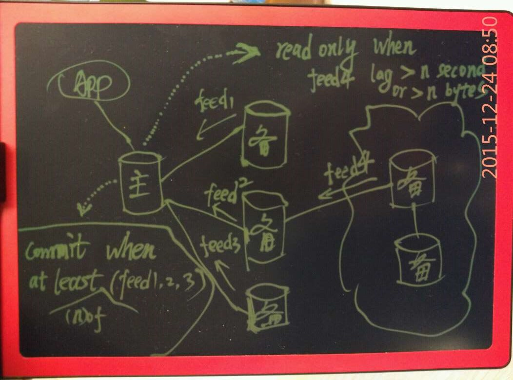
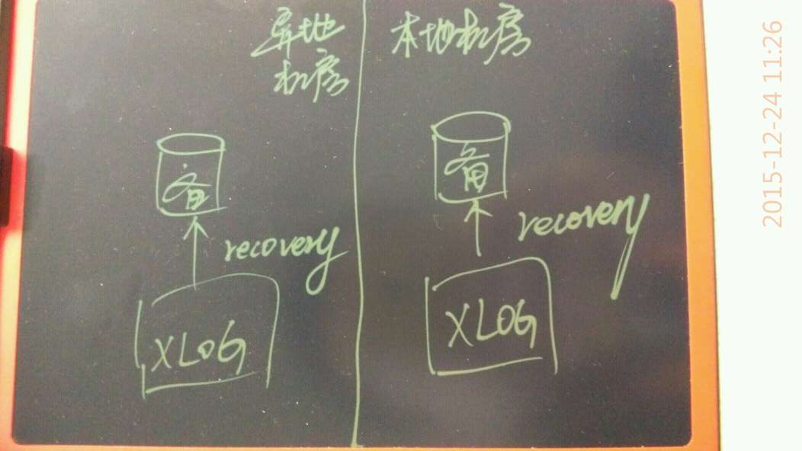
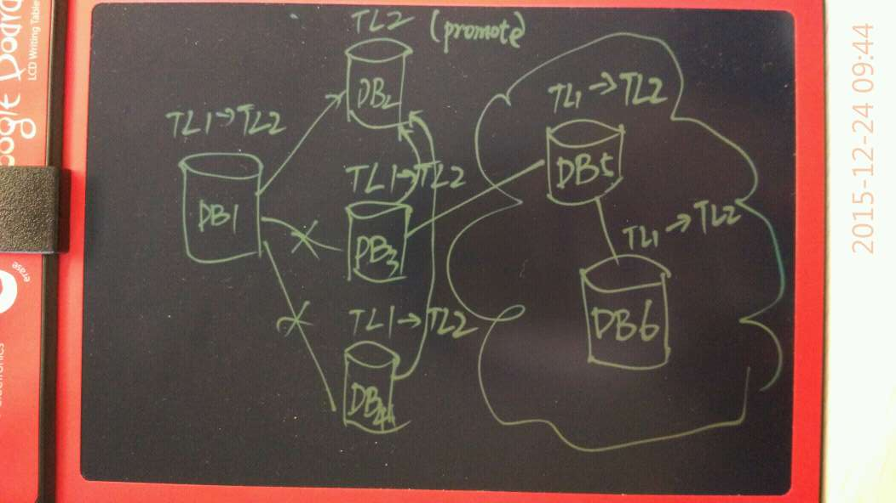

## PostgreSQL 金融行业高可用和容灾解决方案     
       
### 作者       
digoal        
          
### 日期        
2015-12-24                                  
        
### 标签                                                                                                                        
PostgreSQL , 金融行业 , 高可用 , 容灾      
      
----        
      
## 背景  
金融行业高度依赖共享存储来解决高可用，数据0丢失以及异地容灾的问题。  
  
开源数据库PostgreSQL基于复制的解决方案能不能解决0丢失，高可用以及容灾的问题？  
  
完全可以，而且更灵活，更可靠。  
  
## PostgreSQL 金融场景实现  
  
如图1  
  
  
  
主备同步通过流复制实现，可靠性指标包含反馈维度的指标和一致性维度的指标。  
  
### 反馈指标  
  
1\. L1，备库接收到REDO并写入XLOG BUFFER。  
  
2\. L2，备库接收到REDO并落盘。  
  
3\. L3，备库接收到REDO落盘后并恢复。  
  
以上三个指标，对事务的时延逐级提升。（根据可靠性强度要求设置）  
  
### 一致性指标  
  
1\. 满足两个条件后，通知应用程序事务提交成功或失败  
  
1\.1 强制要求强同步的指定备库组反馈，处于该组的所有备库，至少有一个反馈。（用于异地强同步容灾，不配置则表示没有指定的强同步备库，只要满足下面一条即可。）  
  
1\.2 大于等于n个备库反馈，（用于任意副本数强同步，0表示异步，1表示1个备库强同步，2表示2个备库强同步，以此类推）  
  
2\. 异步库延迟多少秒，主库切换为只读（不配置，表示主库不管异步库延迟多少）  
  
3\. 异步库延迟多少字节，主库切换为只读（不配置，表示主库不管异步库延迟多少）  
  
（如果异地容灾库也需要0丢失，把上图的异地2个异步库级联挂接改为直接挂接主库即可。并且将它们配置为一组，则这组库必须要有1个反馈。）  
  
## 架构简化  
数据0丢失的实际上是靠REDO日志来保障的，只要REDO不丢失，就可以恢复到最终一致性状态。  
  
前面的图，可以简化为XLOG多分组同步如下图，每个分组代表一个机房（含本地机房）。  
  
### XLOG副本：  
  
1\. 本地强同步模式  
  
XLOG数据在本地机房同步至少1份。  
  
2\. 异地容灾强同步模式  
  
XLOG在异地机房同步至少1份。  
  
  
  
### 数据副本：  
本地机房建议2个副本。  
  
异地机房建议1个副本，可靠性要求高的场景，可以再增加副本。  
  
  
  
### 配置示范：  
  
针对金融行业，或者可靠性要求非常高的用户。  
  
本地机房  
  
    1主3备，万兆网连接。  
  
    反馈指标配置为2个L1，1个L2。一致性要求配置为超过1个主机反馈。  
  
    本地机房和异地机房通过物理分离的双光纤直连。  
      
异地机房  
  
    2备, 都直连主库，并配置为强同步组，至少要有1个反馈，同时反馈指标都配置为L1。  
  
## 解决了什么问题？  
  
1\. 数据的强同步副本达到了2个，其中一个副本在异地。  
  
2\. 本地机房，备库挂2台没关系，不影响主库运作。  
  
3\. 异地机房，备库挂1台没关系，不影响主库运作。  
  
## 性能如何？  
1. 对读完全没有影响。  
  
2. 对写事务的性能影响，完全取决于网络，实测万兆网的环境中写事务请求延迟会增加不到1毫秒，影响非常小。  
  
3. 备库和主库的延迟，因为PostgreSQL是基于物理变更的数据流同步，所以不存在逻辑复制的延迟问题，物理流复制的延迟可以控制在毫秒级。  
  
4. 发生故障时 HA 切换时延如何？  
  
  考虑到网络抖动，负载等不安因素，整个切换过程一般控制在25到45秒之间。  
  
5. 发生故障切换时，应用要不要重新和数据库建立会话？  
  
  有proxy解决方案，可以做到 HA 切换时不断开用户连接，对用户无感知（但是使用绑定变量的话，需要重新绑定，将来会解决会话信息的同步）。  
  
## 主库的重新选举原则  
  
1. 从已达到同步模式的库中根据配置的优先级顺序选择  
2. 如果用户配置的是全异步模式，则从延迟最低的库选择  
3. 同样的延迟，则根据配置的优先级顺序选择  
  
图2  
  
  
  
选举出新的主库后，连接关系重新建立。  
  
## 灵活性  
  
1\. 备库可以提供给只读查询，做读写分离负载均衡。  
  
2\. 时间线切换很方便，主备角色切换非常灵活。  
  
3\. 备库还可以用于升级大版本的演练，测试环境快速搭建，样本库快速建立等。  
  
以上这些，使用共享存储的解决方案都是做不到的。  
  
## 性能和一致性的博弈  
  
如果异地机房不设置强同步，那么当主库所在机房都挂掉时，切换到异地机房有丢数据的风险。但是为了可用性，用户可能会决定切换到异地机房，那么问题来了，当主库所在的机房活了，  
  
1\. 怎么把未完全同步到异地机房的数据补回去？  
  
2\. 怎么快速的把原来的主库变成备库，需不需要重新同步数据，搭建主备？  
  
### 博弈  
1\. PostgreSQL 的logical decode帮你解决第1个问题。  
  
使用logical decode，可以帮助用户从异地机房激活的时间点开始，将主库执行过多的SQL取出来，同时将SQL影响的行，老的记录，新的记录都取出来。  
  
有了这些数据，就可以在业务层面解决补数据差异的问题。  
  
  
2\. PostgreSQL 的pg_rewind可以帮你解决第2个问题  
  
速度有多快？假设切换时，异地备库与主库的延迟在分钟级别，那么：  
  
不管数据库有多大，都可以分钟级完成回退，变成备库。  
  
原理是从异地机房激活的时间点到主库crash时，主库产生的XLOG，将这些变更使用新的主库的数据块替换。  
  
这一点Oracle都做不到。  
  
## 成本  
  
使用PostgreSQL的解决方案，本地高可用，加一个容灾机房。  
  
（假设用户单库的数据 10TB，REDO 保留100GB。）  
  
成本如下：  
  
1\. 本地机房数据 2份（包括主库在内2台主机）  
  
2\. 本地机房XLOG 3份（复用以上主机，再增加一台）  
  
3\. 异地机房数据 1份（1台主机）  
  
4\. 异地机房XLOG 2份（复用以上主机，再增加一台）  
  
一共5台主机。  
  
磁盘容量需求，3份数据容量（30TB），5份REDO容量（500 GB）。  
  
## 效果：  
1\. 本地2个XLOG接收服务，挂掉1个不影响主库的写操作。  
  
2\. 异地机房2个XLOG接收服务，挂掉1个不影响主库的写操作。  
  
3\. 主库挂掉时，自动切换到本地的备库。  
  
4\. 机房挂掉时，可以切换到异地的备库。  
  
  
    
                                                            
                                                                    
                          
  
  
  
  
  
  
  
  
## [digoal's 大量PostgreSQL文章入口](https://github.com/digoal/blog/blob/master/README.md "22709685feb7cab07d30f30387f0a9ae")
  
  
## [免费领取阿里云RDS PostgreSQL实例、ECS虚拟机](https://free.aliyun.com/ "57258f76c37864c6e6d23383d05714ea")
  
  

  
