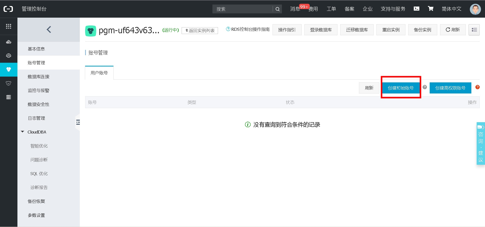
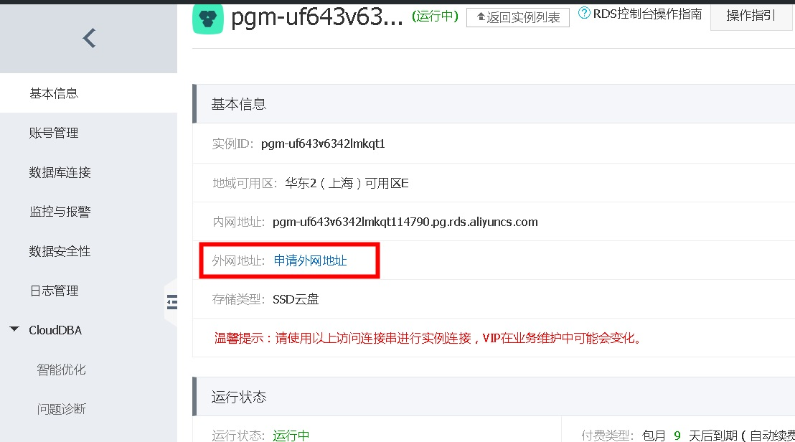
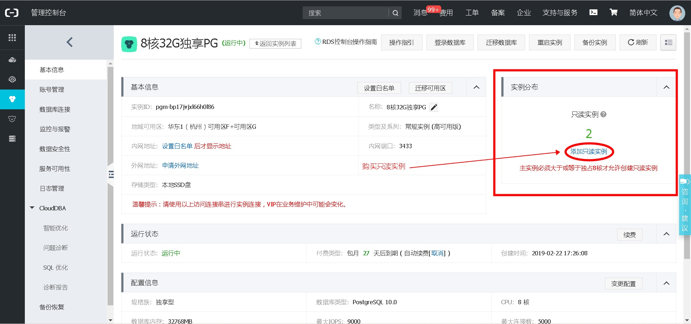

## 如何搭建阿里云RDS PostgreSQL数据库的物理备库,从库     
##### [TAG 24](../class/24.md)  
                                  
### 作者                                     
digoal                             
                              
### 日期                                                                                                 
2016-03-01                            
                                 
### 标签                              
PostgreSQL , 阿里云 , RDS , 物理备库           
                                                                                                    
----                                                                                              
                                                                                                       
## 背景                      
如何搭建阿里云RDS PostgreSQL数据库的物理备库      
      
用户在阿里云购买了RDS PostgreSQL，如何在自己的机房或者ECS上建立备库？      
    
关于如何构建逻辑备库，在我以前的文章有详细的讲解，所谓逻辑备库，是可以跨版本，甚至仅仅同步一部分相同步的表的备库。      
    
https://yq.aliyun.com/articles/7240      
      
如果用户需要构建一个和RDS PostgreSQL一模一样的备库，则可以通过流复制或者归档来完成。      
      
步骤如下      
    
1\. 准备备库环境      
    
安装64位Linux      
    
安装与RDS PostgreSQL大版本一致的PostgreSQL软件      
    
空间规划      
    
2\. 申请一个replication角色的用户(目前RDS 的根用户已自带replication权限，可忽略此步骤)      
    
3\. 配置外网地址（可选）      
    
4\. 配置白名单，测试连通性正常      
    
5\. 下载全量备份集，测试归档的下载接口是否正常      
    
6\. 配置postgresql.conf, recovery.conf      
    
7\. 启动备库，检查是否同步      
      
详细步骤      
    
1\. 准备备库环境      
    
安装CentOS 6.x x64，步骤略。      
    
线上RDS PostgreSQL版本为9.4.x，所以备库环境也需要安装9.4的大版本，我们可以安装9.4.6，关注一下release notes，确保兼容性。      
    
PS，目前阿里RDS PostgreSQL软件还没有下载或开源，如果将来开放下载或开源的话，建议安装阿里云提供的PostgreSQL版本，可以保证兼容性，以及出问题可以找到阿里云的PostgreSQL内核团队修复。      
      
确保与线上版本编译参数一致，包括插件版本。      
    
只需要关注如下      
    
```      
select name,setting from pg_settings;      
 block_size                          | 8192      
 wal_block_size                      | 8192      
 rds_available_extensions            | plpgsql,pg_stat_statements,btree_gin,btree_gist,chkpass,citext,cube,dblink,dict_int,earthdistance,hstore,intagg,intarray,isn,ltree,pgcrypto,pgrowlocks,pg_prewarm,pg_trgm,postgres_fdw,sslinfo,tablefu      
nc,tsearch2,unaccent,postgis,postgis_topology,fuzzystrmatch,postgis_tiger_geocoder,plperl,pltcl,plv8,plls,plcoffee,"uuid-ossp",zhparser,pgrouting,rdkit,pg_hint_plan,pgstattuple      
```      
    
安装软件      
    
```      
wget https://ftp.postgresql.org/pub/source/v9.4.6/postgresql-9.4.6.tar.bz2      
tar -jxvf postgresql-9.4.6.tar.bz2      
cd postgresql-9.4.6      
./configure --prefix=/home/postgres/pgsql9.4.6 --with-blocksize=8 --with-wal-blocksize=8       
gmake -j 32 world      
gmake install-world      
```      
    
配置环境变量      
    
```      
vi ~/env_pg.sh      
# add by digoal      
export PS1="$USER@`/bin/hostname -s`-> "      
export PGPORT=1921      
export PGDATA=/data01/pgdata      
export LANG=en_US.utf8      
export PGHOME=/home/postgres/pgsql9.4.6      
export LD_LIBRARY_PATH=$PGHOME/lib:/lib64:/usr/lib64:/usr/local/lib64:/lib:/usr/lib:/usr/local/lib:$LD_LIBRARY_PATH      
export DATE=`date +"%Y%m%d%H%M"`      
export PATH=$PGHOME/bin:$PATH:.      
export MANPATH=$PGHOME/share/man:$MANPATH      
export PGHOST=$PGDATA      
export PGDATABASE=postgres      
export PGUSER=postgres      
alias rm='rm -i'      
alias ll='ls -lh'      
unalias vi      
      
postgres@digoal-> . ./env_pg.sh       
-bash: unalias: vi: not found      
postgres@digoal-> psql -V      
psql (PostgreSQL) 9.4.6      
```      
    
以下插件如果没有用到可以不安装，否则需要手动安装，安装方法见相应的插件官网或者搜索我的blog：      
    
```      
postgis, plv8, plls, plcoffee, zhparser, pgrouting, rdkit, pg_hint_plan      
```      
    
规划空间      
    
目录空间至少要大于你所购买的RDS的容量规格，例如我买的是5G的实例，那么我本地的单个目录的空间要大于5GB。      
    
PS，目前RDS PostgreSQL不支持自定义表空间，所以所有的数据都是放在默认表空间的，也即是需要单个目录的空间大于购买规格的空间的原因。将来如果RDS开放了创建表空间的权限，可以重新规划本地的目录。      
    
```      
[root@digoal ~]# df -h      
Filesystem      Size  Used Avail Use% Mounted on      
/dev/sda2        39G   22G   15G  61% /      
tmpfs           3.9G     0  3.9G   0% /dev/shm      
/dev/sdb         20G   44M   19G   1% /data01      
```     
    
2\. 申请一个replication角色的用户(目前RDS 的根用户已自带replication权限，可忽略此步骤)         
    
在阿里云管理控制台的右上方点击 工单服务 -> 提交工单 -> 关系型数据库RDS -> 直接提交工单，让客服创建一个有replication角色的用户。      
    
PS，将来如果开放创建replication角色的API，就不需要提工单来申请账号了。      
      
3\. 如果你需要将RDS复制到阿里云以外的主机，或者RDS和ECS在不同的可用区，则需要通过公网来连接。      
    
那么需要用户配置RDS的公网地址，同样在阿里云管理控制台的RDS实例管理中可以申请公网地址。      
      
4\. 在阿里云管理控制台的RDS 实例管理 -> 数据安全 配置白名单，测试连通性正常。      
    
例如备库的出口IP是固定的，则将这个IP添加到白名单，如果不是固定的IP，则需要添加0.0.0.0。      
      
5\. 下载全量备份集      
    
在控制台下载最近的一次全量备份集。      
      
6\. 测试归档的下载接口是否正常      
    
归档文件的下载需要通过调用API完成。      
    
https://help.aliyun.com/document_detail/rds/OpenAPI-manual/RDS-OpenAPI-LogManagement/DescribeBinlogFiles.html?spm=5176.docrds/OpenAPI-manual/RDS-OpenAPI-BackupRecovery/DescribeBackups.6.217.tqV3VW      
    
什么情况下需要用到API呢？当备库需要的XLOG文件已经被主库删除时。这种情况通常发生在自建的备库和主库网络异常，或者自建的备库由于某些原因停库后，长时间没有接收来自RDS PostgreSQL的XLOG，这些XLOG在RDS归档后就会从线上数据库的WAL日志中清除。      
    
如果发现自建的备库报需要获取的XLOG不存在的错误，这个时候就需要从OSS下载归档了。      
    
如果连OSS中都无法找到需要的归档，说明归档也清除了，那么就需要重建备库，回到第五步骤。      
      
      
7\. 测试数据库的流复制连通性      
    
请替换成您自己的RDS实例连接信息进行测试      
    
```      
postgres@digoal-> psql "replication=true" -h xxxx.pg.rds.aliyuncs.com -p 3433 -U digoal      
Password for user digoal:       
psql (9.4.6, server 9.4.1)      
Type "help" for help.      
postgres=> IDENTIFY_SYSTEM;      
      systemid       | timeline |  xlogpos   | dbname       
---------------------+----------+------------+--------      
 6165616856935119759 |        3 | 0/6B3A0180 |       
(1 row)      
```      
    
8\. 配置postgresql.conf, recovery.conf      
    
解压全量备份集到规划好的目录。      
    
/data01/pgdata      
      
配置  postgresql.conf      
    
在文件末尾追加如下：      
    
```      
# add by digoal      
port=1921      
unix_socket_directories='.'      
tcp_keepalives_idle = 70      
tcp_keepalives_interval = 10      
tcp_keepalives_count = 10      
log_destination='csvlog'      
logging_collector=on      
log_truncate_on_rotation=on      
log_line_prefix = ''      
log_checkpoints = on      
log_connections = on      
log_disconnections = on      
log_error_verbosity = verbose      
hot_standby = on      
max_standby_archive_delay = 300s      
max_standby_streaming_delay = 300s      
wal_receiver_status_interval = 1s      
hot_standby_feedback = off     
log_statement='none'      
archive_mode=on      
archive_command = '/bin/date'      
track_io_timing=off      
listen_addresses='0.0.0.0'      
```      
    
同时还需要修正postgresql.conf, postgresql.auto.conf(为了能够让客户端能使用社区版本PG跑起来)     
    
```  
vi postgresql.auto.conf  以及  postgresql.conf  
  
参考postgresql.conf, postgresql.auto.conf中的shared_preload_libraries进行修改  
  
shared_preload_libraries='.....'   # 删除你的环境中没有按照的插件的SO, 例如zhparser, pg_pathman ....，保留其他的  
```  
      
配置  recovery.conf      
    
请替换成您自己的RDS实例连接信息      
    
```      
standby_mode = 'on'      
primary_conninfo = 'host=xxxxxx.pg.rds.aliyuncs.com user=digoal password=xxxx port=3433'      
recovery_target_timeline = 'latest'      
```      
      
9\. 启动备库，检查是否同步      
    
```      
pg_ctl start      
      
RDS    
postgres@digoal-> psql -h xxxx.pg.rds.aliyuncs.com -p 3433 -U digoal postgres    
Type "help" for help.      
postgres=> create table test(id timestamp);      
postgres=> insert into test values (now());      
postgres=> update test set id=now() returning *;      
postgres=> \watch 1      
    
备库    
postgres@digoal-> psql -h 127.0.0.1 -p 1921 -U digoal postgres    
Type "help" for help.      
postgres=> select * from test;      
postgres=> \watch 1      
    
查看是否能同步    
```      
      
风险点评估      
    
1\.  建议不要使用replication slot, 因为slot会导致主节点不删除XLOG, 从而可能因为网络堵塞，备库异常等无法实时接收XLOG的情况下导致主节点因为保留pg_xlog而把空间用满。      
    
用户可以通过这种方法搭建自己的备库，在RDS没有提供异地容灾服务前，进行异地容灾。       
     
其他：    
    
```  
replication = String  
  
Connection parameter passed in the startup message. This parameter accepts two values; "true" and database. Passing true tells the backend to go into walsender mode, wherein a small set of replication commands can be issued instead of SQL statements. Only the simple query protocol can be used in walsender mode. Passing "database" as the value instructs walsender to connect to the database specified in the dbname parameter, which will allow the connection to be used for logical replication from that database.  
```  
  
## RDS PG 10 基础版，物理从库（备库）搭建例子  
1、主实例，创建超级账号(自带replication权限)  
  
  
  
2、主实例，设置白名单，允许你的从库所在的主机能够访问到这个RDS PG 10实例  
  
  
  
  
  
3、主实例，申请外网地址（可选），如果您的从库所在的主机是通过外网访问RDS PG，则需要申请RDS PG的公网地址。  
  
  
  
4、假设主实例为  
  
```  
pgm-uf643v6342lmkqt1to.pg.rds.aliyuncs.com  
  
3433  
```  
  
5、确保您的从库所在的主机可以连通主实例  
  
```  
digoal@pg11-test-> psql -h pgm-uf643v6342lmkqt1to.pg.rds.aliyuncs.com -p 3433 -U sup postgres  
Password for user sup:   
psql (11.1, server 10.6)  
Type "help" for help.  
  
  
postgres=> \du+ sup  
                        List of roles  
 Role name | Attributes  |     Member of      |  Description    
-----------+-------------+--------------------+---------------  
 sup       | Replication | {pg_rds_superuser} | rds_superuser  
  
  
postgres=> \l+ postgres  
                                                             List of databases  
   Name   |   Owner    | Encoding | Collate | Ctype | Access privileges |  Size   | Tablespace |                Description                   
----------+------------+----------+---------+-------+-------------------+---------+------------+--------------------------------------------  
 postgres | pg13011779 | UTF8     | C       | C     |                   | 7629 kB | pg_default | default administrative connection database  
(1 row)  
```  
  
6、安装PG 10，安装插件(你在RDS中用了哪些插件，本地也要安装)。  
  
  
https://www.postgresql.org/ftp/source/v10.7/  
  
  
```  
[root@pg11-test ~]# useradd pg10  
[root@pg11-test ~]# su - pg10  
[pg10@pg11-test ~]$ wget https://ftp.postgresql.org/pub/source/v10.7/postgresql-10.7.tar.bz2  
[pg10@pg11-test ~]$ tar -jxvf postgresql-10.7.tar.bz2   
[pg10@pg11-test ~]$ cd postgresql-10.7/  
[pg10@pg11-test postgresql-10.7]$ ./configure --prefix=/home/pg10/pg10.7  
[pg10@pg11-test postgresql-10.7]$ make world  
[pg10@pg11-test postgresql-10.7]$ make install-world  
```  
  
  
```  
[pg10@pg11-test postgresql-10.7]$ vi ~/.bash_profile  
export PS1="$USER@`/bin/hostname -s`-> "  
export PGPORT=4001  
export PGDATA=/data01/pg10/pg_root$PGPORT  
export LANG=en_US.utf8  
export PGHOME=/home/pg10/pg10.7  
export LD_LIBRARY_PATH=$PGHOME/lib:/lib64:/usr/lib64:/usr/local/lib64:/lib:/usr/lib:/usr/local/lib:$LD_LIBRARY_PATH   
export DATE=`date +"%Y%m%d%H%M"`  
export PATH=$PGHOME/bin:$PATH:.  
export MANPATH=$PGHOME/share/man:$MANPATH  
export PGHOST=$PGDATA  
export PGUSER=sup  
export PGDATABASE=postgres  
alias rm='rm -i'  
alias ll='ls -lh'  
unalias vi  
```  
  
7、足够大的目录（放下主实例数据文件）  
  
```  
[pg10@pg11-test ~]$ exit  
logout  
[root@pg11-test ~]# mkdir /data01/pg10  
[root@pg11-test ~]# chown pg10:pg10 /data01/pg10  
```  
  
  
8、创建从库(采用rds的超级账号)  
  
```  
su - pg10  
  
pg10@pg11-test-> pg_basebackup -D $PGDATA -F p -c fast -X stream -h pgm-uf643v6342lmkqt1to.pg.rds.aliyuncs.com -p 3433 -U sup   
Password:   
WARNING:  skipping special file "./.s.PGSQL.3002"  
```  
  
9、配置recovery.conf  
  
```  
pg10@pg11-test-> cd $PGDATA  
pg10@pg11-test-> cp /home/pg10/pg10.7/share/postgresql/recovery.conf.sample ./  
pg10@pg11-test-> mv recovery.conf.sample recovery.conf  
  
vi recovery.conf  
recovery_target_timeline = 'latest'  
standby_mode = on  
primary_conninfo = 'host=pgm-uf643v6342lmkqt1to.pg.rds.aliyuncs.com port=3433 user=sup password=密码'  
```  
  
10、配置postgresql.conf  
  
```  
vi postgresql.conf  
#  
#Mon Mar 04 17:06:37 CST 2019  
# 注释几个参数  
#auth_delay.milliseconds='3000'  
#shared_preload_libraries='pg_stat_statements,auth_delay,auto_explain,zhparser,pg_pathman'  
#rds.rds_max_non_super_conns=100  
#log_line_prefix='\1\n\t%p\t%r\t%u\t%d\t%t\t%e\t%T\t%S\t%U\t%E\t\t'  
#rds.rds_max_super_conns=100  
#log_filename='postgresql-%Y-%m-%d_%H%M%S.log'  
#rds.rds_max_non_super_wal_snd=10  
# 修改几个参数  
port=4001  
log_statement='ddl'  
log_destination='csvlog'  
log_checkpoints=on   
```  
  
11、启动从库  
  
```  
pg10@pg11-test-> pg_ctl start  
waiting for server to start....2019-03-26 06:41:50.843 UTC [45301] LOG:  listening on IPv4 address "0.0.0.0", port 4001  
2019-03-26 06:41:50.843 UTC [45301] LOG:  listening on IPv6 address "::", port 4001  
2019-03-26 06:41:50.843 UTC [45301] LOG:  listening on Unix socket "./.s.PGSQL.4001"  
2019-03-26 06:41:50.866 UTC [45301] LOG:  redirecting log output to logging collector process  
2019-03-26 06:41:50.866 UTC [45301] HINT:  Future log output will appear in directory "pg_log".  
 done  
server started  
```  
  
12、连接到主库，查看从库的连接状态，延迟状态  
  
```  
pg10@pg11-test-> psql -h pgm-uf643v6342lmkqt1to.pg.rds.aliyuncs.com -p 3433 -U sup postgres  
Password for user sup:   
psql (10.7, server 10.6)  
Type "help" for help.  
  
postgres=> select * from pg_stat_replication ;  
-[ RECORD 1 ]----+-----------------------------  
pid              | 20987  
usesysid         | 16385  
usename          | sup  
application_name | walreceiver  
client_addr      | 47.99.87.236  
client_hostname  |   
client_port      | 49794  
backend_start    | 2019-03-26 14:41:50.88186+08  
backend_xmin     |   
state            | streaming  
sent_lsn         | 0/31000060  
write_lsn        | 0/31000060  
flush_lsn        | 0/31000060  
replay_lsn       | 0/31000060  
write_lag        |   
flush_lag        |   
replay_lag       |   
sync_priority    | 0  
sync_state       | async  
```  
  
13、主库写压力测试  
  
  
```  
postgres=> \dt  
Did not find any relations.  
postgres=> create table test (id int, info text, crt_time timestamp);  
CREATE TABLE  
postgres=> insert into test select generate_series(1,100000), md5(random()::text), now();  
INSERT 0 100000  
postgres=> \timing  
Timing is on.  
postgres=> insert into test select generate_series(1,100000), md5(random()::text), now();  
INSERT 0 100000  
Time: 385.658 ms  
postgres=> insert into test select generate_series(1,100000), md5(random()::text), now();  
INSERT 0 100000  
Time: 260.957 ms  
postgres=> select * from pg_stat_replication ;  
-[ RECORD 1 ]----+-----------------------------  
pid              | 20987  
usesysid         | 16385  
usename          | sup  
application_name | walreceiver  
client_addr      | 47.99.87.236  
client_hostname  |   
client_port      | 49794  
backend_start    | 2019-03-26 14:41:50.88186+08  
backend_xmin     |   
state            | streaming  
sent_lsn         | 0/32DFEE80  
write_lsn        | 0/32DFEE80  
flush_lsn        | 0/32DFEE80  
replay_lsn       | 0/32DFEE80  
write_lag        | 00:00:00.006496  
flush_lag        | 00:00:00.006554  
replay_lag       | 00:00:00.006644  
sync_priority    | 0  
sync_state       | async  
Time: 5.774 ms  
  
  
postgres=> \q  
```  
  
14、连接从库，检查是否已同步  
  
```  
pg10@pg11-test-> psql -U sup  
psql (10.7)  
Type "help" for help.  
  
postgres=> select count(*) from test;  
 count    
--------  
 300000  
(1 row)  
```  
  
**注意**  
  
如果从库与主库网络不好，或者长时间无法正常的接收WAL日志，那么主库的WAL可能会被清除导致从库永远无法获得同步（此时必须重建从库），建议设置主实例的wal_keep_segments参数，确保有一定的保留余量，会增加主实例的空间使用量。   
  
例如设置为1024，可能增加16GB的空间占用(wal日志)。  
  
**如果您已购买阿里云RDS PG 10 HA版 8核以上独占规格实例，可以直接购买只读实例（只读实例本身也是自带HA的，所以可用性比自建更高），省去自建只读实例的麻烦。**   
  
  
  
  
    
    
    
    
    
    
    
    
    
    
  
  
  
#### [免费领取阿里云RDS PostgreSQL实例、ECS虚拟机](https://free.aliyun.com/ "57258f76c37864c6e6d23383d05714ea")
  
  
#### [digoal's PostgreSQL文章入口](https://github.com/digoal/blog/blob/master/README.md "22709685feb7cab07d30f30387f0a9ae")
  
  

  
  
  
  
  
  
#### 打赏都逃不过老婆的五指山 －_－b  

  
