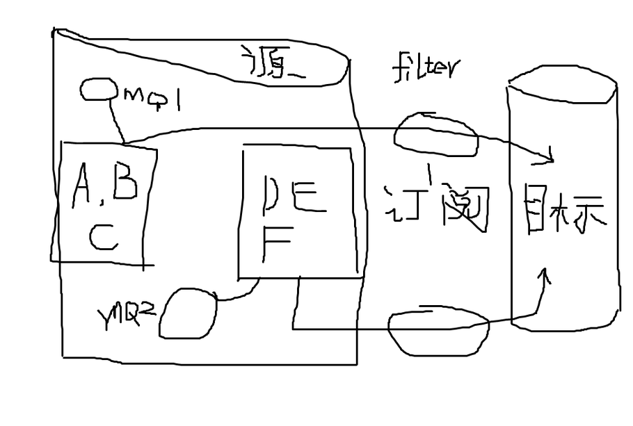

## 如何搭建阿里云RDS PostgreSQL数据库的逻辑备库    
                                  
### 作者                                     
digoal                             
                              
### 日期                                                                                                 
2016-03-01                            
                                 
### 标签                              
PostgreSQL , 阿里云 , RDS , 逻辑备库           
                                                                                                    
----                                                                                              
                                                                                                       
## 背景                      
适用于PostgreSQL数据库之间的逻辑增量同步。    
  
对PostgreSQL的版本要求，8.3以上即可。    
  
最小的同步单位为行，用户可以选择表为同步对象，并且可以对表进行分组（有事务关联的表作为一个分组）。    
  
不同的分组，可以并行订阅，消费消息。    
  
如图：    
  
A,B,C三个表有事务关联，放到一个消息队列。    
  
D,E,F三个表有事务关联，放到另一个消息队列。    
  
在数据库中跟踪表的变更，记录到数据库的MQ中。    
  
订阅者将MQ翻译成SQL，按照事务的提交顺序，在目标端回放这些SQL。从而达到逻辑复制的目的。  
  
与MySQL的binlog 复制原理一致。    
  
  
  
应用场景举例：    
  
1\. 多IDC之间的数据库同步。    
  
2\. 公有云的PostgreSQL和ECS中自建或用户自己的IDC中的数据库之间的数据同步。    
  
实测性能：    
  
单个分组支持大于8000条SQL每秒的同步速度。    
  
并行执行的情况，支持大于2万条SQL每秒的同步速度。    
  
包含代码的例子：    
  
https://github.com/digoal/pgsql_admin_script/blob/master/pgq_case.md    
  
## rds_dbsync(推荐使用)  
以上方法需要使用触发器，更好的方式是从RDS PG的redo 日志中，使用逻辑流复制的方法搭建逻辑备库。  
  
请参考 阿里云开源项目rds_dbsync，支持增量复制mysql, pg的数据到pg, greenplum, ppas中。  
  
https://github.com/aliyun/rds_dbsync  
  
## 好消息
PostgreSQL 10.0 内置流式逻辑复制功能，无需再借助插件或者触发器。   
