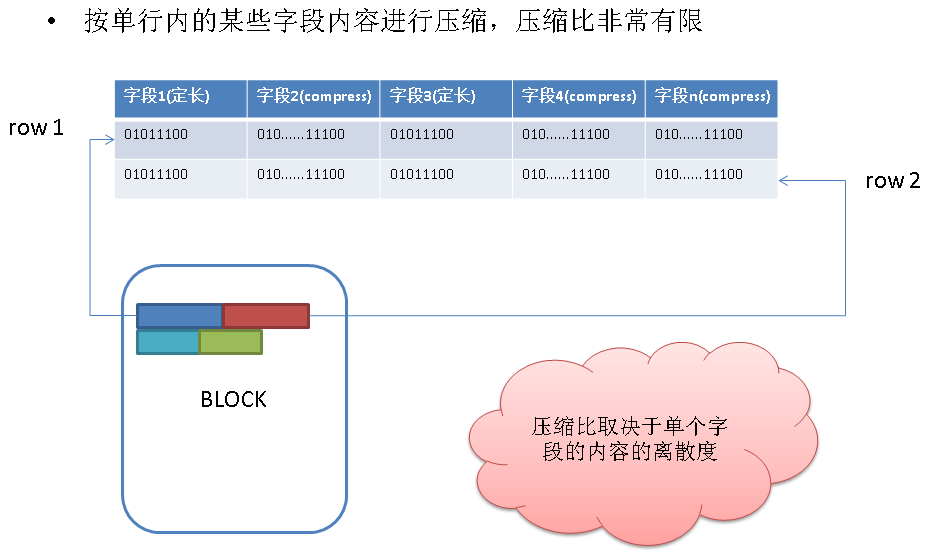
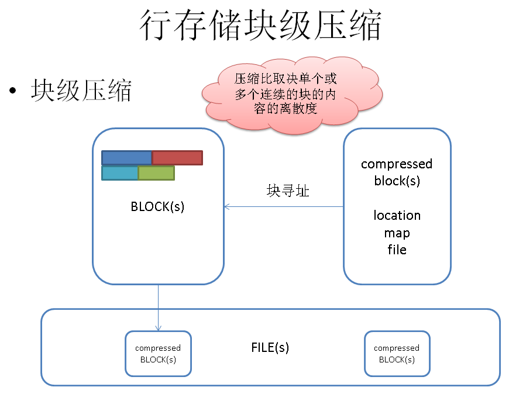
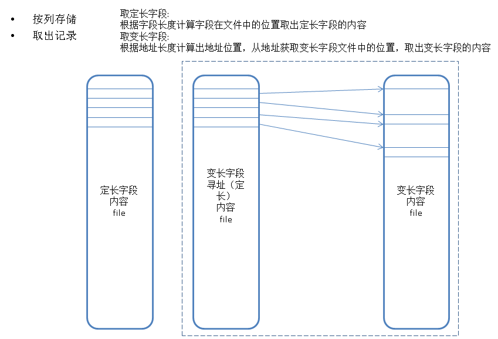
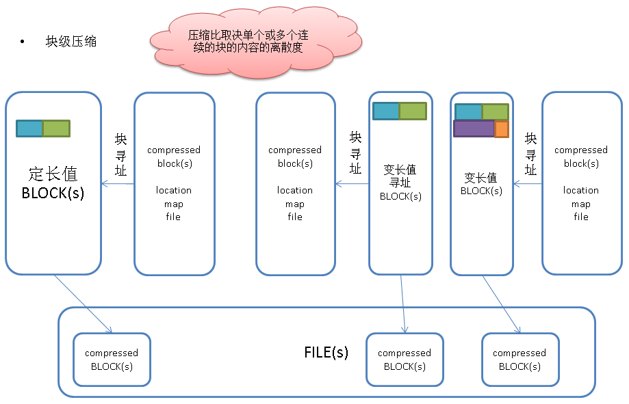
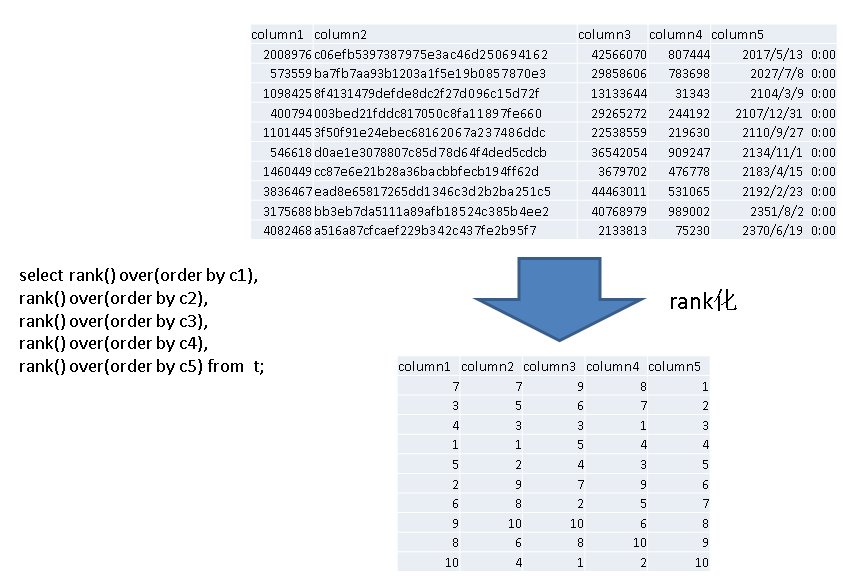
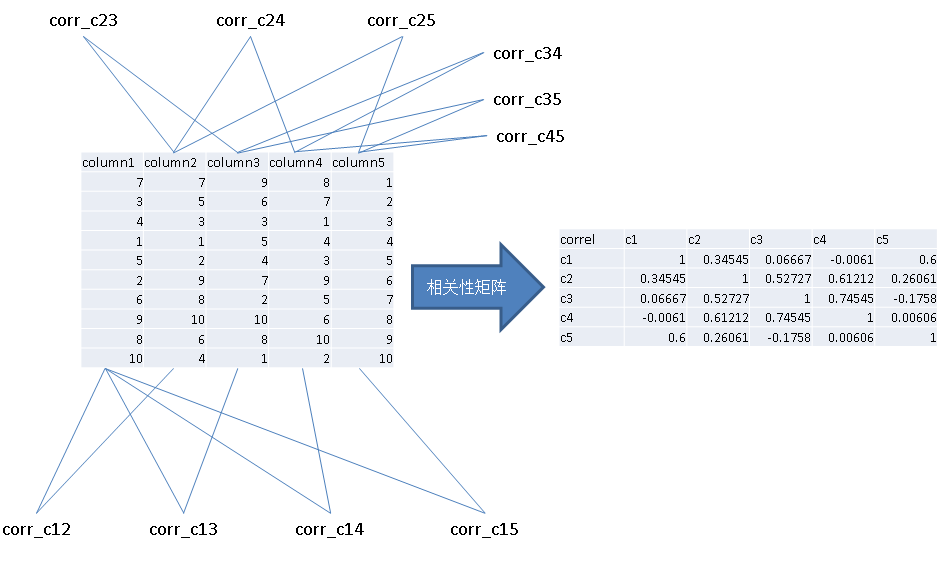

## 一个简单算法可以帮助物联网,金融 用户 节约98%的数据存储成本 (PostgreSQL,Greenplum帮你做到)  
##### [TAG 11](../class/11.md)
                                           
### 作者                                           
digoal                                            
                                              
### 日期                                            
2016-04-04                                                                    
                                            
### 标签                                                                                                                                                            
PostgreSQL , 字段线性相关性 , rank化 , 列存储 , 压缩        
        
----                                            
                                          
## 背景        
前段时间为大家分享了物联网行业分析以及PostgreSQL 为物联网场景量身定制的特性介绍。  
  
https://yq.aliyun.com/articles/18034  
  
https://yq.aliyun.com/edu/lesson/67  
  
今天再给大家分享一枚重磅炸弹，PostgreSQL 帮助物联网用户 降低98%的存储成本。这是个什么概念呢？  
  
举个例子，你原来要花100万买存储才能存下的数据，现在只需要花2万就能搞定。  
  
下面我会给大家介绍一下是如何做到的。  
  
在物联网和金融行业中，存在庞大的数据体量，以一个城市的电子眼为例，一个月存储的车牌信息就可能几百亿，一年可能达到几千亿甚至上万亿。这仅仅是物联网中某一项单一应用的数据量。  
  
这么大的数据量，存入数据库会有多大呢？  
  
我来模拟一些数据：  
  
5个字段，随机生成一些数据，其中一个字符串，3个INT，1个时间类型。  
  
```  
digoal=# create table heap_test(c1 int, c2 text, c3 int, c4 int, c5 timestamp);  
digoal=#   
insert into heap_test   
  select   
  random()*5000000,   
  repeat(md5(c::text),32),   
  c+random()*50000000,   
  random()*1000000,    
  current_date+(150000*random())::int  
  from  
  (select trunc(random()*100000) c from generate_series(1,50000000) t(id)) t;  
```  
  
并行执行10次，生成5亿数据。  
  
传统的堆数据存储，5亿数据就达到500GB。   
  
怎样能把500GB的数据压缩到5GB呢？  
  
原理如下：  
  
堆表行压缩  
  
  
  
堆表块压缩  
  
  
  
列存储原理  
  
  
  
列存储块压缩  
  
  
  
拿Greenplum来做一下验证，PostgreSQL的列存储可以外挂cstore, monetdb引擎。或者等阿里云AliCloudDB for PostgreSQL后期的版本开放这个功能。  
  
使用列存储，开启压缩，可以将数据量压缩到 21GB。  
  
```  
digoal=# create table ao1_test(c1 int, c2 text, c3 int, c4 int, c5 timestamp) with (APPENDONLY=true,BLOCKSIZE=2097152,ORIENTATION=column,COMPRESSTYPE=zlib,CHECKSUM=false);  
digoal=# insert into ao1_test select * from heap_test ;  
digoal=# analyze ao1_test;  
ANALYZE  
digoal=# select pg_size_pretty(pg_total_relation_size('ao1_test'));  
 pg_size_pretty   
----------------  
21GB  
(1 row)  
```  
  
压缩比达到了 这就完了吗?  
  
显然还没，压缩比和数据存储关系是非常大的，为了进一步提升列存储的压缩比，我们必须找到一个非常合理的数据排序才能实现这一的目的。  
  
为了达到这个目的，我们需要关注几个要素：  
  
1\. 字段值的冗余度，冗余度越高的值，排序后的压缩比越高。  
  
2\. 字段值的平均宽度，平均宽度大的值，压缩取得的绝对效果比宽度小的值好。  
  
3\. 字段与字段间的线性相关性，线性关系好的字段，按其中一个A字段排序后线性关系也好，从而相关字段B的压缩效果也会比较好，从而达到双赢的目的。  
  
以上三个要素都提到了统计学的知识， PostgreSQL数据库在这方面是非常强大的。  
  
接下来会展示PostgreSQL利用窗口计算和统计分析，推算出最佳压缩比的字段排序组合。  
  
第一个要素，字段值冗余度的计算方法：  
  
```  
case   
when n_distinct < 0 then 1 + n_distinct   
when n_distinct = 1 then 1   
when n_distinct > 1 then 1 - n_distinct/reltuples   
end  
```  
  
第二个要素，字段值平均宽度的算法：  
  
```  
avg(pg_column_size(column_name)  
```  
  
第三个要素，字段值之间线性相关性的计算方法：  
  
同时需要计算 N*(N-1)/2 种相邻字段的相关性，相关性决定了压缩率的好坏，任意数据类型的相关性计算可以参考我前面写的文章：  
  
https://yq.aliyun.com/articles/18038  
  
原理如下:  
  
  
  
  
  
最后是计算综合压缩率，需要计算每种组合的综合压缩率：  
  
对于有N列的表来说，会产生N阶乘种排序组合，也就是需要计算 N! 组数据的相关性。  
  
如何得到N种组合的顺序，可以参考我前面写的一篇文章：  
  
https://yq.aliyun.com/articles/17228  
  
代码如下：  
  
依赖函数，过滤重复字段，用于生成N阶排列组合：  
  
```  
CREATE or replace FUNCTION has_dupli_val(VARIADIC arr int[]) RETURNS boolean AS $$  
  select count(distinct val) <> count(*) dist_val from unnest($1) t(val) where val is not null;  
$$ language sql strict;  
```  
  
终极目的 :   
  
计算每种排列组合的压缩率：  
  
这里需要用到矩阵，窗口查询，相关性计算等统计学的知识。  
  
用PostgreSQL可以把书本上的知识运用起来，还不错的，工业界和学术界的完美结合。  
  
下面还是拿Greenplum来做一下验证，PostgreSQL的列存储可以外挂cstore, monetdb引擎。或者等阿里云AliCloudDB for PostgreSQL后期的版本开放这个功能。  
  
```  
create or replace function best_compress_cols(samp int8) returns void as $$  
declare  
  cols text[] := array['c1', 'c2', 'c3', 'c4', 'c5'];  -- 参与计算的字段(最多5列, 至少有一列的冗余度>10%)  
  sub int[];  -- 计算过程中用到的数组下标  
  res_sub int[];  -- 计算结果用到的数组下标  
  comp_rat numeric;  -- 计算过程中存储的压缩率  
  res_comp_rat numeric := 0;  -- 计算结果的压缩率  
  cols_w_avg int[] := array[4, 1028, 4, 4, 8];  --  参与计算的字段, 对应的平均宽度  
  dup_rat numeric[] := array[0.941288981586695, 0.999979166666666666666667, 0.996877203229815, 0.999979166814228, 0.999697591731092];   -- 参与计算的字段, 对应的冗余度  
  corr numeric[][];  
begin  
  
--  计算字段之间的相关性, 存入矩阵corr[][]  
execute  
'  
select  
  array[  
    array[1,c12,c13,c14,c15] ,  
    array[c12,1,c23,c24,c25] ,  
    array[c13,c23,1,c34,c35] ,  
    array[c14,c24,c34,1,c45] ,  
    array[c15,c25,c35,c45,1]   
  ]   
from  
(  
  select   
    corr(c1,c2) c12,   
    corr(c1,c3) c13,   
    corr(c1,c4) c14,   
    corr(c1,c5) c15,   
    corr(c2,c3) c23,   
    corr(c2,c4) c24,   
    corr(c2,c5) c25,   
    corr(c3,c4) c34,   
    corr(c3,c5) c35,   
    corr(c4,c5) c45  
  from   
  (  
    select   
      rank() over(order by c1) c1,  
      rank() over(order by c2) c2,  
      rank() over(order by c3) c3,  
      rank() over(order by c4) c4,  
      rank() over(order by c5) c5  
    from  
    (  
      select '  
||  
cols[1]||' c1, '||cols[2]||' c2, '||cols[3]||' c3, '||cols[4]||' c4, '||cols[5]||' c5 '  
||  
'     from   
      heap_test   
      order by random() limit '  
||  
samp  
||  
'  
    ) t  
  ) t  
) t '  
into corr;  
  
-- 生成字段序号排列组合  
for sub in   
  with t(id) as (select generate_series(1,5))   
  select array[t1.id,t2.id,t3.id,t4.id,t5.id] from t t1,t t2,t t3,t t4,t t5 where not has_dupli_val(t1.id,t2.id,t3.id,t4.id,t5.id)   
LOOP  
  
comp_rat := abs( cols_w_avg[sub[1]] * dup_rat[sub[1]] * corr[sub[1]][sub[1]] )+   
            abs( cols_w_avg[sub[2]] * dup_rat[sub[2]] * corr[sub[1]][sub[2]] )+  
            abs( cols_w_avg[sub[3]] * dup_rat[sub[3]] * corr[sub[2]][sub[3]] )+  
            abs( cols_w_avg[sub[4]] * dup_rat[sub[4]] * corr[sub[3]][sub[4]] )+  
            abs( cols_w_avg[sub[5]] * dup_rat[sub[5]] * corr[sub[4]][sub[5]] );  
  
raise notice '%, %, %, %, %, compress ratio: % ', cols[sub[1]], cols[sub[2]], cols[sub[3]], cols[sub[4]], cols[sub[5]], comp_rat;  
  
if res_comp_rat = 0 then  
  res_comp_rat := comp_rat;  
  res_sub := sub;  
elseif  comp_rat > res_comp_rat then  
  res_comp_rat := comp_rat;  
  res_sub := sub;  
end if;  
  
END LOOP;  
  
-- 输出压缩比最大的组合  
raise notice 'resutl: %, %, %, %, %. compress ratio: % ', cols[res_sub[1]], cols[res_sub[2]], cols[res_sub[3]], cols[res_sub[4]], cols[res_sub[5]], res_comp_rat;  
end;  
$$ language plpgsql strict;  
```  
  
采样5000万数据，计算每种组合的压缩率，并输出最佳组合。  
  
```  
select best_compress_cols(50000000);  --  采样5000万记录，计算最佳压缩排序.  
```  
  
结果如下：  
  
```  
NOTICE:  resutl: c2, c4, c3, c5, c1. compress ratio: 1031.11112165362824768278103927944140  
```  
  
按照这个顺序重组数据，重组后的数据空间占用：  
  
```  
digoal=# create table ao2_test(c1 int, c2 text, c3 int, c4 int, c5 timestamp) with (APPENDONLY=true,BLOCKSIZE=2097152,ORIENTATION=column,COMPRESSTYPE=zlib,CHECKSUM=false);  
digoal=# insert into ao2_test select * from heap_test order by c2, c4, c3, c5, c1 ;  
digoal=# analyze ao2_test;  
ANALYZE  
digoal=# select pg_size_pretty(pg_total_relation_size('ao2_test'));  
 pg_size_pretty   
----------------  
4603MB  
(1 row)  
```  
  
以此方法，数据空间占用从500GB到4.5GB，压缩比达到了111 : 1。   
  
物联网，选择PostgreSQL，还不错哦。  
  
后续继续会放出PostgreSQL数据库在更多物联网细分行业的解决方案，敬请期待。  
  
https://yq.aliyun.com/articles/18034  
  
https://yq.aliyun.com/edu/lesson/67  
    
                    
  
  
  
  
  
  
  
  
  
  
  
  
  
#### [免费领取阿里云RDS PostgreSQL实例、ECS虚拟机](https://free.aliyun.com/ "57258f76c37864c6e6d23383d05714ea")
  
  
#### [digoal's PostgreSQL文章入口](https://github.com/digoal/blog/blob/master/README.md "22709685feb7cab07d30f30387f0a9ae")
  
  

  
  
#### 老婆的钱袋子：可以打赏哦^_^  

  
