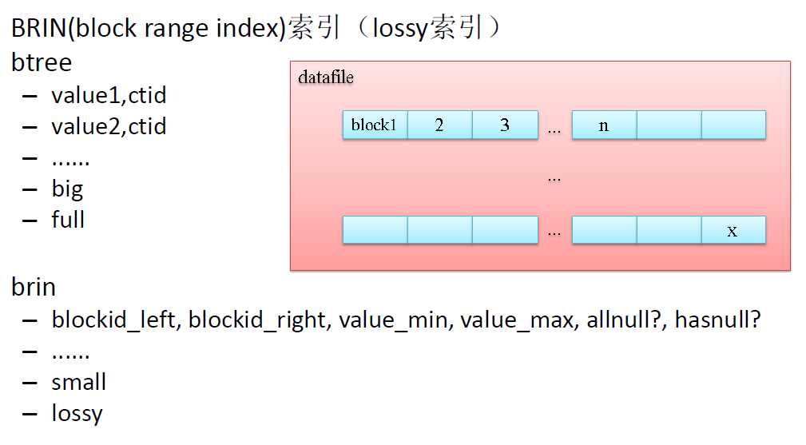
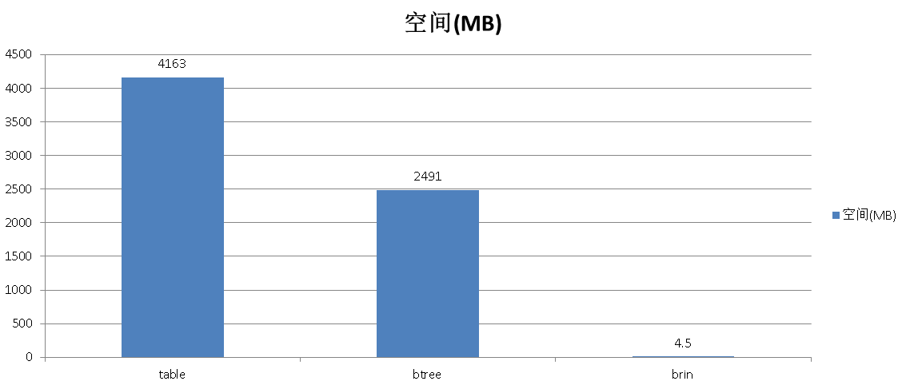
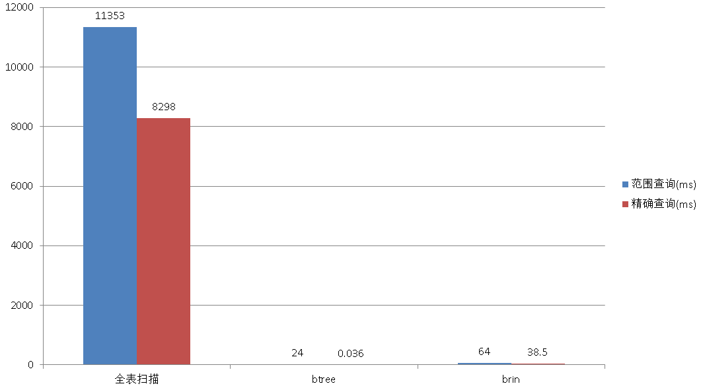
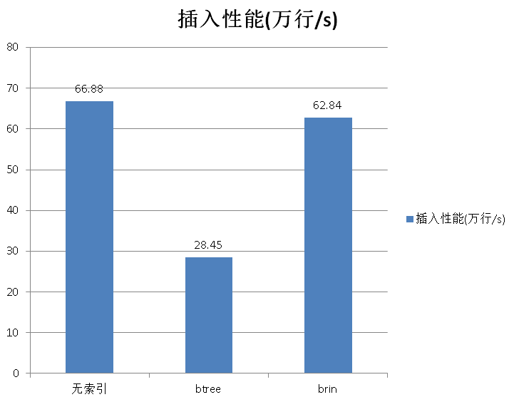

## PostgreSQL 物联网黑科技 - 瘦身几百倍的索引(BRIN index)  
                                                                                                                    
### 作者                                                                                                                   
digoal                                                                                                                    
                                                                                                                    
### 日期                                                                                                                  
2016-04-14                            
                                                                                                                    
### 标签                                                                                                                  
PostgreSQL , 物联网 , 块索引 , BRIN , Oracle Exadata                                                                                
                                                      
----                                                                                                                  
                                                          
## 背景      
在数据库中用得最多的当属btree索引，除了BTREE，一般的数据库可能还支持hash, bitmap索引。  
  
但是这些索引到了物联网，会显得太重，对性能的损耗太大。  
  
为什么呢？  
  
物联网有大量的数据产生和入库，入库基本都是流式的。在使用这些数据时，基本是FIFO，或者范围查询的批量数据使用风格。  
  
btree索引太重，因为索引需要存储每条记录的索引字段的值和寻址，使得索引非常庞大。  
  
另一方面，物联网的大量范围查询和批量处理用法决定了它不需要这么重的索引。  
  
例子：  
  
如下所示，btree索引的空间占比是非常大的。  
  
```  
postgres=# \dt+ tab  
                    List of relations  
 Schema | Name | Type  |  Owner   |  Size   | Description   
--------+------+-------+----------+---------+-------------  
 public | tab  | table | postgres | 3438 MB |   
(1 row)  
  
postgres=# \di+ idx_tab_id  
                           List of relations  
 Schema |    Name    | Type  |  Owner   | Table |  Size   | Description   
--------+------------+-------+----------+-------+---------+-------------  
 public | idx_tab_id | index | postgres | tab   | 2125 MB |   
(1 row)  
```  
  
除了大以外，btree索引同时也会影响数据的更新，删除，或插入的性能。  
  
例子：  
  
有btree索引, 每秒入库28.45万行  
  
```  
postgres=# create unlogged table tab(id serial8, info text, crt_time timestamp);  
CREATE TABLE  
postgres=# create index idx_tab_id on tab(id);  
CREATE INDEX  
```  
  
```  
vi test.sql  
insert into tab (info) select '' from generate_series(1,10000);  
  
pgbench -M prepared -n -r -P 1 -f ./test.sql -c 48 -j 48 -T 100  
tps = 28.453983 (excluding connections establishing)  
```  
  
无索引, 每秒入库66.88万行  
  
```  
postgres=# drop index idx_tab_id ;  
DROP INDEX  
```  
  
```  
pgbench -M prepared -n -r -P 1 -f ./test.sql -c 48 -j 48 -T 100  
tps = 66.880260 (excluding connections establishing)  
```  
  
从上面的介绍和测试数据，可以明显的看出btree索引存在的问题：  
  
体积大，影响性能。  
  
接下来该让PostgreSQL黑科技登场了：  
  
范围索引，术语brin, block range index.  
  
## BRIN索引原理  
范围索引的原理，存储连续相邻的BLOCK的统计信息（min(val), max(val), has null? all null? left block id, right block id )。  
  
例如一个表占用10000个BLOCK，创建brin index 时，指定统计每128个BLOCK的统计信息，那么这个索引只需要存储79份统计信息。  
  
    
  
空间占用非常的小。  
  
## BRIN索引对比BTREE索引性能  
解决了空间的问题，还需要解决性能的问题，我们测试一下，在创建了brin索引后，插入的性能有多少？  
  
范围索引, 每秒入库62.84万行  
  
```  
postgres=# drop index idx_tab_id ;  
DROP INDEX  
postgres=# create index idx_tab_id on tab using brin (id) with (pages_per_range=1);  
CREATE INDEX  
```  
  
```  
pgbench -M prepared -n -r -P 1 -f ./test.sql -c 48 -j 48 -T 100  
tps = 62.838701 (excluding connections establishing)  
```  
  
最后还需要对比一下 btree, brin 索引的大小，还有查询的性能。  
  
索引大小比拼：  
  
表 4163MB  
  
btree索引 2491 MB  
  
brin索引 4608 kB  
  
```  
postgres=# \di+ idx_tab_btree_id   
                              List of relations  
 Schema |       Name       | Type  |  Owner   | Table |  Size   | Description   
--------+------------------+-------+----------+-------+---------+-------------  
 public | idx_tab_btree_id | index | postgres | tab   | 2491 MB |   
(1 row)  
  
postgres=# \di+ idx_tab_id  
                           List of relations  
 Schema |    Name    | Type  |  Owner   | Table |  Size   | Description   
--------+------------+-------+----------+-------+---------+-------------  
 public | idx_tab_id | index | postgres | tab   | 4608 kB |   
(1 row)  
  
postgres=# \dt+ tab  
                    List of relations  
 Schema | Name | Type  |  Owner   |  Size   | Description   
--------+------+-------+----------+---------+-------------  
 public | tab  | table | postgres | 4163 MB |   
(1 row)  
```  
  
查询性能比拼 :  
  
范围查询  
  
全表扫描 11 秒  
  
范围索引 64 毫秒  
  
btree索引 24 毫秒  
  
```  
postgres=# /*+ seqscan(tab) */ explain (analyze,buffers,timing,costs,verbose) select count(*) from tab where id between 1 and 100000;  
                                                           QUERY PLAN                                                             
--------------------------------------------------------------------------------------------------------------------------------  
 Aggregate  (cost=1891578.12..1891578.13 rows=1 width=0) (actual time=11353.057..11353.058 rows=1 loops=1)  
   Output: count(*)  
   Buffers: shared hit=133202  
   ->  Seq Scan on public.tab  (cost=0.00..1891352.00 rows=90447 width=0) (actual time=1660.445..11345.123 rows=100000 loops=1)  
         Output: id, info, crt_time  
         Filter: ((tab.id >= 1) AND (tab.id <= 100000))  
         Rows Removed by Filter: 117110000  
         Buffers: shared hit=133202  
 Planning time: 0.048 ms  
 Execution time: 11353.080 ms  
(10 rows)  
  
postgres=# /*+ bitmapscan(tab idx_tab_id) */ explain (analyze,buffers,timing,costs,verbose) select count(*) from tab where id between 1 and 100000;  
                                                             QUERY PLAN                                                                
-------------------------------------------------------------------------------------------------------------------------------------  
 Aggregate  (cost=70172.91..70172.92 rows=1 width=0) (actual time=63.735..63.735 rows=1 loops=1)  
   Output: count(*)  
   Buffers: shared hit=298  
   ->  Bitmap Heap Scan on public.tab  (cost=1067.08..69946.79 rows=90447 width=0) (actual time=40.700..55.868 rows=100000 loops=1)  
         Output: id, info, crt_time  
         Recheck Cond: ((tab.id >= 1) AND (tab.id <= 100000))  
         Rows Removed by Index Recheck: 893  
         Heap Blocks: lossy=111  
         Buffers: shared hit=298  
         ->  Bitmap Index Scan on idx_tab_id  (cost=0.00..1044.47 rows=90447 width=0) (actual time=40.675..40.675 rows=1110 loops=1)  
               Index Cond: ((tab.id >= 1) AND (tab.id <= 100000))  
               Buffers: shared hit=187  
 Planning time: 0.049 ms  
 Execution time: 63.755 ms  
(14 rows)  
  
postgres=# /*+ bitmapscan(tab idx_tab_btree_id) */ explain (analyze,buffers,timing,costs,verbose) select count(*) from tab where id between 1 and 100000;  
                                                                 QUERY PLAN                                                                   
--------------------------------------------------------------------------------------------------------------------------------------------  
 Aggregate  (cost=76817.88..76817.89 rows=1 width=0) (actual time=23.780..23.780 rows=1 loops=1)  
   Output: count(*)  
   Buffers: shared hit=181  
   ->  Bitmap Heap Scan on public.tab  (cost=1118.87..76562.16 rows=102286 width=0) (actual time=6.569..15.950 rows=100000 loops=1)  
         Output: id, info, crt_time  
         Recheck Cond: ((tab.id >= 1) AND (tab.id <= 100000))  
         Heap Blocks: exact=111  
         Buffers: shared hit=181  
         ->  Bitmap Index Scan on idx_tab_btree_id  (cost=0.00..1093.30 rows=102286 width=0) (actual time=6.530..6.530 rows=100000 loops=1)  
               Index Cond: ((tab.id >= 1) AND (tab.id <= 100000))  
               Buffers: shared hit=70  
 Planning time: 0.099 ms  
 Execution time: 23.798 ms  
(13 rows)  
```  
  
精确查询  
  
全表扫描 8 秒  
  
范围索引 39 毫秒  
  
btree索引 0.03 毫秒  
  
```  
postgres=# /*+ seqscan(tab) */ explain (analyze,buffers,timing,costs,verbose) select count(*) from tab where id=100000;  
                                                      QUERY PLAN                                                        
----------------------------------------------------------------------------------------------------------------------  
 Aggregate  (cost=1598327.00..1598327.01 rows=1 width=0) (actual time=8297.589..8297.589 rows=1 loops=1)  
   Output: count(*)  
   Buffers: shared hit=133202  
   ->  Seq Scan on public.tab  (cost=0.00..1598327.00 rows=2 width=0) (actual time=1221.359..8297.582 rows=1 loops=1)  
         Output: id, info, crt_time  
         Filter: (tab.id = 100000)  
         Rows Removed by Filter: 117209999  
         Buffers: shared hit=133202  
 Planning time: 0.113 ms  
 Execution time: 8297.619 ms  
(10 rows)  
  
postgres=# /*+ bitmapscan(tab idx_tab_id) */ explain (analyze,buffers,timing,costs,verbose) select count(*) from tab where id=100000;  
                                                          QUERY PLAN                                                            
------------------------------------------------------------------------------------------------------------------------------  
 Aggregate  (cost=142.04..142.05 rows=1 width=0) (actual time=38.498..38.498 rows=1 loops=1)  
   Output: count(*)  
   Buffers: shared hit=189  
   ->  Bitmap Heap Scan on public.tab  (cost=140.01..142.04 rows=2 width=0) (actual time=38.432..38.495 rows=1 loops=1)  
         Output: id, info, crt_time  
         Recheck Cond: (tab.id = 100000)  
         Rows Removed by Index Recheck: 1811  
         Heap Blocks: lossy=2  
         Buffers: shared hit=189  
         ->  Bitmap Index Scan on idx_tab_id  (cost=0.00..140.01 rows=2 width=0) (actual time=38.321..38.321 rows=20 loops=1)  
               Index Cond: (tab.id = 100000)  
               Buffers: shared hit=187  
 Planning time: 0.102 ms  
 Execution time: 38.531 ms  
(14 rows)  
  
postgres=# /*+ indexscan(tab idx_tab_btree_id) */ explain (analyze,buffers,timing,costs,verbose) select count(*) from tab where id=100000;  
                                                            QUERY PLAN                                                               
-----------------------------------------------------------------------------------------------------------------------------------  
 Aggregate  (cost=2.76..2.77 rows=1 width=0) (actual time=0.018..0.018 rows=1 loops=1)  
   Output: count(*)  
   Buffers: shared hit=4  
   ->  Index Scan using idx_tab_btree_id on public.tab  (cost=0.44..2.76 rows=2 width=0) (actual time=0.015..0.016 rows=1 loops=1)  
         Output: id, info, crt_time  
         Index Cond: (tab.id = 100000)  
         Buffers: shared hit=4  
 Planning time: 0.049 ms  
 Execution time: 0.036 ms  
(9 rows)  
```  
  
## 性能对比图  
    
  
    
  
    
  
## 小结  
1\. 范围索引重点的使用场景是物联网类型的，流式入库，范围查询的场景。 不仅仅对插入的影响微乎其微，而且索引大小非常的小，范围查询的性能和BTREE差别微乎其微。  
  
2\. 结合JSON和GIS功能，相信PostgreSQL会在物联网大放异彩。  
  
ps: oracle 也有与之类似的索引，名为storage index. 但是只有Exadata产品里有，贵得离谱，屌丝绕道。哈哈。  
  
https://docs.oracle.com/cd/E50790_01/doc/doc.121/e50471/concepts.htm#SAGUG20984  
  
DBA应该具备抓住各种数据库的特性，并且将这种特性应用到适合的场景中去的能力。数据库与DBA的角色用千里马和伯乐来形容好像也不为过。  
  
小伙伴们一起来玩PG吧，社区正在推Oracle DBA 7天速成PG的教程，敬请期待。  
            
                                                      
[Count](http://info.flagcounter.com/h9V1)                                                                  
                                                              
                             
