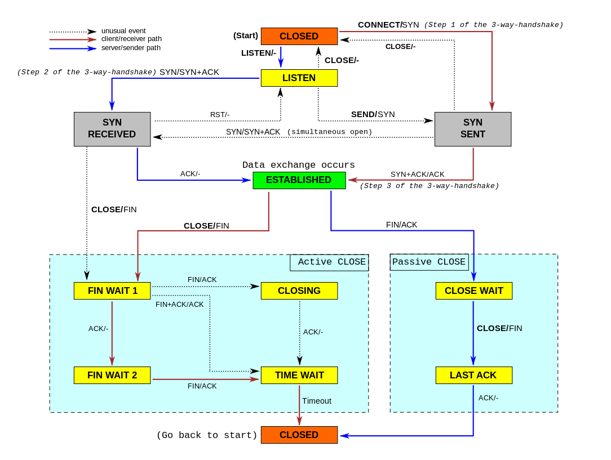

## 防止短连接耗尽你的动态TCP端口  
                                                                                                                                                                                                   
### 作者                                                                                                                                                                                                   
digoal                                                                                                                                                                                                   
                                                                                                                                                                                                   
### 日期                                                                                                                                                                                                   
2016-05-27                                                                                                                                                                                            
                                                                                                                                                                                                   
### 标签                                                                                                                                                                                                   
PostgreSQL , tcp , 连接端口                 
                                                                                                                                                                                                   
----                                                                                                                                                                                                   
                                                                                                                                                                                                   
## 背景                                                                                       
用pgbench使用短连接压测一个PostgreSQL数据库(select 1)，其他数据库亦如此。    
  
```  
$ vi test.sql  
select 1;  
  
$ export PGPASSWORD=digoal  
$ pgbench -M simple -C -n -r -P 1 -c 800 -j 80 -T 1000 -h xxx.xxx.xxx.xxx -p xxxx -U xxx dbname  
```  
  
压测一段时间之后，可能会因为本地（客户端）的端口耗尽，客户端会报错如下    
  
```  
connection to database "postgres" failed:  
could not connect to server: Cannot assign requested address  
        Is the server running on host "xxx.xxx.xxx.xxx" and accepting  
        TCP/IP connections on port 1925?  
connection to database "postgres" failed:  
could not connect to server: Cannot assign requested address  
        Is the server running on host "xxx.xxx.xxx.xxx" and accepting  
        TCP/IP connections on port 1925?  
```  
  
原因是客户端需要为每一个连接动态创建TCP端口，所以每个连接会消耗一个端口。    
  
客户端主动断开连接后，会进入TIME_WAIT状态。    
  
  
详见TCP协议      
  
https://en.wikipedia.org/wiki/Transmission_Control_Protocol  
  
  
  
但是TIME_WAIT是有时间窗口的，Linux默认是60秒。    
  
所以如果不停的产生和关闭TCP会话，就可能导致前面提到的问题。    
  
  
  
对于Linux的客户端，通过调整几个操作系统内核参数可以解决这个问题。     
  
```  
net.ipv4.tcp_syncookies=1   # 开启SYN Cookies。当出现SYN等待队列溢出时，启用cookie来处理，可防范少量的SYN攻击  
net.ipv4.tcp_tw_recycle=1   # 开启TCP连接中TIME-WAIT套接字的快速回收  
net.ipv4.tcp_tw_reuse=1     # 开启重用。允许将TIME-WAIT套接字重新用于新的TCP连接  
net.ipv4.tcp_timestamps=1   # 减少time_wait  
net.ipv4.tcp_tw_timeout=3   # 收缩TIME_WAIT状态socket的回收时间窗口  
```  
  
      
  
  
  
  
  
  
  
  
  
  
  
  
  
#### [免费领取阿里云RDS PostgreSQL实例、ECS虚拟机](https://free.aliyun.com/ "57258f76c37864c6e6d23383d05714ea")
  
  
#### [digoal's PostgreSQL文章入口](https://github.com/digoal/blog/blob/master/README.md "22709685feb7cab07d30f30387f0a9ae")
  
  

  
  
  
  
  
  
  
