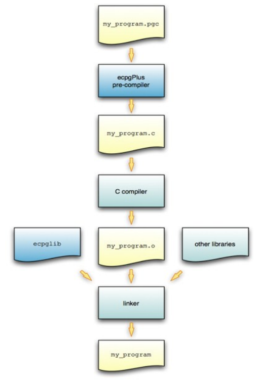

## PostgreSQL ECPG 开发 DEMO  
                                                                   
### 作者                                                                   
digoal                                                                   
                                                                   
### 日期                                                                   
2016-05-29                                                                
                                                                   
### 标签                                                                   
PostgreSQL , ECPG  
                                                                   
----                                                                   
                                                                   
## 背景     
ECPG 是在C中嵌套SQL的一种用法。    
  
写好pgc文件后，需要使用ecpg程序将pgc编程成C文件来使用。    
  
  
  
详细的用法请参考    
  
https://www.postgresql.org/docs/9.5/static/ecpg.html  
  
ecpg的用法,  以EXEC SQL开头表示后面是SQL写法      
  
一些简单的用法    
  
大小写敏感.    
  
1\. 连接数据库    
  
```  
EXEC SQL CONNECT TO target [AS connection-name] [USER user-name];  
  
target :   
dbname[@hostname][:port]  
tcp:postgresql://hostname[:port][/dbname][?options]  
unix:postgresql://hostname[:port][/dbname][?options]  
  
例子  
EXEC SQL CONNECT TO mydb@sql.mydomain.com;  
  
EXEC SQL CONNECT TO unix:postgresql://sql.mydomain.com/mydb AS myconnection USER john;  
  
EXEC SQL BEGIN DECLARE SECTION;  
const char *target = "mydb@sql.mydomain.com";  
const char *user = "john";  
const char *passwd = "secret";  
EXEC SQL END DECLARE SECTION;  
 ...  
EXEC SQL CONNECT TO :target USER :user USING :passwd;  
/* or EXEC SQL CONNECT TO :target USER :user/:passwd; */  
```  
  
2\. 定义ecpg变量    
  
PostgreSQL数据类型与ecpg使用的类型的映射关系    
  
https://www.postgresql.org/docs/9.5/static/ecpg-variables.html#ECPG-VARIABLES-TYPE-MAPPING  
  
有些类型没有一一对应的关系，需要使用ecpg的函数来转换。    
  
下面是一个DEMO    
  
首先需要编写pgc文件。    
  
```  
$ vi t.pgc  
#include <stdio.h>  
#include <stdlib.h>  
#include <pgtypes_numeric.h>  
  
EXEC SQL WHENEVER SQLERROR STOP;  
  
int  
main(void)  
{  
EXEC SQL BEGIN DECLARE SECTION;  
    numeric *num;  
    numeric *num2;  
    decimal *dec;  
EXEC SQL END DECLARE SECTION;  
  
    EXEC SQL CONNECT TO tcp:postgresql://xxxcs.com:3433/postgres AS db_digoal USER digoal USING digoal;  
  
    num = PGTYPESnumeric_new();  
    dec = PGTYPESdecimal_new();  
  
    EXEC SQL SELECT 12.345::numeric(4,2), 23.456::decimal(4,2) INTO :num, :dec;  
  
    printf("numeric = %s\n", PGTYPESnumeric_to_asc(num, 0));  
    printf("numeric = %s\n", PGTYPESnumeric_to_asc(num, 1));  
    printf("numeric = %s\n", PGTYPESnumeric_to_asc(num, 2));  
  
    /* Convert decimal to numeric to show a decimal value. */  
    num2 = PGTYPESnumeric_new();  
    PGTYPESnumeric_from_decimal(dec, num2);  
  
    printf("decimal = %s\n", PGTYPESnumeric_to_asc(num2, 0));  
    printf("decimal = %s\n", PGTYPESnumeric_to_asc(num2, 1));  
    printf("decimal = %s\n", PGTYPESnumeric_to_asc(num2, 2));  
  
    PGTYPESnumeric_free(num2);  
    PGTYPESdecimal_free(dec);  
    PGTYPESnumeric_free(num);  
  
    EXEC SQL COMMIT;  
    EXEC SQL DISCONNECT ALL;  
    return 0;  
}  
```  
  
本地环境中需要有依赖的头文件和库.    
  
编译.pgc    
  
-t 表示使用自动提交    
  
```  
ecpg -t -c -I/home/digoal/pgsql9.6/include -o t.c t.pgc  
```  
  
查看编译后的.c    
  
```  
/* Processed by ecpg (4.12.0) */  
/* These include files are added by the preprocessor */  
#include <ecpglib.h>  
#include <ecpgerrno.h>  
#include <sqlca.h>  
/* End of automatic include section */  
  
#line 1 "t.pgc"  
#include <stdio.h>  
#include <stdlib.h>  
#include <pgtypes_numeric.h>  
  
/* exec sql whenever sqlerror  stop ; */  
#line 5 "t.pgc"  
  
  
int  
main(void)  
{  
/* exec sql begin declare section */  
       
       
       
  
#line 11 "t.pgc"  
 numeric * num ;  
   
#line 12 "t.pgc"  
 numeric * num2 ;  
   
#line 13 "t.pgc"  
 decimal * dec ;  
/* exec sql end declare section */  
#line 14 "t.pgc"  
  
  
    { ECPGconnect(__LINE__, 0, "tcp:postgresql://rdsqm2ffv0wjxnxk5nbsi.pg.rds.aliyuncs.com:3433/postgres" , "digoal" , "digoal" , "db_digoal", 1);   
#line 16 "t.pgc"  
  
if (sqlca.sqlcode < 0) exit (1);}  
#line 16 "t.pgc"  
  
  
    num = PGTYPESnumeric_new();  
    dec = PGTYPESdecimal_new();  
  
    { ECPGdo(__LINE__, 0, 1, NULL, 0, ECPGst_normal, "select 12.345 :: numeric ( 4 , 2 ) , 23.456 :: decimal ( 4 , 2 )", ECPGt_EOIT,   
        ECPGt_numeric,&(num),(long)1,(long)0,sizeof(numeric),   
        ECPGt_NO_INDICATOR, NULL , 0L, 0L, 0L,   
        ECPGt_decimal,&(dec),(long)1,(long)0,sizeof(decimal),   
        ECPGt_NO_INDICATOR, NULL , 0L, 0L, 0L, ECPGt_EORT);  
#line 21 "t.pgc"  
  
if (sqlca.sqlcode < 0) exit (1);}  
#line 21 "t.pgc"  
  
  
    printf("numeric = %s\n", PGTYPESnumeric_to_asc(num, 0));  
    printf("numeric = %s\n", PGTYPESnumeric_to_asc(num, 1));  
    printf("numeric = %s\n", PGTYPESnumeric_to_asc(num, 2));  
  
    /* Convert decimal to numeric to show a decimal value. */  
    num2 = PGTYPESnumeric_new();  
    PGTYPESnumeric_from_decimal(dec, num2);  
  
    printf("decimal = %s\n", PGTYPESnumeric_to_asc(num2, 0));  
    printf("decimal = %s\n", PGTYPESnumeric_to_asc(num2, 1));  
    printf("decimal = %s\n", PGTYPESnumeric_to_asc(num2, 2));  
  
    PGTYPESnumeric_free(num2);  
    PGTYPESdecimal_free(dec);  
    PGTYPESnumeric_free(num);  
  
    { ECPGtrans(__LINE__, NULL, "commit");  
#line 39 "t.pgc"  
  
if (sqlca.sqlcode < 0) exit (1);}  
#line 39 "t.pgc"  
  
    { ECPGdisconnect(__LINE__, "ALL");  
#line 40 "t.pgc"  
  
if (sqlca.sqlcode < 0) exit (1);}  
#line 40 "t.pgc"  
  
    return 0;  
}  
```  
  
编译，链接 .c    
  
```  
gcc -I/home/digoal/pgsql9.6/include  -Wall -g  t.c  -L/home/digoal/pgsql9.6/lib -lecpg -lpq -lpgtypes -o t  
```  
  
也可以写成Makefile如下 :    
  
```  
$ vi Makefile  
```  
  
注意行首缩进的地方需要TAB键输入.    
  
```  
ECPG = ecpg  
CC = gcc  
  
INCLUDES = -I$(shell pg_config --includedir)  
LIBPATH = -L$(shell pg_config --libdir)  
CFLAGS += $(INCLUDES)  
LDFLAGS += -Wall -g  
LDLIBS += $(LIBPATH) -lecpg -lpq -lpgtypes  
  
%.c: %.pgc  
        $(ECPG) -t -c $(INCLUDES) -o $@ $<  
  
%: %.o  
        $(CC) $(CFLAGS) $(LDFLAGS) $(LDLIBS) -o $@ $<  
  
TESTS = t t.c  
  
default: $(TESTS)  
  
clean:  
        rm -f *.o *.so t t.c  
```  
  
使用时注意把pg_config弄进PATH      
  
```  
$ export PATH=/home/digoal/pgsql9.6/bin:$PATH  
$ make  
```  
  
使用编译好的t :     
  
```  
./t   
numeric = 12  
numeric = 12.4  
numeric = 12.35  
decimal = 23  
decimal = 23.5  
decimal = 23.46  
```  
  
<a rel="nofollow" href="http://info.flagcounter.com/h9V1"  ></a>  
  
  
  
  
  
  
## [digoal's 大量PostgreSQL文章入口](https://github.com/digoal/blog/blob/master/README.md "22709685feb7cab07d30f30387f0a9ae")
  
  
## [免费领取阿里云RDS PostgreSQL实例、ECS虚拟机](https://free.aliyun.com/ "57258f76c37864c6e6d23383d05714ea")
  
  

  
