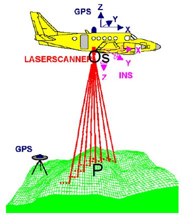
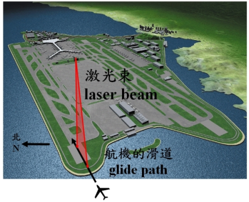

## PostgreSQL 内核扩展之 - 管理十亿级3D扫描数据(基于Lidar产生的point cloud数据)  
                                                                                                           
### 作者                                                                                                           
digoal                                                                                                           
                                                                                                           
### 日期                                                                                                           
2016-06-29                                                                                                        
                                                                                                           
### 标签                                                                                                           
PostgreSQL , 3D , 数据管理 , point cloud       
                                                                                                           
----                                                                                                           
                                                                                                           
## 背景                                               
## 背景知识    
还记得成龙演的那部《十二生肖》里用3D扫描和打印技术复制的生肖吗？      
  
    
  
3D打印是近几年兴起的一种技术，除了存储 **物体表面的位置信息，还有颜色，密度等信息** 。      
  
而3D扫描其实在军用领域很早以前就有了。      
  
如果使用普通的数据库来存储，得把这些属性拆开来存。      
  
而在PostgreSQL中，你完全不需要把这些属性拆开，他们本来就是一体的，用好PG的扩展接口就好了。      
  
PostgreSQL 扩展指南 ：      
  
https://yq.aliyun.com/articles/55981    
    
## 什么是Lidar        
3D扫描的基础知识，来自百度百科        
  
LiDAR——Light Detection And Ranging，即激光探测与测量。      
  
是利用GPS（Global Position System）和IMU（Inertial Measurement Unit，惯性测量装置）机载激光扫描。      
  
其所测得的数据为数字表面模型(Digital Surface Model, DSM)的离散点表示，数据中含有 **空间三维信息** 和 **激光强度** 信息。      
  
应用分类(Classification)技术在这些原始数字表面模型中移除建筑物、人造物、覆盖植物等测点，即可获得数字高程模型(Digital Elevation Model, DEM)，并同时得到地面覆盖物的高度。        
      
机载LIDAR技术在国外的发展和应用已有十几年的历史，但是我国在这方面的研究和应用还只是刚刚起步,其中利用航空激光扫描探测数据进行困难地区DEM、DOM、DLG数据产品生产是当今的研究热点之一。    
  
该技术在地形测绘、环境检测、三维城市建模等诸多领域具有广阔的发展前景和应用需求，有可能为测绘行业带来一场新的技术革命。    
  
针对不同的应用领域及成果要求，结合灵活的搭载方式，LiDAR技术可以广泛应用于基础测绘、道路工程、电力电网、水利、石油管线、海岸线及海岛礁、数字城市等领域，提供高精度、大比例尺（1:500至1:10000）的空间数据成果。    
      
例子        
  
激光扫描设备装置可记录一个单发射脉冲返回的首回波﹑中间多个回波与最后回波，通过对每个回波时刻记录，可同时获得多个高程信息，将IMU/DGPS系统和激光扫描技术进行集成，飞机向前飞行时，扫描仪横向对地面发射连续的激光束，同时接受地面反射回波，IMU/DGPS系统记录每一个激光发射点的瞬间空间位置和姿态，从而可计算得到激光反射点的空间位置。        
  
    
        
激光雷达的激光束扫瞄机场的滑道，探测飞机将遇到的风切变，即逆风的改变。    
  
      
    
## 什么是point cloud    
https://en.wikipedia.org/wiki/Point_cloud    
      
前面提到了LIDAR扫描的数据包括了位置信息，以及其他传感器在对应这个位置采集的其他信息如 RGB、时间、温度、湿度等等（你可以大开脑洞想，什么都有）。      
  
也就是说，每一个点都包含了大量的信息。      
  
```    
The variables captured by LIDAR sensors varies by sensor and capture process.     
Some data sets might contain only X/Y/Z values.     
Others will contain dozens of variables: X, Y, Z; intensity and return number;     
red, green, and blue values; return times; and many more.     
```    
      
point cloud则是很多点的集合，所以信息量是非常庞大的。        
  
```    
A point cloud is a set of data points in some coordinate system.    
    
In a three-dimensional coordinate system, these points are usually defined by X, Y, and Z coordinates, and often are intended to represent the external surface of an object.    
    
Point clouds may be created by 3D scanners. These devices measure a large number of points on an object's surface, and often output a point cloud as a data file.     
The point cloud represents the set of points that the device has measured.    
```      
    
## point cloud如何存入PostgreSQL    
PostgreSQL 存储的point cloud格式与PDAL（Point Data Abstraction Library）库一致。      
  
非常好的复用了PDAL的数据结构，操作方法等。      
  
因为PDAL的通用性，所以兼容性也非常的好。      
  
```    
PostgreSQL Pointcloud deals with all this variability by using a "schema document" to describe the contents of any particular LIDAR point.     
Each point contains a number of dimensions, and each dimension can be of any data type, with scaling and/or offsets applied to move between the actual value and the value stored in the database.     
The schema document format used by PostgreSQL Pointcloud is the same one used by the PDAL library.    
```    
      
## PostgreSQL Point Cloud支持的对象类型      
### PcPoint      
基本类型，样例    
  
```  
{    
    "pcid" : 1,    
      "pt" : [0.01, 0.02, 0.03, 4]    
}    
```  
    
### PcPatch    
PcPoint的聚合类型，一个PcPatch存储的是一些临近PcPoint的聚合。      
  
```  
The structure of database storage is such that storing billions of points as individual records in a table is not an efficient use of resources.   
Instead, we collect a group of PcPoint into a PcPatch. Each patch should hopefully contain points that are near together.      
```  
  
样例    
  
```  
{    
    "pcid" : 1,    
     "pts" : [    
              [0.02, 0.03, 0.05, 6],    
              [0.02, 0.03, 0.05, 8]    
             ]    
}    
```  
    
## PostgreSQL Point Cloud支持的Functions    
### PC_MakePoint(pcid integer, vals float8[]) returns pcpoint    
构造pcpoint    
  
```  
SELECT PC_MakePoint(1, ARRAY[-127, 45, 124.0, 4.0]);    
010100000064CEFFFF94110000703000000400    
    
INSERT INTO points (pt)    
SELECT PC_MakePoint(1, ARRAY[x,y,z,intensity])    
FROM (    
  SELECT      
  -127+a/100.0 AS x,     
    45+a/100.0 AS y,    
         1.0*a AS z,    
          a/10 AS intensity    
  FROM generate_series(1,100) AS a    
) AS values;    
```  
  
pcid是唯一标示一个点的ID    
    
### PC_AsText(p pcpoint) returns text    
pcpoint转换成人类可读的文本    
  
```  
SELECT PC_AsText('010100000064CEFFFF94110000703000000400'::pcpoint);    
    
{"pcid":1,"pt":[-127,45,124,4]}    
```  
    
### PC_PCId(p pcpoint) returns integer (from 1.1.0)    
取pcid    
  
```  
SELECT PC_PCId('010100000064CEFFFF94110000703000000400'::pcpoint));    
    
1     
```  
    
### PC_AsBinary(p pcpoint) returns bytea    
将pcpoint转换为OGC WKB编码的二进制    
  
```  
SELECT PC_AsBinary('010100000064CEFFFF94110000703000000400'::pcpoint);    
    
\x01010000800000000000c05fc000000000008046400000000000005f40    
```  
    
### PC_Get(pt pcpoint, dimname text) returns numeric    
读取pcpoint包含的维度(指定属性)信息    
  
```  
SELECT PC_Get('010100000064CEFFFF94110000703000000400'::pcpoint, 'Intensity');    
    
4    
```  
    
### PC_Get(pt pcpoint) returns float8[] (from 1.1.0)    
读取pcpoint的属性，返回ARRAY    
  
```  
SELECT PC_Get('010100000064CEFFFF94110000703000000400'::pcpoint);    
    
{-127,45,124,4}    
```  
    
### PC_Patch(pts pcpoint[]) returns pcpatch    
把多个pcpoint聚合成一个pcpatch    
  
```  
INSERT INTO patches (pa)    
SELECT PC_Patch(pt) FROM points GROUP BY id/10;    
```  
    
### PC_NumPoints(p pcpatch) returns integer    
pcpatch中包含多少个pcpoint    
  
```  
SELECT PC_NumPoints(pa) FROM patches LIMIT 1;    
    
9         
```  
    
### PC_PCId(p pcpatch) returns integer (from 1.1.0)    
返回pcpatch包含的pcpoint的pcid    
  
```  
SELECT PC_PCId(pa) FROM patches LIMIT 1;    
    
1       
```  
    
### PC_Envelope(p pcpatch) returns bytea    
将pcpatch转换为OGC WKB编码的二进制    
  
```  
SELECT PC_Envelope(pa) FROM patches LIMIT 1;    
    
\x0103000000010000000500000090c2f5285cbf5fc0e17a    
14ae4781464090c2f5285cbf5fc0ec51b81e858b46400ad7    
a3703dba5fc0ec51b81e858b46400ad7a3703dba5fc0e17a    
14ae4781464090c2f5285cbf5fc0e17a14ae47814640    
```  
    
### PC_AsText(p pcpatch) returns text    
将pcpatch转换为文本    
  
```  
SELECT PC_AsText(pa) FROM patches LIMIT 1;    
    
{"pcid":1,"pts":[    
 [-126.99,45.01,1,0],[-126.98,45.02,2,0],[-126.97,45.03,3,0],    
 [-126.96,45.04,4,0],[-126.95,45.05,5,0],[-126.94,45.06,6,0],    
 [-126.93,45.07,7,0],[-126.92,45.08,8,0],[-126.91,45.09,9,0]    
]}    
```  
    
### PC_Summary(p pcpatch) returns text (from 1.1.0)    
返回json格式的文本    
  
```  
SELECT PC_Summary(pa) FROM patches LIMIT 1;    
    
{"pcid":1, "npts":9, "srid":4326, "compr":"dimensional","dims":[{"pos":0,"name":"X","size":4,"type":"int32_t","compr":"sigbits","stats":{"min":-126.99,"max":-126.91,"avg":-126.95}},{"pos":1,"name":"Y","size":4,"type":"int32_t","compr":"sigbits","stats":{"min":45.01,"max":45.09,"avg":45.05}},{"pos":2,"name":"Z","size":4,"type":"int32_t","compr":"sigbits","stats":{"min":1,"max":9,"avg":5}},{"pos":3,"name":"Intensity","size":2,"type":"uint16_t","compr":"rle","stats":{"min":0,"max":0,"avg":0}}]}    
```  
    
### PC_Uncompress(p pcpatch) returns pcpatch    
解压pcpatch    
  
```  
SELECT PC_Uncompress(pa) FROM patches     
   WHERE PC_NumPoints(pa) = 1;    
    
01010000000000000001000000C8CEFFFFF8110000102700000A00     
```  
    
### PC_Union(p pcpatch[]) returns pcpatch    
多个pcpatch聚合为一个pcpatch    
  
```  
-- Compare npoints(sum(patches)) to sum(npoints(patches))    
SELECT PC_NumPoints(PC_Union(pa)) FROM patches;    
SELECT Sum(PC_NumPoints(pa)) FROM patches;    
    
100     
```  
    
### PC_Intersects(p1 pcpatch, p2 pcpatch) returns boolean    
判断两个pcpatch是否有交叉    
  
```  
-- Patch should intersect itself    
SELECT PC_Intersects(    
         '01010000000000000001000000C8CEFFFFF8110000102700000A00'::pcpatch,    
         '01010000000000000001000000C8CEFFFFF8110000102700000A00'::pcpatch);    
    
t    
```  
    
### PC_Explode(p pcpatch) returns SetOf[pcpoint]    
将pcpatch转换为pcpoint    
  
```  
SELECT PC_AsText(PC_Explode(pa)), id     
FROM patches WHERE id = 7;    
    
              pc_astext               | id     
--------------------------------------+----    
 {"pcid":1,"pt":[-126.5,45.5,50,5]}   |  7    
 {"pcid":1,"pt":[-126.49,45.51,51,5]} |  7    
 {"pcid":1,"pt":[-126.48,45.52,52,5]} |  7    
 {"pcid":1,"pt":[-126.47,45.53,53,5]} |  7    
 {"pcid":1,"pt":[-126.46,45.54,54,5]} |  7    
 {"pcid":1,"pt":[-126.45,45.55,55,5]} |  7    
 {"pcid":1,"pt":[-126.44,45.56,56,5]} |  7    
 {"pcid":1,"pt":[-126.43,45.57,57,5]} |  7    
 {"pcid":1,"pt":[-126.42,45.58,58,5]} |  7    
 {"pcid":1,"pt":[-126.41,45.59,59,5]} |  7    
```  
    
### PC_PatchAvg(p pcpatch, dimname text) returns numeric    
求pcpatch中包含的某个维度的信息的平均值    
  
```  
SELECT PC_PatchAvg(pa, 'intensity')     
FROM patches WHERE id = 7;    
    
5.0000000000000000    
```  
    
### PC_PatchMax(p pcpatch, dimname text) returns numeric    
求pcpatch中包含的某个维度的信息的最大值    
  
### PC_PatchMin(p pcpatch, dimname text) returns numeric    
求pcpatch中包含的某个维度的信息的最小值    
    
### PC_PatchAvg(p pcpatch) returns pcpoint (from 1.1.0)    
求pcpatch中所有pcpoint的所有维度的平均值    
  
### PC_PatchMax(p pcpatch) returns pcpoint (from 1.1.0)    
求pcpatch中所有pcpoint的所有维度的最大值    
  
### PC_PatchMin(p pcpatch) returns pcpoint (from 1.1.0)    
求pcpatch中所有pcpoint的所有维度的最小值    
    
### PC_FilterGreaterThan(p pcpatch, dimname text, float8 value) returns pcpatch    
返回pcpatch中在指定维度上大于指定值的pcpoint    
  
```  
SELECT PC_AsText(PC_FilterGreaterThan(pa, 'y', 45.57))     
FROM patches WHERE id = 7;    
    
 {"pcid":1,"pts":[[-126.42,45.58,58,5],[-126.41,45.59,59,5]]}    
```  
    
### PC_FilterLessThan(p pcpatch, dimname text, float8 value) returns pcpatch    
返回pcpatch中在指定维度上小于指定值的pcpoint    
  
### PC_FilterBetween(p pcpatch, dimname text, float8 value1, float8 value2) returns pcpatch    
返回pcpatch中在指定维度上在指定范围的pcpoint    
  
### PC_FilterEquals(p pcpatch, dimname text, float8 value) returns pcpatch    
返回pcpatch中在指定维度上等于指定值的pcpoint    
    
### PC_Compress(p pcpatch,global_compression_scheme text,compression_config text) returns pcpatch (from 1.1.0)    
压缩pcpatch    
  
```  
Allowed global compression schemes are:    
auto -- determined by pcid    
ght -- no compression config supported    
laz -- no compression config supported    
dimensional configuration is a comma-separated list of per-dimension compressions from this list:    
  auto -- determined automatically, from values stats    
  zlib -- deflate compression    
  sigbits -- significant bits removal    
  rle -- run-length encoding    
```  
  
### PC_PointN(p pcpatch, n int4) returns pcpoint    
返回pcpatch中第n个pcpoint，正值从头开始计数，负值反向计数。    
     
    
## point cloud和PostGIS结合使用    
  
```  
CREATE EXTENSION postgis;    
CREATE EXTENSION pointcloud;    
CREATE EXTENSION pointcloud_postgis;    
```  
    
### PC_Intersects(p pcpatch, g geometry) returns boolean    
  
### PC_Intersects(g geometry, p pcpatch) returns boolean    
判断pcpatch和geometry是否有相交    
  
```  
SELECT PC_Intersects('SRID=4326;POINT(-126.451 45.552)'::geometry, pa)    
FROM patches WHERE id = 7;    
    
t    
```  
    
### PC_Intersection(pcpatch, geometry) returns pcpatch    
返回pcpatch中与geometry相交的点组成的一个新的pcpatch    
  
```  
SELECT PC_AsText(PC_Explode(PC_Intersection(    
      pa,     
      'SRID=4326;POLYGON((-126.451 45.552, -126.42 47.55, -126.40 45.552, -126.451 45.552))'::geometry    
)))    
FROM patches WHERE id = 7;    
    
             pc_astext                   
--------------------------------------    
 {"pcid":1,"pt":[-126.44,45.56,56,5]}    
 {"pcid":1,"pt":[-126.43,45.57,57,5]}    
 {"pcid":1,"pt":[-126.42,45.58,58,5]}    
 {"pcid":1,"pt":[-126.41,45.59,59,5]}    
```  
    
### Geometry(pcpoint) returns geometry    
### pcpoint::geometry returns geometry    
将pcpatch中的位置属性的信息转换为geometry类型    
  
```  
SELECT ST_AsText(PC_MakePoint(1, ARRAY[-127, 45, 124.0, 4.0])::geometry);    
    
POINT Z (-127 45 124)    
```  
  
  
## point cloud的压缩    
PostgreSQL point cloud，使用document输入时，可以指定压缩方法。      
  
写法如下，      
  
```  
<pc:metadata>    
  <Metadata name="compression">dimensional</Metadata>    
</pc:metadata>    
```  
  
支持的压缩方法如下      
  
```  
None,     
  which stores points and patches as byte arrays using the type and formats described in the schema document.    
      
Dimensional,     
  which stores points the same as 'none' but stores patches as collections of dimensional data arrays, with an "appropriate" compression applied.     
Dimensional compression makes the most sense for smaller patch sizes, since small patches will tend to have more homogeneous dimensions.    
      
GHT or "GeoHash Tree",     
  which stores the points in a tree where each node stores the common values shared by all nodes below.     
For larger patch sizes, GHT should provide effective compression and performance for patch-wise operations.     
You must build Pointcloud with libght support to make use of the GHT compression.    
      
LAZ or "LASZip".     
  You must build Pointcloud with LAZPERF support to make use of the LAZ compression.    
    
If no compression is declared in <pc:metadata>, then a compression of "none" is assumed.    
```  
  
  
## point cloud的二进制格式    
The point and patch binary formats start with a common header, which provides:    
    
endianness flag, to allow portability between architectures    
pcid number, to look up the schema information in the pointcloud_formats table    
    
    
Point Binary    
  
```  
byte:     endianness (1 = NDR, 0 = XDR)    
uint32:   pcid (key to POINTCLOUD_SCHEMAS)    
uchar[]:  pointdata (interpret relative to pcid)    
```  
    
The patch binary formats have additional standard header information:    
    
the compression number, which indicates how to interpret the data    
the number of points in the patch    
    
Patch Binary (Uncompressed)    
  
```  
byte:         endianness (1 = NDR, 0 = XDR)    
uint32:       pcid (key to POINTCLOUD_SCHEMAS)    
uint32:       0 = no compression    
uint32:        npoints    
pointdata[]:  interpret relative to pcid    
```  
    
pcpatch的压缩格式的二进制表述请参考    
https://github.com/pgpointcloud/pointcloud    
    
## 如果将数据导入point cloud    
有两种格式导入      
  
From WKB    
    
From PDAL    
    
参考    
  
https://github.com/pgpointcloud/pointcloud    
  
  
## pcpoint和pcpatch类型的SQL定义      
```  
CREATE TYPE pcpoint (    
	internallength = variable,    
	input = pcpoint_in,    
	output = pcpoint_out,    
	-- send = geometry_send,    
	-- receive = geometry_recv,    
	typmod_in = pc_typmod_in,    
	typmod_out = pc_typmod_out,    
	-- delimiter = ':',    
	-- alignment = double,    
	-- analyze = geometry_analyze,    
	storage = external -- do not try to compress it please    
);    
    
CREATE TYPE pcpatch (    
	internallength = variable,    
	input = pcpatch_in,    
	output = pcpatch_out,    
	-- send = geometry_send,    
	-- receive = geometry_recv,    
	typmod_in = pc_typmod_in,    
	typmod_out = pc_typmod_out,    
	-- delimiter = ':',    
	-- alignment = double,    
	-- analyze = geometry_analyze,    
	storage = external    
);    
    
CREATE TYPE pointcloud_abs (    
	internallength = 8,    
	input = pointcloud_abs_in,    
	output = pointcloud_abs_out,    
	alignment = double    
);    
```  
  
  
## pcpoint 数据类型 输入输出 对应的C函数    
```  
PG_FUNCTION_INFO_V1(pcpoint_in);    
Datum pcpoint_in(PG_FUNCTION_ARGS)    
{    
	char *str = PG_GETARG_CSTRING(0);    
	/* Datum pc_oid = PG_GETARG_OID(1); Not needed. */    
	int32 typmod = 0;    
	uint32 pcid = 0;    
	PCPOINT *pt;    
	SERIALIZED_POINT *serpt = NULL;    
    
	if ( (PG_NARGS()>2) && (!PG_ARGISNULL(2)) )    
	{    
		typmod = PG_GETARG_INT32(2);    
		pcid = pcid_from_typmod(typmod);    
	}    
    
	/* Empty string. */    
	if ( str[0] == '\0' )    
	{    
		ereport(ERROR,(errmsg("pcpoint parse error - empty string")));    
	}    
    
	/* Binary or text form? Let's find out. */    
	if ( str[0] == '0' )    
	{    
		/* Hex-encoded binary */    
		pt = pc_point_from_hexwkb(str, strlen(str), fcinfo);    
		pcid_consistent(pt->schema->pcid, pcid);    
		serpt = pc_point_serialize(pt);    
		pc_point_free(pt);    
	}    
	else    
	{    
		ereport(ERROR,(errmsg("parse error - support for text format not yet implemented")));    
	}    
    
	if ( serpt ) PG_RETURN_POINTER(serpt);    
	else PG_RETURN_NULL();    
}    
    
PG_FUNCTION_INFO_V1(pcpoint_out);    
Datum pcpoint_out(PG_FUNCTION_ARGS)    
{    
	PCPOINT *pcpt = NULL;    
	PCSCHEMA *schema = NULL;    
	SERIALIZED_POINT *serpt = NULL;    
	char *hexwkb = NULL;    
    
	serpt = PG_GETARG_SERPOINT_P(0);    
	schema = pc_schema_from_pcid(serpt->pcid, fcinfo);    
	pcpt = pc_point_deserialize(serpt, schema);    
	hexwkb = pc_point_to_hexwkb(pcpt);    
	pc_point_free(pcpt);    
	PG_RETURN_CSTRING(hexwkb);    
}    
```  
  
  
## pcpatch 数据类型 输入输出 对应的C函数    
```  
PG_FUNCTION_INFO_V1(pcpatch_in);    
Datum pcpatch_in(PG_FUNCTION_ARGS)    
{    
	char *str = PG_GETARG_CSTRING(0);    
	/* Datum geog_oid = PG_GETARG_OID(1); Not needed. */    
	uint32 typmod = 0, pcid = 0;    
	PCPATCH *patch;    
	SERIALIZED_PATCH *serpatch = NULL;    
    
	if ( (PG_NARGS()>2) && (!PG_ARGISNULL(2)) )    
	{    
		typmod = PG_GETARG_INT32(2);    
		pcid = pcid_from_typmod(typmod);    
	}    
    
	/* Empty string. */    
	if ( str[0] == '\0' )    
	{    
		ereport(ERROR,(errmsg("pcpatch parse error - empty string")));    
	}    
    
	/* Binary or text form? Let's find out. */    
	if ( str[0] == '0' )    
	{    
		/* Hex-encoded binary */    
		patch = pc_patch_from_hexwkb(str, strlen(str), fcinfo);    
		pcid_consistent(patch->schema->pcid, pcid);    
		serpatch = pc_patch_serialize(patch, NULL);    
		pc_patch_free(patch);    
	}    
	else    
	{    
		ereport(ERROR,(errmsg("parse error - support for text format not yet implemented")));    
	}    
    
	if ( serpatch ) PG_RETURN_POINTER(serpatch);    
	else PG_RETURN_NULL();    
}    
    
PG_FUNCTION_INFO_V1(pcpatch_out);    
Datum pcpatch_out(PG_FUNCTION_ARGS)    
{    
	PCPATCH *patch = NULL;    
	SERIALIZED_PATCH *serpatch = NULL;    
	char *hexwkb = NULL;    
	PCSCHEMA *schema = NULL;    
    
	serpatch = PG_GETARG_SERPATCH_P(0);    
	schema = pc_schema_from_pcid(serpatch->pcid, fcinfo);    
	patch = pc_patch_deserialize(serpatch, schema);    
	hexwkb = pc_patch_to_hexwkb(patch);    
	pc_patch_free(patch);    
	PG_RETURN_CSTRING(hexwkb);    
}    
```  
  
    
## 参考    
https://en.wikipedia.org/wiki/Lidar    
  
http://baike.baidu.com/view/2922098.htm    
  
https://github.com/pgpointcloud/pointcloud    
  
http://pointcloud.org/    
  
https://en.wikipedia.org/wiki/Point_cloud    
  
http://www.pdal.io/    
  
http://www.pdal.io/quickstart.html    
  
  
  
  
  
  
  
  
  
  
  
  
  
#### [免费领取阿里云RDS PostgreSQL实例、ECS虚拟机](https://free.aliyun.com/ "57258f76c37864c6e6d23383d05714ea")
  
  
#### [digoal's PostgreSQL文章入口](https://github.com/digoal/blog/blob/master/README.md "22709685feb7cab07d30f30387f0a9ae")
  
  

  
  
  
  
  
  
#### 打赏都逃不过老婆的五指山 －_－b  

  
