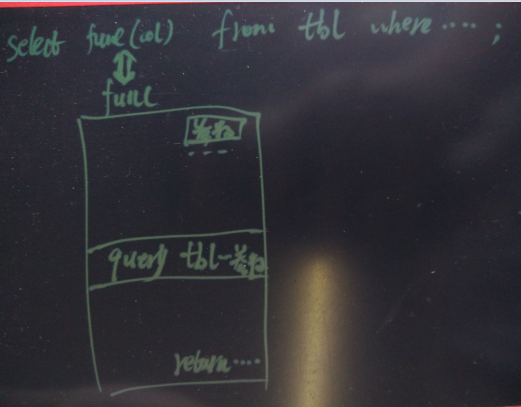

## Greenplum 最佳实践 - 函数内嵌套查询在query中调用的替代方案  
##### [TAG 24](../class/24.md)
                                                                      
### 作者                                                                          
digoal                                                                          
                                                                      
### 日期                                                                          
2016-08-02                                                                      
                                                                      
### 标签                                                                          
Greenplum , 嵌套查询                             
                                                                      
----                                                                          
                                                                      
## 背景  
在使用数据库过程中，用户可能会封装一些函数，用来返回一些映射值。    
    
例如，有一张表存储了学号和学生名字，写一个函数，根据学号，返回学生名字。    
    
  
    
SQL如下 :   
  
```  
create table tab(id int primary key, std_name name);  
  
create or replace function f1(int) returns name as $$  
  select std_name from tab where id=$1;  
$$ language sql strict volatile;  
  
dwh=> insert into tab values (1,'abc');  
INSERT 0 1  
  
dwh=> select f1(1);  
 f1    
-----  
 abc  
(1 row)  
```  
  
使用Greenplum时，可能需要注意，因为如果函数中有QUERY，但是这个函数又在QUERY中调用的话，可能会报错。    
    
目前执行计划还不支持这种查询：    
  
```  
dwh=> select f1(id) from tab;  
ERROR:  XX000: function cannot execute on segment because it accesses relation "public.tab" (functions.c:155)  (seg0 slice1 e45f16674.cloud.nu17:3017 pid=20659) (cdbdisp.c:1326)  
DETAIL:  SQL function "f1" during startup  
LOCATION:  cdbdisp_finishCommand, cdbdisp.c:1326  
```  
    
出错原因，在检查segment节点query tree时，如果发现树中还有非catalog类的对象，则报错。    
  
可能是master节点对这种QUERY的处理没有彻底。      
  
```  
/**  
 * Walker for querytree_safe_for_segment.  
 */  
bool querytree_safe_for_segment_walker(Node *expr, void *context)  
{  
        Assert(context == NULL);  
  
        if (!expr)  
        {  
                /**  
                 * Do not end recursion just because we have reached one leaf node.  
                 */  
                return false;  
        }  
  
        switch(nodeTag(expr))  
        {  
                case T_Query:  
                        {  
                                Query *q = (Query *) expr;  
  
                                if (!allow_segment_DML &&  
                                        (q->commandType != CMD_SELECT  
                                         || q->intoClause != NULL  
                                         || q->resultRelation > 0))  
                                {  
                                        elog(ERROR, "function cannot execute on segment because it issues a non-SELECT statement");  
                                }  
  
                                ListCell * f = NULL;  
                                foreach(f,q->rtable)  
                                {  
                                        RangeTblEntry *rte = (RangeTblEntry *) lfirst(f);  
  
                                        if (rte->rtekind == RTE_RELATION)  
                                        {  
                                                Assert(rte->relid != InvalidOid);  
  
                                                Oid namespaceId = get_rel_namespace(rte->relid);  
  
                                                Assert(namespaceId != InvalidOid);  
  
                                                if (!(IsSystemNamespace(namespaceId) ||  
                                                          IsToastNamespace(namespaceId) ||  
                                                          IsAoSegmentNamespace(namespaceId)))  
                                                {  
                                                        elog(ERROR, "function cannot execute on segment because it accesses relation \"%s.%s\"",  
                                                                        quote_identifier(get_namespace_name(namespaceId)), quote_identifier(get_rel_name(rte->relid)));  
                                                }  
                                        }  
                                }  
                                query_tree_walker(q, querytree_safe_for_segment_walker, context, 0);    
...  
```  
    
使用with也不能解决这个问题，因为不会等收到master节点后再调用f1    
  
```  
dwh=> with t as (select * from tab) select f1(id) from t;  
ERROR:  XX000: function cannot execute on segment because it accesses relation "public.tab" (functions.c:155)  (seg0 slice1 e45f16674.cloud.nu17:3017 pid=26324) (cdbdisp.c:1326)  
DETAIL:  SQL function "f1" during startup  
LOCATION:  cdbdisp_finishCommand, cdbdisp.c:1326  
  
dwh=> with t as (select * from tab) select * from t;  
 id | std_name   
----+----------  
  1 | abc  
  2 | abc  
(2 rows)  
  
聚合后还是不行  
dwh=> with t as (select array_agg(id) ag from tab) select unnest(ag) from t;  
 unnest   
--------  
      2  
      1  
(2 rows)  
  
dwh=> with t as (select array_agg(id) ag from tab) select f1(unnest(ag)) from t;  
ERROR:  XX000: query plan with multiple segworker groups is not supported (cdbdisp.c:302)  
HINT:  likely caused by a function that reads or modifies data in a distributed table  
CONTEXT:  SQL function "f1" statement 1  
LOCATION:  cdbdisp_dispatchToGang, cdbdisp.c:302  
```  
    
怎么解决这个问题呢？      
  
可以用子查询(括号中的部分)替代 function 。      
  
```  
dwh=> select *, (select std_name from tab where tab.id=t.id) from tab t;  
 id | std_name | ?column?   
----+----------+----------  
  1 | abc      | abc  
(1 row)  
```  
     
  
                                                                      
[Count](http://info.flagcounter.com/h9V1)                                                                          
                        
                    
