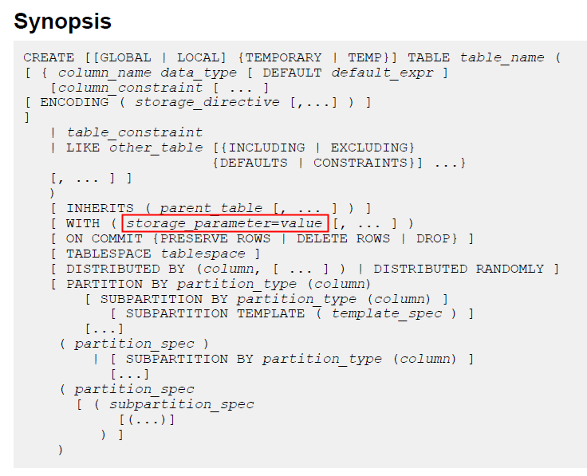
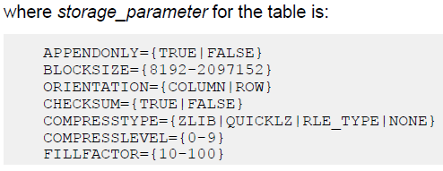
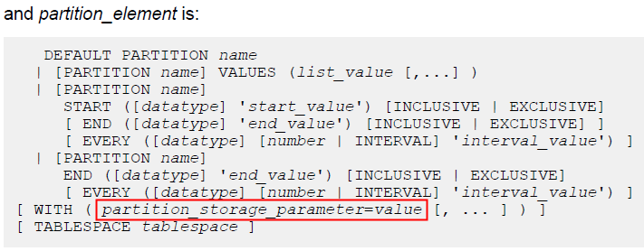
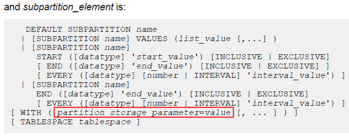
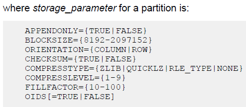
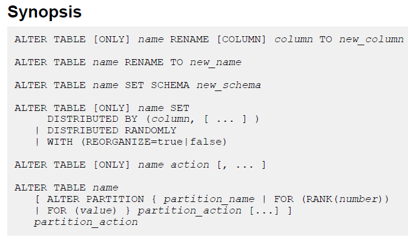
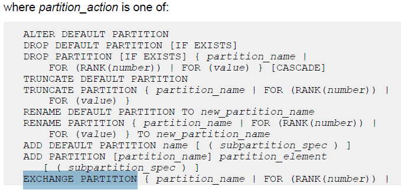

## Greenplum 最佳实践 - 行存与列存的选择以及转换方法  
##### [TAG 24](../class/24.md) , [TAG 11](../class/11.md)
                                                                                        
### 作者                                                                                            
digoal                                                                                            
                                                                                        
### 日期                                                                                            
2016-08-15                                                                                       
                                                                                        
### 标签                                                                                            
Greenplum , 行存 , 列存 , 转换                             
                                                                                        
----                                                                                            
                                                                                        
## 背景  
数据在数据库中的存储形式多种多样，比较常见的如      
      
1\. PostgreSQL的堆表，以行的形式存储，（当变成字段压缩后的长度超过数据块的四分之一时，会以TOAST的形式存储到TOAST表）。      
      
2\. MySQL innodb则是以b+tree形式存储的。      
      
3\. 在数据仓库产品中，如Greenplum，支持行存，也支持列存。      
      
还有很多存储格式，本文将讨论行存和列存应该如何选择呢？        
      
## 行存储优劣分析  
Greenplum行存储(堆表)的优势在哪里？      
    
数据顺序写入BLOCK中，持续写入的情况下，一条记录命中在一个块中，IO开销相对比较小，速度较快。    
    
查询多个字段时，因为记录在一个块中命中，速度较快。    
    
Greenplum行存储(堆表)的劣势在哪里？      
    
查询少量字段时，也要访问整条记录，造成一定的IO浪费。    
    
行存储的压缩比有限。    
    
## 行存储适合什么应用场景    
行存储适合非常典型的OLTP应用场景。    
      
## 列存储优劣分析  
Greenplum列存储的优势在哪里？      
    
数据按列存储，压缩比可以做到很高。    
    
当查询少量字段时，扫描的块更少，可以节约IO还能提升效率。    
  
Greenplum列存储的劣势在哪里？      
    
因为是按列存储的，当需要查询大量字段时，或者查询的记录数偏少时，会造成离散IO较多。      
    
例如查询1条记录的20个列，行存储可能只需要扫描1个块，而列存储至少需要扫描20个块。     
    
由于IO的放大，列存储不适合OLTP的场景，如有大量的更新，查询操作。    
    
## 列存储适合什么应用场景    
列存储适合非常典型的OLAP应用场景，按列做较大范围的聚合分析，或者JOIN分析。      
    
## 如何设置表的存储格式  
建表时，在with(storage parameter)中指定      
  
    
    
    
      
或者在分区的with(storage parameter)中指定      
  
     
    
或者在子分区的with(storage parameter)中指定      
  
    
      
    
      
因此Greenplum的存储格式支持到了子分区这个级别，一张表（指父表）可以混合使用行存储与列存储。    
      
## 如何转换表的存储格式  
  
    
  
  
## 行列混合存储应用场景  
例如用户如果有一张按时间分区的表，最近1个月的查询类似OLTP的请求，需要查询较多字段，而一个月以前的表则OLAP的需求更旺盛。    
    
这种情况下，我们的需求是将老的分区转换为列存储，怎么做呢？    
    
例子    
    
创建分区表，选择行存储  
  
```  
create table t_digoal (id int, info text, crt_time timestamp) distributed by (id) partition by range(crt_time) (start (date '2016-08-01') inclusive end (date '2016-12-01') exclusive every (interval '1 day'));  
```  
    
查看分区定义    
  
```  
postgres=> select * from pg_partitions;  
-[ RECORD 1 ]------------+----------------------------------------------------------------------------------------------------------------------------------------------  
schemaname               | public  
tablename                | t_digoal  
partitionschemaname      | public  
partitiontablename       | t_digoal_1_prt_1  
partitionname            |   
parentpartitiontablename |   
parentpartitionname      |   
partitiontype            | range  
partitionlevel           | 0  
partitionrank            | 1  
partitionposition        | 1  
partitionlistvalues      |   
partitionrangestart      | '2016-08-01 00:00:00'::timestamp without time zone  
partitionstartinclusive  | t  
partitionrangeend        | '2016-08-02 00:00:00'::timestamp without time zone  
partitionendinclusive    | f  
partitioneveryclause     | '1 day'::interval  
partitionisdefault       | f  
partitionboundary        | START ('2016-08-01 00:00:00'::timestamp without time zone) END ('2016-08-02 00:00:00'::timestamp without time zone) EVERY ('1 day'::interval)  
parenttablespace         | pg_default  
partitiontablespace      | pg_default  
-[ RECORD 2 ]------------+----------------------------------------------------------------------------------------------------------------------------------------------  
schemaname               | public  
tablename                | t_digoal  
partitionschemaname      | public  
partitiontablename       | t_digoal_1_prt_2  
partitionname            |   
parentpartitiontablename |   
parentpartitionname      |   
partitiontype            | range  
partitionlevel           | 0  
partitionrank            | 2  
partitionposition        | 2  
partitionlistvalues      |   
partitionrangestart      | '2016-08-02 00:00:00'::timestamp without time zone  
partitionstartinclusive  | t  
partitionrangeend        | '2016-08-03 00:00:00'::timestamp without time zone  
partitionendinclusive    | f  
partitioneveryclause     | '1 day'::interval  
partitionisdefault       | f  
partitionboundary        | START ('2016-08-02 00:00:00'::timestamp without time zone) END ('2016-08-03 00:00:00'::timestamp without time zone) EVERY ('1 day'::interval)  
parenttablespace         | pg_default  
partitiontablespace      | pg_default  
```  
    
创建列存单表，用于交换分区    
  
```  
postgres=> create table t_digoal_col(id int, info text, crt_time timestamp) with (appendonly=true, ORIENTATION=column) distributed by (id);  
CREATE TABLE  
```  
    
将历史分区数据插入列存储的交换分区    
  
```  
insert into t_digoal_col select * from t_digoal_1_prt_1;  
```  
    
指定对应的rank，交换分区    
  
```  
alter table t_digoal exchange partition for (rank(1)) with table t_digoal_col with validation;  
```  
    
可以使用 without validation 加快速度。    
   
## 如何查看表的存储结构  
pg_class.relstorage表示这个对象是什么存储：  
  
```  
postgres=# select distinct relstorage from pg_class ;    
 relstorage     
------------    
 a  -- 行存储AO表    
 h  -- heap堆表、索引    
 x  -- 外部表(external table)    
 v  -- 视图    
 c  -- 列存储AO表    
(5 rows)    
```  
  
查询当前数据库有哪些AO表：  
  
```  
postgres=# select t2.nspname, t1.relname from pg_class t1, pg_namespace t2 where t1.relnamespace=t2.oid and relstorage in ('c', 'a');    
 nspname  |      relname          
----------+-------------------    
 postgres | tbl_tag    
 postgres | tbl_pos_1_prt_p1    
 postgres | tbl_pos_1_prt_p2    
 postgres | tbl_pos_1_prt_p3    
 postgres | tbl_pos_1_prt_p4    
 postgres | tbl_pos_1_prt_p5    
 postgres | tbl_pos_1_prt_p6    
 postgres | tbl_pos_1_prt_p7    
 postgres | tbl_pos_1_prt_p8    
 postgres | tbl_pos_1_prt_p9    
 postgres | tbl_pos_1_prt_p10    
 postgres | tbl_pos    
 postgres | xx_czrk_qm_col    
 postgres | ao1    
(14 rows)    
```  
  
查询当前数据库有哪些堆表：  
  
```  
select t2.nspname, t1.relname from pg_class t1, pg_namespace t2 where t1.relnamespace=t2.oid and relstorage in ('h') and relkind='r';    
```  
    
祝大家玩得开心，欢迎随时来 **阿里云促膝长谈业务需求 ，恭候光临**。    
    
阿里云的小伙伴们加油，努力 **做好内核与服务，打造最贴地气的云数据库** 。    
    
        
                                                                                        
                                          
                                      
  
  
  
  
  
  
  
  
  
  
  
  
  
#### [免费领取阿里云RDS PostgreSQL实例、ECS虚拟机](https://free.aliyun.com/ "57258f76c37864c6e6d23383d05714ea")
  
  
#### [digoal's PostgreSQL文章入口](https://github.com/digoal/blog/blob/master/README.md "22709685feb7cab07d30f30387f0a9ae")
  
  

  
  
#### 老婆的钱袋子：可以打赏哦^_^  

  
