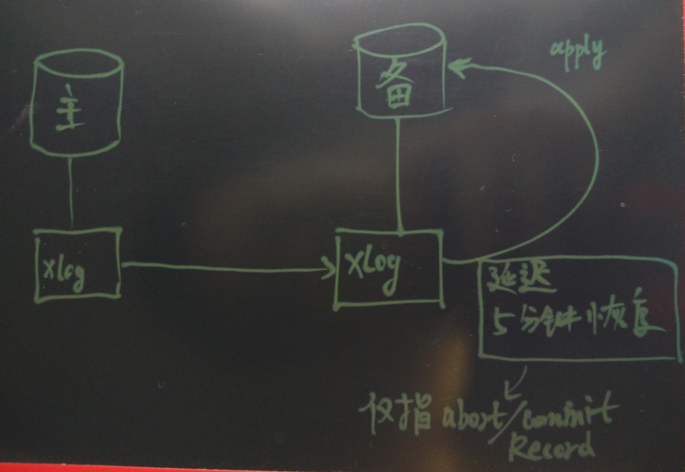

## PostgreSQL延迟hot standby使用问题及源码浅析
    
### 作者   
digoal    
    
### 日期  
2016-08-25    
    
### 标签  
PostgreSQL , standby , 延迟hot standby  
    
----  
    
## 背景  
在某些场景中，用户可能需要部署延迟的数据库，比如用来应对误操作。    
    
用户可以创建延迟2小时的standby数据库，如果在2小时内发现了误操作，可以直接使用hot standby，查看误操作前的数据，从而进行恢复。    
    
而不需要对数据库进行PITR恢复操作。    
    
当然这个防范左右还有更好的方法，比如使用我前面写的基于ZFS的快照的备份策略，也可以快速的回档。    
    
好了言归正传，为什么要小心使用PostgreSQL延迟hot standby，如果你的standby不仅仅要延迟，还要用于查询的话，那就需要注意了。    
    
## 延迟的原理  
  
    
在PostgreSQL的redo中，只在commit, abort的record中记录了时间戳，所以目前PostgreSQL的延迟备库，只能在APPLY事务结束的redo上面做时间的延迟控制。    
```  
typedef struct xl_xact_commit  
{  
        TimestampTz xact_time;          /* time of commit */  
  
        /* xl_xact_xinfo follows if XLOG_XACT_HAS_INFO */  
        /* xl_xact_dbinfo follows if XINFO_HAS_DBINFO */  
        /* xl_xact_subxacts follows if XINFO_HAS_SUBXACT */  
        /* xl_xact_relfilenodes follows if XINFO_HAS_RELFILENODES */  
        /* xl_xact_invals follows if XINFO_HAS_INVALS */  
        /* xl_xact_twophase follows if XINFO_HAS_TWOPHASE */  
        /* xl_xact_origin follows if XINFO_HAS_ORIGIN, stored unaligned! */  
} xl_xact_commit;  
  
typedef struct xl_xact_abort  
{  
        TimestampTz xact_time;          /* time of abort */  
  
        /* xl_xact_xinfo follows if XLOG_XACT_HAS_INFO */  
        /* No db_info required */  
        /* xl_xact_subxacts follows if HAS_SUBXACT */  
        /* xl_xact_relfilenodes follows if HAS_RELFILENODES */  
        /* No invalidation messages needed. */  
        /* xl_xact_twophase follows if XINFO_HAS_TWOPHASE */  
} xl_xact_abort;  
```  
    
在recovery.conf中也能看到这个描述    
```  
# By default, a standby server restores XLOG records from the primary as  
# soon as possible. If you want to explicitly delay the replay of committed  
# transactions from the master, specify a minimum apply delay. For example,  
# if you set this parameter to 5min, the standby will replay each transaction  
# commit only when the system time on the standby is at least five minutes  
# past the commit time reported by the master.  
#  
recovery_min_apply_delay = 0  
```  
    
了解了PostgreSQL的延迟恢复原理后，回答一下这么做会有什么问题呢？    
    
比如某个事务包含了DDL操作，那么这笔操作马上会在HOT STANDBY执行，锁在hot standby也同时被加载。    
但是当遇到这个事务的commit record时，由于设置了recovery_min_apply_delay，这笔record被延迟执行，这个锁也会延迟到这笔record被apply为止。    
在此延迟时间段内，对这个被执行DDL的表的QUERY都会被堵塞。    
    
这个锁会持续多长时间呢？    
    
这么长recovery_min_apply_delay。    
    
其他锁和读操作基本上都没有冲突，所以用户在延迟的hot_standby查询数据时感觉不到，但是DDL的感觉是非常明显的。    
    
## 改进建议  
  
1\. 增加GUC参数，apply时，检测事务中是否包含DDL级别的锁，如果包含这种锁，用户可以通过recovery.conf中的参数设置，这个事务的record是否立即执行，而不等待recovery_min_apply_delay。    
    
减少延迟hot standby中事务包含DDL锁带来的问题。    
    
2\. 或者增加对事务开启时间的记录，用户可以通过GUC参数，设置延迟是从事务开始时间计算，还是从事务结束开始计算。    
    
## 小结  
1\. 建议用户不要使用带延迟的hot_standby作为常用的只读备库，至少在改进之前不要这么做。    
如果你仅仅想做一个误操作保护的话，这么做是没有问题的。    
  
