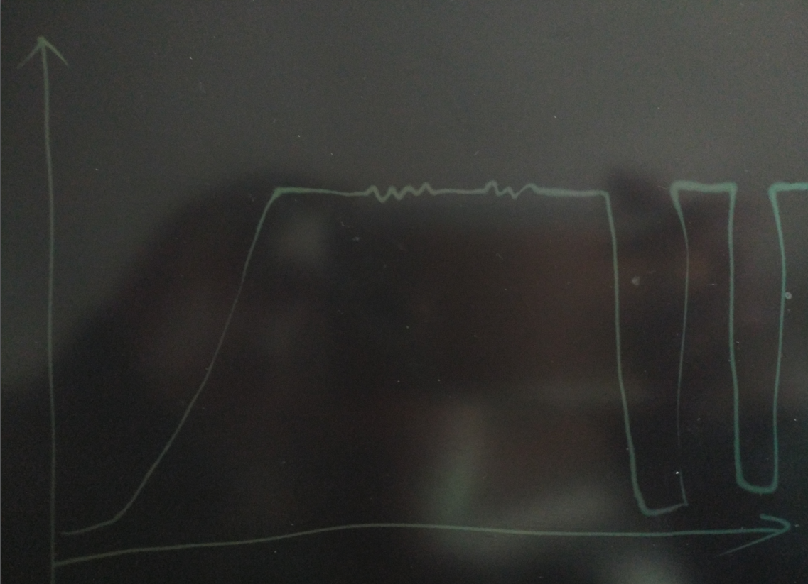
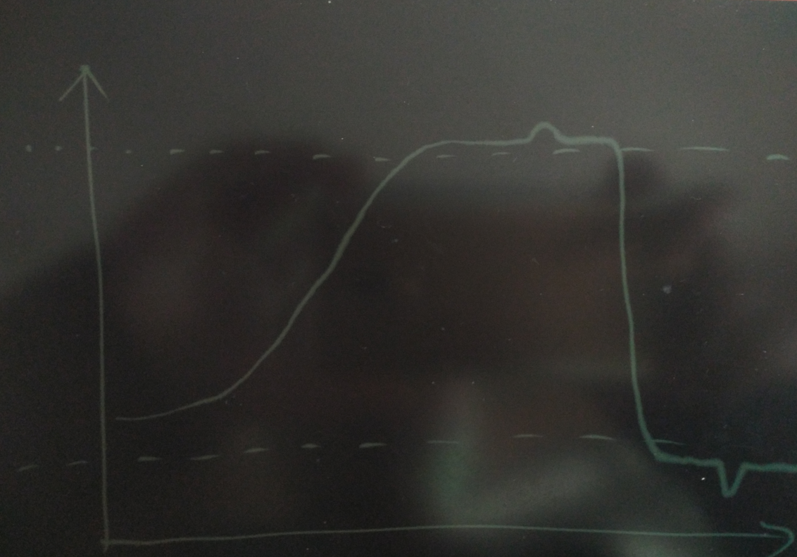
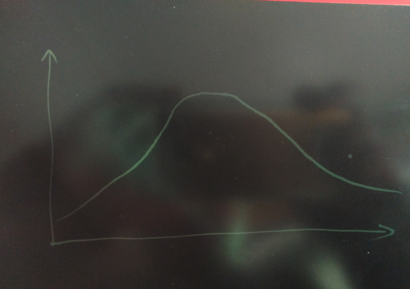
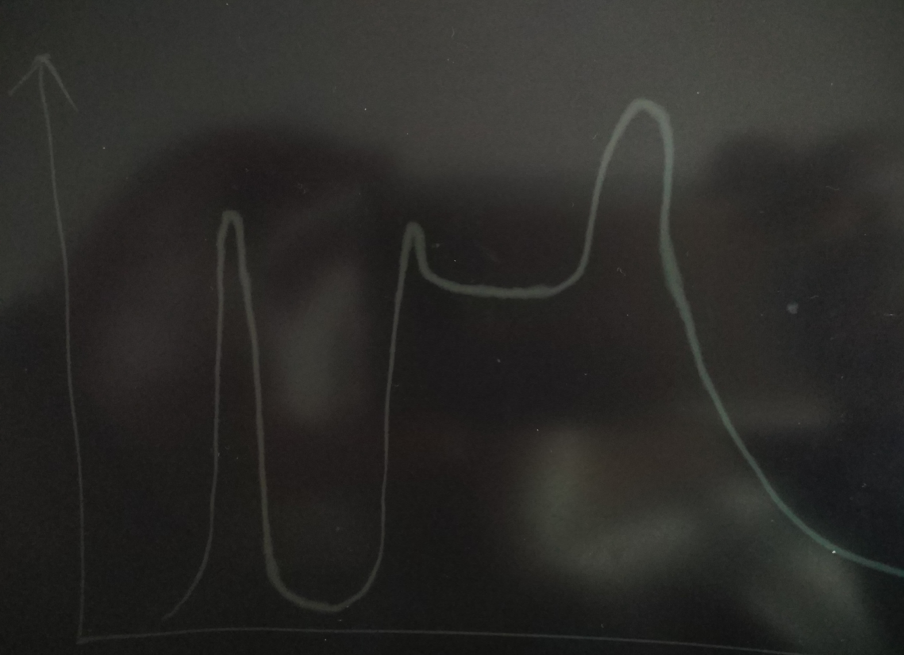
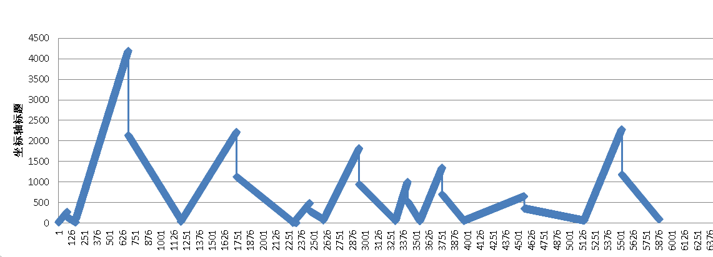

## 用PostgreSQL描绘人生的高潮、尿点、低谷 - 窗口/帧 or 斜率/导数/曲率/微积分?          
##### [TAG 15](../class/15.md)
                                    
### 作者                                   
digoal                                    
                                    
### 日期                                  
2016-12-03                                     
                                    
### 标签                                  
PostgreSQL , 曲线拐点 , 窗口查询 , 帧 , 窗口 , 导数 , 曲率 , 微积分 , 斜率                                                                        
                                    
----                                  
                                    
## 背景           
人生就像一场戏，有高潮，有尿点，有低谷。如果用曲线来描述漫漫人生路的话，怎么找出高潮、尿点、低谷呢？   
  
其实类似的场景还有很多，比如来自传感器（比如人身上可以探测的指标就有很多）的监控数据；服务器的监控数据；温度，湿度的变化数据；等等，都可以数字化，用曲线来表示。   
  
找高潮、尿点、低谷有什么好的方法吗？   
  
如果你是刚毕业不久的学生，可能会往学校里学到的知识去思考，怎么找曲线的拐点？    
    
导数、微积分、斜率、曲率、面积？       
    
没错，PostgreSQL可以算这些，math相关的函数里有，如果没有，也可以写UDF来实现。   
   
如果你把这些都忘了，还有什么方法能找出高潮、尿点、低谷么？   
  
当然，还是有方法的，也是PostgreSQL，它支持窗口，帧的查询。   
    
## 高潮、尿点、低谷
用几张图来表示一下什么是高潮、尿点、低谷？     
  
不要以为我是算命的，我其实是搞PostgreSQL的。       
  
  
  
这段曲线表示了一段奋力拼搏，快速到达人生巅峰，然后在巅峰期有些许的抖动，一段时间之后遭遇打击急速掉入谷底的情况，由于底子好，东山再起也很快，不过此命注定要在一波三折中度过，最后持续的保持在平滑的巅峰状态。   
  
  
  
而这一段人生属于不积跬步无以至千里的模式，主人公慢慢的积累，终于到达了人生的巅峰，而且在巅峰期主人公应该是想继续突破，很可惜，只是一个小的突破，马上有跌下来了，在过了一段时间，主人公可能遭遇了不可逆转的挫折，进入了人生的谷底之后，就一蹶不振，甚至还想过自杀，不过还好躲过一劫，可惜此命太薄，后来也只能郁郁不得终。   
  
  
  
这一段有意思了，也是属于不积跬步无以至千里的模式，主人公慢慢的积累，终于到达了人生的巅峰。但是好景不长，可能娶了个即会败家又不旺夫的败家娘们，慢慢的开始走下坡路，直到精尽人亡。    
  
  
  
这个主人公绝对属于可以拍电视剧的传奇人物类型，可能是富豪家族的小孩出生后被医院抱错的情况，从小在屌丝家庭长大，后来机缘巧合又回到了富豪家庭，因此经历了急速的从屌丝到高富帅的过程。但是可能不习惯富豪家的勾心斗角，被可恶的后妈搞走，又从高富帅摔入谷底。还好亲爸在世时的庇护下，经历了富豪家的一波三折，中间还出现过几次小的高峰，可惜好景不长，后来还是逐渐的衰退。      
    
  
    
最后这一段一定是一个从屌丝到人生赢家的励志故事，主人公在屌丝家庭长大，经过自己的坚持不懈的努力，到达了人生的巅峰，整个过程非常的平滑，还创造了不少小的高潮，直到风光逝去。   
   
看了这么多曲线，我们怎么把拐点找出来？   
  
## 曲线分析
###  曲线的分辨率
在单位时间内采样的点越多，分辨率就越高。  
  
对于分辨率较低的曲线，看起来可能就不像曲线了，是一些跳跃的点，按斜率找到有意义的拐点也比较麻烦，也是难点之一。   
  
### 曲线的长度
在历史的长河中，一个人的详细经历或故事（除了一些对历史有重大影响的人）可能是不起眼的，但是对于这个人来说，他的经历，他遇到的人和事，就可以抓出很多值得说道的点来。   
     
所以说我们要分析曲线的拐点，和曲线的长度也是有莫大的关系的，你是要看1年的曲线拐点呢，还是要看1天的曲线拐点？     
    
在1天的曲线中能找出来10个拐点，但是这一天的数据可能在一年的曲线中出现在一个很平淡的段落中，那么可能就一个点都找不到。    
    
### 曲线的总体落差
即曲线的总体落差，假设我们要分析一条1年的曲线，总体落差指的是1年的数据中最大值和最小值的差。     
  
总体落差可以描述一段数据的高潮和低谷的差异，可以作为判断关键点的一个评判系数。   
   
### 曲线的区间落差
区间落差，指以某个点为中心，它的辐射半径内的最大值和最小值的落差。可以用来评判这个点所处的区域中的落差，判断平凡人生路中的小尖刺，比如在平淡期的一些小的波动，小高潮或者小低谷。        
  
### 曲线的总体高低水位
掌握了整体曲线的落差后，其实就可以设定高低水位，或者按大局来设定高低水位。  
  
比如股市，有大盘走势，有个股走势。   
  
什么是低水位，什么是高水位，是有参照的情况下来设置的。  
  
打个比方，一组监控数据，监控的是服务器的负载，服务器有32核，那么我们就可以根据这些参照设定负载的高低水位，比如低水位为1以下，高水位为24以上。    
  
## 数据库算高潮、低谷、尿点的实践
需要用到PostgreSQL的窗口查询和帧，用来实现对以上曲线分析的计算。   
  
### 窗口
窗口指计算的数据区间，指与当前row在同一个分组中的数据。   
    
### 帧
帧也是指计算的数据区间，但是是在分组内的指定，可以根据当前row设定辐射半径，或者当前row的前后分开设置辐射范围。   
    
### 例子

求凸点和凹点其实可以用前后值的大小比较就可以了，使用lead()和lag()窗口函数 即可。  
  
但是有其缺陷，没有落差，没有意义。  
  
没有范围数据，无法检测渐进数据的凹凸。  
  
创建测试表：  
  
```
create table wind (id serial, val numeric);

insert into wind (val) select mod((trunc(100000*random()+210000*random()))::int, 900)+round((100*random())::numeric, 2) from generate_series(1,10000);

postgres=# select * from wind;
  id   |  val   
-------+--------
     1 | 701.20
     2 | 511.14
     3 | 241.83
     4 | 552.72
     5 | 507.11
     6 |  62.66
     7 | 343.72
     8 | 260.89
     9 | 785.54
    10 | 483.94
    11 | 330.08
    12 | 716.85
    13 | 897.21
    14 | 493.07
    15 | 492.86
    16 | 742.36
    17 | 890.77
    18 |  62.47
    19 | 815.17
    20 | 695.46
    21 | 963.36
    22 | 178.90
    23 | 818.06
    24 | 337.37
    25 | 738.30
    26 |  90.01
    27 | 391.66
......
```
  
#### query 1  
```
select * from 
(
  select id, 
    val, 
    min(val) over(order by id rows between 10 preceding and current row) as left_min,  -- 左边相邻10个点的最小值（包括当前点）, 辐射半径的左边
    max(val) over(order by id rows between 10 preceding and current row) as left_max,  -- 左边相邻10个点的最大值（包括当前点）, 辐射半径的左边
    min(val) over(order by id rows between current row and 10 following) as right_min, -- 右边相邻10个点的最小值（包括当前点）, 辐射半径的右边
    max(val) over(order by id rows between current row and 10 following) as right_max, -- 右边相邻10个点的最大值（包括当前点）, 辐射半径的右边
    min(val) over() as global_min, -- 全局的最小值（包括当前点）
    max(val) over() as global_max  -- 全局的最大值（包括当前点）
    from wind
) t
where 
(  -- 找出全局谷底开始
(  
left_max - val > ((global_max-global_min)*0.5)  -- 左边相邻10个点的最大值 - 当前值 > 全局落差的50% (可能导致无法找到平滑变化的谷底)
and 
val = left_min  -- 拐点
)

and

(
right_max - val > ((global_max-global_min)*0.5)  -- 右边相邻10个点的最大值 - 当前值 > 全局落差的50% (可能导致无法找到平滑变化的谷底)
and 
val = right_min  -- 拐点
)
)  -- 找出全局谷底结束

or

(  -- 找出全局高潮开始
(
val - left_min > ((global_max-global_min)*0.5)  -- 当前值 - 左边相邻10个点的最小值 > 全局落差的50% (可能导致无法找到平滑变化的高潮)
and 
val = left_max  -- 拐点
)

and

(
val - right_min > ((global_max-global_min)*0.5)  -- 当前值 - 右边相邻10个点的最小值  > 全局落差的50% (可能导致无法找到平滑变化的高潮)
and 
val = right_max  -- 拐点
)
)  -- 找出全局高潮开始
;
```
  
结果  
  
```
  id  |  val   | left_min | left_max | right_min | right_max | global_min | global_max 
------+--------+----------+----------+-----------+-----------+------------+------------
    6 |  62.66 |    62.66 |   701.20 |     62.66 |    897.21 |       1.50 |     996.57
   18 |  62.47 |    62.47 |   897.21 |     62.47 |    963.36 |       1.50 |     996.57
   21 | 963.36 |    62.47 |   963.36 |     90.01 |    963.36 |       1.50 |     996.57
   44 |  57.54 |    57.54 |   884.70 |     57.54 |    949.44 |       1.50 |     996.57
   45 | 949.44 |    57.54 |   949.44 |    291.63 |    949.44 |       1.50 |     996.57
   62 |  54.09 |    54.09 |   841.67 |     54.09 |    835.75 |       1.50 |     996.57
   76 | 892.74 |   186.73 |   892.74 |     43.92 |    892.74 |       1.50 |     996.57
   83 |  43.92 |    43.92 |   892.74 |     43.92 |    828.41 |       1.50 |     996.57
   98 | 961.65 |   108.82 |   961.65 |    222.69 |    961.65 |       1.50 |     996.57
  112 |  72.93 |    72.93 |   778.41 |     72.93 |    689.00 |       1.50 |     996.57
  126 |  44.19 |    44.19 |   829.42 |     44.19 |    900.01 |       1.50 |     996.57
  141 | 950.97 |    44.80 |   950.97 |     80.02 |    950.97 |       1.50 |     996.57
......
 9924 | 879.23 |    80.56 |   879.23 |     73.87 |    879.23 |       1.50 |     996.57
 9930 |  73.87 |    73.87 |   879.23 |     73.87 |    858.93 |       1.50 |     996.57
 9950 | 941.34 |   117.90 |   941.34 |     61.66 |    941.34 |       1.50 |     996.57
 9953 |  61.66 |    61.66 |   941.34 |     61.66 |    872.60 |       1.50 |     996.57
 9974 | 916.83 |   278.73 |   916.83 |    147.24 |    916.83 |       1.50 |     996.57
 9986 | 957.28 |   147.24 |   957.28 |     87.52 |    957.28 |       1.50 |     996.57
 9994 |  87.52 |    87.52 |   957.28 |     87.52 |    726.31 |       1.50 |     996.57
(945 rows)
```
  
功能  
  
可以找到全局高潮、低谷  
  
可以找到平滑变化的拐点(设置10，或者更大，越大，越能找出平滑变化的拐点)  
  
缺陷  
  
无法找到平滑变化后正式进入平滑高潮或低谷期(>10)的点。  
  
无法找到在平滑高潮或低谷期中的小波峰和波谷(即局部高潮或低谷)。  
  
#### query 2  
```
select * from 
(
  select id, 
    val, 
    min(val) over(order by id rows between 10 preceding and current row) as left_min,  -- 左边相邻10个点的最小值（包括当前点）, 辐射半径的左边 
    max(val) over(order by id rows between 10 preceding and current row) as left_max,  -- 左边相邻10个点的最大值（包括当前点）, 辐射半径的左边 
    min(val) over(order by id rows between current row and 10 following) as right_min,  -- 右边相邻10个点的最小值（包括当前点）, 辐射半径的右边 
    max(val) over(order by id rows between current row and 10 following) as right_max,  -- 右边相邻10个点的最大值（包括当前点）, 辐射半径的右边 
    min(val) over(order by id rows between 10 preceding and 10 following) as range_min,  -- 左边相邻10个点的最小值（包括当前点）, 辐射半径两边全部 
    max(val) over(order by id rows between 10 preceding and 10 following) as range_max,  -- 右边相邻10个点的最大值（包括当前点）, 辐射半径两边全部 
    min(val) over() as global_min, -- 全局的最小值（包括当前点） 
    max(val) over() as global_max  -- 全局的最大值（包括当前点） 
  from wind
) t
where 
(  -- 找越过低水位后的局部低谷开始
 (
 left_max - val > ((range_max-range_min)*0.5)   -- 左边相邻10个点的最大值 - 当前值 > 局部落差的50%
 and 
 val = left_min  -- 拐点 
 )

 and

 (
 right_max - val > ((range_max-range_min)*0.5)   -- 右边相邻10个点的最大值 - 当前值 > 局部落差的50%
 and 
 val = right_min  -- 拐点
 )

 and 

 (val - global_min)::numeric/(global_max-global_min+0.0000001) <= 0.1      -- 当前点必须是低水位线外的点，低水位线为全局低谷上浮10%的值
)  -- 找越过低水位后的局部低谷结束

or

(  -- 找越过高水位后的局部高潮开始
 (
 val - left_min > ((range_max-range_min)*0.5)   -- 当前值 - 左边相邻10个点的最小值 > 局部落差的50%
 and 
 val = left_max  -- 拐点
 )

 and

 (
 val - right_min > ((range_max-range_min)*0.5)   -- 当前值 - 右边相邻10个点的最小值 > 局部落差的50%
 and 
 val = right_max  -- 拐点
 )

 and 

 (global_max - val)::numeric/(global_max-global_min+0.0000001) <= 0.1      -- 当前点必须是高水位线外的点，高水位线为全局高潮下调10%的值
)  -- 找越过高水位后的局部高潮结束
;
```
  
结果  
  
```
  id  |  val   | left_min | left_max | right_min | right_max | range_min | range_max | global_min | global_max 
------+--------+----------+----------+-----------+-----------+-----------+-----------+------------+------------
    6 |  62.66 |    62.66 |   701.20 |     62.66 |    897.21 |     62.66 |    897.21 |       1.50 |     996.57
   18 |  62.47 |    62.47 |   897.21 |     62.47 |    963.36 |     62.47 |    963.36 |       1.50 |     996.57
   21 | 963.36 |    62.47 |   963.36 |     90.01 |    963.36 |     62.47 |    963.36 |       1.50 |     996.57
   44 |  57.54 |    57.54 |   884.70 |     57.54 |    949.44 |     57.54 |    949.44 |       1.50 |     996.57
   45 | 949.44 |    57.54 |   949.44 |    291.63 |    949.44 |     57.54 |    949.44 |       1.50 |     996.57
   62 |  54.09 |    54.09 |   841.67 |     54.09 |    835.75 |     54.09 |    841.67 |       1.50 |     996.57
   83 |  43.92 |    43.92 |   892.74 |     43.92 |    828.41 |     43.92 |    892.74 |       1.50 |     996.57
   98 | 961.65 |   108.82 |   961.65 |    222.69 |    961.65 |    108.82 |    961.65 |       1.50 |     996.57
  112 |  72.93 |    72.93 |   778.41 |     72.93 |    689.00 |     72.93 |    778.41 |       1.50 |     996.57
  126 |  44.19 |    44.19 |   829.42 |     44.19 |    900.01 |     44.19 |    900.01 |       1.50 |     996.57
......
 9913 |  34.37 |    34.37 |   871.17 |     34.37 |    786.24 |     34.37 |    871.17 |       1.50 |     996.57
 9930 |  73.87 |    73.87 |   879.23 |     73.87 |    858.93 |     73.87 |    879.23 |       1.50 |     996.57
 9950 | 941.34 |   117.90 |   941.34 |     61.66 |    941.34 |     61.66 |    941.34 |       1.50 |     996.57
 9953 |  61.66 |    61.66 |   941.34 |     61.66 |    872.60 |     61.66 |    941.34 |       1.50 |     996.57
 9974 | 916.83 |   278.73 |   916.83 |    147.24 |    916.83 |    147.24 |    916.83 |       1.50 |     996.57
 9986 | 957.28 |   147.24 |   957.28 |     87.52 |    957.28 |     87.52 |    957.28 |       1.50 |     996.57
 9994 |  87.52 |    87.52 |   957.28 |     87.52 |    726.31 |     87.52 |    957.28 |       1.50 |     996.57
(691 rows)
```
  
功能  
  
可以覆盖到越过高水位或低水位的点  
    
可以找到越过高水位或低水位后，平滑过渡的高潮或低谷的点  
  
可以找到在平滑高潮或低谷期中的小波峰和波谷(即局部高潮或低谷)。  
  
缺陷  
  
无法找到单边骤变的点，例如新增一下骤变点。    
  
```
postgres=# select * from wind order by id desc limit 10;
  id   |  val   
-------+--------
 10000 | 440.70
  9999 | 465.07
  9998 | 243.10
  9997 | 117.50
  9996 | 527.88
  9995 | 726.31
  9994 |  87.52
  9993 | 347.65
  9992 | 527.00
  9991 | 206.62
(10 rows)

postgres=# insert into wind (val) values (1),(2),(3),(4),(5),(6),(6),(7),(1),(8);
INSERT 0 10
```
  
#### query 3  
  
```
select * from 
(
  select id, 
    val, 
    min(val) over(order by id rows between 10 preceding and current row) as left_min,  -- 左边相邻10个点的最小值（包括当前点）, 辐射半径的左边 
    max(val) over(order by id rows between 10 preceding and current row) as left_max,  -- 左边相邻10个点的最大值（包括当前点）, 辐射半径的左边 
    min(val) over(order by id rows between current row and 10 following) as right_min,  -- 右边相邻10个点的最小值（包括当前点）, 辐射半径的右边 
    max(val) over(order by id rows between current row and 10 following) as right_max,  -- 右边相邻10个点的最大值（包括当前点）, 辐射半径的右边 
    min(val) over(order by id rows between 10 preceding and 10 following) as range_min,  -- 左边相邻10个点的最小值（包括当前点）, 辐射半径两边全部 
    max(val) over(order by id rows between 10 preceding and 10 following) as range_max,  -- 右边相邻10个点的最大值（包括当前点）, 辐射半径两边全部 
    -- avg(val) over(order by id rows between 10 preceding and current row) as range_left_avg, -- 左局部平均值
    -- stddev(val) over(order by id rows between 10 preceding and current row) as range_left_stddev, -- 左局部采样标准方差
    -- avg(val) over(order by id rows between current row and 10 following) as range_right_avg, -- 右局部平均值
    -- stddev(val) over(order by id rows between current row and 10 following) as range_right_stddev, -- 右局部采样标准方差
    min(val) over() as global_min, -- 全局的最小值（包括当前点）
    max(val) over() as global_max  -- 全局的最大值（包括当前点）
    from wind
) t
where 
(  -- 开始 找出单边，左陡右平缓，谷底
(  
left_max - val > ((global_max-global_min)*0.5)  -- 左边相邻10个点的最大值 - 当前值 > 全局落差的50% 
and 
val = left_min  -- 拐点
)

and

(
(right_max-right_min)/(range_max-range_min+0.00000001) < 0.05  -- 要求越平缓，设置0.05的值越低。
)
)  -- 结束 找出单边，左陡右平缓，谷底

or

(  -- 开始 找出单边，右陡左平缓，谷底
(  
right_max - val > ((global_max-global_min)*0.5)  -- 右边相邻10个点的最大值 - 当前值 > 全局落差的50% 
and 
val = right_min  -- 拐点
)

and

(
(left_max-left_min)/(range_max-range_min+0.00000001) < 0.05  -- 要求越平缓，设置0.05的值越低。
)
)  -- 结束 找出单边，右陡左平缓，谷底

or

(  -- 开始 找出单边，左陡右平缓，高潮
(  
val - left_min > ((global_max-global_min)*0.5)  -- 当前值 - 左边相邻10个点的最小值 > 全局落差的50% 
and 
val = left_max  -- 拐点
)

and

(
(right_max-right_min)/(range_max-range_min+0.00000001) < 0.05  -- 要求越平缓，设置0.05的值越低。
)
)  -- 结束 找出单边，左陡右平缓，高潮

or

(  -- 开始 找出单边，右陡左平缓，高潮
(  
val - right_min > ((global_max-global_min)*0.5)  -- 左边相邻10个点的最大值 - 当前值 > 全局落差的50% 
and 
val = right_max  -- 拐点
)

and

(
(left_max-left_min)/(range_max-range_min+0.00000001) < 0.05  -- 要求越平缓，设置0.05的值越低。
)
)  -- 结束 找出单边，右陡左平缓，高潮
;

  id   | val | left_min | left_max | right_min | right_max | range_min | range_max | global_min | global_max 
-------+-----+----------+----------+-----------+-----------+-----------+-----------+------------+------------
 10001 |   1 |        1 |   726.31 |         1 |         8 |         1 |    726.31 |          1 |     996.57
(1 row)
```
  
功能  
  
可以找到单边骤变的点。    
  
缺陷  
  
无法输出跳跃点  
    
#### query 4
输出跳跃点，与左右相邻的任一点差值大于局部落差%?的点    
  
```
select * from 
(
  select id, 
    val, 
    min(val) over(order by id rows between 10 preceding and current row) as left_min,  -- 左边相邻10个点的最小值（包括当前点）, 辐射半径的左边 , 值越大，可以找到更平滑变化的高潮和低谷
    max(val) over(order by id rows between 10 preceding and current row) as left_max,  -- 左边相邻10个点的最大值（包括当前点）, 辐射半径的左边 , 值越大，可以找到更平滑变化的高潮和低谷 
    min(val) over(order by id rows between current row and 10 following) as right_min,  -- 右边相邻10个点的最小值（包括当前点）, 辐射半径的右边 , 值越大，可以找到更平滑变化的高潮和低谷 
    max(val) over(order by id rows between current row and 10 following) as right_max,  -- 右边相邻10个点的最大值（包括当前点）, 辐射半径的右边 , 值越大，可以找到更平滑变化的高潮和低谷 
    min(val) over(order by id rows between 10 preceding and 10 following) as range_min,  -- 左边相邻10个点的最小值（包括当前点）, 辐射半径两边全部 , 值越大，可以找到更平滑变化的高潮和低谷 
    max(val) over(order by id rows between 10 preceding and 10 following) as range_max,  -- 右边相邻10个点的最大值（包括当前点）, 辐射半径两边全部 , 值越大，可以找到更平滑变化的高潮和低谷 
    lag(val) over(order by id) as lag_val, -- 上一个值(第一条为空)
    lead(val) over(order by id) as lead_val, -- 下一个值(最后一条为空)
    min(val) over() as global_min, -- 全局的最小值（包括当前点）
    max(val) over() as global_max  -- 全局的最大值（包括当前点）
    from wind
) t
where 
lag_val is not null 
and 
lead_val is not null 
and 
(
abs(lag_val-val)/(range_max-range_min+0.00000000001) > 0.35   
or
abs(lead_val-val)/(range_max-range_min+0.00000000001) > 0.35   
)
```
  
#### query 5
把以上几个QUERY结合起来  
  
相邻点的个数，建议根据总的个数除以一个百分比，例如1万条记录，去百分之一作为评判标准，那么10000*0.01=100，取值100.   
   
```
select * from 
(
  select id, 
    val, 
    min(val) over(order by id rows between 10 preceding and current row) as left_min,  -- 左边相邻10个点的最小值（包括当前点）, 辐射半径的左边 , 值越大，可以找到更平滑变化的高潮和低谷
    max(val) over(order by id rows between 10 preceding and current row) as left_max,  -- 左边相邻10个点的最大值（包括当前点）, 辐射半径的左边 , 值越大，可以找到更平滑变化的高潮和低谷 
    min(val) over(order by id rows between current row and 10 following) as right_min,  -- 右边相邻10个点的最小值（包括当前点）, 辐射半径的右边 , 值越大，可以找到更平滑变化的高潮和低谷 
    max(val) over(order by id rows between current row and 10 following) as right_max,  -- 右边相邻10个点的最大值（包括当前点）, 辐射半径的右边 , 值越大，可以找到更平滑变化的高潮和低谷 
    min(val) over(order by id rows between 10 preceding and 10 following) as range_min,  -- 左边相邻10个点的最小值（包括当前点）, 辐射半径两边全部 , 值越大，可以找到更平滑变化的高潮和低谷 
    max(val) over(order by id rows between 10 preceding and 10 following) as range_max,  -- 右边相邻10个点的最大值（包括当前点）, 辐射半径两边全部 , 值越大，可以找到更平滑变化的高潮和低谷 
    lag(val) over(order by id) as lag_val, -- 上一个值(第一条为空)
    lead(val) over(order by id) as lead_val, -- 下一个值(最后一条为空)
    -- avg(val) over(order by id rows between 10 preceding and current row) as range_left_avg, -- 左局部平均值 , 值越大，可以找到更平滑变化的高潮和低谷
    -- stddev(val) over(order by id rows between 10 preceding and current row) as range_left_stddev, -- 左局部采样标准方差 , 值越大，可以找到更平滑变化的高潮和低谷
    -- avg(val) over(order by id rows between current row and 10 following) as range_right_avg, -- 右局部平均值 , 值越大，可以找到更平滑变化的高潮和低谷
    -- stddev(val) over(order by id rows between current row and 10 following) as range_right_stddev, -- 右局部采样标准方差 , 值越大，可以找到更平滑变化的高潮和低谷
    min(val) over() as global_min, -- 全局的最小值（包括当前点）
    max(val) over() as global_max  -- 全局的最大值（包括当前点）
    from wind
) t
where 
( -- query 1
(  -- 找出全局谷底开始
(  
left_max - val > ((global_max-global_min)*0.5)  -- 左边相邻10个点的最大值 - 当前值 > 全局落差的50% ，值越大，展示落差越大的点
and 
val = left_min  -- 拐点
)

and

(
right_max - val > ((global_max-global_min)*0.5)  -- 右边相邻10个点的最大值 - 当前值 > 全局落差的50% ，值越大，展示落差越大的点
and 
val = right_min  -- 拐点
)
)  -- 找出全局谷底结束

or

(  -- 找出全局高潮开始
(
val - left_min > ((global_max-global_min)*0.5)  -- 当前值 - 左边相邻10个点的最小值 > 全局落差的50% ，值越大，展示落差越大的点
and 
val = left_max  -- 拐点
)

and

(
val - right_min > ((global_max-global_min)*0.5)  -- 当前值 - 右边相邻10个点的最小值  > 全局落差的50% ，值越大，展示落差越大的点
and 
val = right_max  -- 拐点
)
)  -- 找出全局高潮开始
) -- query 1

or 

( -- query 2
(  -- 找越过低水位后的局部低谷开始
 (
 left_max - val > ((range_max-range_min)*0.5)   -- 左边相邻10个点的最大值 - 当前值 > 局部落差的50%
 and 
 val = left_min  -- 拐点 
 )

 and

 (
 right_max - val > ((range_max-range_min)*0.5)   -- 右边相邻10个点的最大值 - 当前值 > 局部落差的50%
 and 
 val = right_min  -- 拐点
 )

 and 

 (val - global_min)::numeric/(global_max-global_min+0.0000001) <= 0.1      -- 当前点必须是低水位线外的点，低水位线为全局低谷上浮10%的值
)  -- 找越过低水位后的局部低谷结束

or

(  -- 找越过高水位后的局部高潮开始
 (
 val - left_min > ((range_max-range_min)*0.5)   -- 当前值 - 左边相邻10个点的最小值 > 局部落差的50%
 and 
 val = left_max  -- 拐点
 )

 and

 (
 val - right_min > ((range_max-range_min)*0.5)   -- 当前值 - 右边相邻10个点的最小值 > 局部落差的50%
 and 
 val = right_max  -- 拐点
 )

 and 

 (global_max - val)::numeric/(global_max-global_min+0.0000001) <= 0.1      -- 当前点必须是高水位线外的点，高水位线为全局高潮下调10%的值
)  -- 找越过高水位后的局部高潮结束
) -- query 2

or

( -- query 3
(  -- 开始 找出单边，左陡右平缓，谷底
(  
left_max - val > ((global_max-global_min)*0.5)  -- 左边相邻10个点的最大值 - 当前值 > 全局落差的50% 
and 
val = left_min  -- 拐点
)

and

(
(right_max-right_min)/(range_max-range_min+0.00000001) < 0.05  -- 要求越平缓，设置0.05的值越低。
)
)  -- 结束 找出单边，左陡右平缓，谷底

or

(  -- 开始 找出单边，右陡左平缓，谷底
(  
right_max - val > ((global_max-global_min)*0.5)  -- 右边相邻10个点的最大值 - 当前值 > 全局落差的50% 
and 
val = right_min  -- 拐点
)

and

(
(left_max-left_min)/(range_max-range_min+0.00000001) < 0.05  -- 要求越平缓，设置0.05的值越低。
)
)  -- 结束 找出单边，右陡左平缓，谷底

or

(  -- 开始 找出单边，左陡右平缓，高潮
(  
val - left_min > ((global_max-global_min)*0.5)  -- 当前值 - 左边相邻10个点的最小值 > 全局落差的50% 
and 
val = left_max  -- 拐点
)

and

(
(right_max-right_min)/(range_max-range_min+0.00000001) < 0.05  -- 要求越平缓，设置0.05的值越低。
)
)  -- 结束 找出单边，左陡右平缓，高潮

or

(  -- 开始 找出单边，右陡左平缓，高潮
(  
val - right_min > ((global_max-global_min)*0.5)  -- 左边相邻10个点的最大值 - 当前值 > 全局落差的50% 
and 
val = right_max  -- 拐点
)

and

(
(left_max-left_min)/(range_max-range_min+0.00000001) < 0.05  -- 要求越平缓，设置0.05的值越低。
)
)  -- 结束 找出单边，右陡左平缓，高潮
) -- query 3

or

( -- query 4
lag_val is not null 
and 
lead_val is not null 
and 
(
abs(lag_val-val)/(range_max-range_min+0.00000000001) > 0.35   
or
abs(lead_val-val)/(range_max-range_min+0.00000000001) > 0.35   
)
) -- query 4
;
```
  
结果  
  
```
  id   |  val   | left_min | left_max | right_min | right_max | range_min | range_max | global_min | global_max 
-------+--------+----------+----------+-----------+-----------+-----------+-----------+------------+------------
     6 |  62.66 |    62.66 |   701.20 |     62.66 |    897.21 |     62.66 |    897.21 |          1 |     996.57
    18 |  62.47 |    62.47 |   897.21 |     62.47 |    963.36 |     62.47 |    963.36 |          1 |     996.57
    21 | 963.36 |    62.47 |   963.36 |     90.01 |    963.36 |     62.47 |    963.36 |          1 |     996.57
    44 |  57.54 |    57.54 |   884.70 |     57.54 |    949.44 |     57.54 |    949.44 |          1 |     996.57
    45 | 949.44 |    57.54 |   949.44 |    291.63 |    949.44 |     57.54 |    949.44 |          1 |     996.57
    62 |  54.09 |    54.09 |   841.67 |     54.09 |    835.75 |     54.09 |    841.67 |          1 |     996.57
    76 | 892.74 |   186.73 |   892.74 |     43.92 |    892.74 |     43.92 |    892.74 |          1 |     996.57
    83 |  43.92 |    43.92 |   892.74 |     43.92 |    828.41 |     43.92 |    892.74 |          1 |     996.57
    98 | 961.65 |   108.82 |   961.65 |    222.69 |    961.65 |    108.82 |    961.65 |          1 |     996.57
   112 |  72.93 |    72.93 |   778.41 |     72.93 |    689.00 |     72.93 |    778.41 |          1 |     996.57
   126 |  44.19 |    44.19 |   829.42 |     44.19 |    900.01 |     44.19 |    900.01 |          1 |     996.57
   141 | 950.97 |    44.80 |   950.97 |     80.02 |    950.97 |     44.80 |    950.97 |          1 |     996.57
...........
  9839 | 972.29 |   109.72 |   972.29 |     92.10 |    972.29 |     92.10 |    972.29 |          1 |     996.57
  9844 |  92.10 |    92.10 |   972.29 |     92.10 |    940.05 |     92.10 |    972.29 |          1 |     996.57
  9866 | 958.95 |   128.55 |   958.95 |     91.19 |    958.95 |     91.19 |    958.95 |          1 |     996.57
  9882 | 867.15 |    91.19 |   867.15 |      5.84 |    867.15 |      5.84 |    867.15 |          1 |     996.57
  9884 |   5.84 |     5.84 |   867.15 |      5.84 |    900.04 |      5.84 |    900.04 |          1 |     996.57
  9894 | 900.04 |     5.84 |   900.04 |    154.28 |    900.04 |      5.84 |    900.04 |          1 |     996.57
  9902 | 154.28 |   154.28 |   900.04 |    154.28 |    871.17 |    154.28 |    900.04 |          1 |     996.57
  9913 |  34.37 |    34.37 |   871.17 |     34.37 |    786.24 |     34.37 |    871.17 |          1 |     996.57
  9924 | 879.23 |    80.56 |   879.23 |     73.87 |    879.23 |     73.87 |    879.23 |          1 |     996.57
  9930 |  73.87 |    73.87 |   879.23 |     73.87 |    858.93 |     73.87 |    879.23 |          1 |     996.57
  9950 | 941.34 |   117.90 |   941.34 |     61.66 |    941.34 |     61.66 |    941.34 |          1 |     996.57
  9953 |  61.66 |    61.66 |   941.34 |     61.66 |    872.60 |     61.66 |    941.34 |          1 |     996.57
  9974 | 916.83 |   278.73 |   916.83 |    147.24 |    916.83 |    147.24 |    916.83 |          1 |     996.57
  9986 | 957.28 |   147.24 |   957.28 |     87.52 |    957.28 |     87.52 |    957.28 |          1 |     996.57
 10001 |      1 |        1 |   726.31 |         1 |         8 |         1 |    726.31 |          1 |     996.57
(948 rows)
```
  
截取1-1000进行绘图，看看找出来的是不是关键点    
  
   
  
使用以下QUERY可以打印稀疏点，进行比对   
  
```
select t1.id, case when t2.val is null then t1.val else t2.val end as val from (select generate_series(1,1000) id, 0 val ) t1 left join 
(...) t2
on (t1.id=t2.id) 
order by t1.id
;
```
  
### 另一个例子
造一批波动数据  
  
```
do language plpgsql $$
declare
  rand int;
  step int;
  range int;
begin
  for i in 1..10 loop 
    rand := 100*random();
    step := 10*random();
    range := 10+1000*random();
    for x in 1..range loop
      insert into wind(val) values( x*step+rand);
    end loop;
    for x in 1..range loop
      insert into wind(val) values( (range+1-x)*step*0.5+rand);
    end loop;
  end loop;
end;
$$;
```
  
数据如图  
  
   
  
query 5 输出  
  
```
  id   |  val   | left_min | left_max | right_min | right_max | range_min | range_max | lag_val | lead_val | global_min | global_max 
-------+--------+----------+----------+-----------+-----------+-----------+-----------+---------+----------+------------+------------
 92632 |    273 |      243 |      273 |     133.5 |       273 |     133.5 |       273 |     270 |    147.0 |        9.0 |       4197
 92633 |  147.0 |    147.0 |      273 |     132.0 |     147.0 |     132.0 |       273 |     273 |    145.5 |        9.0 |       4197
 92716 |   22.5 |     22.5 |     37.5 |      22.5 |       165 |      22.5 |       165 |    24.0 |       93 |        9.0 |       4197
 92717 |     93 |     22.5 |       93 |        93 |       173 |      22.5 |       173 |    22.5 |      101 |        9.0 |       4197
 93230 |   4197 |     4117 |     4197 |    2105.0 |      4197 |    2105.0 |      4197 |    4189 |   2141.0 |        9.0 |       4197
 93231 | 2141.0 |   2141.0 |     4197 |    2101.0 |    2141.0 |    2101.0 |      4197 |    4197 |   2137.0 |        9.0 |       4197
 93744 |   89.0 |     89.0 |    129.0 |        36 |      89.0 |        36 |     129.0 |    93.0 |       36 |        9.0 |       4197
 93745 |     36 |       36 |    125.0 |        36 |        76 |        36 |     125.0 |    89.0 |       40 |        9.0 |       4197
 94292 |   2224 |     2184 |     2224 |    1110.0 |      2224 |    1110.0 |      2224 |    2220 |   1128.0 |        9.0 |       4197
 94293 | 1128.0 |   1128.0 |     2224 |    1108.0 |    1128.0 |    1108.0 |      2224 |    2224 |   1126.0 |        9.0 |       4197
 94840 |   34.0 |     34.0 |     54.0 |        10 |      34.0 |        10 |      54.0 |    36.0 |       10 |        9.0 |       4197
 94841 |     10 |       10 |     52.0 |        10 |        30 |        10 |      52.0 |    34.0 |       12 |        9.0 |       4197
 94858 |     44 |       24 |       44 |      17.0 |        44 |      17.0 |        44 |      42 |     26.0 |        9.0 |       4197
 94859 |   26.0 |     26.0 |       44 |      16.0 |      26.0 |      16.0 |        44 |      44 |     25.0 |        9.0 |       4197
 94876 |    9.0 |      9.0 |     19.0 |       9.0 |       128 |       9.0 |       128 |    10.0 |      101 |        9.0 |       4197
 94877 |    101 |      9.0 |      101 |       101 |       131 |       9.0 |       131 |     9.0 |      104 |        9.0 |       4197
 95007 |    491 |      461 |      491 |     281.0 |       491 |     281.0 |       491 |     488 |    294.5 |        9.0 |       4197
 95008 |  294.5 |    294.5 |      491 |     279.5 |     294.5 |     279.5 |       491 |     491 |    293.0 |        9.0 |       4197
 95138 |   99.5 |     99.5 |    114.5 |        67 |       112 |        67 |     114.5 |   101.0 |       67 |        9.0 |       4197
 95139 |     67 |       67 |    113.0 |        67 |       117 |        67 |       117 |    99.5 |       72 |        9.0 |       4197
 95491 |   1827 |     1777 |     1827 |     922.0 |      1827 |     922.0 |      1827 |    1822 |    944.5 |        9.0 |       4197
 95492 |  944.5 |    944.5 |     1827 |     919.5 |     944.5 |     919.5 |      1827 |    1827 |    942.0 |        9.0 |       4197
 95965 |   1013 |      933 |     1013 |     493.0 |      1013 |     493.0 |      1013 |    1005 |    529.0 |        9.0 |       4197
 95966 |  529.0 |    529.0 |     1013 |     489.0 |     529.0 |     489.0 |      1013 |    1013 |    525.0 |        9.0 |       4197
 96086 |   49.0 |     49.0 |     89.0 |      49.0 |       114 |      49.0 |       114 |    53.0 |       60 |        9.0 |       4197
 96302 |   1350 |     1290 |     1350 |     675.0 |      1350 |     675.0 |      1350 |    1344 |    702.0 |        9.0 |       4197
 96303 |  702.0 |    702.0 |     1350 |     672.0 |     702.0 |     672.0 |      1350 |    1350 |    699.0 |        9.0 |       4197
 96518 |   57.0 |     57.0 |     87.0 |      57.0 |        75 |      57.0 |      87.0 |    60.0 |       66 |        9.0 |       4197
 97106 |    653 |      643 |      653 |     354.5 |       653 |     354.5 |       653 |     652 |    359.0 |        9.0 |       4197
 97107 |  359.0 |    359.0 |      653 |     354.0 |     359.0 |     354.0 |       653 |     653 |    358.5 |        9.0 |       4197
 98061 |   2287 |     2227 |     2287 |    1159.0 |      2287 |    1159.0 |      2287 |    2281 |   1186.0 |        9.0 |       4197
 98062 | 1186.0 |   1186.0 |     2287 |    1156.0 |    1186.0 |    1156.0 |      2287 |    2287 |   1183.0 |        9.0 |       4197
(32 rows)
```
  
## 小结
使用本文的方法，一定要注意设置好对应的变量，包括范围记录数，落差比例，抖动比例。。   
  
才能得到想要的关键点 。   
  
## 参考
1\. https://www.postgresql.org/docs/9.6/static/sql-expressions.html#SYNTAX-WINDOW-FUNCTIONS  
  
2\. https://www.postgresql.org/docs/9.6/static/functions-aggregate.html  
  
3\. [旋转门数据压缩算法在PostgreSQL中的实现](../20160813_01.md)  
                  
                            
  
<a rel="nofollow" href="http://info.flagcounter.com/h9V1"  ></a>  
  
  
  
  
  
  
## [digoal's 大量PostgreSQL文章入口](https://github.com/digoal/blog/blob/master/README.md "22709685feb7cab07d30f30387f0a9ae")
  
  
## [免费领取阿里云RDS PostgreSQL实例、ECS虚拟机](https://free.aliyun.com/ "57258f76c37864c6e6d23383d05714ea")
  
  

  
