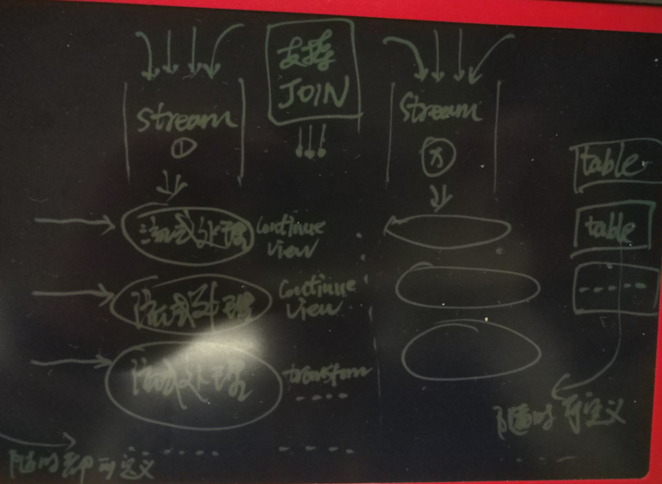
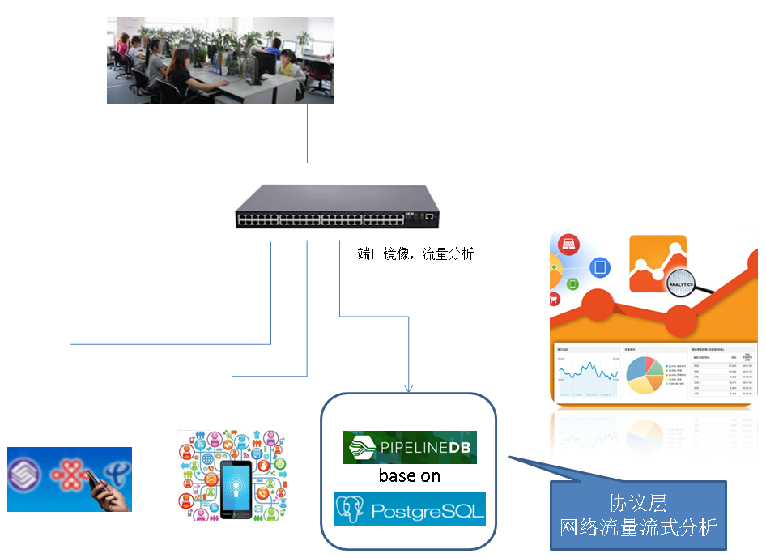
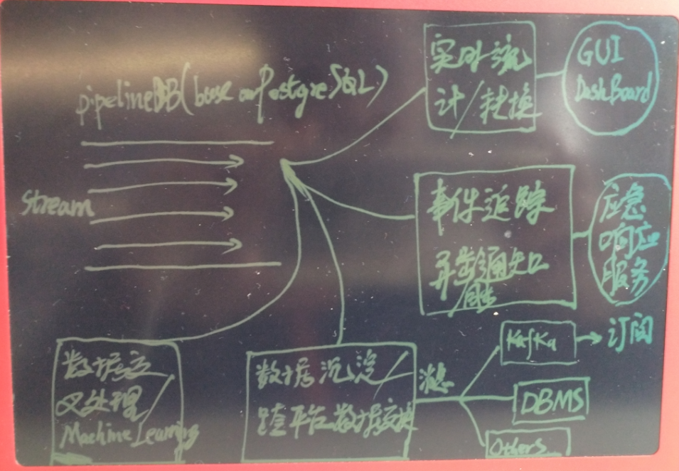
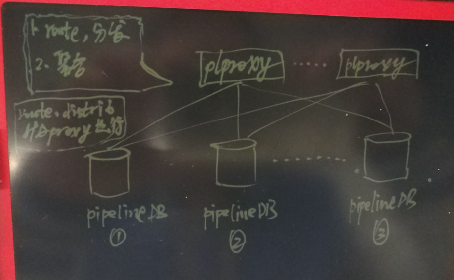
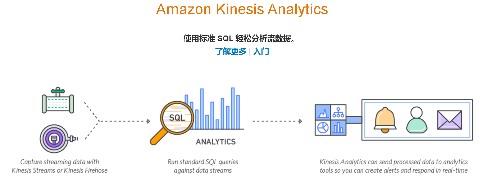

## 流计算风云再起 - PostgreSQL携PipelineDB力挺IoT       
##### [TAG 17](../class/17.md)
                                                            
### 作者                                                           
digoal                                                            
                                                            
### 日期                                                          
2016-12-20                                                             
                                                            
### 标签                                                          
PostgreSQL , pipelinedb , 流计算 , patch , bug , libcheck , zeromq , kafka , kinesis , IoT , 物联网 , 水文监测 , 流量协议分析 , 公安 , 交通 , 物流                                                                                                                               
                                                            
----                                                          
                                                            
## 背景         
pipelinedb是基于PostgreSQL的一个流式计算数据库，纯C代码，效率极高(**32c机器,单机日处理流水达到了250.56亿条**)。同时它具备了PostgreSQL强大的功能基础，正在掀起一场流计算数据库制霸的腥风血雨。      
      
在物联网(IoT)有非常广泛的应用场景，越来越多的用户开始从其他的流计算平台迁移到pipelineDB。        
     
pipelinedb的用法非常简单，首先定义stream(流)，然后基于stream定义对应的transform(事件触发模块)，以及Continuous Views(实时统计模块)        
      
数据往流里面插入，transform和Continuous Views就在后面实时的对流里的数据进行处理，对开发人员来说很友好，很高效。    
     
值得庆祝的还有，所有的接口都是SQL操作，非常的方便，大大降低了开发难度。    
          
      
     
## pipelinedb基本概念
1\. 什么是流  
流是基础，Continuous Views和transform则是基于流中的数据进行处理的手段。    
        
对于同一份数据，只需要定义一个流，写入一份即可。   
   
如果对同一份数据有多个维度的统计，可以写在一条SQL完成的（如同一维度的运算或者可以支持窗口的多维度运算），只需定义一个Continuous Views或transform。如果不能在同一条SQL中完成计算，则定义多个Continuous Views或transform即可。    
    
如果有多份数据来源（例如设计时就已经区分了不同的表）时，定义不同的流即可；    
      
2\. 什么是流视图？    
      
流视图，其实就是定义统计分析的QUERY， 例如```select id, count(*), avg(x), ... from stream_1 group by ...;``` 就属于一个流视图。         
      
定义好之后，数据插入流(stream_1)，这个流视图就会不断增量的进行统计，你只要查询这个流视图，就可以查看到实时的统计结果。     
     
数据库中存储的是实时统计的结果（实际上是在内存中进行增量合并的，增量的方式持久化）。    
    
3\. 什么是Transforms    
    
与流视图不同的是，transform是用来触发事件的，所以它可以不保留数据，但是可以设定条件，当记录满足条件时，就触发事件。     
     
例如监视传感器的值，当值的范围超出时，触发报警（如通过REST接口发给指定的server），或者将报警记录下来（通过触发器函数）。      
  
4\. pipelinedb继承了PostgreSQL很好的扩展性，例如支持了概率统计相关的功能，例如HLL等。用起来也非常的爽，例如统计网站的UV，或者红绿灯通过的汽车编号唯一值车流，通过手机信号统计基站辐射方圆多少公里的按时UV等。       
    
```  
Bloom Filter    
Count-Min Sketch    
Filtered-Space Saving Top-K    
HyperLogLog    
T-Digest    
```  
    
5\. Sliding Windows    
      
因为很多场景的数据有时效，或者有时间窗口的概念，所以pipelinedb提供了窗口分片的接口，允许用户对数据的时效进行定义。     
     
例如仅仅统计最近一分钟的时间窗口内的统计数据。     
     
比如热力图，展示最近一分钟的热度，对于旧的数据不关心，就可以适应SW进行定义，从而保留的数据少，对机器的要求低，效率还高。      
  
6\. 流视图 支持JOIN，支持JOIN，支持JOIN，重要的事情说三遍。    
    
流 JOIN 流(未来版本支持,目前可以通过transform间接实现)    
    
流 JOIN TABLE(已支持)    
    
欲了解pipelineDB详情请参考     
      
http://docs.pipelinedb.com/    
      
如果你还想了解一下PostgreSQL请参考    
      
[《PostgreSQL 前世今生》](../201609/20160929_02.md)     
    
pipelinedb在github上面可以下载。        
    
https://github.com/pipelinedb/pipelinedb/releases      
      
## pipelinedb适用场景
凡是需要流式处理的场景，pipelinedb都是适用的，例如 ：   
   
1\. 交通   
    
流式处理交通传感器（如路感、红绿灯）上报的数据，实时的反应交通情况如车流（流视图中完成）。动态的触发事件响应（transform中完成）如交通事故。     
   
2\. 水文监测  
  
流式监测传感器的数据，水质的变化，动态的触发事件响应（transform中完成）如水质受到污染。     
   
3\. 车联网   
   
结合PostGIS，实现对汽车的位置实时跟踪和轨迹合并，动态的绘制大盘数据（分时，车辆区域分布）。     
   
4\. 物流动态   
    
动态的跟踪包裹在每个环节的数据，聚合结果，在查询时不需要再从大量的数据中筛选多条（降低离散扫描）。   
    
5\. 金融数据实时处理  
  
例如用户设定了某个股票达到多少时，进行买入或卖出的操作，使用transform的事件处理机制，可以快速的进行买卖。   
   
又比如，实时的对股票的指标数据进行一些数学模型的运算，实时输出运算结果，绘制大盘数据。   
   
6\. 公安刑侦   
     
例如在已知可疑车辆的车牌时，在流式处理天眼拍摄并实时上传的车牌信息时，通过transform设置的规则，遇到可疑车牌时，触发事件，快速的知道可疑车辆的实时行踪。    
     
7\. app埋点(feed)数据实时分析   
  
很多APP都会设置埋点，方便对用户的行为，或者业务处理逻辑进行跟踪，如果访问量大，数据量可能非常庞大，在没有流式处理前，我们可能需要将数据收集到一个大型的数据仓库，进行离线分析。   
   
但是有些时候，离线分析可能是不够用的，比如要根据用户的实时行为，或者大盘的实时行为，对用户做出一些动态的推荐，或者营销，那么就要用到流式实时处理了。   
   
8\. 网络协议层流量分析    
  
比如对办公网络、运营商网关、某些服务端的流量分析。    
   
  
   
还有诸多场景等你来发掘。   
    
    
  
pipelinedb文档中提到的一些例子   
    
```
实时监测每个URL的日访问UV
CREATE CONTINUOUS VIEW uniques AS
SELECT date_trunc('day', arrival_timestamp) AS day,
  referrer, COUNT(DISTINCT user_id)
FROM users_stream GROUP BY day, referrer;

实时监测两个列的线性相关性，比如湿度与温度，大盘与贵州茅台，路口A与路口B的车流，某商场的人流量与销售额
CREATE CONTINUOUS VIEW lreg AS
SELECT date_trunc('minute', arrival_timestamp) AS minute,
  regr_slope(y, x) AS mx,
  regr_intercept(y, x) AS b
FROM datapoints_stream GROUP BY minute;

最近5分钟的计数
CREATE CONTINUOUS VIEW imps AS
SELECT COUNT(*) FROM imps_stream
WHERE (arrival_timestamp > clock_timestamp() - interval '5 minutes');

网站的访问品质，99th的用户访问延时, 95th的用户访问延时,.....
CREATE CONTINUOUS VIEW latency AS
SELECT percentile_cont(array[90, 95, 99]) WITHIN GROUP (ORDER BY latency)
FROM latency_stream;

西斯科方圆1000公里有多少车子
-- PipelineDB ships natively with geospatial support
CREATE CONTINUOUS VIEW sf_proximity_count AS
SELECT COUNT(DISTINCT sensor_id)
FROM geo_stream WHERE ST_DWithin(

  -- Approximate SF coordinates
  ST_GeographyFromText('SRID=4326;POINT(37 -122)'), sensor_coords, 1000);
```
    
### pipeline的优势
这是个拼爹的年代，pipelinedb有个很牛逼的爸爸PostgreSQL，出身伯克利大学，有扎实的理论基础，历经了43年的进化，在功能、性能、扩展能力、理论基础等方面无需质疑一直处于领先的位置。    
   
搞流式计算，计算是灵魂，算法和支持的功能排在很重要的位置。    
   
    
   
PostgreSQL的强大之处在于统计维度极其丰富，数据类型也极其丰富。    
    
build-in 数据类型参考    
    
https://www.postgresql.org/docs/9.6/static/datatype.html     
    
build-in 聚合，窗口，数学函数请参考    
    
https://www.postgresql.org/docs/9.6/static/functions.html      
    
同时还支持扩展，常见的例如   
   
[MADLib](http://madlib.incubator.apache.org/docs/latest/index.html)   
   
[PostGIS](http://postgis.net/)    
   
[路径规划](http://pgrouting.org/)     
   
[wavelet](../201611/20161126_01.md)    
   
[基因](../201606/20160621_01.md)    
   
[化学](http://www.rdkit.org/)    
   
还有好多好多(为什么这么多？原因是PostgreSQL的BSD-Like许可，致使了PG的生态圈真的很大很大，深入各行各业)。       
      
你能想到的和想不到的几乎都可以在pipelinedb 中进行流式处理，大大提高开发效率。    
   
## 快速部署pipelinedb    
### OS最佳部署    
[《PostgreSQL on Linux 最佳部署手册》](../201611/20161121_01.md)    
    
### 部署依赖    
### 安装 zeromq    
http://zeromq.org/intro:get-the-software      
      
```    
wget https://github.com/zeromq/libzmq/releases/download/v4.2.0/zeromq-4.2.0.tar.gz    
    
tar -zxvf zeromq-4.2.0.tar.gz    
    
cd zeromq-4.2.0    
    
./configure    
make    
make install    
    
    
vi /etc/ld.so.conf    
/usr/local/lib    
    
ldconfig    
```    
    
### rhel6需要更新libcheck    
删除老版本的check    
    
```    
yum remove check    
```    
    
安装 check    
    
http://check.sourceforge.net/    
    
https://libcheck.github.io/check/web/install.html#linuxsource    
    
https://github.com/libcheck/check/releases    
    
```    
wget http://downloads.sourceforge.net/project/check/check/0.10.0/check-0.10.0.tar.gz?r=&ts=1482216800&use_mirror=ncu    
    
tar -zxvf check-0.10.0.tar.gz    
    
cd check-0.10.0    
    
./configure    
make     
make install    
```    
    
### 下载pipelinedb    
```    
wget https://github.com/pipelinedb/pipelinedb/archive/0.9.6.tar.gz    
    
tar -zxvf 0.9.6.tar.gz    
    
cd pipelinedb-0.9.6    
```    
    
pipelinedb for rhel 6 or CentOS 6有几个BUG需要修复一下      
#### rhel6需要调整check.h
```    
vi src/test/unit/test_hll.c     
vi src/test/unit/test_tdigest.c     
vi src/test/unit/test_bloom.c     
vi src/test/unit/test_cmsketch.c     
vi src/test/unit/test_fss.c     
    
添加    
#include "check.h"    
```    
    
#### rhel6需要修复libzmq.a路径错误    
libzmq.a的路径修正      
    
```    
vi src/Makefile.global.in    
    
LIBS := -lpthread /usr/local/lib/libzmq.a -lstdc++ $(LIBS)    
```    
    
#### 修复test_decoding错误    
```    
cd contrib/test_decoding    
    
mv specs test    
    
cd ../../    
```    
    
### 编译pipelinedb    
```    
export C_INCLUDE_PATH=/usr/local/include:C_INCLUDE_PATH    
export LIBRARY_PATH=/usr/local/lib:$LIBRARY_PATH    
    
export USE_NAMED_POSIX_SEMAPHORES=1    
    
LIBS=-lpthread CC="/home/digoal/gcc6.2.0/bin/gcc" CFLAGS="-O3 -flto" ./configure --prefix=/home/digoal/pgsql_pipe    
    
make world -j 32    
    
make install-world    
```    
    
## 初始化集群    
配置环境变量    
    
```    
vi env_pipe.sh     
    
export PS1="$USER@`/bin/hostname -s`-> "    
export PGPORT=$1    
export PGDATA=/$2/digoal/pg_root$PGPORT    
export LANG=en_US.utf8    
export PGHOME=/home/digoal/pgsql_pipe    
export LD_LIBRARY_PATH=/home/digoal/gcc6.2.0/lib:/home/digoal/gcc6.2.0/lib64:/home/digoal/python2.7.12/lib:$PGHOME/lib:/lib64:/usr/lib64:/usr/local/lib64:/lib:/usr/lib:/usr/local/lib:$LD_LIBRARY_PATH    
export PATH=/home/digoal/cmake3.6.3/bin:/home/digoal/gcc6.2.0/bin:/home/digoal/python2.7.12/bin:/home/digoal/cmake3.6.3/bin:$PGHOME/bin:$PATH:.    
export DATE=`date +"%Y%m%d%H%M"`    
export MANPATH=$PGHOME/share/man:$MANPATH    
export PGHOST=$PGDATA    
export PGUSER=postgres    
export PGDATABASE=pipeline    
alias rm='rm -i'    
alias ll='ls -lh'    
unalias vi    
```    
    
假设端口为1922，目录放在/u01中    
    
```    
. ./env_pipe.sh 1922 u01    
```    
    
初始化集群    
    
```    
pipeline-init -D $PGDATA -U postgres -E SQL_ASCII --locale=C    
```    
    
## 修改配置    
```    
cd $PGDATA    
    
vi pipelinedb.conf    
    
listen_addresses = '0.0.0.0'    
port = 1922      
max_connections = 2000    
superuser_reserved_connections = 13    
unix_socket_directories = '.'    
shared_buffers = 64GB    
maintenance_work_mem = 2GB    
dynamic_shared_memory_type = posix    
vacuum_cost_delay = 0    
bgwriter_delay = 10ms    
bgwriter_lru_maxpages = 1000    
bgwriter_lru_multiplier = 10.0
max_worker_processes = 128
wal_level = minimal
synchronous_commit = off    
full_page_writes = off    
wal_buffers = 2047MB
wal_writer_delay = 10ms
max_wal_size = 64GB
min_wal_size = 32GB
checkpoint_timeout = 55min    
checkpoint_completion_target = 0.1    
random_page_cost = 1.2    
effective_cache_size = 400GB    
log_destination = 'csvlog'    
logging_collector = on    
log_truncate_on_rotation = on    
log_checkpoints = on    
log_connections = on    
log_disconnections = on    
log_error_verbosity = verbose       
log_timezone = 'PRC'    
autovacuum = on    
log_autovacuum_min_duration = 0    
autovacuum_vacuum_scale_factor = 0.05
autovacuum_analyze_scale_factor = 0.1
autovacuum_vacuum_cost_delay = 0
autovacuum_vacuum_cost_limit = 0
datestyle = 'iso, mdy'    
timezone = 'PRC'    
lc_messages = 'C'    
lc_monetary = 'C'    
lc_numeric = 'C'    
lc_time = 'C'    
default_text_search_config = 'pg_catalog.english'    
continuous_query_combiner_synchronous_commit = off    
continuous_query_combiner_work_mem = 1GB    
continuous_view_fillfactor = 50    
continuous_query_max_wait = 10    
continuous_query_commit_interval = 10    
continuous_query_batch_size = 50000    
continuous_query_num_combiners = 24    
continuous_query_num_workers = 12    
```    
    
### pipelinedb新增的配置    
```  
#------------------------------------------------------------------------------    
# PIPELINEDB OPTIONS    
#------------------------------------------------------------------------------    
    
# synchronization level for combiner commits; off, local, remote_write, or on    
continuous_query_combiner_synchronous_commit = off    
    
# maximum amount of memory to use for combiner query executions    
continuous_query_combiner_work_mem = 1GB    
    
# the default fillfactor to use for continuous views    
continuous_view_fillfactor = 50    
    
# the time in milliseconds a continuous query process will wait for a batch    
# to accumulate    
continuous_query_max_wait = 10    
    
# time in milliseconds after which a combiner process will commit state to    
# disk    
continuous_query_commit_interval = 10    
    
# the maximum number of events to accumulate before executing a continuous query    
# plan on them    
continuous_query_batch_size = 50000    
    
# the number of parallel continuous query combiner processes to use for    
# each database    
continuous_query_num_combiners = 24    
    
# the number of parallel continuous query worker processes to use for    
# each database    
continuous_query_num_workers = 12    
    
# allow direct changes to be made to materialization tables?    
#continuous_query_materialization_table_updatable = off    
    
# synchronization level for stream inserts    
#stream_insert_level = sync_read    
    
# continuous views that should be affected when writing to streams.    
# it is string with comma separated values for continuous view names.    
#stream_targets = ''    
    
# the default step factor for sliding window continuous queries (as a percentage    
# of the total window size)    
#sliding_window_step_factor = 5    
    
# allow continuous queries?    
#continuous_queries_enabled = on    
    
# allow anonymous statistics collection and version checks?    
#anonymous_update_checks = on    
```  
    
## 启动pipelinedb    
    
```    
pipeline-ctl start    
```    
    
    
## 连接方法    
如何连接PostgreSQL，就如何连接pipelinedb，它们是全兼容的。    
  
```    
psql    
psql (9.5.3)    
Type "help" for help.    
    
pipeline=# \dt    
No relations found.    
pipeline=# \l    
                             List of databases    
   Name    |  Owner   | Encoding  | Collate | Ctype |   Access privileges       
-----------+----------+-----------+---------+-------+-----------------------    
 pipeline  | postgres | SQL_ASCII | C       | C     |     
 template0 | postgres | SQL_ASCII | C       | C     | =c/postgres          +    
           |          |           |         |       | postgres=CTc/postgres    
 template1 | postgres | SQL_ASCII | C       | C     | =c/postgres          +    
           |          |           |         |       | postgres=CTc/postgres    
(3 rows)    
    
pipeline=#    
```    
    
## 测试    
    
### 创建流结构    
id为KEY， val存储值，统计时按ID聚合      
    
```    
CREATE STREAM s1 (id int, val int);    
```    
    
### 创建流式视图    
流视图统计count, avg, min, max, sum几个常见维度    
    
```    
CREATE CONTINUOUS VIEW cv1 AS    
SELECT id,count(*),avg(val),min(val),max(val),sum(val)    
FROM s1 GROUP BY id;    
```    
    
PostgreSQL的强大之处在于统计维度极其丰富，数据类型也极其丰富。    
    
build-in 数据类型参考    
    
https://www.postgresql.org/docs/9.6/static/datatype.html     
    
build-in 聚合，窗口，数学函数请参考    
    
https://www.postgresql.org/docs/9.6/static/functions.html      
    
同时还支持扩展，常见的例如 PostGIS, wavelet, 基因，化学，图类型，等等。      
    
你能想到的和想不到的都可以在pipelinedb 中进行流式处理，大大提高开发效率。    
    
### 激活流计算    
```    
activate ;    
```    
    
### 插入压测    
100万个随机group，插入的值为500万内的随机值    
    
```    
vi test.sql    
    
\setrandom id 1 1000000    
\setrandom val 1 5000000    
insert into s1(id,val) values (:id, :val);    
```    
    
使用1000个连接，开始压测，每秒约处理24万流水        
    
```    
pgbench -M prepared -n -r -P 1 -f ./test.sql -c 1000 -j 1000 -T 100    
    
...    
progress: 2.0 s, 243282.2 tps, lat 4.116 ms stddev 5.182    
progress: 3.0 s, 237077.6 tps, lat 4.211 ms stddev 5.794    
progress: 4.0 s, 252376.8 tps, lat 3.967 ms stddev 4.998    
...    
```    
    
如果主机有很多块硬盘，并且CPU很强时，可以在一台主机中部署2个或多个pipelinedb实例，进行分流。    
    
比如我在32Core的机器上，部署2个pipelinedb实例，可以达到29万/s的流处理能力，一天能处理 **250.56亿** 流水。      
   
部署两个时，建议使用NUMACTL进行控制，分别使用两路CPU和内存绑定。     
  
例如  
  
```
numactl --physcpubind=0-31 pipeline-ctl start
```
   
性能可以做到更好。   
    
小伙伴们都惊呆了。      
       
250.56亿，使用jstrom框架的话，估计要几十倍甚至上百倍于pipelinedb的硬件投入才能达到同样效果。      
    
## pipelinedb集群化部署    
虽然pipelinedb的性能很强(前面测的32C机器约250.56亿/天的流水处理能力)，但是单机总会有瓶颈，所以我们还是需要考虑集群化的部署。      
    
        
    
写入操作，如果不需要特定的分片规则，使用haproxy分发就可以了。如果需要加入分片规则，可以使用plproxy。    
    
查询聚合，需要使用plproxy，非常简单，写个动态函数即可。      
    
### plproxy 相关文档介绍    
[《使用Plproxy设计PostgreSQL分布式数据库》](../201005/20100511_01.md)      
    
[《A Smart PostgreSQL extension plproxy 2.2 practices》](../201110/20111025_01.md)      
    
[《PostgreSQL 最佳实践 - 水平分库(基于plproxy)》](../201608/20160824_02.md)     
    
## pipelinedb 文档结构    
http://docs.pipelinedb.com/    
    
从文档目录，可以快速了解pipelinedb可以干什么，可以和什么结合，处理那些场景的问题?      
    
1\. 介绍    
    
```  
What PipelineDB is    
What PipelineDB is not    
```  
    
2\. Continuous Views    
    
定义流视图，其实就是定义 统计分析的QUERY， 例如select id, count(*), avg(x), ... from table group by ...;     
      
定义好之后，数据插入table，这个流视图就会不断增量的进行统计，你只要查询这个流视图，就可以查看到实时的统计结果。     
     
数据库中存储的是实时统计的结果（实际上是在内存中进行增量合并的，增量的方式持久化）。    
      
```  
CREATE CONTINUOUS VIEW    
DROP CONTINUOUS VIEW    
TRUNCATE CONTINUOUS VIEW    
Viewing Continuous Views    
Data Retrieval    
Time-to-Live (TTL) Expiration    
Activation and Deactivation    
Examples    
```  
    
3\. Continuous Transforms    
    
与流视图不同的是，transform是用来触发事件的，所以它可以不保留数据，但是可以设定条件，当记录满足条件时，就触发事件。     
     
例如监视传感器的值，当值的范围超出时，触发报警（如通过REST接口发给指定的server），或者将报警记录下来（通过触发器函数）。      
    
```  
CREATE CONTINUOUS TRANSFORM    
DROP CONTINUOUS TRANSFORM    
Viewing Continuous Transforms    
Built-in Transform Triggers    
Creating Your Own Trigger    
```  
    
4\. Streams    
    
流视图和transform都是基于流的，所以流是基础。     
    
我们首先需要定义流，往流里面写数据，然后在流动的数据中使用流视图或者transform对数据进行实时处理。    
  
```  
Writing To Streams    
Output Streams    
stream_targets    
Arrival Ordering    
Event Expiration    
```  
    
5\. Built-in Functionality    
    
内置的函数    
    
```  
General    
Aggregates    
PipelineDB-specific Types    
PipelineDB-specific Functions    
Miscellaneous Functions    
```  
    
6\. Continuous Aggregates    
    
聚合的介绍，通常流处理分两类，即前面讲的     
     
流视图（通常是实时聚合的结果），比如按分钟实时的对红绿灯的车流统计数据绘图，或者按分钟对股票的实时数据进行绘图。    
      
transform（事件处理机制），比如监控水质，传感器的值超出某个范围时，记录日志，并同时触发告警（发送给server）。     
      
```  
PipelineDB-specific Aggregates    
Combine    
CREATE AGGREGATE    
General Aggregates    
Statistical Aggregates    
Ordered-set Aggregates    
Hypothetical-set Aggregates    
Unsupported Aggregates    
```  
    
7\. Clients    
    
几种常见的客户端用法，实际上支持PostgreSQL的都支持pipelinedb，他们的连接协议是一致的。       
    
```  
Python    
Ruby    
Java    
```  
    
8\. Probabilistic Data Structures & Algorithms    
    
概率统计相关的功能，例如HLL等。用起来也非常的爽，例如统计网站的UV，或者红绿灯通过的汽车编号唯一值车流，通过手机信号统计基站辐射方圆多少公里的按时UV等。     
    
```  
Bloom Filter    
Count-Min Sketch    
Filtered-Space Saving Top-K    
HyperLogLog    
T-Digest    
```  
    
9\. Sliding Windows    
      
因为很多场景的数据有时效，或者有时间窗口的概念，所以pipelinedb提供了窗口分片的接口，允许用户对数据的时效进行定义。     
     
例如仅仅统计最近一分钟的时间窗口内的统计数据。     
     
比如热力图，展示最近一分钟的热度，对于旧的数据不关心，就可以适应SW进行定义，从而保留的数据少，对机器的要求低，效率还高。      
      
```  
Examples    
Sliding Aggregates    
Temporal Invalidation    
Multiple Windows    
step_factor    
```  
    
10\. Continuous JOINs    
    
流视图 支持JOIN，支持JOIN，支持JOIN，重要的事情说三遍。    
    
流 JOIN 流(未来版本支持,目前可以通过transform间接实现)    
    
流 JOIN TABLE(已支持)    
      
```  
Stream-table JOINs    
Supported Join Types    
Examples    
Stream-stream JOINs    
```  
    
11\. Integrations    
    
pipelinedb继承了PostgreSQL的高扩展性，所以支持kafka, aws kinesis也是易如反掌的，可以适应更多的场景。     
    
    
  
https://aws.amazon.com/cn/kinesis/streams/    
        
```  
Apache Kafka    
Amazon Kinesis    
```  
    
12\. Statistics    
    
统计信息，对于DBA有很大的帮助    
    
```  
pipeline_proc_stats    
pipeline_query_stats    
pipeline_stream_stats    
pipeline_stats    
```  
    
13\. Configuration    
    
    
## 参考    
https://yq.aliyun.com/articles/166    
    
  
  
  
  
<a rel="nofollow" href="http://info.flagcounter.com/h9V1"  ></a>  
  
  
  
  
## [digoal's PostgreSQL文章入口](https://github.com/digoal/blog/blob/master/README.md "22709685feb7cab07d30f30387f0a9ae")
  
