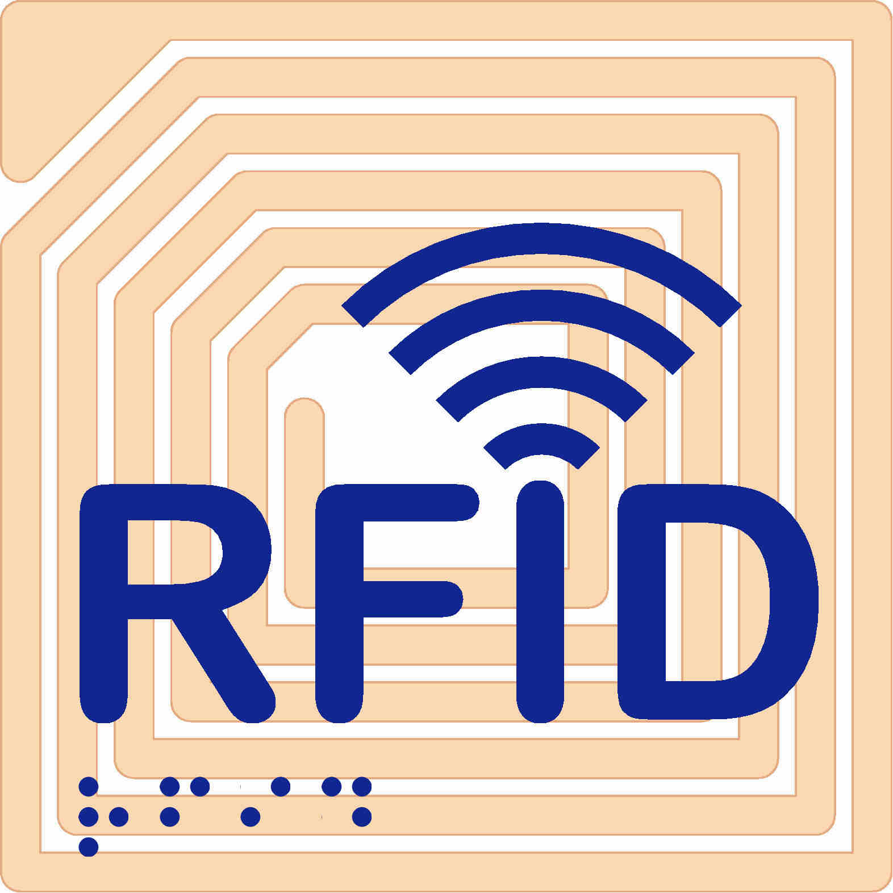
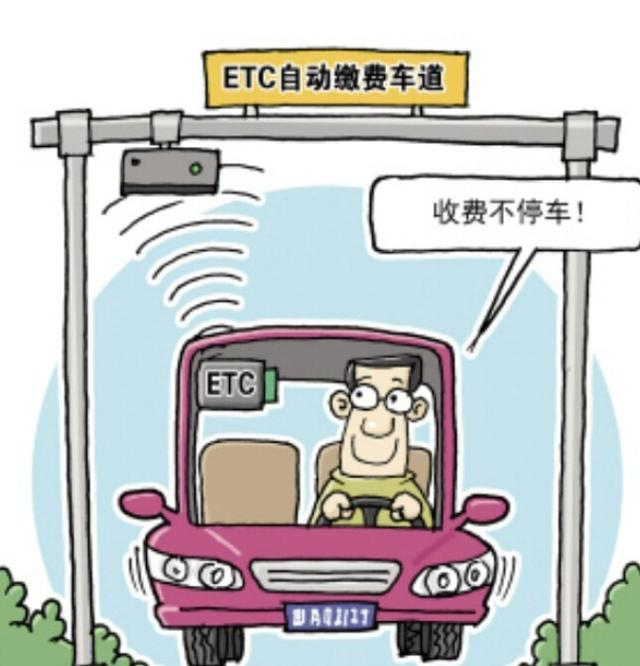
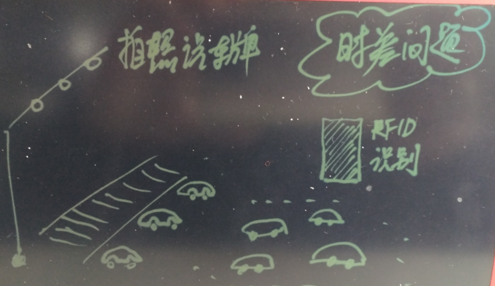
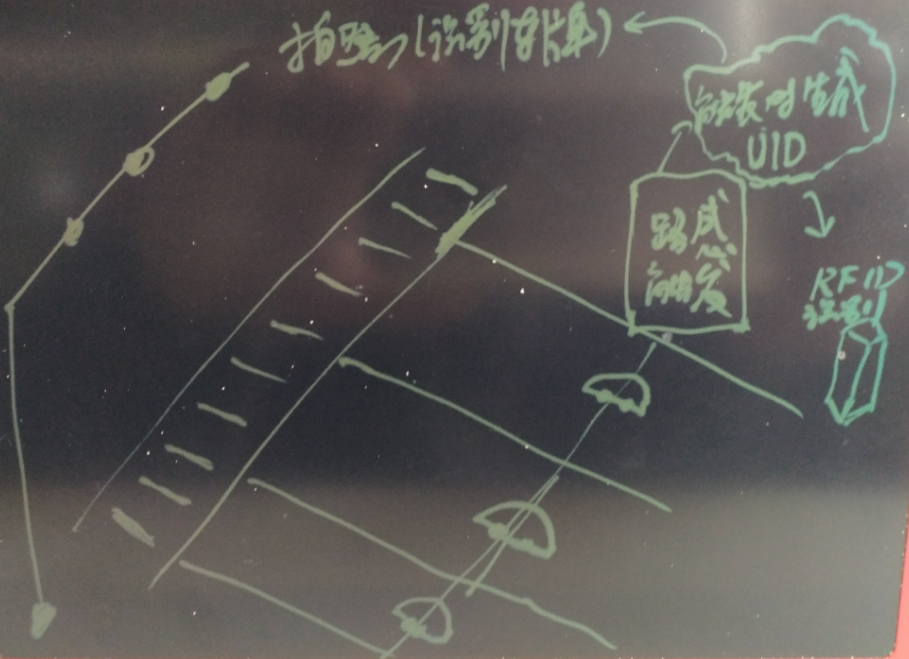
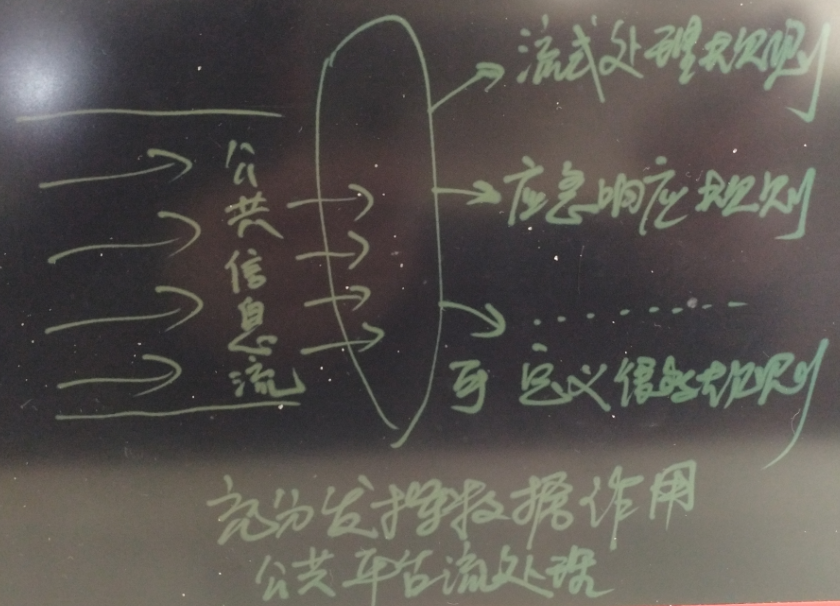

## 从真假美猴王谈起 - 让套牌车、克隆x 无处遁形的技术手段思考  
##### [TAG 15](../class/15.md)
                                                                            
### 作者                                                                           
digoal                                                                            
                                                                            
### 日期                                                                          
2016-12-27                                                                            
                                                                            
### 标签                                                                          
PostgreSQL , RFID , 物联网 , IoT , 套牌车 , 克隆车 , Wavelet , 图像相似度 , 传输加密 , 伪装             
              
----                                                                          
                  
## 背景  
西游记想必大家小时候都看过吧，其中有一集“真假美猴王”还记得吗？     
     
假的美猴王简直是克隆的，和孙悟空一模一样。一开始菩提祖师、如来佛祖、观音菩萨、就连最亲近的师父、师兄弟都分辨不出来，最后师父使出紧箍咒的绝招才辨别出来。      
  
    
     
打假在现实世界中的需求也非常旺盛，诸如我们看到的一些商品的防伪码验证、水印验证、钞票的一些特征验证等等。     
     
但是大多数的防伪手段是很容易模仿的，包括电话，网站的防伪验证。钞票也一样，再难也有人会去搞。     
     
再往广泛的场景去想，还有更多的真假美猴王，比如套牌车(克隆车)，克隆人，ip伪装，MAC伪装。      
     
有什么技术手段可以真正的解决真假美猴王的问题呢？      
     
我们接下来从套牌车谈起.     
     
## 什么是套牌车  
套牌车正是克隆车。这种车是参照真牌车的型号和颜色，将号码相同的假牌套在同样型号和颜色的车上，其中有很多是报废后偷运出来的旧车翻新的。  
  
假设你的车牌号是“京A00001”，有一整套档案资料，做套牌车的人就找一部和你同厂牌型号同颜色的车，也做一副号牌也是“京A00001”，把原车的的发动机号和大架号码磨去，重新按照你的车档案中的发动机号和大架号做上去，这样就出现了一套档案两部同样的车，然后伪造行驶执照，此为套牌！  
  
驾驶套牌车的危害非常多  
   
一是害自己  
　　  
根据《道路交通安全法》的规定，一旦发现套牌现象，对于套牌车主除了给予经济处罚外，严重者还要予以刑事处罚，最终是" 搬起石头砸自己的脚" ；  
   
二是害他人  
　　  
套牌车主因为套用别人的牌照，所以在路上行驶就胆大妄为，闯红灯、轧黄线，几乎没他不敢做的；  
   
三是害社会  
　　  
由于套牌车主在路上行驶极少以交通法规来约束自己，随之带来的交通事故、法律纠纷势必给社会带来更大的不稳定因素！ 　  
  
## 传统手段判断套牌车的方法和难度  
传统的检测方法完全靠人，靠经验  
　　  
套牌车的方法有四招，可以简单概括成“望、摸、问、查”四种方法来识别真假牌。   
   
望是观察车牌外形，从形、色、字的角度进行基本判断。正规的车牌经过高科技处理，并采用一次成型技术，给人的视觉感受很好。而伪造的“套牌”在正常阳光下存在颜色偏红或者偏黄、字体较瘦等“硬伤”，只要细加端详就能发现。 　　  
  
摸是用手触摸车牌，尤其是周边棱角处，这是判断一辆车是否存在套牌的重要标志。由于并非一次性成型，“套牌”上的字体边缘会有棱角，即使打磨过也难以掩盖痕迹，拆下车牌，其背面会有敲打过的痕迹。 　　  
   
问是判断是否套牌的重要方法。目前二手车市场上一些“黄牛”喜欢把二手车牌卖掉，用打磨的“套牌”随车出售，从中牟取暴利。遇上这种情况，购车人只要多问几次可疑“套牌车”的车主就会发现，这些车主对正常领证程序说不清，或者说车牌是别人帮忙办的。 　　  
   
查是最有效的一招：记下车牌号码后，到车辆管理部门上网查询车辆登记档案。挪用牌照的套牌车有的是“套”不同车型牌照，有的是“套”同种车型牌照，有的还涂改车架号和相关标志。  
  
我们回想一下美猴王的鉴别，其实一开始用的都是传统的手段，望闻问切、甚至照妖镜都用上了，都没识别出来。  
  
## 紧箍咒与RFID  
最后假的美猴王是怎么鉴别出来的呢？没错紧箍咒，这是唯一不一样的地方。        
  
从紧箍咒，我们可以联想到RFID，比如你去迪卡侬买衣服，衣服标签里就包含了一个RFID(由天线，耦合元件及芯片组成，一般来说都是用标签作为应答器，每个标签具有唯一的电子编码，附着在物体上标识目标对象)。    
  
rfid就是唯一的，你买了两件一模一样，尺寸颜色都一样的衣服时，就可以通过RFID来辨别。     
  
    
  
rfid除了防伪，还可以用来监控产品的生产流程，每一步都能唯一的挂钩起来。    
  
https://en.wikipedia.org/wiki/Radio-frequency_identification  
  
http://baike.baidu.com/subview/531097/13865303.htm  
  
### RFID介绍  
最初在技术领域，应答器是指能够传输信息回复信息的电子模块，近些年，由于射频技术发展迅猛，应答器有了新的说法和含义，又被叫做智能标签或标签。RFID电子标签的阅读器通过天线与RFID电子标签进行无线通信，可以实现对标签识别码和内存数据的读出或写入操作。RFID技术可识别高速运动物体并可同时识别多个标签，操作快捷方便。  
  
在未来，RFID技术的飞速发展对于物联网领域的进步具有重要的意义。  
  
比如在高速收费中的应用（ETC）  
  
    
  
好了，回到套牌车（克隆车），传统方法在识别度、识别成本上就决定了，无法杜绝套牌车（原因是识别度低（纯靠经验）、识别成本高（纯靠人力））。  
  
RFID给真正杜绝套牌车带来了希望，我们只需要在汽车上牌时，同时也给汽车贴上RFID，那么这事就好办了。    
    
但是前路并不是一帆风顺的，我们来分析一下还有什么难点。  
  
## 难题一、车牌与RFID的配对泥潭  
首先我们要搞清楚车牌与RFID的识别手段。    
  
车牌的识别手段，拍摄，识别车牌，海康威视是一个典型的供应商代表。    
  
RFID的识别手段，磁场识别，当RFID终端进入识别磁场时，就会被识别。  
  
由于识别手段的差异，决定了不能同时识别同一辆车。   
  
比如同一个路口多辆车并排通过，一张照片中可能涉及多辆车，同时RFID识别也一样，可能一次识别到多辆车，导致RFID与车牌无法在识别时一一挂钩。  
  
    
  
如何解决被识别的车牌与RFID的多对多的配对问题呢？    
  
一般来说道路下面都埋设了路感，当汽车经过时，触发拍摄和RFID的识别，并且触发时，可以产生一个唯一的ID，然后拍摄与RFID都带上这个ID，这样RFID与照片就能关联起来了。  
  
但是这可能还是无法解决一对一的关联问题，由于一次可以识别多个设备，所以可能还是多对多的。    
  
    
  
## 难题一解法、多对多的问题解决  
  
1\. 数组类型  
  
由于一次或一个短暂的时间窗口内，可能拍摄到多个车牌，或者识别到多个RFID，所以我们在设计结构时，可以使用两个数组分别来存储车牌与RFID。     
  
2\. 流式计算  
  
识别套牌车只是公共服务的其中之一，我还写过一些文章，比如抓捕人贩，识别遮挡车牌，公安刑侦等都可能会调用到RFID与车牌的数据。  
  
[《金融风控、公安刑侦、社会关系、人脉分析等需求分析与数据库实现 - PostgreSQL图数据库场景应用》](./20161213_01.md)  
  
[《一场IT民工 与 人贩子 之间的战争 - 只要人人都献出一点爱》](./20161222_01.md)  
   
流式计算是必不可少的，不能等数据都汇总了之后再进行处理，那样延迟会很大，办事效率就低了。     
  
    
  
3\. 流式计算时间窗口  
  
前面讲了，由于识别手段的差别，一辆车的RFID与车牌可能不是同一时刻被识别到的，比如前后有可能会差几秒。  
  
所以在进行配对时，我们需要用到前后几秒的数据进行配对。  
  
4\. 流式计算地域窗口  
  
除了时间维度，我们还有另一个维度，即位置维度，比如RFID的识别可能不是与拍摄系统共同建设的，不如说RFID的识别在A路段，而拍摄在附近几百米的某个信号灯附近。  
  
那么时间可能不是差几秒，可能差分钟以上，此时，需要的是地域维度的配对手段，比如说圈定出一个区域，在该区域内的摄像头与RFID识别设备，识别到的车牌与RFID进行配对。     
  
这里需要用到的是GIS技术，如何根据区域快速的赛选记录（GIS索引）。    
  
PostgreSQL可以很好的支撑。    
  
参考PostGIS。    
  
[《如何建立GIS测试环境 - 将openstreetmap的样本数据导入PostgreSQL PostGIS库》](../201609/20160906_01.md)  
  
[《PostgreSQL 百亿地理位置数据 近邻查询性能》](../201601/20160119_01.md)   
  
## 流计算细节  
配对的问题解决掉之后，就需要用到流式计算，及时的  
  
定义transform udf  
  
输入(车牌数组，RFID数组)  
  
处理逻辑，根据车牌找出RFID，RFID与RFID数组进行匹配，如果不能匹配，告警。  
  
例子、未做任何优化，仅展示功能(依赖PostGIS地理位置插件)     
  
```  
采集流  
create stream tbl_chepai (  
  sid timestamp, -- 序列或时间的epoch值, 入库时减去offset值，形成时差  
  -- loc geometry, -- 位置  
  loc point,  -- 测试时使用point代替经纬度  
  chepai text[]  
);  
  
create stream tbl_rfid (  
  sid timestamp, -- 序列或时间的epoch值  
  -- loc geometry, -- 位置  
  loc point,  -- 测试时使用point代替经纬度  
  rfid text[]  
);  
  
字典库  
车牌, RFID对应表  
create table chepai_rfid(  
  chepai text unique,  
  rfid text unique  
);  
  
被套牌车库  
create table tbl_taopaiche(sid timestamp, chepai text, loc point);  
  
流视图  
1. RFID 流视图，保留30分钟的值  
CREATE CONTINUOUS VIEW rfid_cv WITH (ttl = '30 min', ttl_column = 'sid') AS  
  SELECT sid, loc, rfid FROM tbl_rfid;  
  
2. 车牌 事件机制  
create or replace function tg1() returns trigger as $$  
declare   
  v_rfid text := null;  
  cv_rfid text[] := null;  
  v_loc point := null;  
  v_chepai text := null;  
  cv_chepai text[] := NEW.chepai;  
begin  
  for v_chepai in select chepai from (select chepai from unnest(NEW.chepai) as t(chepai)) t where not exists (select 1 from chepai_rfid where chepai_rfid.chepai=t.chepai)   
  loop  
    raise notice '% 是套牌车', v_chepai;  
    -- 告警，这里可以写成异步通知，发现假车牌，或未登记RFID的车牌   
    -- 本例使用插入审计代替异步调用
    insert into tbl_taopaiche(sid, chepai, loc) values (now(), v_chepai, NEW.loc);  
    cv_chepai := array_remove(cv_chepai, v_chepai);  
  end loop;  
  
  raise notice '%', cv_chepai;
  for v_rfid, v_chepai in select rfid,chepai from chepai_rfid where chepai = any(cv_chepai)   
  loop   
    raise notice '%,%', v_rfid, v_chepai;
    if v_loc is null then   
      select loc into v_loc from rfid_cv order by loc <-> NEW.loc limit 1;  
      raise notice '%', v_loc;
    end if;   
    if cv_rfid is null then   
      select array_agg(t.unnest) into cv_rfid from (select unnest(t1.rfid) from rfid_cv t1 where t1.loc::text=v_loc::text and t1.sid between NEW.sid-interval '1 min' and NEW.sid+interval '1 min') t;  
      
      if cv_rfid is null then
        -- 该时间段内RFID没有上报信息，可能是RFID故障，也可能是套牌车造成
	raise notice '% 是套牌车', NEW.chepai;  
        -- 告警，异步通知，可能发现套牌车   
        -- 本例使用插入审计代替异步调用
        insert into tbl_taopaiche(sid, chepai, loc) values (now(), v_chepai, NEW.loc);  
	continue;
      end if;

      raise notice '%', cv_rfid;
    end if;  
    
    if (not cv_rfid && array[v_rfid]) then   
      raise notice '% 是套牌车', NEW.chepai;  
      -- 告警，异步通知，可能发现套牌车   
      -- 本例使用插入审计代替异步调用
      insert into tbl_taopaiche(sid, chepai, loc) values (now(), v_chepai, NEW.loc);  
    end if;  
  end loop;  
  RETURN NEW;  
end;  
$$ language plpgsql strict;  
  
CREATE CONTINUOUS TRANSFORM ct AS  
  SELECT sid::timestamp, loc::point, chepai::text[] FROM tbl_chepai  
  THEN EXECUTE PROCEDURE tg1();    
```  
  
数据测试  
  
```  
insert into chepai_rfid values('浙A00001', '123');  
insert into chepai_rfid values('浙A00002', '234');  
  
insert into tbl_rfid (sid, loc, rfid) values (now(), '(1,2)', array['123']);  
insert into tbl_chepai (sid, loc, chepai) values (now()-interval '30 s', '(1,2)', array['浙A00002', '浙A00001']);  
  
车牌 '浙A00002' 可能被套牌  
```  
  
关于流计算的其他案例和部署方法，请参考  
  
[《流计算风云再起 - PostgreSQL携PipelineDB力挺IoT》](./20161220_01.md)  
  
## 数据风险与安全解法  
1\. 在识别RFID时，需要确保无线传输的数据不被窃取，比如使用加密的手段进行通信  
  
2\. 数据采集后，传输给后台（比如数据库）的过程中也需要加密  
  
3\. 由于RFID与车牌绑定，所以RFID的数据安全非常的重要，一旦RFID值被泄露，就有可能被不法分子拿去伪造携带一样信息的RFID。从而继续制造克隆车。 数据库的安全（SQL注入、密码复杂度等。。。）也是需要注意的。  
  
关于数据库的安全，可以参考如下    
  
[《DBA专供 冈本003系列 - 数据库安全第一,过个好年》](./20161224_01.md)  
  
## 小结
随着物联网的发展，数据正发生爆炸式的增长，流式的数据处理也会成为将来的热门需求。  
   
### pipelineDB的优势
这是个拼爹的年代，pipelinedb有个很牛逼的爸爸PostgreSQL，出身伯克利大学，有扎实的理论基础，历经了43年的进化，在功能、性能、扩展能力、理论基础等方面无需质疑一直处于领先的位置。    
   
搞流式计算，计算是灵魂，算法和支持的功能排在很重要的位置。    
   
    
   
PostgreSQL的强大之处在于统计维度极其丰富，数据类型也极其丰富。    
    
build-in 数据类型参考    
    
https://www.postgresql.org/docs/9.6/static/datatype.html     
    
build-in 聚合，窗口，数学函数请参考    
    
https://www.postgresql.org/docs/9.6/static/functions.html      
    
同时还支持扩展，常见的例如   
   
[MADLib](http://madlib.incubator.apache.org/docs/latest/index.html)   
   
[PostGIS](http://postgis.net/)    
   
[路径规划](http://pgrouting.org/)     
   
[wavelet](../201611/20161126_01.md)    
   
[基因](../201606/20160621_01.md)    
   
[化学](http://www.rdkit.org/)    
   
还有好多好多(为什么这么多？原因是PostgreSQL的BSD-Like许可，致使了PG的生态圈真的很大很大，深入各行各业)。       
      
你能想到的和想不到的几乎都可以在pipelinedb 中进行流式处理，大大提高开发效率。    
  
## 参考  
[《DBA专供 冈本003系列 - 数据库安全第一,过个好年》](./20161224_01.md)  
  
[《流计算风云再起 - PostgreSQL携PipelineDB力挺IoT》](./20161220_01.md)  
  
[《金融风控、公安刑侦、社会关系、人脉分析等需求分析与数据库实现 - PostgreSQL图数据库场景应用》](./20161213_01.md)  
  
[《一场IT民工 与 人贩子 之间的战争 - 只要人人都献出一点爱》](./20161222_01.md)  
      
[《PostgreSQL 在视频、图片去重，图像搜索业务中的应用》](../201611/20161126_01.md)  
      
[《如何建立GIS测试环境 - 将openstreetmap的样本数据导入PostgreSQL PostGIS库》](../201609/20160906_01.md)  
  
[《PostgreSQL 百亿地理位置数据 近邻查询性能》](../201601/20160119_01.md)   
             
                      
                      
  
  
  
  
  
  
  
  
  
  
  
  
  
#### [免费领取阿里云RDS PostgreSQL实例、ECS虚拟机](https://free.aliyun.com/ "57258f76c37864c6e6d23383d05714ea")
  
  
#### [digoal's PostgreSQL文章入口](https://github.com/digoal/blog/blob/master/README.md "22709685feb7cab07d30f30387f0a9ae")
  
  

  
  
  
  
  
  
#### 打赏都逃不过老婆的五指山 －_－b  

  
