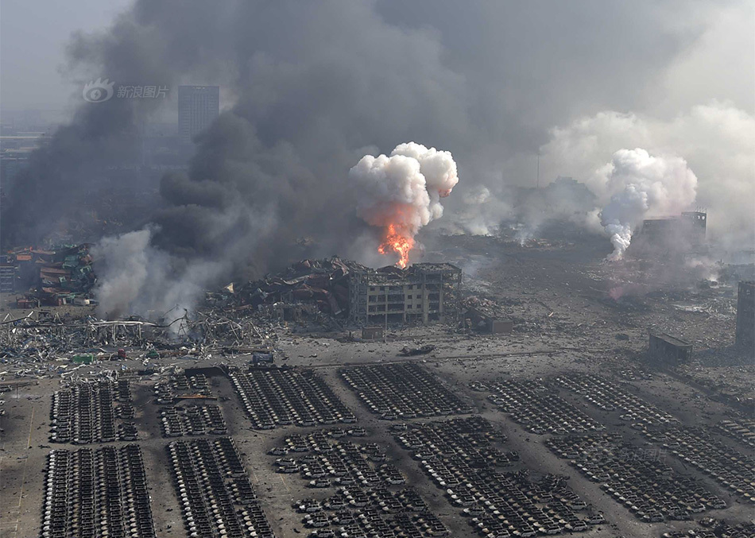
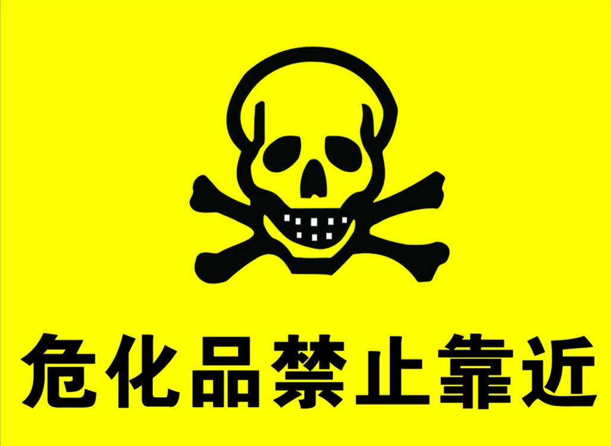
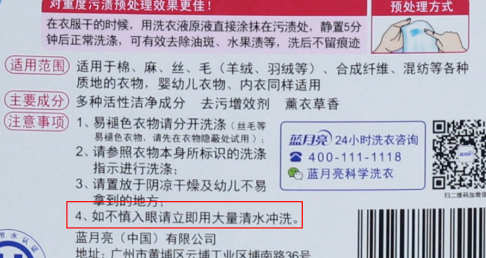
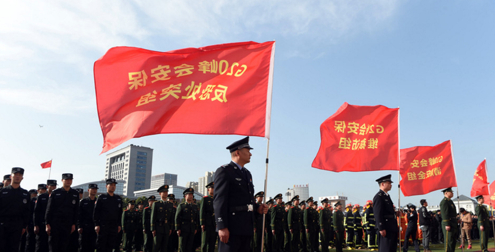
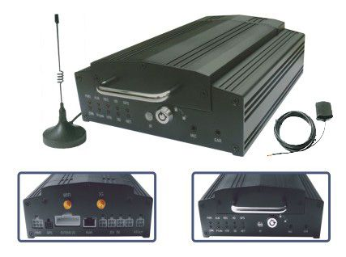
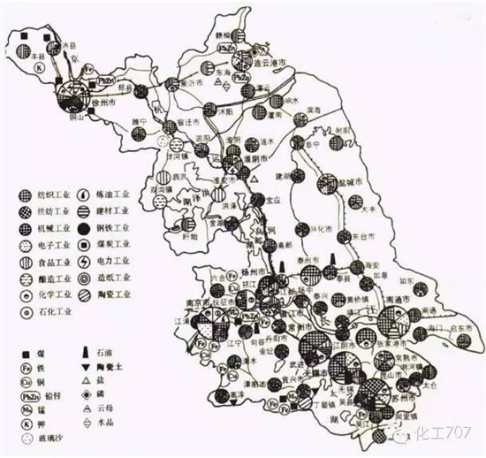
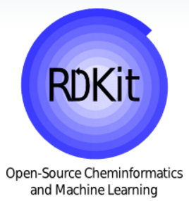
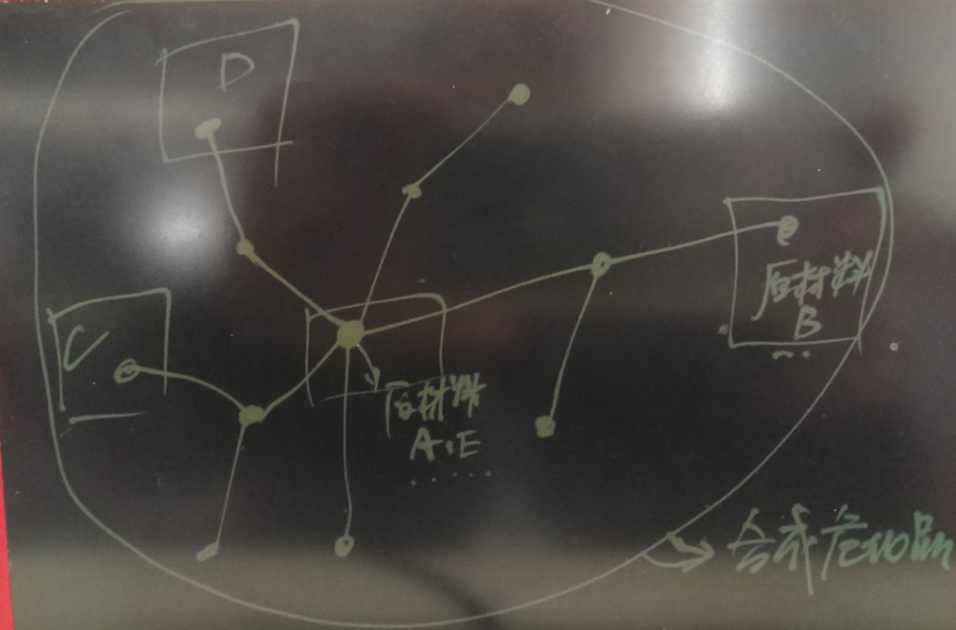

## 从天津滨海新区大爆炸、危化品监管聊聊 IT人背负的社会责任感        
##### [TAG 15]
                                                                                  
### 作者                                                                                 
digoal                                                                                  
                                                                                  
### 日期                                                                                
2016-12-28                                                                                  
                                                                                  
### 标签                                                                                
PostgreSQL , 天津滨海新区大爆炸 , 危险品 , 危化品监管 , RDKit , 化学插件 , 社会关系分析 , 毒品分析 , 化学反应 , 机器学习 , 地理位置 , PostGIS                         
                    
----                                                                                
                        
## 背景        
缘分所致，前几天与一些来自ING行业的企业做了一次深入的交流，有感而发，写下本文。      
      
其实技术和业务相互依赖，相互推动着各自的发展。哪一个发明不是从自嗨开始的呢，作为IT人不应该故步自封，敞开胸怀，承担更多的社会责任，一起来推动社会变革吧。        
      
          
         
天津滨海大爆炸只是危化品事故的其中之一，看看事故后的一片狼藉，危化品一旦发生事故，破坏力非常的惊人。        
         
危化品的种类繁多。包括如常见的易爆、易燃、放射、腐蚀、剧毒、等等。         
        
         
      
         
         
由于危化品的危害极大，所以监管显得尤为重要，那么作为IT人，一起来思考一下，能利用哪些技术手段来帮助相关部门对危化品的监管呢？        
        
## 如何做到风险可控      
要做到风险的可控，需要从危化品的生产源头、销售、仓促、运输、消耗、应急响应等环节入手，形成一个闭环的管理。         
        
## 生产环节      
传统的手段，除了例行的设备检查、监督、排放检查；颁发生产许可等。其实没有太多的监管手段。         
        
你总不能每个工厂安排几号公务员连续24小时轮岗监管吧，而且很容易被利益熏心，最后估计也达不到监管效果。        
      
随着物联网的发展，生成的设备本身，生成的过程，都有很多的指标，而且这些指标可以被实时的监控。       
      
这些监控的数据实时的传送到云端或者本地建立的流处理平台，一旦指标异常，可以立即触发定义好的响应机制。        
      
比如生产危化品的锅炉里面，可能就有成千上万的传感器，每个传感器根据监控指标的敏感度，例如每隔几十毫秒上报一次采集的数据。        
        
假设某个传感器上传的 温度、液位 或其他什么指标异常，会造成安全隐患的话，根据定义好的规则触发应急机制（例如减少加煤量，或者结合其他的传感器指标触发应急机制，等等）      
      
由于传感器的数量很多（一个工厂通常上万或者上百万的传感器），传感器上传数据的频率高，上传的数据关联度高、数据类型繁多（如数字，文本，位置，甚至有声波、图感等），所以对流处理产品的要求也非常高。      
      
pipelineDB是一个非常优秀的开源流处理数据库产品，具有开发效率高，处理高效，功能丰富，扩展能力强，支持的数据类型多，检索效率高，生态完整诸多的优势。      
      
细节可以参考如下文章，内有详细的用法和场景DEMO。      
      
[《流计算风云再起 - PostgreSQL携PipelineDB力挺IoT》](./20161220_01.md)         
        
小结一下，将各个原来人工监控的环节数字化，使用 传感器、流计算、规则（可以设置为动态的规则） 代替人的监管和经验。         
        
## 销售环节      
通常危化品的生成、中间商、以及最终的用户圈子是很小的，同时由于危化品的危害大，容易被不法分子利用。      
      
销售环节的监管非常重要，可以发现虚假销售（如骗银行贷款、骗保险的）、发掘不法分子。      
      
例如      
      
1\. 发掘不法分子：      
      
涉及到买卖双方的背景调查（社会关系学分析），例如不法分子找到一位远房亲戚，代为购买。       
      
通过社会关系学分析，可以找到不法分子，从而降低犯罪率，降低社会危害。       
      
关于社会关系学分析的IT系统构建详情，可以参考如下文章，在很多场景可以使用        
      
[《金融风控、公安刑侦、社会关系、人脉分析等需求分析与数据库实现 - PostgreSQL图数据库场景应用》](./20161213_01.md)         
      
2\. 虚假交易，骗保、骗贷   
  
    
      
订单生成后的货物运输的跟踪，涉及到货物、货车的位置跟踪。      
      
这一块除了要用到普通的数据库功能，还需要用到对地理位置信息处理的数据库能力，可以使用PostgreSQL的PostGIS插件，这个插件在军方、民用、科研都有着极为广泛的应用，也是OSGeo开源组织的默认数据库组件。        
      
有两篇文档可以参考一下      
      
[《PostGIS 在 O2O应用中的优势》](https://yq.aliyun.com/articles/50922)          
          
[《PostgreSQL 百亿地理位置数据 近邻查询性能》](https://yq.aliyun.com/articles/2999)       
                  
http://www.osgeo.org/      
      
http://postgis.net/      
      
小结一下，利用社会关系分析，在销售环节挖掘不法分子。利用地理位置跟踪，掌控整个交易的货物运输过程。      
      
## 仓储环节      
危化品的危害大，在生产、存储、运输、消耗的环节都需要监控。      
      
特别是仓储，量大，一旦发生事故，危害更大（就比如天津的爆炸事件）。      
      
同样需要用到传感器，监控货物存储的关键指标、位置、属性、化学反应、应急机制、等。      
      
注意这里引入了对危化品本身的属性的监管，包括它会和什么发生化学反应，需要什么样的应急机制。      
      
正如我们购买的很多化工产品，后面可能都会温馨提示，如不慎进入眼睛、不慎喝下，需要怎么处理。      
      
        
      
危化品仓储需要哪些手段进行监管呢？      
      
1\. 传感器、流计算、(流规则)应急响应机制      
      
2\. 危化品本身的成分存储，会与哪些物质发生化学反应      
      
这里可以用到PostgreSQL的化学插件，它可以存储化学分子式数据，同时不同的化学分子式的化学反应后的合成物等。      
      
例如我们可以使用PG的排他约束，利用技术手段，做到对一些会发生化学反应的产品强制隔离存储。        
      
排他约束参考（Exclusion Constraints）      
      
https://www.postgresql.org/docs/9.6/static/ddl-constraints.html#DDL-CONSTRAINTS-CHECK-CONSTRAINTS      
      
RDKit在化学行业应用非常广泛。目前阿里云RDS PostgreSQL已经支持了这个插件。      
      
      
      
具体可参考      
      
http://www.rdkit.org/docs/Overview.html#functionality-overview      
      
```      
Open source toolkit for cheminformatics      
Business-friendly BSD license      
Core data structures and algorithms in C++      
Python (2.x and 3.x) wrapper generated using Boost.Python      
Java and C# wrappers generated with SWIG      
2D and 3D molecular operations      
Descriptor generation for machine learning      
Molecular database cartridge for PostgreSQL      
Cheminformatics nodes for KNIME (distributed from the KNIME community site: http://tech.knime.org/community/rdkit)      
```      
      
如果你是从上化学行业的，可能会对以下比较感兴趣      
      
基本功能      
      
```      
Input/Output: SMILES/SMARTS, SDF, TDT, SLN 1, Corina mol2 1, PDB, sequence notation, FASTA (peptides only), HELM (peptides only)      
Substructure searching      
Canonical SMILES      
Chirality support (i.e. R/S or E/Z labeling)      
Chemical transformations (e.g. remove matching substructures)      
Chemical reactions      
Molecular serialization (e.g. mol <-> text)      
2D depiction, including constrained depiction      
Fingerprinting: Daylight-like, atom pairs, topological torsions, Morgan algorithm, “MACCS keys”, extended reduced graphs, etc.      
Similarity/diversity picking      
Gasteiger-Marsili charges      
Bemis and Murcko scaffold determination      
Salt stripping      
Functional-group filters      
```      
      
2D功能      
      
```      
2D pharmacophores      
Hierarchical subgraph/fragment analysis      
RECAP and BRICS implementations      
Multi-molecule maximum common substructure      
Enumeration of molecular resonance structures      
Molecular descriptor library:      
Topological (κ3, Balaban J, etc.)      
Compositional (Number of Rings, Number of Aromatic Heterocycles, etc.)      
Electrotopological state (Estate)      
clogP, MR (Wildman and Crippen approach)      
“MOE like” VSA descriptors      
MQN      
Similarity Maps      
Machine Learning:      
Clustering (hierarchical, Butina)      
Information theory (Shannon entropy, information gain, etc.)      
Tight integration with the Jupyter notebook (formerly the IPython notebook) and Pandas.      
```      
      
3D功能      
      
```      
2D->3D conversion/conformational analysis via distance geometry, including optional use of experimental torsion angle potentials      
UFF and MMFF94/MMFF94S implementations for cleaning up structures      
Pharmacophore embedding (generate a pose of a molecule that matches a 3D pharmacophore)      
Feature maps      
Shape-based similarity      
RMSD-based molecule-molecule alignment      
Shape-based alignment (subshape alignment)      
Unsupervised molecule-molecule alignment using the Open3DAlign algorithm      
Integration with PyMOL for 3D visualization      
Molecular descriptor library:      
Moments-of-inertia based descriptors: PMI, NPR, PBF, etc.      
Feature-map vectors      
Torsion Fingerprint Differences for comparing conformations      
```      
  
一些SQL例子  
  
```
chembl_14=# select * from rdk.mols where m @> 'NC(=O)[C@@H]1CCCN1C=O' limit 10;
 molregno |                                                                                        m
----------+----------------------------------------------------------------------------------------------------------------------------------------------------------------------------------
  1295889 | COc1ccc(C[C@@H](C(=O)NCC(N)=O)N(C)C(=O)[C@@H]2CCCN2C(=O)[C@H](CC(C)C)NC(=O)C(C)NC(=O)OCc2ccccc2)cc1
  1293815 | CN1C(=O)C23CC4=CC=CC(O)C4N2C(=O)C1(CO)SS3
  1293919 | CNC(=O)CNC(=O)C(NC(=O)CNC(=O)C1CCCN1C(=O)C(C)NC(=O)C(NC(=O)OC(C)(C)C)C(C)C)C(C)C
  1011887 | COC(=O)C(C)NC(=O)C1CCCN1C(=O)CNC(=O)OCc1ccccc1
  1293021 | CCC(C)C1NC(=O)C(NC(=O)C(CC(C)C)N(C)C(=O)[C@@H]2CC(O)CN2C(=O)[C@H](C)O)C(C)OC(=O)[C@H](Cc2ccc(OC)cc2)N(C)C(=O)[C@@H]2CCCN2C(=O)[C@H](CC(C)C)NC(=O)C(C)C(=O)[C@H](C(C)C)OC(=O)CC1O
  1287353 | CCC(C)C1NC(=O)C(NC(=O)C(CC(C)C)N(C)C(=O)C2CCCN2C(=O)C(C)O)C(C)OC(=O)C(Cc2ccc(OC)cc2)N(C)C(=O)C2CCCN2C(=O)C(CC(C)C)NC(=O)[C@H](C)C(=O)[C@H](C(C)C)OC(=O)CC1O
  1293647 | CCC(C)[C@@H]1NC(=O)[C@@H]2CCCN2C(=O)C(CC(O)CCl)OC(=O)CCNC(=O)[C@H](C)N(C)C(=O)[C@H](C(C)C)N(C)C1=O
  1290320 | C=CCOC(=O)[C@@H]1C[C@@H](OC(C)(C)C)CN1C(=O)[C@@H]1[C@H]2OC(C)(C)O[C@H]2CN1C(=O)OCC1c2ccccc2-c2ccccc21
  1281392 | COC1=CC2C(=O)N(C)[C@@H](C)C(=O)N3NCCC[C@@H]3C(=O)N3[C@@H](C[C@@]4(O)c5ccc(Cl)cc5N[C@@H]34)C(=O)N[C@H](C(C)C)C(=O)N3NCCC[C@@H]3C(=O)N2N=C1
  1014237 | CC(C)COC(=O)N1CC(O)CC1C(=O)Nc1ccc2c(c1)OCO2
(10 rows)
Time: 9.447 ms
  
New Types
mol : an rdkit molecule. Can be created from a SMILES via direct type conversion, for example: ‘c1ccccc1’::mol creates a molecule from the SMILES ‘c1ccccc1’
qmol : an rdkit molecule containing query features (i.e. constructed from SMARTS). Can be created from a SMARTS via direct type conversion, for example: ‘c1cccc[c,n]1’::qmol creates a query molecule from the SMARTS ‘c1cccc[c,n]1’
sfp : a sparse count vector fingerprint (SparseIntVect in C++ and Python)
bfp : a bit vector fingerprint (ExplicitBitVect in C++ and Python)

Similarity search

% : operator used for similarity searches using Tanimoto similarity. Returns whether or not the Tanimoto similarity between two fingerprints (either two sfp or two bfp values) exceeds rdkit.tanimoto_threshold.
# : operator used for similarity searches using Dice similarity. Returns whether or not the Dice similarity between two fingerprints (either two sfp or two bfp values) exceeds rdkit.dice_threshold.
<%> : used for Tanimoto KNN searches (to return ordered lists of neighbors).
<#> : used for Dice KNN searches (to return ordered lists of neighbors).
Substructure and exact structure search

@> : substructure search operator. Returns whether or not the mol or qmol on the right is a substructure of the mol on the left.
<@ : substructure search operator. Returns whether or not the mol or qmol on the left is a substructure of the mol on the right.
@= : returns whether or not two molecules are the same.
Molecule comparison

< : returns whether or not the left mol is less than the right mol
> : returns whether or not the left mol is greater than the right mol
= : returns whether or not the left mol is equal to the right mol
<= : returns whether or not the left mol is less than or equal to the right mol
>= : returns whether or not the left mol is greater than or equal to the right mol
 
http://www.rdkit.org/docs/Cartridge.html
```
      
小结一下，仓储环节依旧使用传感器、流计算、应急机制对仓管的产品进行实时的监管，而对于危化品本身，我们已经不能使用普通的数据类型来存储，很幸运的是在PostgreSQL的生态圈中，有专门支持化学行业的RDKit支持，支持存储化合物类型，以及基于化合物类型的数据处理（包括化学反应，分解等等）。         
      
## 运输环节      
运输环节的风险系数也是非常大的，包括司机的经验、运输过程的风险、汽车的安全状况、道路的安全、天气的影响等等。        
      
依次进行分析，看看如何应用IT手段来解决这些安全隐患。      
      
### 司机的管理      
G20大家应该很清楚吧，G20的司机、安保，据说都是三代以内所有关系网的背景干净的，目的就是防止正面人物的跳反。      
      
      
      
对于危化品运输行业也一样，司机的背景很重要，除了在招聘时需要调查，平时也可以动态的分析司机们的关系网络，从而降低司机层面的安全隐患。         
      
用到的技术也是社会关系学分析，可以参考      
      
[《金融风控、公安刑侦、社会关系、人脉分析等需求分析与数据库实现 - PostgreSQL图数据库场景应用》](./20161213_01.md)         
      
### 运输过程中的危化品监管      
在集装箱、货车本身都有相应的传感器。      
      
比如货车的 速度、地理位置、胎压、轮胎温度、剩余燃料、集装箱本身针对危化品的各项指标数据（如液位、温度、压力、等）      
      
这里涉及的同样也是传感器、流式计算、应急机制（流规则）技术。以及地理位置信息的处理。        
      
参考      
      
[《流计算风云再起 - PostgreSQL携PipelineDB力挺IoT》](./20161220_01.md)         
      
[《PostGIS 在 O2O应用中的优势》](https://yq.aliyun.com/articles/50922)          
          
[《PostgreSQL 百亿地理位置数据 近邻查询性能》](https://yq.aliyun.com/articles/2999)       
          
http://www.osgeo.org/        
         
http://postgis.net/        
         
### 路径管理      
危化品的运输其实是受到严格的监管的，比如 不能进城，不能走某些禁行路段或桥梁等 ，又比如绕过道路拥堵等。        
      
这里涉及到的功能和导航的功能类似，只不过导航没有针对危化品运输的版本，它不会告诉你哪些是危化品禁行的路段。      
      
所以针对危化品运输，可能需要自建导航，那么自建导航还需要考虑什么呢，      
      
比如动态路径规划，开高速的朋友一定对堵车，车祸很惧怕，动态规划包括躲避拥堵，躲避禁行路段，提前对恶劣天气进行播报、接收交管部门的公告等。转换为动态的路径规划，实时的改变行程。       
       
      
      
用什么产品才能支持这些功能呢？还是PostGIS，如下文档可以作为参考        
      
[《聊一聊双十一背后的技术 - 物流、动态路径规划》](../201611/20161114_01.md)          
      
http://pgrouting.org/        
      
### 应急响应      
如果危化品运输过程中出现了泄露、或者货车出现了事故，需要根据出事地点，快速的调配附近的应急救助资源（如交警、消防中队、医院、120）。      
      
同时需要根据危化品的属性，选择合理处理方案（绝对不要再出现天津爆炸类似的事件了），要达到这个目的，我们需要实时的追踪货车的位置，同时货车承载的货物属性需要被集中的监管。      
      
前面提到的开源流计算产品pipelineDB可以帮助对货车上传的数据进行流式处理，比如实时的聚合（生成轨迹等）；比如创建TRANSFORM，创建事件响应规则；      
      
小结一下，在危化品的运输环节，使用传感器对货车、集装箱内的危化品的指标进行实时的监控，使用流式数据库pipelineDB流式的处理传感器实时上报的数据；使用PostgreSQL+PostGIS+pgrouting 对于货车的形式路径进行管理，绕开禁行路段、拥堵路段。  
    
当出现事故时，使用PostgreSQL的GIS索引，快速的找出附近的应急救助资源（如交警、消防中队、医院、120）。  
  
同时对危化品的货物存储，使用化学物类型存储，可以对这些类型进行更多的约束和模拟的合成，例如可以发现化学反应，防止出现类似天津爆炸事件。  
    
## 消耗环节      
危化品最终用户，需要将危化品消耗掉，与仓管差不多的监管手段，同时我们可以增加剩余量的监控，在闭环中起到很好的作用，达到供需平衡，避免供不应求，或者供过于求的事情发生。      
      
## 危化品货物的动态数据监控        
        
      
### 指挥中心dashboard      
以往我们可能只能看到一张静态的图        
      
         
      
在给生产、仓库、物流配送、消耗环节添加了终端、传感器后，就建立了一个全面的危化品监管数据平台。       
       
我们可以在构建实时的监管全图。       
       
类似我们常用的DD打车，可以看到那里存放了什么，危化品的车辆在什么地方？。。。。等等       
    
      
      
## 扩展思考      
      
### 公共场所危化品携带监管      
      
### 危化品原材料监管      
      
### 缉毒、化学合成、监管      
       
比如危化品的原材料，可能有不法分子有作坊可以买原材料加工成危化品，如炸弹。       
       
那么就需要对源头进行监管，还记得G20前，买菜刀都要登记身份证。其实道理类似，就是怕不法分子趁机搞事嘛。    
    
但是这种手段成本太高，而且效果不好，有什么好的手段呢？    
    
我们可以登记所有的买家信息，同时利用关系学分析，找到不法分子。（前面讲招聘危化品货车司机时有讲到）    
    
另一方面，对于原材料的数据存储，如果都是化学物质的话，我们需要一种可以存储并处理化学物质的数据库，这一方面我们可以使用RDKit + PostgreSQL来实现。     
   
     
   
比如对购买了原材料的人进行关系推导，找出N级范围内同样购买了其他原材料的人，使用RDKit进行模拟化学反应，合成后看看是不是危化品？     
   
    
        
## 小结    
1\. 生产环节  
  
将各个原来人工监控的环节数字化，使用 传感器、流计算、规则（可以设置为动态的规则） 代替人的监管和经验。  
  
2\. 销售环节  
  
利用社会关系分析，在销售环节挖掘不法分子，挖掘骗贷、骗保的虚假交易。利用地理位置跟踪，掌控整个交易的货物运输过程。  
  
3\. 仓储环节  
  
仓储环节依旧使用传感器、流计算、应急机制对仓管的产品进行实时的监管，而对于危化品本身，我们已经不能使用普通的数据类型来存储，很幸运的是在PostgreSQL的生态圈中，有专门支持化学行业的RDKit支持，支持存储化合物类型，以及基于化合物类型的数据处理（包括化学反应，分解等等）。  
  
4\. 运输环节  
  
小结一下，在危化品的运输环节，使用传感器对货车、集装箱内的危化品的指标进行实时的监控，使用流式数据库pipelineDB流式的处理传感器实时上报的数据；使用PostgreSQL+PostGIS+pgrouting 对于货车的形式路径进行管理，绕开禁行路段、拥堵路段。  
  
当出现事故时，使用PostgreSQL的GIS索引，快速的找出附近的应急救助资源（如交警、消防中队、医院、120）。  
  
同时对危化品的货物存储，使用化学物类型存储，可以对这些类型进行更多的约束和模拟的合成，例如可以发现化学反应，防止出现类似天津爆炸事件。  
        
5\. 消耗环节  
  
增加剩余量的监控，在闭环中起到很好的作用，达到供需平衡，避免供不应求，或者供过于求的事情发生。     
  
6\. 动态指挥中心  
  
在给生产、仓库、物流配送、消耗环节添加了终端、传感器后，就建立了一个全面的危化品监管数据平台。 构建实时的监管全图。       
    
7\. 缉毒、发现不法分子等  
  
通过社会关系学分析，结合RDKit，在数据库中存储了人的信息，存储了人与化学物的关系（比如购买过），然后，根据社会关系学分析，将一堆的化合物（原材料）结合起来，看看会不会发生反应，生成毒品或危化品。   
    
从而发现不法分子。  
    
## 参考文档      
有爱心的数据库登场，PostgreSQL是一个 "很有爱" 的数据库，用心学习它，用心回报社会吧。         
         
        
        
[《一场IT民工 与 人贩子 之间的战争 - 只要人人都献出一点爱》](./20161222_01.md)      
         
[《"物联网"流式处理应用 - 用PostgreSQL实时处理(万亿每天)》](../201512/20151215_01.md)         
        
[《为了部落 - 如何通过PostgreSQL基因配对，产生优良下一代》](../201606/20160621_01.md)        
        
[《流计算风云再起 - PostgreSQL携PipelineDB力挺IoT》](./20161220_01.md)         
        
[《分析加速引擎黑科技 - LLVM、列存、多核并行、算子复用 大联姻 - 一起来开启PostgreSQL的百宝箱》](./20161216_01.md)        
        
[《金融风控、公安刑侦、社会关系、人脉分析等需求分析与数据库实现 - PostgreSQL图数据库场景应用》](./20161213_01.md)         
        
[《实时数据交换平台 - BottledWater-pg with confluent》](./20161205_02.md)         
        
[《PostgreSQL 在视频、图片去重，图像搜索业务中的应用》](../201611/20161126_01.md)        
        
[《基于 阿里云 RDS PostgreSQL 打造实时用户画像推荐系统》](../201610/20161021_01.md)        
        
[《PostgreSQL 与 12306 抢火车票的思考》](../201611/20161124_02.md)         
        
[《门禁广告销售系统需求剖析 与 PostgreSQL数据库实现》](../201611/20161124_01.md)        
        
[《聊一聊双十一背后的技术 - 物流、动态路径规划》](../201611/20161114_01.md)          
        
[《聊一聊双十一背后的技术 - 分词和搜索》](../201611/20161115_01.md)          
        
[《聊一聊双十一背后的技术 - 不一样的秒杀技术, 裸秒》](../201611/20161117_01.md)          
        
[《聊一聊双十一背后的技术 - 毫秒分词算啥, 试试正则和相似度》](../201611/20161118_01.md)          
        
[《PostgreSQL 9.6 引领开源数据库攻克多核并行计算难题》](../201610/20161001_01.md)         
        
[《PostgreSQL 前世今生》](../201609/20160929_02.md)          
        
[《如何建立GIS测试环境 - 将openstreetmap的样本数据导入PostgreSQL PostGIS库》](../201609/20160906_01.md)          
        
[《PostgreSQL 9.6 单元化,sharding (based on postgres_fdw) - 内核层支持前传》](../201610/20161004_01.md)        
        
[《PostgreSQL 9.6 sharding + 单元化 (based on postgres_fdw) 最佳实践 - 通用水平分库场景设计与实践》](../201610/20161005_01.md)         
        
[《PostgreSQL 9.6 sharding based on FDW & pg_pathman》](../201610/20161027_01.md)        
        
[《PostgreSQL 9.5+ 高效分区表实现 - pg_pathman》](../201610/20161024_01.md)          
        
[《PostgreSQL 数据库安全指南》](../201506/20150601_01.md)         
        
[《PostgreSQL 9.6 黑科技 bloom 算法索引，一个索引支撑任意列组合查询》](../201605/20160523_01.md)         
        
[《PostgreSQL 使用递归SQL 找出数据库对象之间的依赖关系》](../201607/20160725_01.md)         
        
[《用PostgreSQL描绘人生的高潮、尿点、低谷 - 窗口/帧 or 斜率/导数/曲率/微积分?》](./20161203_01.md)       
      
[《用PostgreSQL找回618秒逝去的青春 - 递归收敛优化》](./20161201_01.md)         
        
[《PostGIS 在 O2O应用中的优势》](https://yq.aliyun.com/articles/50922)          
          
[《PostgreSQL 百亿地理位置数据 近邻查询性能》](https://yq.aliyun.com/articles/2999)       
                   
[Count](http://info.flagcounter.com/h9V1)                                
                            
                            
