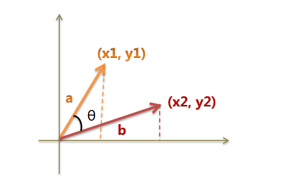
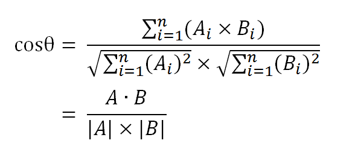

## PostgreSQL结合余弦、线性相关算法 在文本、图片、数组相似 等领域的应用 - 3 rum, smlar应用场景分析  
##### [TAG 15](../class/15.md)
           
### 作者    
digoal      
    
### 日期      
2017-01-16           
           
### 标签     
PostgreSQL , 文本相似性分析 , tf , idf , tf-idf , tag , 相关性 , 余弦相关性 , 线性相关性 , 关键词 , tfidf向量 , rum , smlar , cosine              
           
----       
                                     
## 背景  
前面介绍了tf-idf算法，以及它在文本分析中的应用(提取关键词)，参考如下。  
  
[《文本(关键词)分析 - TF(Term Frequency 词频) IDF(Inverse Document Frequency 逆向文本频率)》](./20170116_02.md)   
  
[《PostgreSQL 与 tf-idf 文本相似算法》](./20170116_03.md)   
  
除了提取文章的关键词，另外一方面，比较两篇文本的相似性也是一个比较常见的应用，例如在搜索引擎中，比如，"Google新闻"在主新闻下方，还提供多条相似的新闻。  
  
    
  
引自 http://www.ruanyifeng.com/blog/2013/03/cosine_similarity.html   
  
那么如何才能找到 "相似" 的文本呢？  
  
注意我这里必须要解释一下相似的几个不同场景，否则很容易误入魔道。  
  
1\. 打个比方，很多人写作文，会引用一些名人名句，那么这些引用了同样的名人名句的文章他们具有相似性吗？  
  
2\. 小时候估计很多小朋友都抄过作业，甚至有一些考试的时候，会出现一模一样的卷子，答案完全一致。他们相似吗？  
  
3\. 老师带小朋友出去春游，回来叫大伙写春游游记，大家写的内容可能大致上差不多，这些文章相似吗？  
  
其实以上三个问题，都是相似性问题，只是要找出他们，用到的方法可能不一样（或者说面向它们的算法可以不一样，以提升效率）。  
  
1\. 文章的部分内容相似，包含了一模一样的词句，这个其实是全文检索的范畴，比如我搜一下哪些文章用到了这些名人名句。  
  
在PostgreSQL中，我们可以使用tsvector, tsquery, gist/gin/rum索引来实现高效的全文检索  
  
[《PostgreSQL 全文检索加速 快到没有朋友 - RUM索引接口(潘多拉魔盒)》](../201610/20161019_01.md)    
  
[《从难缠的模糊查询聊开 - PostgreSQL独门绝招之一 GIN , GiST , SP-GiST , RUM 索引原理与技术背景》](../201612/20161231_01.md)  
  
[《聊一聊双十一背后的技术 - 分词和搜索》](../201611/20161115_01.md)    
  
[《聊一聊双十一背后的技术 - 毫秒分词算啥, 试试正则和相似度》](../201611/20161118_01.md)   
  
2\. 完全一致的文本，其实通过文本的HASH值上的b-tree或hash index，可以快速的搜索到。  
  
```  
postgres=# create table t1(id int, info text, hashval int);  
CREATE TABLE  
  
postgres=# create or replace function tg() returns trigger as $$  
declare  
begin  
  NEW.hashval := hashtext(NEW.info);  
  return NEW;    
end;  
$$ language plpgsql strict;  
  
postgres=# create trigger tg before insert or update on t1 for each row execute procedure tg();  
CREATE TRIGGER  
  
postgres=# insert into t1(id,info) values (1,'test');  
INSERT 0 1  
postgres=# select * from t1;  
 id | info |  hashval     
----+------+------------  
  1 | test | 1771415073  
(1 row)  
  
postgres=# update t1 set info='a';  
UPDATE 1  
postgres=# select * from t1;  
 id | info |  hashval     
----+------+------------  
  1 | a    | 1075015857  
(1 row)  
  
postgres=# create index idx on t1(hashval);  
CREATE INDEX  
```  
  
3\. 小朋友们写的春游游记，看起来肯定不一样，但是大家可能都会体现一些共同点，比如游玩中遇到的一些事情，看到的一些风景啥。  
  
如果使用TF-IDF算法来提取小朋友们的文章关键词，那么是不是可以通过文章关键词来对比不同文章的相似性呢？  
  
（建议TF使用相对频率（出现次数/全文总词组(计算重复值)数），避免因为文章长短带来的差异）  
  
所以第三个问题变成了关键词的相似性计算方法。  
  
我们首先来了解几种相似性算法。  
  
## 1 线性相关性  
1801年，意大利天文学家朱赛普·皮亚齐发现了第一颗小行星谷神星。  
  
经过40天的跟踪观测后，由于谷神星运行至太阳背后，使得皮亚齐失去了谷神星的位置。  
  
随后全世界的科学家利用皮亚齐的观测数据开始寻找谷神星，但是根据大多数人计算的结果来寻找谷神星都没有果。  
  
时年24岁的高斯也计算了谷神星的轨道。奥地利天文学家海因里希·奥尔伯斯根据高斯计算出来的轨道重新发现了谷神星。   
  
这是一个线性回归分析linear regression, 最小二乘法least-squares-fit的小故事。  
  
背景知识参考：  
  
https://en.wikipedia.org/wiki/Correlation_coefficient  
  
https://en.wikipedia.org/wiki/Correlation_and_dependence  
  
https://en.wikipedia.org/wiki/Coefficient_of_determination  
  
线性回归分析，除了用于天文，其实还有很多应用，比如金融预测，天气预报，疾病预测等。  
  
下面我给了一些在PostgreSQL中使用一元、多元回归的应用例子。  
  
[《用PostgreSQL了解一些统计学术语以及计算方法和表示方法 - 1》](../201503/20150303_02.md)    
  
[《PostgreSQL aggregate function 2 : Aggregate Functions for Statistics》](../201503/20150303_03.md)    
  
[《在PostgreSQL中用线性回归分析(linear regression) - 实现数据预测》](../201503/20150303_01.md)    
  
[《PostgreSQL 线性回归 - 股价预测 1》](../201503/20150304_01.md)    
  
[《在PostgreSQL中用线性回归分析linear regression做预测 - 例子2, 预测未来数日某股收盘价》](../201503/20150305_01.md)   
  
[《PostgreSQL 统计信息之 - 逻辑与物理存储的线性相关性》](../201502/20150228_01.md)    
  
[《PostgreSQL 计算 任意类型 字段之间的线性相关性》](../201604/20160403_01.md)    
  
那么线性回归和文本相似性分析有什么关系吗？  
  
我个人理解，它也可以用于计算两个相似tf-idf向量的相关性，通过相关性来判断他们的相似性。  
  
算出来的相关性越接近1，越相似。  
  
比如：  
  
```  
文本A关键词tf-idf向量(注意TF使用相对频率)  
[('中国', 0.7), ('崛起', 0.9), ('星球大战', 1.3), ('化学', 0.5)]  
  
  
文本B关键词tf-idf向量  
[('美国', 0.7), ('金融危机', 0.9), ('星球大战', 1.3), ('化学', 0.5)]  
```  
  
但是它们的关键词并不完全重叠，所以有两种修正方法。  
  
1\. 求相交关键词的相关性，同时使用加权进行修正（如通过相交集的分值占比，或者元素个数占比来加权）。  
  
相交线性相关计算的是以下两组值的线性相关性=1  
  
```  
('星球大战', 1.3), ('化学', 0.5) && ('星球大战', 1.3), ('化学', 0.5)  
```  
  
2\. 将两篇文章的关键词取并集，然后在对应的文本中继续取出其词语的tf-idf值，得到两组向量，再计算两组向量的相关性。  
  
例如  
  
```  
文本A  
('中国', 0.7), ('崛起', 0.9), ('星球大战', 1.3), ('化学', 0.5), ('美国', 0.0001), ('金融危机', 0)  
  
文本B  
('美国', 0.7), ('金融危机', 0.9), ('星球大战', 1.3), ('化学', 0.5), ('中国', 0), ('崛起', 0)  
  
按文本排序后取相关性  
('中国', 0.7), ('崛起', 0.9), ('星球大战', 1.3), ('化学', 0.5), ('美国', 0.0001), ('金融危机', 0)  
('中国', 0), ('崛起', 0), ('星球大战', 1.3), ('化学', 0.5), ('美国', 0.7), ('金融危机', 9)  
```  
  
SQL如下  
  
```  
postgres=# select corr(x,y) from (values (0.7,0),(0.9,0),(1.3,1.3),(0.5,0.5),(0.0001,0.7),(0,9)) t(x,y);  
        corr          
--------------------  
 -0.509740523766277  
(1 row)  
```  
  
3\. 如果你觉得并集的确实关键词的TF-IDF不好取，也可以用0直接代替缺失词的tf-idf。  
  
最简单的还是直接求交集的相关性，索引实现也比较简单，然后使用加权。  
  
## 2 文本的相似性算法 - TOP N 词汇tf-idf的余弦相似  
除了线性相关，还有一种方法计算文本相似性：余弦相似算法  
  
同样需要提取关键词的TF-IDF值向量，然后对两组相交向量进行计算，因此依旧需要通过相交集的分值占比，或者元素个数占比来加权进行修正。  
    
背景知识  
  
http://www.ruanyifeng.com/blog/2013/03/cosine_similarity.html  
  
http://en.wikipedia.org/wiki/Cosine_similarity  
  
下面的例子取自  
  
http://www.ruanyifeng.com/blog/2013/03/cosine_similarity.html  
  
为了简单起见，我们先从句子着手。  
  
```  
　　句子A：我喜欢看电视，不喜欢看电影。  
　　句子B：我不喜欢看电视，也不喜欢看电影。  
```  
  
请问怎样才能计算上面两句话的相似程度？  
  
基本思路是：如果这两句话的用词越相似，它们的内容就应该越相似。因此，可以从词频入手，计算它们的相似程度。  
  
第一步，分词。  
  
```  
　　句子A：我/喜欢/看/电视，不/喜欢/看/电影。  
　　句子B：我/不/喜欢/看/电视，也/不/喜欢/看/电影。  
```  
  
第二步，列出所有的词。  
  
```  
　　我，喜欢，看，电视，电影，不，也。  
```  
  
第三步，计算词频。  
  
```  
　　句子A：我 1，喜欢 2，看 2，电视 1，电影 1，不 1，也 0。  
　　句子B：我 1，喜欢 2，看 2，电视 1，电影 1，不 2，也 1。  
```  
  
第四步，写出词频向量，注意对齐关键词。  
  
```  
　　句子A：[1, 2, 2, 1, 1, 1, 0]  
　　句子B：[1, 2, 2, 1, 1, 2, 1]  
```  
  
到这里，问题就变成了如何计算这两个向量的相似程度。  
  
假定a向量是[x1, y1]，b向量是[x2, y2]，那么可以将余弦定理改写成下面的形式：  
  
  
  
  
  
数学家已经证明，余弦的这种计算方法对n维向量也成立。假定A和B是两个n维向量，A是 [A1, A2, ..., An] ，B是 [B1, B2, ..., Bn] ，则A与B的夹角θ的余弦等于：  
  
  
  
使用这个公式，我们就可以得到，句子A与句子B的夹角的余弦。  
  
  
  
余弦值越接近1，就表明夹角越接近0度，也就是两个向量越相似，这就叫"余弦相似性"。所以，上面的句子A和句子B是很相似的，事实上它们的夹角大约为20.3度。  
  
由此，我们就得到了"找出相似文章"的一种算法：  
  
```  
　　（1）使用TF-IDF算法，找出两篇文章的关键词；  
　　（2）每篇文章各取出若干个关键词（比如20个），合并成一个集合，计算每篇文章对于这个集合中的词的词频（为了避免文章长度的差异，可以使用相对词频TF）；  
　　（3）生成两篇文章各自的词频向量；  
　　（4）计算两个向量的余弦相似度，值越大就表示越相似。  
```  
  
"余弦相似度"是一种非常有用的算法，只要是计算两个向量的相似程度，都可以采用它。  
  
## 数据库应用 tf-idf文本相似性在数据库中的应用  
### 1 smlar 插件  
  
[《PostgreSQL 与 tf-idf 文本相似算法》](./20170116_03.md) 一文介绍了使用smlar实现数组的快速相似性检索。  
  
其原理与余弦近似的算法类似，同时还允许用户自定义相似度公式。  
  
但是目前仅支持内置类型数组的gin,gist索引，也就是说针对自定义数据类型的数组，不能使用索引进行检索。  
  
例如  
  
```  
create type tp as (word text, tfidf float4);  
tp[]  数组暂时还不能使用索引来查询近似度。  
```  
  
#### 小结  
目前，smlar更适合于非复合类型（即内置类型数组）的检索，比如属性固定的相似度检索。  
  
例如已经抽象好了固定的1000个属性，每行代表一个对象，存储了这个对象的每个属性的打分。  
  
比如标签类应用，通过标签向量的近似度，找出相似人群。  
  
```  
row1: id=1, val=array[1.0,0.9,100.78,.......第1000个属性的打分]  
....  
rown: id=n, val=array[0,0,1,2,2,2,2.......第1000个属性的打分]  
```  
  
又比如图像像素点的RGB值，每张图像的大小一致，可以通过像素点向量进行相似度比较。  
  
当然，它也支持其他内置类型数组的相似度比较，只是元素没有权重!!!!!，正如我前面说的，你要TF-IDF，暂时没门。  
  
PS:    
  
如果我们扩展smlar这个插件，让它的复合类型数组能支持gin, gist索引的话，它的适用范围就更加广阔了。  
  
在应用中算出关键词以及tf-idf，作为复合类型的向量数组，将其数组内容存入数据库，在数据库中只需要计算两组向量的相似性。（这个支持索引会不会很强大呢）  
  
smlar插件还有很大的潜力可挖掘。  
  
### 2 rum 插件  
通过关键词计算文本的相似性是一种简化的方法，精确度不一定高。  
  
还有一种方法，比对整篇文章的相似性，PostgreSQL的rum插件提供了这种能力，当然它实际上也支持关键词的手段。  
  
关于整篇文章的用法就不介绍了，就是普通的用法  
  
```  
CREATE EXTENSION rum;  
CREATE TABLE test_rum(t text, a tsvector);  
  
CREATE TRIGGER tsvectorupdate  
BEFORE UPDATE OR INSERT ON test_rum  
FOR EACH ROW EXECUTE PROCEDURE tsvector_update_trigger('a', 'pg_catalog.english', 't');  
  
INSERT INTO test_rum(t) VALUES ('The situation is most beautiful');  
INSERT INTO test_rum(t) VALUES ('It is a beautiful');  
INSERT INTO test_rum(t) VALUES ('It looks like a beautiful place');  
CREATE INDEX rumidx ON test_rum USING rum (a rum_tsvector_ops);  
  
SELECT t, a <=> to_tsquery('english', 'beautiful | place') AS rank  
    FROM test_rum  
    WHERE a @@ to_tsquery('english', 'beautiful | place')  
    ORDER BY a <=> to_tsquery('english', 'beautiful | place');  
                t                |   rank  
---------------------------------+-----------  
 The situation is most beautiful | 0.0303964  
 It is a beautiful               | 0.0303964  
 It looks like a beautiful place | 0.0607927  
(3 rows)  
  
SELECT t, a <=> to_tsquery('english', 'place | situation') AS rank  
    FROM test_rum  
    WHERE a @@ to_tsquery('english', 'place | situation')  
    ORDER BY a <=> to_tsquery('english', 'place | situation');  
                t                |   rank  
---------------------------------+-----------  
 The situation is most beautiful | 0.0303964  
 It looks like a beautiful place | 0.0303964  
(2 rows)  
  
排序和@@都支持索引  
                               QUERY PLAN                                 
------------------------------------------------------------------------  
 Index Scan using rumidx on test_rum  (cost=2.00..4.01 rows=1 width=36)  
   Index Cond: (a @@ '''place'' | ''situat'''::tsquery)  
   Order By: (a <=> '''place'' | ''situat'''::tsquery)  
(3 rows)  
```  
  
使用全文比较的好处当然是准确度更高，但是带来一个问题，需要存储更多的词，消耗更多的存储空间，同时效率会有所下降（相比只存储关键词时）。  
  
下面以关键词为例，介绍rum插件和关键词结合的用法     
  
（因为tsvector里面不存储tf-idf，所以我们这里需要存储的是词频）  
  
```  
文本A表示中国、日本、希腊分别出现了6次，火腿肠出现了2次  
(在PostgreSQL中可以使用ts_stat函数得到词频。)  
  
tsvector $$'中国':1,2,3,4,5,6 '日本':1,2,3,4,5,6 '希腊':1,2,3,4,5,6 '火腿肠':1,2$$  
  
postgres=# select tsvector $$'中国':1,2,3,4,5,6 '日本':1,2,3,4,5,6 '希腊':1,2,3,4,5,6 '火腿肠':1,2$$;  
                               tsvector                                  
-----------------------------------------------------------------------  
 '中国':1,2,3,4,5,6 '希腊':1,2,3,4,5,6 '日本':1,2,3,4,5,6 '火腿肠':1,2  
(1 row)  
```  
  
表结构如下(假设你已经将数据如上格式存入了tbl_test表的info字段)  
  
```  
create table tbl_test(id int, info tsvector, doc text);  
  
create index rumidx_tbl_test ON tbl_test USING rum (info rum_tsvector_ops);  
```  
  
接下来要做的是查询相似性(rank)  
  
使用rum查出相似的文本，程序的输入就是tsquery，使用|拼装即可。  
  
(注意, 因为tsquery没有权重信息，所以输入时不支持权重或TF，因此RUM插件的方法计算的ts_rank并不是通过余弦相似的算法计算的，至少目前并不是这样)  
  
虽然不支持权重，但是你可以输入重复值，来加重这个词的比重  
  
```  
SELECT id, info <=> to_tsquery('english', 'beautiful | place') AS rank  
    FROM tbl_test  
    WHERE info @@ to_tsquery('english', 'beautiful | place')  
    ORDER BY info <=> to_tsquery('english', 'beautiful | place') limit 1;  
```  
  
加重place比重  
  
```  
SELECT id, info <=> to_tsquery('english', 'beautiful | place | place | place | place') AS rank  
    FROM tbl_test  
    WHERE info @@ to_tsquery('english', 'beautiful | place')  
    ORDER BY info <=> to_tsquery('english', 'beautiful | place | place | place | place') limit 1;  
```  
  
rum同样支持不同的rank算法，使用一个整数来表示，他们可以相加(1~32)  
  
```  
#define RANK_NO_NORM                    0x00  
#define RANK_NORM_LOGLENGTH             0x01  
#define RANK_NORM_LENGTH                0x02  
#define RANK_NORM_EXTDIST               0x04  
#define RANK_NORM_UNIQ                  0x08  
#define RANK_NORM_LOGUNIQ               0x10  
#define RANK_NORM_RDIVRPLUS1    0x20  
#define DEF_NORM_METHOD                 RANK_NO_NORM  
```  
  
算法的差异，具体要参考rum/src/rum_ts_utils.c代码，看看加了这些值后，算法有什么差异。  
  
使用自定义method的QUERY 例如 :   
  
```  
SELECT id, info <=> (to_tsquery('english', 'beautiful | place'), 1) AS rank  
    FROM tbl_test  
    WHERE info @@ to_tsquery('english', 'beautiful | place')  
    ORDER BY info <=> (to_tsquery('english', 'beautiful | place'), 1) limit 1;  
```  
  
同时我们也可以使用传统的PostgreSQL rank计算值进行排序（只不过按传统的rank排序不支持索引）  
  
```  
SELECT id, ts_rank(info , to_tsquery('english', 'beautiful | place')) AS rank  
    FROM tbl_test  
    WHERE info @@ to_tsquery('english', 'beautiful | place')  
    ORDER BY rank limit 1;  
```  
  
如果要让rum支持使用关键词的话，用起来有点繁琐，rum的TODO里已经说了，接下来会引入TF-IDF，以后用起来就不繁琐了。  
  
```  
Allow multiple additional information (lexemes positions + timestamp).  
Add support for arrays.  
Improve ranking function to support TF/IDF.  
Improve insert time.  
Improve GENERIC WAL to support shift (PostgreSQL core changes).  
```  
  
性能测试 (1000万测试数据，每条记录33个关键词)  
  
```
-- 用于拆分字符
create extension pg_trgm;

postgres=# create unlogged table tbl_test(id int, info text, key tsvector);
CREATE TABLE
postgres=# insert into tbl_test select id, info , array_to_tsvector(show_trgm(info)) from (select generate_series(1,10000000) as id, md5(random()::text) as info) t;
INSERT 0 10000000
postgres=# select * from tbl_test limit 10;
 id |               info               |                                                                                                  key                                       
----+----------------------------------+----------------------------------------------------------------------------------------------------------------------------------------------------------------------
  1 | 5a544e38037442839b906b75774c5bbc | '  5' ' 5a' '037' '06b' '283' '374' '380' '39b' '428' '442' '44e' '4c5' '4e3' '544' '577' '5a5' '5bb' '6b7' '744' '74c' '757' '774' '803' '839' '906' '9b9' 'a54' 'b75' 'b90' 'bbc' 'bc ' 'c5b' 'e38'
  2 | c6ebb12bd89c81d846e820622c8b71e2 | '  c' ' c6' '062' '12b' '1d8' '1e2' '206' '22c' '2bd' '2c8' '46e' '622' '6e8' '6eb' '71e' '81d' '820' '846' '89c' '8b7' '9c8' 'b12' 'b71' 'bb1' 'bd8' 'c6e' 'c81' 'c8b' 'd84' 'd89' 'e2 ' 'e82' 'ebb'
  3 | 81a366dac5a676da4e25cce95fbc1395 | '  8' ' 81' '139' '1a3' '25c' '366' '395' '4e2' '5a6' '5cc' '5fb' '66d' '676' '6da' '76d' '81a' '95 ' '95f' 'a36' 'a4e' 'a67' 'ac5' 'bc1' 'c13' 'c5a' 'cce' 'ce9' 'da4' 'dac' 'e25' 'e95' 'fbc'
  4 | 4e176d69aa00ccafd40f164c2b6cace6 | '  4' ' 4e' '00c' '0cc' '0f1' '164' '176' '2b6' '40f' '4c2' '4e1' '64c' '69a' '6ca' '6d6' '76d' '9aa' 'a00' 'aa0' 'ace' 'afd' 'b6c' 'c2b' 'cac' 'caf' 'cca' 'ce6' 'd40' 'd69' 'e17' 'e6 ' 'f16' 'fd4'
  5 | 52d64e23ec7c0a2f266465190f5b5324 | '  5' ' 52' '0a2' '0f5' '190' '23e' '24 ' '266' '2d6' '2f2' '324' '3ec' '465' '4e2' '519' '52d' '532' '5b5' '646' '64e' '651' '664' '7c0' '90f' 'a2f' 'b53' 'c0a' 'c7c' 'd64' 'e23' 'ec7' 'f26' 'f5b'
  6 | 8acf675cd236a28a2576738d299622f0 | '  8' ' 8a' '22f' '236' '257' '28a' '299' '2f0' '36a' '38d' '576' '5cd' '622' '673' '675' '6a2' '738' '75c' '767' '8a2' '8ac' '8d2' '962' '996' 'a25' 'a28' 'acf' 'cd2' 'cf6' 'd23' 'd29' 'f0 ' 'f67'
  7 | b1e0cb8abd4d86ad3f62857e23bcd05b | '  b' ' b1' '05b' '0cb' '1e0' '23b' '285' '3bc' '3f6' '4d8' '57e' '5b ' '628' '6ad' '7e2' '857' '86a' '8ab' 'abd' 'ad3' 'b1e' 'b8a' 'bcd' 'bd4' 'cb8' 'cd0' 'd05' 'd3f' 'd4d' 'd86' 'e0c' 'e23' 'f62'
  8 | 40e000ff92420bb2d4134afcd3772f72 | '  4' ' 40' '000' '00f' '0bb' '0e0' '0ff' '134' '20b' '242' '2d4' '2f7' '34a' '377' '40e' '413' '420' '4af' '72 ' '72f' '772' '924' 'afc' 'b2d' 'bb2' 'cd3' 'd37' 'd41' 'e00' 'f72' 'f92' 'fcd' 'ff9'
  9 | bf8c857ef7b37e5e5c914044ecb2c844 | '  b' ' bf' '044' '140' '2c8' '37e' '404' '44 ' '44e' '4ec' '57e' '5c9' '5e5' '7b3' '7e5' '7ef' '844' '857' '8c8' '914' 'b2c' 'b37' 'bf8' 'c84' 'c85' 'c91' 'cb2' 'e5c' 'e5e' 'ecb' 'ef7' 'f7b' 'f8c'
 10 | d3f86ec1cf6458b21cb0aa3a712adb59 | '  d' ' d3' '0aa' '12a' '1cb' '1cf' '21c' '2ad' '3a7' '3f8' '458' '58b' '59 ' '645' '6ec' '712' '86e' '8b2' 'a3a' 'a71' 'aa3' 'adb' 'b0a' 'b21' 'b59' 'c1c' 'cb0' 'cf6' 'd3f' 'db5' 'ec1' 'f64' 'f86'
(10 rows)


创建索引
postgres=# set maintenance_work_mem='16GB';
SET
postgres=# CREATE INDEX rumidx_tbl_test ON tbl_test USING rum (key rum_tsvector_ops);


查询性能
postgres=# explain (analyze,verbose,timing,costs,buffers) select id, info, key <=> tsquery '037 & 06b & 283 & 374 & 380', ts_rank(key, tsquery '28a | 3f6') from tbl_test where key @@ tsquery '037 | 06b | 283 | 374 | 380' order by key <=> tsquery '037 | 06b | 283 | 374 | 380' limit 10;

 Limit  (cost=30.00..37.68 rows=10 width=49) (actual time=548.738..548.789 rows=10 loops=1)
   Output: id, info, ((key <=> '''037'' & ''06b'' & ''283'' & ''374'' & ''380'''::tsquery)), (ts_rank(key, '''28a'' | ''3f6'''::tsquery)), ((key <=> '''037'' | ''06b'' | ''283'' | ''374'' | ''380'''::tsquery))
   Buffers: shared hit=259, temp read=1 written=965
   ->  Index Scan using rumidx_tbl_test on public.tbl_test  (cost=30.00..227918.75 rows=296609 width=49) (actual time=548.735..548.783 rows=10 loops=1)
         Output: id, info, (key <=> '''037'' & ''06b'' & ''283'' & ''374'' & ''380'''::tsquery), ts_rank(key, '''28a'' | ''3f6'''::tsquery), (key <=> '''037'' | ''06b'' | ''283'' | ''374'' | ''380'''::tsquery)
         Index Cond: (tbl_test.key @@ '''037'' | ''06b'' | ''283'' | ''374'' | ''380'''::tsquery)
         Order By: (tbl_test.key <=> '''037'' | ''06b'' | ''283'' | ''374'' | ''380'''::tsquery)
         Buffers: shared hit=259, temp read=1 written=965
 Planning time: 0.253 ms
 Execution time: 552.221 ms
(10 rows)
```
  
#### 小结  
不管是smlar或者rum，目前对文本的关键词向量化相似查询都有一定的缺陷，smlar目前更适合固定属性的属性值组成的数据的相似查询。  
  
rum的算法并不是余弦向量化算法，虽然它也支持相似查询，但是如果你就认准了向量化的算法，那还是等等吧。  
  
个人还是倾向使用smlar插件，你可以先不加tf-idf权重，将关键词存成数组即可，如下:     
  
```
create unlogged table tbl_doc (id int, info text, arr text[]); 

插入1000万记录
insert into tbl_doc select id, info , show_trgm(info) from (select generate_series(1,10000000) as id, md5(random()::text) as info) t;

set maintenance_work_mem='16GB';

create index on tbl_doc using gist ( arr _text_sml_ops );

set smlar.threshold=0.9;
set smlar.type='cosine';
explain (analyze,verbose,timing,costs,buffers) 
  select  
    *,  
    smlar( arr, '{32e,476,48f,504,532}'::text[] )  
  from  
    tbl_doc  
  where  
    arr % '{32e,476,48f,504,532}'::text[] -- where cosine similarity >= smlar.threshold  
  order by  
    smlar( arr, '{32e,476,48f,504,532}'::text[] ) desc  
  limit 10;  

 Limit  (cost=10541.51..10541.54 rows=10 width=328) (actual time=81.511..81.511 rows=0 loops=1)
   Output: id, info, arr, (smlar(arr, '{32e,476,48f,504,532}'::text[]))
   Buffers: shared hit=14286
   ->  Sort  (cost=10541.51..10566.51 rows=10000 width=328) (actual time=81.509..81.509 rows=0 loops=1)
         Output: id, info, arr, (smlar(arr, '{32e,476,48f,504,532}'::text[]))
         Sort Key: (smlar(tbl_doc.arr, '{32e,476,48f,504,532}'::text[])) DESC
         Sort Method: quicksort  Memory: 25kB
         Buffers: shared hit=14286
         ->  Index Scan using tbl_doc_arr_idx on public.tbl_doc  (cost=0.42..10325.42 rows=10000 width=328) (actual time=81.500..81.500 rows=0 loops=1)
               Output: id, info, arr, smlar(arr, '{32e,476,48f,504,532}'::text[])
               Index Cond: (tbl_doc.arr % '{32e,476,48f,504,532}'::text[])
               Buffers: shared hit=14286
 Planning time: 0.128 ms
 Execution time: 81.603 ms
(14 rows)


命中1条
explain (analyze,verbose,timing,costs,buffers) 
  select  
    *,  
    smlar( arr, '{048,06f,293,2e6,32e,476,48f,504,532,647,6ad,6b5,6f5,764,76b,8fe,929,"93 ",a92,ada,b53,bbd,bdf,da9,dff,e6a,ebb,f50,f76,feb,ff7}'::text[] )  
  from  
    tbl_doc  
  where  
    arr % '{048,06f,293,2e6,32e,476,48f,504,532,647,6ad,6b5,6f5,764,76b,8fe,929,"93 ",a92,ada,b53,bbd,bdf,da9,dff,e6a,ebb,f50,f76,feb,ff7}'::text[] -- where cosine similarity >= smlar.threshold  
  order by  
    smlar( arr, '{048,06f,293,2e6,32e,476,48f,504,532,647,6ad,6b5,6f5,764,76b,8fe,929,"93 ",a92,ada,b53,bbd,bdf,da9,dff,e6a,ebb,f50,f76,feb,ff7}'::text[] ) desc  
  limit 10;

 Limit  (cost=10541.51..10541.54 rows=10 width=328) (actual time=100.819..100.821 rows=1 loops=1)
   Output: id, info, arr, (smlar(arr, '{048,06f,293,2e6,32e,476,48f,504,532,647,6ad,6b5,6f5,764,76b,8fe,929,"93 ",a92,ada,b53,bbd,bdf,da9,dff,e6a,ebb,f50,f76,feb,ff7}'::text[]))
   Buffers: shared hit=11814
   ->  Sort  (cost=10541.51..10566.51 rows=10000 width=328) (actual time=100.817..100.818 rows=1 loops=1)
         Output: id, info, arr, (smlar(arr, '{048,06f,293,2e6,32e,476,48f,504,532,647,6ad,6b5,6f5,764,76b,8fe,929,"93 ",a92,ada,b53,bbd,bdf,da9,dff,e6a,ebb,f50,f76,feb,ff7}'::text[]))
         Sort Key: (smlar(tbl_doc.arr, '{048,06f,293,2e6,32e,476,48f,504,532,647,6ad,6b5,6f5,764,76b,8fe,929,"93 ",a92,ada,b53,bbd,bdf,da9,dff,e6a,ebb,f50,f76,feb,ff7}'::text[])) DESC
         Sort Method: quicksort  Memory: 25kB
         Buffers: shared hit=11814
         ->  Index Scan using tbl_doc_arr_idx on public.tbl_doc  (cost=0.42..10325.42 rows=10000 width=328) (actual time=8.186..100.801 rows=1 loops=1)
               Output: id, info, arr, smlar(arr, '{048,06f,293,2e6,32e,476,48f,504,532,647,6ad,6b5,6f5,764,76b,8fe,929,"93 ",a92,ada,b53,bbd,bdf,da9,dff,e6a,ebb,f50,f76,feb,ff7}'::text[])
               Index Cond: (tbl_doc.arr % '{048,06f,293,2e6,32e,476,48f,504,532,647,6ad,6b5,6f5,764,76b,8fe,929,"93 ",a92,ada,b53,bbd,bdf,da9,dff,e6a,ebb,f50,f76,feb,ff7}'::text[])
               Buffers: shared hit=11814
 Planning time: 0.124 ms
 Execution time: 100.914 ms
(14 rows)
```
    
threshold越大，说明相似度越高，要求越严苛，复合条件的记录就越少，速度也越快。   
   
```
-- 降低threshold，命中率过高，导致速度下降
postgres=# set smlar.threshold=0.7;
SET
postgres=# explain (analyze,verbose,timing,costs,buffers) 
  select  
    *,  
    smlar( arr, '{048,06f,293,2e6,32e,476,48f,504,532,647,6ad,6b5,6f5,764,76b,8fe,929,"93 ",a92,ada,b53,bbd,bdf,da9,dff,e6a,ebb,f50,f76,feb,ff7}'::text[] )  
  from  
    tbl_doc  
  where  
    arr % '{048,06f,293,2e6,32e,476,48f,504,532,647,6ad,6b5,6f5,764,76b,8fe,929,"93 ",a92,ada,b53,bbd,bdf,da9,dff,e6a,ebb,f50,f76,feb,ff7}'::text[] -- where cosine similarity >= smlar.threshold  
  order by  
    smlar( arr, '{048,06f,293,2e6,32e,476,48f,504,532,647,6ad,6b5,6f5,764,76b,8fe,929,"93 ",a92,ada,b53,bbd,bdf,da9,dff,e6a,ebb,f50,f76,feb,ff7}'::text[] ) desc  
  limit 1;
                                                                                         QUERY PLAN                                                                                         
--------------------------------------------------------------------------------------------------------------------------------------------------------------------------------------------
 Limit  (cost=10375.42..10375.42 rows=1 width=328) (actual time=5225.751..5225.752 rows=1 loops=1)
   Output: id, info, arr, (smlar(arr, '{048,06f,293,2e6,32e,476,48f,504,532,647,6ad,6b5,6f5,764,76b,8fe,929,"93 ",a92,ada,b53,bbd,bdf,da9,dff,e6a,ebb,f50,f76,feb,ff7}'::text[]))
   Buffers: shared hit=207298
   ->  Sort  (cost=10375.42..10400.42 rows=10000 width=328) (actual time=5225.749..5225.749 rows=1 loops=1)
         Output: id, info, arr, (smlar(arr, '{048,06f,293,2e6,32e,476,48f,504,532,647,6ad,6b5,6f5,764,76b,8fe,929,"93 ",a92,ada,b53,bbd,bdf,da9,dff,e6a,ebb,f50,f76,feb,ff7}'::text[]))
         Sort Key: (smlar(tbl_doc.arr, '{048,06f,293,2e6,32e,476,48f,504,532,647,6ad,6b5,6f5,764,76b,8fe,929,"93 ",a92,ada,b53,bbd,bdf,da9,dff,e6a,ebb,f50,f76,feb,ff7}'::text[])) DESC
         Sort Method: quicksort  Memory: 25kB
         Buffers: shared hit=207298
         ->  Index Scan using tbl_doc_arr_idx on public.tbl_doc  (cost=0.42..10325.42 rows=10000 width=328) (actual time=4166.966..5225.730 rows=1 loops=1)
               Output: id, info, arr, smlar(arr, '{048,06f,293,2e6,32e,476,48f,504,532,647,6ad,6b5,6f5,764,76b,8fe,929,"93 ",a92,ada,b53,bbd,bdf,da9,dff,e6a,ebb,f50,f76,feb,ff7}'::text[])
               Index Cond: (tbl_doc.arr % '{048,06f,293,2e6,32e,476,48f,504,532,647,6ad,6b5,6f5,764,76b,8fe,929,"93 ",a92,ada,b53,bbd,bdf,da9,dff,e6a,ebb,f50,f76,feb,ff7}'::text[])
               Buffers: shared hit=207298
 Planning time: 0.128 ms
 Execution time: 5226.033 ms
(14 rows)
```
  
INT8数组例子  
  
```
create unlogged table test (id serial, arr int8[]); 

插入5000万记录，要求如下

int8 取值范围1~1000万 

int8[] 数组长度 11 ~ 50 

create or replace function f() returns void as $$
declare
begin
  for i in 11..50 loop
    insert into test (arr) select array_agg((10000000*random())::int8) from generate_series(1,i);
  end loop;
end;
$$ language plpgsql strict;

写入测试数据
vi test.sql
select f();

pgbench -M prepared -n -r -P 1 -f ./test.sql -c 100 -j 100 -t 12500

创建索引
set maintenance_work_mem='16GB';

create index on test using gist ( arr _int8_sml_ops );

or

create index on test using gin ( arr _int8_sml_ops );

测试
set smlar.threshold=0.9; 
set smlar.type='cosine'; 
-- set smlar.type='overlap'; 
-- set smlar.type='tfidf'; 

select arr from test limit 100;

explain (analyze,verbose,timing,costs,buffers) 
  select  
    *,  
    smlar( arr, '{}'::int8[] )  
  from  
    test  
  where  
    arr % '{}'::int8[]                -- where cosine similarity >= smlar.threshold  
  order by  
    smlar( arr, '{}'::int8[] ) desc  
  limit 10;  
```
      
smlar用法详解参考    
  
[《PostgreSQL 与 tf-idf 文本相似算法》](./20170116_03.md)     
    
## 参考  
[《文本(关键词)分析 - TF(Term Frequency 词频) IDF(Inverse Document Frequency 逆向文本频率)》](./20170116_02.md)   
  
[《PostgreSQL 与 tf-idf 文本相似算法》](./20170116_03.md)   
  
[《PostgreSQL 统计信息之 - 逻辑与物理存储的线性相关性》](../201502/20150228_01.md)    
  
[《PostgreSQL 计算 任意类型 字段之间的线性相关性》](../201604/20160403_01.md)    
  
http://www.ruanyifeng.com/blog/2013/03/cosine_similarity.html  
  
http://en.wikipedia.org/wiki/Cosine_similarity  
  
https://en.wikipedia.org/wiki/Correlation_coefficient  
  
https://en.wikipedia.org/wiki/Correlation_and_dependence  
  
https://en.wikipedia.org/wiki/Coefficient_of_determination  
  
数据挖掘-基于贝叶斯算法及KNN算法的newsgroup18828文本分类器的JAVA实现  
  
http://blog.csdn.net/yangliuy/article/details/7400984  
  
http://blog.csdn.net/yangliuy/article/details/7401142  
  
http://www.ruanyifeng.com/blog/2013/03/cosine_similarity.html  
  
                                                                              
                              
  
  
  
  
  
  
  
  
  
  
  
  
  
#### [免费领取阿里云RDS PostgreSQL实例、ECS虚拟机](https://free.aliyun.com/ "57258f76c37864c6e6d23383d05714ea")
  
  
#### [digoal's PostgreSQL文章入口](https://github.com/digoal/blog/blob/master/README.md "22709685feb7cab07d30f30387f0a9ae")
  
  

  
  
#### 老婆的钱袋子：可以打赏哦^_^  

  
