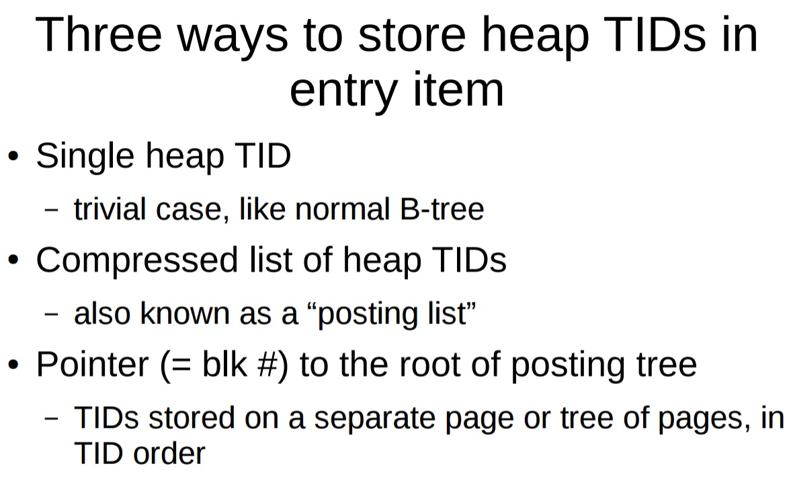
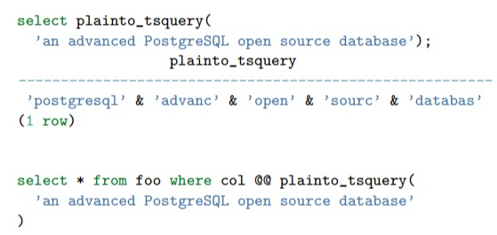
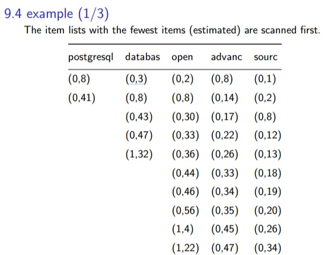
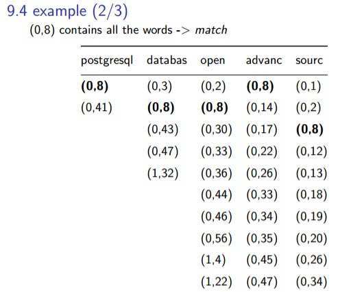
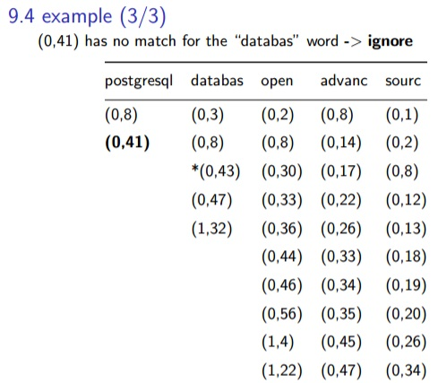

## PostgreSQL GIN multi-key search 优化       
         
### 作者         
digoal          
            
### 日期          
2017-02-03                                    
          
### 标签                                                                                                                          
PostgreSQL , gin , in , or , multi key , right link scan , skip scan       
        
----          
        
## 背景        
PostgreSQL中，有一种GIN索引，被广泛应用于多值类型，例如数组，分词，同时也被应用于模糊查询等领域。    
      
gin索引，将列(比如数组，全文检索类型)中的值拿出来，再存储到树形结构中（类似B-TREE，键值+heap行号s），对于低频值，会作为posting list直接存在树的gin的叶子节点中，而对于高频值，行号s会存储在另外树结构(posting tree)中，gin的叶子节点中存储的是指向posting tree的pointer。      
    
      
    
      
    
      
  
GIN本质上是elemet为key的树结构，而value则为"posting tree pointer"或者"posting list"。      
  
```  
Internally, a GIN index contains a B-tree index constructed over keys,   
  
where each key is an element of one or more indexed items (a member of an array, for example)   
  
and where each tuple in a leaf page contains either   
  
a pointer to a B-tree of heap pointers (a “posting tree”), /  
  
or a simple list of heap pointers (a “posting list”) when the list is small enough to fit into a single index tuple along with the key value.  
```  
  
关于GIN的一些介绍，可参考  
  
[《从难缠的模糊查询聊开 - PostgreSQL独门绝招之一 GIN , GiST , SP-GiST , RUM 索引原理与技术背景》](../201612/20161231_01.md)  
  
## posting list\tree
gin 索引的叶子节点中存储的为posting list(heap page number, itempointers)，或者posting tree(heap pointers构建的树)。   
  
那么什么时候使用list什么时候使用tree呢？  
  
因为posting list是在GIN的叶子节点里面直接存储的，所以指当heap pointers较少，小于TOAST_INDEX_TARGET时（参考自PostgreSQL数据库内核分析，基于8.4的版本编写），使用posting list.  
  
否则使用posting tree。  
  
## gin结构
    
  
    
  
可以使用pageinspect观察gin索引的内容。  
  
https://www.postgresql.org/docs/devel/static/pageinspect.html  
  
## 多值搜索例子  
多值查询，例如 where column @> aa and column @> bb and column @> cc and ....    
  
多值查询是比较常见的需求，例如有一个表存储的是店家售卖的商品ID，每个店家一行记录，其中列A为数组类型，数组中包含了这家店铺售卖的商品ID。  
  
找出有哪些店铺在售卖热水器（ID=1）、笔记本（ID=2）以及台式机（ID=3）。可以这样把你的需求告诉数据库 where column @> array[1,2,3] 或者 column @> 1 and column @> 2 and column @> 3   
  
这种查询可以使用GIN索引，由于本质上GIN还是个树结构，所以扫描方法和B-Tree实际上是相差不大的，B-Tree类似的优化手段同样适用。    
    
## 多值搜索优化  
2014-01-29, 30 提交的几个patch针对多值搜索场景进行了优化  
  
1\. where column @> aa and column @> bb and column @> cc  
  
gin 索引扫描方法是bitmap scan，也就是对gin中每一个命中KEY的posting list/tree中存储的CTID(heap行号)排序后，再开始从HEAP扫描结果。  
  
当找到了一条满足 "某一条件（如column @> aa）" 的记录后，首先对该posting list/tree里面存储的CTIDs进行排序，这个时候就得到了一个有序的ctid列表LIST-A，由于INDEX没有版本信息，所以要从HEAP搜索对应的记录，判断可见性。  
  
当可见时，这条记录的CTID-A会被用于扫描优化，也就是这个patch的优化点。  
  
另一个条件（如column @> bb），也会对该posting list/tree里面存储的CTIDs进行排序，这个时候也会得到一个有序的ctid列表LIST-B。  
  
优化点在于，当LIST-B的ctid < CTID-A时，这些LIST-B的ctid会直接跳过，不需要到HEAP进行CHECK可见性，从而减少IO操作。  
  
为什么可以跳过呢？  
  
因为gin使用了bitmap scan，所以一定是ctid的有序扫描。  
  
那么从逻辑推理角度来看，比如A条件，第一个满足条件的行号为1000，B条件的posting list/tree为(1,2,3,1000,2000)，那么1,2,3则可以直接跳过，因为它在A条件中肯定不存在。  
  
https://git.postgresql.org/gitweb/?p=postgresql.git;a=commit;h=e20c70cb0fa74d5bffa080e21a99b44bf0768667  
  
```  
Allow skipping some items in a multi-key GIN search.  
  
In a multi-key search, ie. something like "col @> 'foo' AND col @> 'bar'",  
as soon as we find the next item that matches the first criteria, we don't  
need to check the second criteria for TIDs smaller the first match. That  
saves a lot of effort, especially if one of the terms is rare, while the  
second occurs very frequently.  
  
Based on ideas from Alexander Korotkov's fast scan patch.  
```  
  
当某个条件比较罕见，而另一个条件很常见时，有立竿见影的效果。（也就是说一个有很多行记录满足条件，另一个则只有少量记录满足条件）  
  
例子(posting list/tree最小的先扫描，所以直接跳过若干ctid的扫描)  
  
  
  
  
  
  
  
  
  
2\. 依旧是multi-key的优化，优化点和1类似，对于所有tid都更小的posting list segments，连decoding都不做。  
  
https://git.postgresql.org/gitweb/?p=postgresql.git;a=commit;h=25b1dafab63f465a65c63b26834dc18857f0fa0c  
  
```  
Further optimize multi-key GIN searches.  
  
If we're skipping past a certain TID, avoid decoding posting list segments  
that only contain smaller TIDs.  
  
Extracted from Alexander Korotkov's fast scan patch, heavily modified.  
```  
  
```  
+       GinPostingList *seg = GinDataLeafPageGetPostingList(page);  
        Size        len = GinDataLeafPageGetPostingListSize(page);  
+       Pointer     endptr = ((Pointer) seg) + len;  
+       GinPostingList *next;  
+  
+       /* Skip to the segment containing advancePast+1 */  
+       if (ItemPointerIsValid(&advancePast))  
+       {  
+           next = GinNextPostingListSegment(seg);  
+           while ((Pointer) next < endptr &&  
+                  ginCompareItemPointers(&next->first, &advancePast) <= 0)  
+           {  
+               seg = next;  
+               next = GinNextPostingListSegment(seg);  
+           }  
+           len = endptr - (Pointer) seg;  
+       }  
   
-       result = ginPostingListDecodeAllSegments(ptr, len, nitems);  
+       if (len > 0)  
+           result = ginPostingListDecodeAllSegments(seg, len, nitems);  
+       else  
+       {  
+           result = NULL;  
+           *nitems = 0;  
+       }  
```  
  
3\. 跳跃扫描优化，指posting tree的扫描优化，当skip的element已经不在当前posting tree的当前page时，返回posting tree的root开始扫描。  
  
https://git.postgresql.org/gitweb/?p=postgresql.git;a=commit;h=626a120656a75bf4fe64b1d0d83c23cb38d3771a  
  
```  
Further optimize GIN multi-key searches.  
  
When skipping over some items in a posting tree, re-find the new location  
by descending the tree from root, rather than walking the right links.  
This can save a lot of I/O.  
  
Heavily modified from Alexander Korotkov's fast scan patch.  
```  
  
```  
+   bool        stepright;  
+  
+   if (!BufferIsValid(entry->buffer))  
+   {  
+       entry->isFinished = true;  
+       return;  
+   }  
+  
+   /*  
+    * We have two strategies for finding the correct page: step right from  
+    * the current page, or descend the tree again from the root. If  
+    * advancePast equals the current item, the next matching item should be  
+    * on the next page, so we step right. Otherwise, descend from root.  
+    */  
+   if (ginCompareItemPointers(&entry->curItem, &advancePast) == 0)  
+   {  
+       stepright = true;  
+       LockBuffer(entry->buffer, GIN_SHARE);  
+   }  
+   else  
+   {  
+       GinBtreeStack *stack;  
+  
+       ReleaseBuffer(entry->buffer);  
+  
+       /*  
+        * Set the search key, and find the correct leaf page.  
+        */  
+       if (ItemPointerIsLossyPage(&advancePast))  
+       {  
+           ItemPointerSet(&entry->btree.itemptr,  
+                          GinItemPointerGetBlockNumber(&advancePast) + 1,  
+                          FirstOffsetNumber);  
+       }  
+       else  
+       {  
+           entry->btree.itemptr = advancePast;  
+           entry->btree.itemptr.ip_posid++;  
+       }  
+       entry->btree.fullScan = false;  
+       stack = ginFindLeafPage(&entry->btree, true);  
+  
+       /* we don't need the stack, just the buffer. */  
+       entry->buffer = stack->buffer;  
+       IncrBufferRefCount(entry->buffer);  
+       freeGinBtreeStack(stack);  
+       stepright = false;  
+   }  
+  
+   elog(DEBUG2, "entryLoadMoreItems, %u/%u, skip: %d",  
+        GinItemPointerGetBlockNumber(&advancePast),  
+        GinItemPointerGetOffsetNumber(&advancePast),  
+        !stepright);  
```  
  
跳跃扫描优化类似于递归查询的优化  
  
参考  
  
[《时序数据合并场景加速分析和实现 - 复合索引，窗口分组查询加速，变态递归加速》](../201611/20161128_01.md)    
  
[《distinct xx和count(distinct xx)的变态递归优化方法 - 索引收敛(skip scan)扫描》](../201611/20161128_02.md)   
  
[《用PostgreSQL找回618秒逝去的青春 - 递归收敛优化》](../201612/20161201_01.md)    
  
## posting list 压缩优化
posting list的压缩优化也是9.4对GIN的优化之一。  
    
## fastupdate, pending list 优化
由于多值类型的变更，插入，可能影响GIN索引的若干个KEY，所以IO巨大，为了减少这种IO，提高数据的写入\变更速度，提出了pending list的结构，类似缓冲区，这部分数据非树结构，可以有效合并IO，使用速度提升非常明显。  
  
但是要注意pending list的存在，使得查询效率有一定的下降，特别是pending list中有大量数据时，使用vacuum可以手动将pending list合并到gin tree中。  
  
或者等pending list写满后触发合并的动作，或者等待autovcauum来合并。  
  
https://www.postgresql.org/docs/9.6/static/gin-tips.html  
  
## 其他  
btree_gin  
  
https://www.postgresql.org/docs/9.6/static/btree-gin.html  
  
btree_gin为普通类型的GIN索引接口。  
  
```  
int2, int4, int8, float4, float8, timestamp with time zone, timestamp without time zone, time with time zone, time without time zone, date, interval, oid, money, "char", varchar, text, bytea, bit, varbit, macaddr, inet, and cidr  
```  
  
它主要是GIN的开发例子，或者复合索引（如int, tsvector的复合查询，可以建立GIN的单一索引）  
  
```  
Also, for queries that test both a GIN-indexable column and a B-tree-indexable column, it might be more efficient to create a multicolumn GIN index that uses one of these operator classes than to create two separate indexes that would have to be combined via bitmap ANDing.  
```  
  
由于这些标量类型默认只有B-Tree和hash索引扫描方法，当查询需求包含数组列，同时还包含这些标量数据列的查询时。  
  
1\. 如果有两个索引，那么会对两个索引的CTID进行合并  
  
bitmap anding  
  
例子

```
create table t1(id int , c1 int[]);

create index idx1 on t1 using btree (id);
create index idx2 on t1 using gin (c1);

select ? from t1 where id=? and c1 @> ....;
```
  
2\. 而如果是一个GIN复合索引(标量+多值类型)，则不需要bitmap anding操作。  
  
例子 , 使用gin复合索引  
    
```  
create extension btree_gin;  
  
create index idx3 on t1 using gin (id, c1);  

select ? from t1 where id=? and c1 @> ....;
```  
  
## 参考
[GIN in 9.4 and further](20170203_01_pdf_001.pdf)  
  
https://www.postgresql.org/docs/current/static/indexes-bitmap-scans.html  
  
https://www.postgresql.org/docs/current/static/indexes-multicolumn.html  
  
```
A multicolumn B-tree index can be used with query conditions that involve any subset of the index's columns, but the index is most efficient when there are constraints on the leading (leftmost) columns. The exact rule is that equality constraints on leading columns, plus any inequality constraints on the first column that does not have an equality constraint, will be used to limit the portion of the index that is scanned. Constraints on columns to the right of these columns are checked in the index, so they save visits to the table proper, but they do not reduce the portion of the index that has to be scanned. For example, given an index on (a, b, c) and a query condition WHERE a = 5 AND b >= 42 AND c < 77, the index would have to be scanned from the first entry with a = 5 and b = 42 up through the last entry with a = 5. Index entries with c >= 77 would be skipped, but they'd still have to be scanned through. This index could in principle be used for queries that have constraints on b and/or c with no constraint on a — but the entire index would have to be scanned, so in most cases the planner would prefer a sequential table scan over using the index.

A multicolumn GiST index can be used with query conditions that involve any subset of the index's columns. Conditions on additional columns restrict the entries returned by the index, but the condition on the first column is the most important one for determining how much of the index needs to be scanned. A GiST index will be relatively ineffective if its first column has only a few distinct values, even if there are many distinct values in additional columns.

A multicolumn GIN index can be used with query conditions that involve any subset of the index's columns. Unlike B-tree or GiST, index search effectiveness is the same regardless of which index column(s) the query conditions use.
```
  
https://www.postgresql.org/docs/devel/static/gin-implementation.html  
  
```
Multicolumn GIN indexes are implemented by building a single B-tree over composite values (column number, key value). The key values for different columns can be of different types.
```
    
src/backend/access/gin/README  
  
```
* In a single-column index, a key tuple just contains the key datum, but
in a multi-column index, a key tuple contains the pair (column number,
key datum) where the column number is stored as an int2.  This is needed
to support different key data types in different columns.  This much of
the tuple is built by index_form_tuple according to the usual rules.
The column number (if present) can never be null, but the key datum can
be, in which case a null bitmap is present as usual.  (As usual for index
tuples, the size of the null bitmap is fixed at INDEX_MAX_KEYS.)
```
  
backend/access/gin/ginentrypage.c:      itup = index_form_tuple(ginstate->tupdesc[attnum - 1], datums, isnull);  
  
backend/access/nbtree/nbtree.c: itup = index_form_tuple(RelationGetDescr(rel), values, isnull);  
  
backend/access/common/indextuple.c:index_form_tuple(TupleDesc tupleDescriptor,    
                                      
                                                                      
                           
  
  
  
  
  
  
  
  
  
  
  
  
  
#### [免费领取阿里云RDS PostgreSQL实例、ECS虚拟机](https://free.aliyun.com/ "57258f76c37864c6e6d23383d05714ea")
  
  
#### [digoal's PostgreSQL文章入口](https://github.com/digoal/blog/blob/master/README.md "22709685feb7cab07d30f30387f0a9ae")
  
  

  
  
#### 老婆的钱袋子：可以打赏哦^_^  

  
