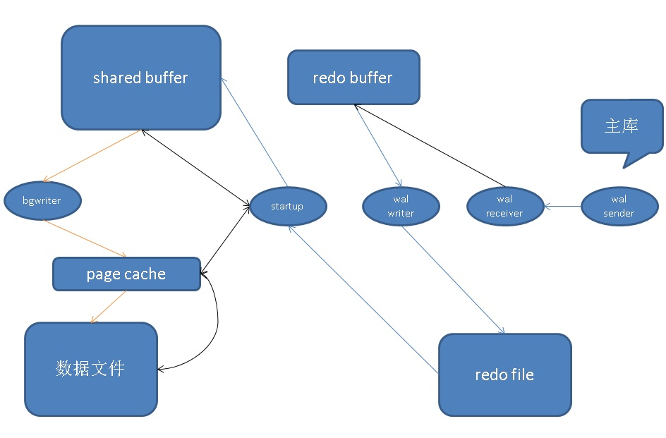

## PostgreSQL 备库apply延迟原理分析与诊断  
              
### 作者              
digoal              
              
### 日期              
2016-03-01              
              
### 标签              
PostgreSQL , 物理流复制 ,  IO不对称    
      
----     
      
## 背景         
开车的同学都喜欢一马平川，最好是车道很多，车很少，开起来爽。  
  
  
  
大家想象一下，同样的车速，6车道每秒可以通过6辆车，而1车道每秒就只能通过1辆车。  
  
好了，我们回到IO层面，我们在使用fio测试块设备的IO能力时，可以选择多少个线程进行压测，实际可以理解为开多少车道的意思。  
  
只要没到通道或者设备本身的极限，当然开的车道（并发）越多，测出来的IO数据越好看。比如单线程可以做到每秒处理1万次请求，而开8个并发，可能处理能达到8万次请求。  
  
这个可以理解之后，我们来看看PostgreSQL的物理复制，为了保证数据一致性，备库在APPLY时，目前只有一个startup进程，对于partial block从REDO中读取出块的变化，并从数据文件读出对应的完整块，在shared buffer中完成合并，最后bg writer会将shared buffer的dirty page write（异步写）到数据文件，对于FPW，则直接写入SHARED BUFFER，后期bg write会负责处理dirty page。  
  
虽然PostgreSQL备库已经使用shared buffer减少了写操作（比如单个数据块的多次变更，只要对应的dirty page没有从shared buffer evict出去，就不需要多次读IO；写IO也可以降低（比如OS层IO合并，或者bgwrite调度机制也可以降低写IO）），但是这些技术在主库也存在，除非备库设置的shared buffer更大，那么备库的写IO也许能降低。  
  
另一方面，备库在恢复非FPW块时，需要从数据文件读取数据块，进行合并，这个动作实际上会产生离散读，在bgwrite将数据块写出shared buffer时产生离散写。  
  
小结一下，主库是多进程离散读写转换为单进程顺序写，而备库单进程顺序读转换为单进程离散读写。  
  
主节点  
  
下面指非分组提交、采用同步提交、开启FSYNC时的流程。  
  
1\. 数据库后台进程wal writer，负责将wal buffer的REDO数据，批量写入(fsync) wal文件。  
  
2\. 数据库后台进程bg writer，负责将shared buffer的dirty page数据(根据page lsn判断，该页WAL已fsync)，写入(write) datafile。OS调度，将PAGE CACHE持久化写入数据文件(datafile)。  
  
3\. 用户进程（S），将需要用到的数据页，读入shared buffer，当shared buffer不够用时，会evict一些page，和bg writer操作类似。  
  
4\. 用户进程（S），非提交事务时，将产生的变更写入wal buffer，提交事务时，会触发XLogFlush（src/backend/access/transam/xact.c），将wal buffer写入(fsync)wal文件。  
  
  
  
备节点  
  
1\. wal receiver进程，负责将收到的wal写入wal buffer。  
  
2\. wal writer进程，负责将wal buffer写入(fsync)wal文件。  
  
3\. startup进程，从WAL文件读取日志，同时从数据文件读取对应数据块，合并(apply redo)后，写入shared buffer。  
  
4\. bgwriter进程，将shared buffer的dirty page数据(根据page lsn判断，该页WAL已fsync)，写入(write) datafile。OS调度，将PAGE CACHE持久化写入数据文件(datafile)。  
  
  
  
对比主节点和备节点的操作，可以观察到一些不对等的地方。  
  
1\. 写(fsync)WAL文件时，主节点有用户进程、wal writer并发的情况出现。而备节点只有wal writer单一进程。  
  
2\. 写(write)数据文件时，主节点有用户进程、bg writer并发的情况出现。而备节点只有bg writer单一进程。  
  
3\. 写shared buffer时，主节点有用户进程并发读写。而备节点只有startup单一进程。  
  
由于以上不对称的情况（主库多数操作是多车道，备库多数操作是单车道），当主库产生的XLOG量非常庞大，或者包含一些非常耗时的操作（例如（大量离散IO，大量系统调用()））时，备库可能会出现延时。  
  
## 哪些情况可能导致备库apply延迟  
通常来说备库接收日志不会有延迟，只要网络带宽比主库产生REDO的速度快。  
  
延迟通常发生在apply阶段。前面分析了主库多数操作是多车道，备库多数操作是单车道，成为备库apply延迟的主要原因。  
  
1\. 恢复时，需要消耗大量CPU时，例如开启了数据文件checksum时，会额外消耗startup进程的cpu。  
  
2\. 主库频繁的离散IO操作，SEEK等。例如大量的索引变更，例如大量的索引VACUUM，例如大量的VACUUM操作。  
  
3\. 频繁或者大量的系统调用，例如大批量删除对象，如drop schema。  
  
[《PostgreSQL DaaS设计注意 - schema与database的抉择》](../201610/20161012_01.md)  
  
4\. 冲突，例如备库开放用户查询，某些查询操作和replay操作冲突时，可能短暂的影响恢复。  
  
## 如何避免apply延迟  
1\. checksum，除非你要防物理篡改，否则通常不需要开启checksum。checksum只是帮助你了解块是否损坏，并不能起到修复作用。(redo的checksum是默认强制打开的，但是数据文件的checksum可选)  
  
2\. 删除没有必要使用的索引。  
  
3\. 垃圾回收的调度，根据业务进行调整，默认是20%，越低越频繁，越频繁，垃圾越少。但是越频繁可能导致产生的VACUUM DIRTY PAGE会增加。可以选择一个较为折中的值，例如5%。  
  
4\. 检查点拉长，可以减少FULL PAGE的量。FULL PAGE是指每次检查点后，第一次被更改的页，需要将这个页写入WAL日志，当数据库CRASH后，可以保证数据的完整性。但是由于FULL PAGE的引入，日志量会增加。  
  
拉长检查点的间距，可以减少FULL PAGE。对于COW文件系统例如（zfs, btrfs），不需要开启FULL PAGE WRITE。  
  
5\. 加大备库shared buffer，可以减少write datafile。  
  
6\. 关闭IO时间的跟踪，可以提高IO操作效率。  
  
7\. 备库使用IOPS能力更强、IO延迟更低的机器(例如NVME的SSD)，从而抹平不对称的情况，注意，不建议使用RAID 5机器。   
  
8\. 内核层面改造，使用并行APPLY，让主备的操作尽量对等，这个涉及工作量较大，因为目前报PG APPLY延迟的CASE相对来说还是比较少的。   
  
9\. 如果有多个备库，备库可以关闭fsync。如同voltdb一样，如果备库挂了，重建备库。  
  
10\. 将冻结年龄加大，例如加到15亿，可以减少冻结产生的redo。  
  
11\. 修改内核，将XID改成64位的，彻底规避冻结的问题，不过这么做的话，和社区版本就完全不兼容了。  
  
12\. 增加单个进程可打开的文件数，可以减少文件开启和关闭，特别是数据库的文件数很多时，可以有效的减少系统调用的时间耗费。  
  
配置例子  
  
```  
checkpoint_segments=1024  
track_io_timing=off  
wal_buffers=512MB  
synchronous_commit=off  
wal_writer_delay = 10ms  
max_files_per_process = 65536  
autovacuum_vacuum_scale_factor = 0.05  
autovacuum_freeze_max_age=1500000000
autovacuum_multixact_freeze_max_age=1500000000
vacuum_freeze_min_age = 500000000
vacuum_freeze_table_age = 1000000000
vacuum_multixact_freeze_min_age = 50000000
vacuum_multixact_freeze_table_age = 1000000000
```  
  
## case  
我们可以根据以上分析，模拟一个场景，让备库处于apply延迟的状态，你可以使用perf , pstack , strace等工具分析是否符合我前面从原理或代码层面的分析。  
  
假设主备已经搭建好了。  
  
在主库创建几张表，这几张表涉及大量的索引。  
  
```  
create table test(  
id int8 primary key,  
info text,  
crt_time timestamp,  
c0 serial8  unique  check(c0>0) ,   
c1 serial8  unique  check(c1>0) ,   
c2 serial8  unique  check(c2>0) ,  
c3 serial8  unique  check(c3>0) ,   
c4 serial8  unique  check(c4>0) ,  
c5 serial8  unique  check(c5>0) ,   
c6 serial8  unique  check(c6>0) ,  
c7 serial8  unique  check(c7>0) ,   
c8 serial8  unique  check(c8>0) ,  
c9 serial8  unique  check(c9>0) ,   
c10 serial8 unique   check(c10>0) ,   
c11 serial8 unique   check(c11>0) ,   
c12 serial8 unique   check(c12>0) ,  
c13 serial8 unique   check(c13>0) ,   
c14 serial8 unique   check(c14>0) ,  
c15 serial8 unique   check(c15>0) ,   
c16 serial8 unique   check(c16>0) ,  
c17 serial8 unique   check(c17>0) ,   
c18 serial8 unique   check(c18>0) ,  
c19 serial8 unique   check(c19>0) ,   
c20 serial8 unique   check(c20>0) ,   
c21 serial8 unique   check(c21>0) ,   
c22 serial8 unique   check(c22>0) ,  
c23 serial8 unique   check(c23>0) ,   
c24 serial8 unique   check(c24>0) ,  
c25 serial8 unique   check(c25>0) ,   
c26 serial8 unique   check(c26>0) ,  
c27 serial8 unique   check(c27>0) ,   
c28 serial8 unique   check(c28>0) ,  
c29 serial8 unique   check(c29>0) ,   
c30 serial8 unique   check(c30>0) ,   
c31 serial8 unique   check(c31>0) ,   
c32 serial8 unique   check(c32>0) ,  
c33 serial8 unique   check(c33>0) ,   
c34 serial8 unique   check(c34>0) ,  
c35 serial8 unique   check(c35>0) ,   
c36 serial8 unique   check(c36>0) ,  
c37 serial8 unique   check(c37>0) ,   
c38 serial8 unique   check(c38>0) ,  
c39 serial8 unique   check(c39>0) ,   
c40 serial8 unique   check(c40>0) ,   
c41 serial8 unique   check(c41>0) ,   
c42 serial8 unique   check(c42>0) ,  
c43 serial8 unique   check(c43>0) ,   
c44 serial8 unique   check(c44>0) ,  
c45 serial8 unique   check(c45>0) ,   
c46 serial8 unique   check(c46>0) ,  
c47 serial8 unique   check(c47>0) ,   
c48 serial8 unique   check(c48>0) ,  
c49 serial8 unique   check(c49>0) ,   
c50 serial8 unique   check(c50>0) ,   
c51 serial8 unique   check(c51>0) ,   
c52 serial8 unique   check(c52>0) ,  
c53 serial8 unique   check(c53>0) ,   
c54 serial8 unique   check(c54>0) ,  
c55 serial8 unique   check(c55>0) ,   
c56 serial8 unique   check(c56>0) ,  
c57 serial8 unique   check(c57>0) ,   
c58 serial8 unique   check(c58>0) ,  
c59 serial8 unique   check(c59>0) ,   
c60 serial8 unique   check(c60>0) ,   
c61 serial8 unique   check(c61>0) ,   
c62 serial8 unique   check(c62>0) ,  
c63 serial8 unique   check(c63>0) ,   
c64 serial8 unique   check(c64>0) ,  
c65 serial8 unique   check(c65>0) ,   
c66 serial8 unique   check(c66>0) ,  
c67 serial8 unique   check(c67>0) ,   
c68 serial8 unique   check(c68>0) ,  
c69 serial8 unique   check(c69>0) ,   
c70 serial8 unique   check(c70>0) ,   
c71 serial8 unique   check(c71>0) ,   
c72 serial8 unique   check(c72>0) ,  
c73 serial8 unique   check(c73>0) ,   
c74 serial8 unique   check(c74>0) ,  
c75 serial8 unique   check(c75>0) ,   
c76 serial8 unique   check(c76>0) ,  
c77 serial8 unique   check(c77>0) ,   
c78 serial8 unique   check(c78>0) ,  
c79 serial8 unique   check(c79>0) ,   
c80 serial8 unique   check(c80>0) ,   
c81 serial8 unique   check(c81>0) ,   
c82 serial8 unique   check(c82>0) ,  
c83 serial8 unique   check(c83>0) ,   
c84 serial8 unique   check(c84>0) ,  
c85 serial8 unique   check(c85>0) ,   
c86 serial8 unique   check(c86>0) ,  
c87 serial8 unique   check(c87>0) ,   
c88 serial8 unique   check(c88>0) ,  
c89 serial8 unique   check(c89>0) ,   
c90 serial8 unique   check(c90>0) ,   
c91 serial8 unique   check(c91>0) ,   
c92 serial8 unique   check(c92>0) ,  
c93 serial8 unique   check(c93>0) ,   
c94 serial8 unique   check(c94>0) ,  
c95 serial8 unique   check(c95>0) ,   
c96 serial8 unique   check(c96>0) ,  
c97 serial8 unique   check(c97>0) ,   
c98 serial8 unique   check(c98>0) ,  
c99 serial8 unique   check(c99>0)   
);  
  
  
create or replace function create_test(int,int) returns void as $$  
declare  
begin  
for i in $1..$2 loop  
execute 'create table test'||i||' (like test including all)';  
end loop;  
end;  
$$ language plpgsql strict;  
  
  
select create_test(1,16);  
```  
  
创建了17张表，涉及1818个索引。  
  
创建测试脚本  
  
```  
vi test.sql  
  
\set id random(1,100000000)  
insert into test values (:id,'test',now()) on conflict(id) do update set info=excluded.info, crt_time=excluded.crt_time;  
insert into test1 values (:id,'test',now()) on conflict(id) do update set info=excluded.info, crt_time=excluded.crt_time;  
insert into test2 values (:id,'test',now()) on conflict(id) do update set info=excluded.info, crt_time=excluded.crt_time;  
insert into test3 values (:id,'test',now()) on conflict(id) do update set info=excluded.info, crt_time=excluded.crt_time;  
insert into test4 values (:id,'test',now()) on conflict(id) do update set info=excluded.info, crt_time=excluded.crt_time;  
insert into test5 values (:id,'test',now()) on conflict(id) do update set info=excluded.info, crt_time=excluded.crt_time;  
insert into test6 values (:id,'test',now()) on conflict(id) do update set info=excluded.info, crt_time=excluded.crt_time;  
insert into test7 values (:id,'test',now()) on conflict(id) do update set info=excluded.info, crt_time=excluded.crt_time;  
insert into test8 values (:id,'test',now()) on conflict(id) do update set info=excluded.info, crt_time=excluded.crt_time;  
insert into test9 values (:id,'test',now()) on conflict(id) do update set info=excluded.info, crt_time=excluded.crt_time;  
insert into test10 values (:id,'test',now()) on conflict(id) do update set info=excluded.info, crt_time=excluded.crt_time;  
insert into test11 values (:id,'test',now()) on conflict(id) do update set info=excluded.info, crt_time=excluded.crt_time;  
insert into test12 values (:id,'test',now()) on conflict(id) do update set info=excluded.info, crt_time=excluded.crt_time;  
insert into test13 values (:id,'test',now()) on conflict(id) do update set info=excluded.info, crt_time=excluded.crt_time;  
insert into test14 values (:id,'test',now()) on conflict(id) do update set info=excluded.info, crt_time=excluded.crt_time;  
insert into test15 values (:id,'test',now()) on conflict(id) do update set info=excluded.info, crt_time=excluded.crt_time;  
insert into test16 values (:id,'test',now()) on conflict(id) do update set info=excluded.info, crt_time=excluded.crt_time;  
```  
  
压测  
  
```  
pgbench -M prepared -n -r -P 1 -f ./test.sql -c 64 -j 64 -T 1000  
```  
  
观察延迟  
  
```  
select pg_size_pretty(pg_xlog_location_diff(pg_current_xlog_insert_location(),sent_location)) sent_delay,   
       pg_size_pretty(pg_xlog_location_diff(pg_current_xlog_insert_location(),replay_location)) replay_delay,   
       * from pg_stat_replication ;  
```  
  
分析  
  
```  
pstack startup进程  
  
perf record -avg  
  
perf report --stdio  
```  
  
## 参考  
[《PostgreSQL DaaS设计注意 - schema与database的抉择》](../201610/20161012_01.md)  
  
