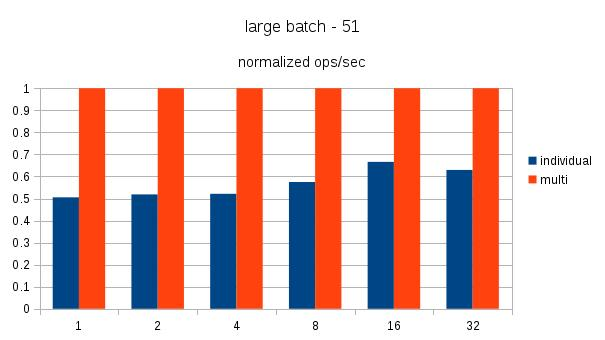
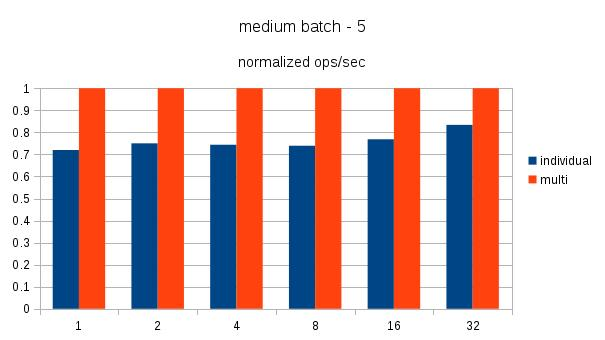
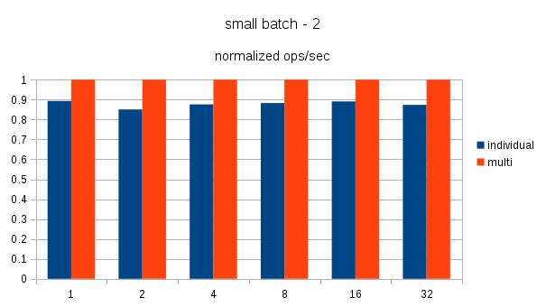

## PostgreSQL jdbc batch insert  
                                                                          
### 作者                                                                                                                       
digoal                                                                     
                                                                            
### 日期                                                                       
2017-03-29                                                                      
                                                                        
### 标签                                                                     
PostgreSQL , jdbc , batch , addbatch , executebatch , insert    
                                                                          
----                                                                    
                                                                             
## 背景     
如何快速的将数据导入数据库？  
  
比如ETL程序，数据还原程序，数据初始化，数据同步等场景都会有这样的诉求。  
  
从几个方面来分析  
  
1\. 统计信息  
  
PostgreSQL会自动统计表的统计信息，包括柱状图等。会有一定的开销，所以在做批量导入时，可以先关闭表的autovacuum.  
  
2\. 索引  
  
构造索引，会有一定的CPU和IO开销，影响导入速度，所以可以在数据导入后再建索引。  
  
3\. 约束  
  
约束会耗费一定的CPU，也可以在数据导入后再加索引。  
  
4\. 检查点  
  
数据库导入势必产生WAL日志，如果WAL很多，可能会产生检查点，影响IO。因此可以把检查点的时间拉长(设置ckpt target, timeout)。  
  
5\. COMMIT fsync  
  
如果是单条INSERT的导入方式，并且使用了autocommit，那么每条COMMIT都会导致FSYNC，flush wal。从而降低速度。  
  
可以设置为异步提交，降低RT。  
  
或者使用批量提交，例如100条提交一次。  
  
6\. parser开销  
  
insert需要parser, 即使使用绑定变量，也有诸多tuple form的工作。  
  
使用copy 接口可以提高效率。  
  
7\. 交互次数  
  
如果使用的是单条insert，也有批量的方式提高速度，例如insert into table values (),(),(),.....;  
  
相比以下，减少了交互次数，可以大幅提升性能，与COPY效率类似。  
  
```  
begin;  
insert into table values ();  
insert into table values ();  
...  
end;  
```  
  
8\. 10.0即将推出的一个新特性，将允许libpq有批量提交QUERY的功能。  
  
[《PostgreSQL 10.0 preview 性能增强 - libpq支持pipeline batch模式减少网络交互提升性能》](../201703/20170312_15.md)  
  
本文将要讲一下jdbc的batch insert.  
  
## jdbc batch insert  
目前，使用jdbc prepared statement insert与addbatch, execute batch，你可能会发现，最后SQL还是没有封装成这样insert into table values (),(),(),.....;而是一条一条的insert。  
    
社区也有类似的讨论帖子  
  
```  
Hi,  
  
As document said, in the extended query protocol, "The query string  
contained in a Parse message cannot include more than one SQL  
statement".  
  
So to support batch in prepared statement, I think the only way is to  
determine the batch size in advance and then create the appropriate  
prepared statement, e.g.  
  
Given the batch size is fixed to 3, then prepare below statement:  
-- create table foobar(a int, b text);  
insert into foobar values($1, $2), ($3, $4), ($5, $6);  
  
Then this prepared statement must be bound with 3 set of arguments.  
  
The limitation is obvious: the batch size is fixed, so if you need to  
do batch with size of 4, the previous prepared statement is useless  
and you need to recreate it.  
  
On the other hand, in JDBC, it seems that you just need to prepare  
below statement:  
  
insert into foobar values($1, $2);  
  
And then calls addBatch() repeatedly until you think the batch size is enough.  
  
What's the final statement does postgresql jdbc driver convert to? I'm  
so curious.  
  
I'm not familiar with jdbc, and although I check the driver source  
codes, but I still cannot understand it.  
  
Anybody knows the answer? Thanks.  
  
  
Regards,  
Jinhua Luo  
```  
  
github里面有一个JDBC batch insert rewrite功能，可以将single batch转换为multi-row batch  
  
https://github.com/whitingjr/batch-rewrite-statements-perf  
  
```  
The first measures INSERT statements in a single batch  
  
 batch begin  
  | INSERT  
  | INSERT  
  | INSERT  
  | INSERT  
  | n INSERT  
 batch end  
the second uses an individual multi-row INSERT statement.  
  
INSERT INTO orderline VALUES (?,?),(?,?),(?,?),(?,?),(n,n)  
Both types has 3 individual benchmarks with varying numbers of statement/row. There is a benchmark called SMALL, MEDIUM and LARGE. The count for each is configurable. See Configuration section later for details.  
```  
  
下面是测试对比，很显然multi-row的效果好很多。  
  
  
  
  
  
  
  
建议要么使用multi-row batch，要么使用copy.  
  
### jdbc 版本
可以看到multi-row batch已经支持了，在这  
  
https://github.com/pgjdbc/pgjdbc/commit/510e6e0fec5e3a44ffda854f5cf808ce9f72ee2e  
  
```
fix: improve insert values(...) batch rewrite
Now it supports VALUES (?,1), and splits very long batch into series of smaller ones
to keep overall number of bind variables <32768 (that is PG's limit in v3 protocol)

Trigger property: reWriteBatchedInserts=true. Default value is still "false".

closes #580
closes #584
```
  
用法  
  
```
reWriteBatchedInserts=true
```
  
## 参考       
[《PostgreSQL 10.0 preview 性能增强 - libpq支持pipeline batch模式减少网络交互提升性能》](../201703/20170312_15.md)  
  
https://jdbc.postgresql.org/  
  
https://github.com/pgjdbc/pgjdbc/  
  
https://www.postgresql.org/message-id/55130DC8.2070508@redhat.com  
  
https://github.com/pgjdbc/pgjdbc/pull/491  
  
https://www.postgresql.org/message-id/flat/CAAc9rOwTZ3d6%3DYUV-vJPndebVyUGAz_Pk8WV1fYkmpVykttLug%40mail.gmail.com#CAAc9rOwTZ3d6=YUV-vJPndebVyUGAz_Pk8WV1fYkmpVykttLug@mail.gmail.com  
  
https://jdbc.postgresql.org/documentation/publicapi/index.html  

