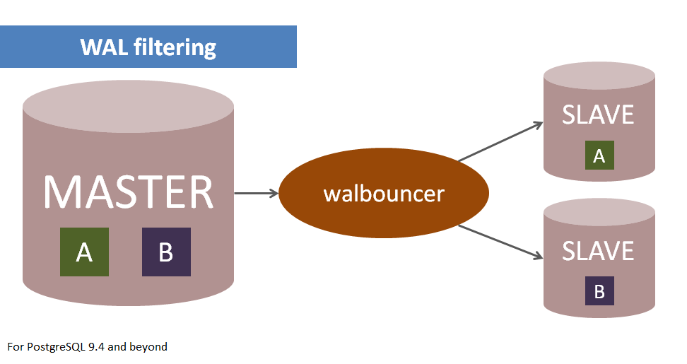
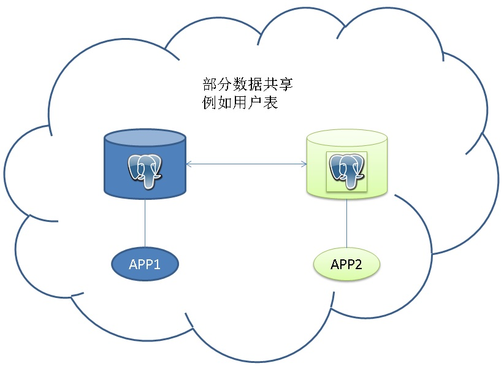
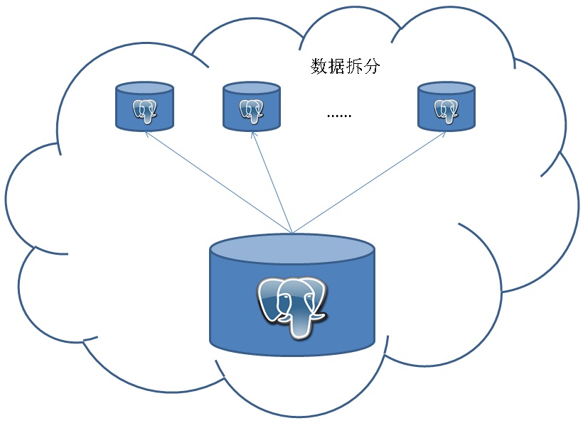
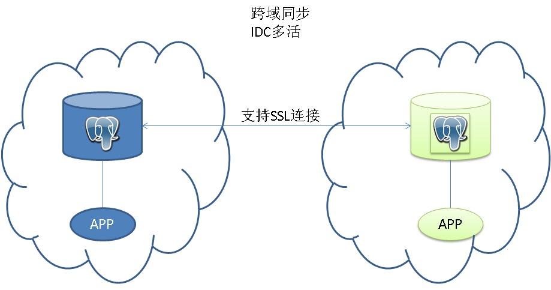
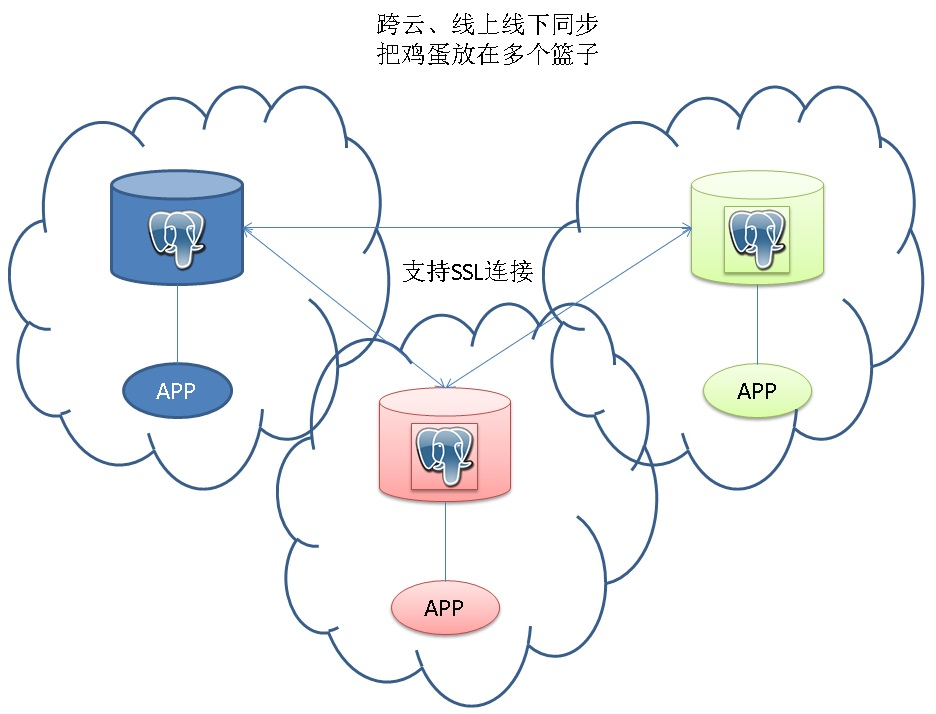
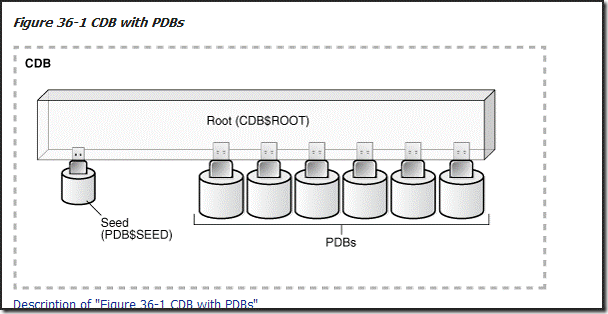

## PostgreSQL 逻辑订阅 - 给业务架构带来了什么希望？  
##### [TAG 15](../class/15.md)
                            
### 作者                               
digoal                       
                        
### 日期                                                                                           
2017-04-13                     
                           
### 标签                        
PostgreSQL , 逻辑订阅 , 10.0 , 数据汇聚 , 数据共享 , IDC多活 , 云端线下同步     
                                                                                              
----                                                                                        
                                                                                                 
## 背景                    
逻辑订阅是PostgreSQL 10.0的新特性。  
  
具体的原理，使用方法可以参考如下文章。    
  
[《PostgreSQL 10.0 preview 逻辑订阅 - 原理与最佳实践》](../201702/20170227_01.md)    
  
[《PostgreSQL 10.0 preview 逻辑订阅 - pg_hba.conf变化,不再使用replication条目》](../201704/20170405_02.md)  
  
[《PostgreSQL 10.0 preview 逻辑订阅 - 备库支持逻辑订阅,订阅支持主备漂移了》](../201703/20170330_01.md)   
  
[《PostgreSQL 10.0 preview 逻辑订阅 - 支持并行COPY初始化数据》](../201703/20170328_01.md)    
  
PostgreSQL 早在2010年就支持了物理流式复制，可以用来支持容灾、读写分离、HA等业务场景。为什么还需要逻辑订阅的功能呢？  
  
## 逻辑订阅和物理流复制有什么差别  
1\. 差别1，物理复制目前只能做到整个集群的复制。逻辑订阅可以做到表级。  
  
物理流式复制是基于REDO的块级别复制，复制出来的数据库与上游数据库一模一样，每个块都是一样的，就好像克隆的一样。  
  
物理流式复制，目前只能做到整个集群的复制，虽然技术上来讲也可以做到按表空间、按数据库级别的复制，目前PG社区还没有这么做。  
  
PS：外围的公司有这样的插件，walbouncer，支持物理的partial replication。  
  
http://www.cybertec.at/en/products/walbouncer-enterprise-grade-partial-replication/  
  
  
  
2\. 差别2，物理复制的备库只读，不能写入。逻辑订阅读写都可以。  
  
3\. 差别3，物理复制不需要等待事务提交，即可将REDO发往备库，备库也可以直接apply它。逻辑订阅，目前需要等待事务提交后，发布端才会使用wal_sender进程将decode后的数据发送给订阅端，订阅端流式接收与流式apply。  
  
将来逻辑订阅也可能不需要等事务结束就apply，因为在CLOG中是有2个BIT记录事务状态的。  
  
```
/*
 * Possible transaction statuses --- note that all-zeroes is the initial
 * state.
 *
 * A "subcommitted" transaction is a committed subtransaction whose parent
 * hasn't committed or aborted yet.
 */
typedef int XidStatus;

#define TRANSACTION_STATUS_IN_PROGRESS          0x00
#define TRANSACTION_STATUS_COMMITTED            0x01
#define TRANSACTION_STATUS_ABORTED                      0x02
#define TRANSACTION_STATUS_SUB_COMMITTED        0x03
```
  
4\. 差别4，物理复制，需要复制所有的REDO（包括回滚的）。逻辑订阅，不需要复制所有的REDO，仅仅需要复制"订阅表产生的REDO解析后的数据"（并且回滚的事务不会被复制）。  
  
5\. 差别5，如果要支持逻辑订阅，需要配置wal_level=logical，如果仅仅需要物理复制，则配置wal_level=replica即可。  
  
逻辑订阅需要产生额外的REDO信息（通过alter或create table指定pk, 或 full row）。而物理复制，不需要在REDO中记录这些信息。  
  
逻辑订阅对主库的性能影响比物理复制更较大的。   
  
```
REPLICA IDENTITY

This form changes the information which is written to the write-ahead log to identify rows which are updated or deleted. 

This option has no effect except when logical replication is in use. 

DEFAULT (the default for non-system tables) records the old values of the columns of the primary key, if any.  -- 普通表默认使用PK作为old value

USING INDEX records the old values of the columns covered by the named index, which must be unique, not partial, not deferrable, and include only columns marked NOT NULL. 

FULL records the old values of all columns in the row. 

NOTHING records no information about the old row. (This is the default for system tables.) -- 默认情况下系统表的变更不记录old row

In all cases, no old values are logged unless at least one of the columns that would be logged differs between the old and new versions of the row.
```
  
6\. 差别6，对于大事务，物理复制的延迟比逻辑订阅更低。因为差别3。  
  
7\. 差别7，逻辑订阅需要用到发布端的catalog，将REDO翻译为可供订阅者使用的ROW格式，如果在订阅端与发布端没有同步前，发布端的TABLE定义发生了变化或者被删除了，翻译REDO的工作将无法进行下去。PostgreSQL使用多版本来解决这样的问题，允许CATALOG的变更，但是版本被保留到订阅端不需要它为止（PG内部通过LSN来实现）。如果你发现发布端的CATALOG膨胀了，可以从这方面找一下原因（是不是订阅太慢或者订阅者停止订阅了，同时期间发布端产生了大量的DDL操作）。  
  
物理复制不存在这样的问题。  
  
8\. 差别8，物理复制的备库，如果要被用来只读的话，为了避免备库LONG QUERY与vacuum redo发生冲突，有两种解决方案，都有一定的损伤。1，主库延迟VACUUM，一定程度上导致主库膨胀。2，备库APPLY礼让QUERY，一定程度上导致备库APPLY延迟。  
  
逻辑订阅不存在以上情形的冲突。  
  
### 逻辑订阅与物理流复制的定位差别  
逻辑订阅，适合于发布端与订阅端都有读写的情况。  
  
逻辑订阅，更适合于小事务，或者低密度写（轻度写）的同步。如果有大事务、高密度写，逻辑订阅的延迟相比物理复制更高。  
  
逻辑订阅，适合于双向，多向同步。  
  
物理复制，适合于单向同步。  
  
物理复制，适合于任意事务，任意密度写（重度写）的同步。  
  
物理复制，适合于HA、容灾、读写分离。  
  
物理复制，适合于备库没有写，只有读的场景。  
  
## 逻辑订阅给业务架构带来了什么  
1\. 多个业务之间，有少量的数据需要同步时，逻辑订阅可以解决这样的问题。  
  
例如A业务和B业务，分别使用两个数据库，但是他们有少量的数据是共用的。而且都要对这部分共享数据进行读写。  
  
  
  
2\. 数据汇总，例如多个业务库的FEED数据，要汇总到一个分析库。以往可能要构建庞大的ETL和调度系统，并且很难做到实时的同步。现在有了逻辑订阅，可以方便的应对这样的场景。  
  
（PostgreSQL 的多个特性表名，它正在朝着HTAP的方向发展，既能高效的处理OLTP在线业务，也能处理分析业务。（LLVM、向量计算、列存储、多核并行、算子复用等一系列的特性支持OLAP））  
  
  
  
3\. 数据拆分，与数据汇总刚好相反，比如在垂直拆分时，使用逻辑订阅，可以将一个集中式的数据库拆分成多个数据库。由于逻辑订阅是增量的，可以节约拆分过程的停机时间。  
  
另外还有些业务场景，在端上可能不会部署那么多的小数据库，统统往一个库里写。下游接一些小的数据库，是要逻辑订阅，也能很好的满足此类需求。  
  
  
  
4\. 多活架构中，最痛苦的实际上是数据库，为什么呢？  
  
比如一个游戏业务，可能在全国都有IDC，而认证或者账务系统可能还是集中式的，如果要拆分成多个库，就会涉及到数据一致性和完整性的问题。  
  
比如按用户的首次注册地，将数据库分为多个区域。根据用户的登陆来源IP，路由到相应的IDC（访问这个IDC中的数据库），这个用户如果是固定用户还好，因为注册地和使用地基本是不变的。对于手机游戏就扯淡了，因为登陆地不断的变化，比如出差，原来在杭州登陆的，跑北京登陆了。而北京机房并没有该用户的信息。业务层面就需要解决这样的问题。  
  
使用逻辑订阅，可以很好的解决这个场景的问题，每个IDC中的数据都是完整的，当用户在杭州时，读写杭州的数据库，通过订阅数据复制到北京的机房。当用户漫游到北京时，读写北京的数据库，通过订阅复制到杭州的机房。  
  
  
  
5\. 有些企业，在云上有数据库，在线下也有数据库，甚至在多个云厂商都有数据库。应了一句话，不要将鸡蛋放在同一个篮子里。  
  
那么这些数据库的数据如何在多个域之间同步呢？使用物理复制是很难做到的，存在一些不可避免的问题：1，云厂商的数据库内核可能修改过，物理复制不一定兼容。2，不同厂商的版本可能不兼容。3，数据库编译时的数据块大小可能不一样导致不兼容。4，背后使用的插件可能不一样，导致不兼容。5，云厂商不一定会开放物理复制的接口。  
  
逻辑订阅规避了以上问题：1，逻辑订阅可以跨版本。2，逻辑订阅不管数据块的大小是否一样，都没有问题。  
  
  
  
6\. 从云上将数据迁移到线下，或者从线下将数据迁移到云上。  
  
使用逻辑订阅，可以实现增量的迁移。减少迁移的业务停机时间。  
  
7\. 跨版本、跨平台升级。  
  
跨版本升级，使用逻辑订阅，增量迁移，可以减少升级版本的业务停机时间。  
  
8\. 数据分享给其他的产品，例如缓存、搜索引擎、流计算平台。  
  
使用逻辑订阅，可以实时将数据分享给其他的业务平台，BottledWater-pg就是一个很好的例子。  
  
  
  
9\. 数据库的热插拔。类似Oracle 12C的cdb架构。PostgreSQL cluster 对应Oracle 12c的CDB，cluster中的database对应Oracle 12c的PDB。     
  
当需要将一个CLUSTER的database拔出时，通过订阅方式复制到其他的CLUSTER。   
  
  
  
例子  
  
```
1. 创建订阅

2. 接近同步后将数据库设置为只读
postgres=# alter database src set default_transaction_read_only =true;
ALTER DATABASE
 
3. 断开已有连接
pg_terminate_backend(pid) 断开所有与被迁移库连接的已有连接。
  
4. 一致性迁移完成
```
  
## 逻辑订阅例子
逻辑订阅只需简单两步即可完成。   
  
1\. 建表、发布  
  
```
src=# create table public.t1(id int primary key, info text, crt_time timestamp);  
CREATE TABLE  
  
src=# create publication pub1 for table public.t1;  
CREATE PUBLICATION  
```
    
2\. 建表、订阅  
  
```
dst=# create table public.t1(id int primary key, info text, crt_time timestamp);  
CREATE TABLE  
  
dst=# create subscription sub1_from_pub1 connection 'hostaddr=xxx.xxx.xxx.xxx port=1922 user=postgres dbname=src' publication pub1 with (enabled, create slot, slot name='sub1_from_pub1');  
NOTICE:  created replication slot "sub1_from_pub1" on publisher  
CREATE SUBSCRIPTION  
```
  
详情请参考  
  
[《PostgreSQL 10.0 preview 逻辑订阅 - 原理与最佳实践》](../201702/20170227_01.md)    
    
## 逻辑订阅的冲突解决  
逻辑订阅，本质上是事务层级的复制，需要在订阅端执行SQL。    
    
如果订阅端执行SQL失败（或者说引发了任何错误，包括约束等），都会导致该订阅暂停。    
    
注意，update, delete没有匹配的记录时，不会报错，也不会导致订阅暂停。    
    
用户可以在订阅端数据库日志中查看错误原因。    
    
### 冲突修复方法    
1\. 通过修改订阅端的数据，解决冲突。例如insert违反了唯一约束时，可以删除订阅端造成唯一约束冲突的记录先DELETE掉。然后使用ALTER SUBSCRIPTION name ENABLE让订阅继续。    
    
2\. 在订阅端调用pg_replication_origin_advance(node_name text, pos pg_lsn)函数，node_name就是subscription name，pos指重新开始的LSN，从而跳过有冲突的事务。    
    
```    
pg_replication_origin_advance(node_name text, pos pg_lsn)           
    
Set replication progress for the given node to the given position.     
    
This primarily is useful for setting up the initial position or a new position after configuration changes and similar.     
    
Be aware that careless use of this function can lead to inconsistently replicated data.    
```    
    
当前的lsn通过pg_replication_origin_status.remote_lsn查看。    
    
https://www.postgresql.org/docs/devel/static/view-pg-replication-origin-status.html    
    
## 参考                    
[《PostgreSQL 10.0 preview 逻辑订阅 - 原理与最佳实践》](../201702/20170227_01.md)    
  
[《PostgreSQL 10.0 preview 逻辑订阅 - pg_hba.conf变化,不再使用replication条目》](../201704/20170405_02.md)  
  
[《PostgreSQL 10.0 preview 逻辑订阅 - 备库支持逻辑订阅,订阅支持主备漂移了》](../201703/20170330_01.md)   
  
[《PostgreSQL 10.0 preview 逻辑订阅 - 支持并行COPY初始化数据》](../201703/20170328_01.md)    
  
  
  
  
  
  
  
  
  
  
  
  
  
#### [免费领取阿里云RDS PostgreSQL实例、ECS虚拟机](https://free.aliyun.com/ "57258f76c37864c6e6d23383d05714ea")
  
  
#### [digoal's PostgreSQL文章入口](https://github.com/digoal/blog/blob/master/README.md "22709685feb7cab07d30f30387f0a9ae")
  
  

  
  
  
  
  
  
#### 打赏都逃不过老婆的五指山 －_－b  

  
