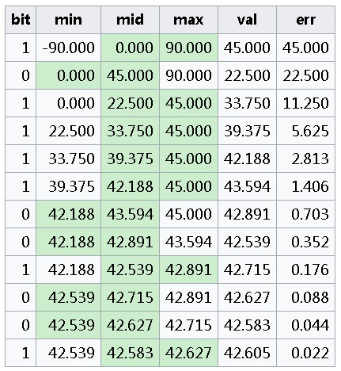
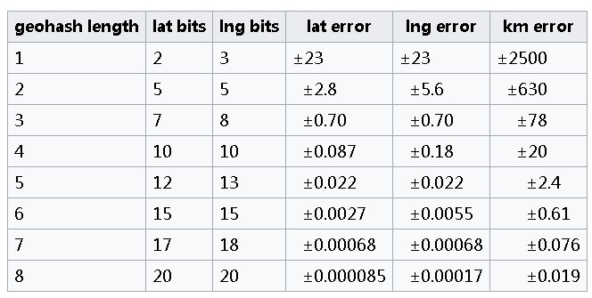
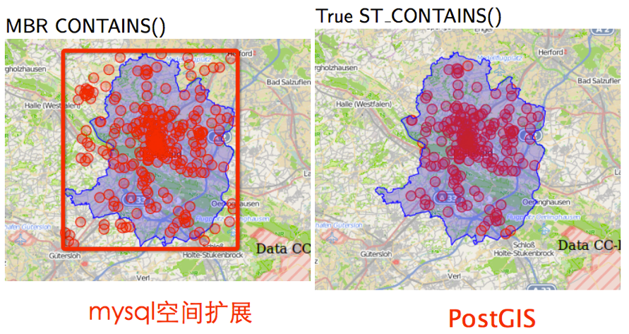

## geohash vs PostGIS   
                                                          
### 作者                                                             
digoal                                                     
                                                      
### 日期                                                                                                                         
2017-04-22                                                    
                                                         
### 标签                                                      
PostgreSQL , PostGIS , GEOHASH , 经纬度 , geometry , geography         
                                                                                                                            
----                                                                                                                      
                                                                                                                               
## 背景       
业界有几种地理位置的表示方法。  
  
通常我们使用经纬度表示地球上的位置，PostgreSQL的PostGIS可以很好的描述这种类型，包括海拔在内。使用最为广泛，精度、功能最高的应该是PostGIS。  
  
但是并不是所有的数据库都有这样的技术（或者实现难度的问题导致了很多数据库在初期会选择较为简单的geohash）。  
  
什么是geohash呢？  
  
## geohash 原理  
通常我们使用经纬度表示地球上的位置，PostgreSQL的PostGIS可以很好的描述这种类型，包括海拔在内。  
  
但是并不是所有的数据库都有这样的技术（或者实现难度的问题导致了很多数据库在初期会选择较为简单的geohash）。  
  
什么是geohash呢？  
  
实际上geohash是一套网格化的编码方式，经过编码，可以将经纬度对应的点，表示为一个网格，网格的大小，取决于geohash的精度。  
  
通常，geohash使用32个字符进行编码。业界也有使用geo base 36的编码，即36个字符来表示的。  
  
编码后，离得越近的点，编码值也是越近的。prefix永远会包含更长的编码字符表示的范围。（例如wb12x是5位的，包含了wb12x..........的网格，即wb12x是个大格子，wb12x....是更小的格子。），但是请注意，边界问题，例如-180和180实际上是一个地方。但是它们的geohash编码却完全不一样。这也是geohash的问题之一。  
  
### 如何将geohash编码转换为经纬度？  
首先有一个base32的映射表(以32个字符进行编码为例)  
  
  
  
例如一个hash=ezs42的geohash值，通过这个表，可以翻译成 13, 31, 24, 4, 2。  
  
将以上每个数字，使用5位BIT表示，进而翻译成 01101 11111 11000 00100 00010 。    
  
接下来是关键不走，以上BIT串，位置从0开始，偶数的BIT位连起来作为 longitude code (0111110000000), 奇数比特位连起来作为 latitude code (101111001001).  
  
得到了经纬度BIT串后，该怎么办呢？  
  
经度范围-180 ~ 180  
  
纬度范围-90 ~ 90  
  
每次将范围对半拆开，例如-180, 0, 180。当bit=0时，表示点落在左边的范围，当bit=1时，表示点落在右边的范围。然后再将下一个范围对半拆开，例如-180, -90, 0。继续根据BIT选择范围，循环往复。  
  
得到一个范围，取范围的中值，作为对应的经度或者纬度。  
  
  
  
上图就是101111001001的计算过程，右，左，右，右，右，右，左，左，右，左，左，右。  
  
value指范围的中间值，ERR指误差。  
  
当geohash的字符串长度越长时，误差越小，我们来看看误差表如下。  
  
  
  
### geohash缺陷  
由于编码，地球非正球体，等问题。导致了geohash 存在几个比较致命的缺陷。  
  
1\. 网格化算法带来的精度问题  
  
2\. 地球是不规则椭圆，geohash的偏差会随着纬度的变大骤变，越接南北极地，距离计算越不准确。  
  
- At the Equator (0 Degrees) the length of a degree of longitude is 111.320 km, while a degree of latitude measures 110.574 km, an error of 0.67%.  
  
- At 30 Degrees (Mid Latitudes) the error is 110.852/96.486 = 14.89%  
  
- At 60 Degrees (High Arctic) the error is 111.412/55.800 = 99.67%, reaching infinity at the poles.  
  
3\. 经度边界(-180,180)数据的处理，边界的哈希值完全不同，但是他们却相邻，不利于相邻计算。  
  
## PostGIS geometry, geography, raster, ...  
PostgreSQL PostGIS 发展了几十年，有非常深厚的理论背景，广泛应用于军工、科研、商业场景。  
  
PostGIS adds extra types (geometry, geography, raster and others) to the PostgreSQL database.   
  
It also adds functions, operators, and index enhancements that apply to these spatial types.   
  
These additonal functions, operators, index bindings and types augment the power of the core PostgreSQL DBMS, making it a fast, feature-plenty, and robust spatial database management system.  
  
### Feature List  
  
The PostGIS 2+ series provides:  
  
- Processing and analytic functions for both vector and raster data for splicing, dicing, morphing, reclassifying, and collecting/unioning with the power of SQL  
  
- raster map algebra for fine-grained raster processing  
  
- Spatial reprojection SQL callable functions for both vector and raster data  
  
- Support for importing / exporting ESRI shapefile vector data via both commandline and GUI packaged tools and support for more formats via other 3rd-party Open Source tools  
  
- Packaged command-line for importing raster data from many standard formats: GeoTiff, NetCDF, PNG, JPG to name a few  
  
- Rendering and importing vector data support functions for standard textual formats such as KML,GML, GeoJSON,GeoHash and WKT using SQL  
  
- Rendering raster data in various standard formats GeoTIFF, PNG, JPG, NetCDF, to name a few using SQL  
  
- Seamless raster/vector SQL callable functions for extrusion of pixel values by geometric region, running stats by region, clipping rasters by a geometry, and vectorizing rasters  
  
- 3D object support, spatial index, and functions  
  
- Network Topology support  
  
- Packaged Tiger Loader / Geocoder/ Reverse Geocoder / utilizing US Census Tiger data  
  
## geohash vs PostGIS  
参考自  
  
http://www.cnblogs.com/LBSer/p/3629149.html  
  
一个玩具级场景（PostGIS说：我可不是玩具^_^....）的对比  
  
功能 | Mysql spatial extension | PostGIS  
---|---|---  
空间索引 | 仅MyISAM支持R树索引，InnoDB不支持 | GIST树索引（R树的变种）  
支持的空间类型 | 仅二维数据 | 二维、三维以及曲线  
空间操作函数 | 有限的空间函数 | 基本实现OGC标准定义的空间操作函数  
空间投影 | 不支持 | 支持多种常用投影坐标系  
事务支持 | 不支持 | PostGIS提供了一系列的长事务支持，可以有效支持复杂的空间分析功能  
加载速度 | MySQL > PostGIS (事务) (作者可能没有进行优化，性能不会更差)。| -  
空间索引的创建速度 | MySQL < PostGIS (diff split algo)。  | -  
查询效率 | MySQL  PostGIS（不同性质查询结果不一样，各有千秋）| -  
GIS系统使用 | 使用较少 | 使用较多，例如openstreetmap的数据库后台就是Postgresql+Postgis  
  
例：想查找蓝色多边形内的点，mysql空间扩展仅能查出在最小外包矩形（红色框）内的点，而postgis能查出任意多边形内的点。  
  
  
  
例：想查找两点间距离。MySQL Spatial仅能计算欧式空间距离，而PostGIS能计算不同投影坐标系下的真实空间距离  
  
### PostGIS不仅支持geometry,geography也支持geohash  
PostGIS虽然不推荐使用geohash，但是它内置了转换函数，可以将geometry转换为geohash  
  
#### Name  
```  
ST_GeoHash — Return a GeoHash representation of the geometry.  
```  
  
#### Synopsis  
```  
text ST_GeoHash(geometry geom, integer maxchars=full_precision_of_point);  
```  
  
#### Description  
Return a GeoHash representation (http://en.wikipedia.org/wiki/Geohash) of the geometry. A GeoHash encodes a point into a text form that is sortable and searchable based on prefixing. A shorter GeoHash is a less precise representation of a point. It can also be thought of as a box, that contains the actual point.  
  
If no maxchars is specified ST_GeoHash returns a GeoHash based on full precision of the input geometry type. Points return a GeoHash with 20 characters of precision (about enough to hold the full double precision of the input). Other types return a GeoHash with a variable amount of precision, based on the size of the feature. Larger features are represented with less precision, smaller features with more precision. The idea is that the box implied by the GeoHash will always contain the input feature.  
  
If maxchars is specified ST_GeoHash returns a GeoHash with at most that many characters so a possibly lower precision representation of the input geometry. For non-points, the starting point of the calculation is the center of the bounding box of the geometry.  
  
Availability: 1.4.0  
  
#### [Note]	  
ST_GeoHash will not work with geometries that are not in geographic (lon/lat) coordinates.  
  
 This method supports Circular Strings and Curves  
  
#### Examples  
```  
SELECT ST_GeoHash(ST_SetSRID(ST_MakePoint(-126,48),4326));  
  
	 st_geohash  
----------------------  
 c0w3hf1s70w3hf1s70w3  
  
SELECT ST_GeoHash(ST_SetSRID(ST_MakePoint(-126,48),4326),5);  
  
 st_geohash  
------------  
 c0w3h  
```	  
  
## 参考  
https://en.wikipedia.org/wiki/Geohash  
  
http://postgis.net/docs/ST_GeoHash.html  
  
http://www.cnblogs.com/LBSer/p/3629149.html  
  
http://planet.postgis.net/  
