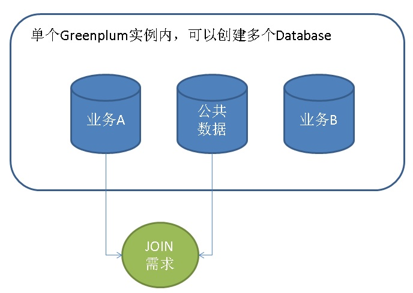
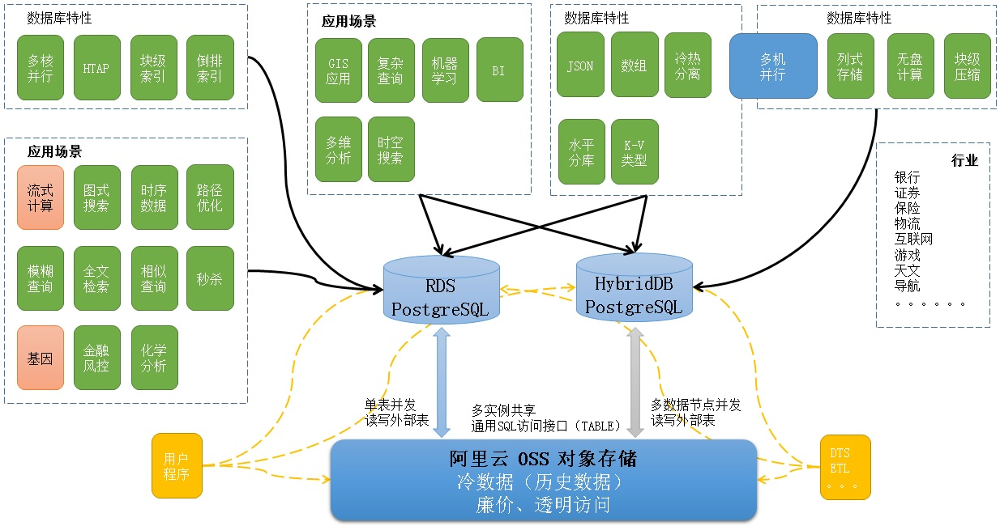

## Greenplum 跨库数据JOIN需求 - dblink的使用和弊端以及解决方案  
##### [TAG 11](../class/11.md)
                                    
### 作者                                    
digoal                                    
                                    
### 日期                                    
2017-05-06                                   
                                    
### 标签                                    
PostgreSQL , Greenplum , dblink          
                                    
----                                    
                                    
## 背景                       
Greenplum在许多企业中被用于数据仓库，一个企业中通常会有统一的用户管理系统，账务系统；还有许多业务线。  
  
数据被分成两类，一类是业务相关的，一类是全公司统一的数据。  
  
如果用户将两个部分数据分别存入不同的数据库（单个实例可以创建多个数据库），并且公共数据需要与业务数据JOIN时，你可能会想到dblink这个功能，通过DBLINK管理其他数据库然后和本地数据进行JOIN。  
  
  
  
  
  
如果你对实例和数据库的概念不太理解，可以参考一下这篇文档。  
  
[《PostgreSQL 逻辑结构 和 权限体系 介绍》](../201605/20160510_01.md)    
  
那么到底dblink是否适合这个场景呢？  
  
## 部署dblink on Greenplum  
Greenplum默认并没有打包dblink，所以需要部署一下。  
  
### 下载与greenplum base postgresql 一致的postgresql源码  
例如现在greenplum base postgresql是8.3的版本。  
  
  
```  
cd postgresql-8.3/contrib/dblink/  
  
vi Makefile  
  
PG_CPPFLAGS = -I$(libpq_srcdir) -w  
  
export PATH=/home/gpdb/bin:$PATH  
  
USE_PGXS=1 make   
USE_PGXS=1 make install  
```  
  
将dblink.so拷贝到所有节点的gp软件目录  
  
```  
/bin/mkdir -p '/home/digoal/gp/lib/postgresql'  
/bin/sh /home/digoal/gp/lib/postgresql/pgxs/src/makefiles/../../config/install-sh -c -m 755  dblink.so '/home/digoal/gp/lib/postgresql/dblink.so'  
/bin/sh /home/digoal/gp/lib/postgresql/pgxs/src/makefiles/../../config/install-sh -c -m 644 ./uninstall_dblink.sql '/home/digoal/gp/share/postgresql/contrib'  
/bin/sh /home/digoal/gp/lib/postgresql/pgxs/src/makefiles/../../config/install-sh -c -m 644 dblink.sql '/home/digoal/gp/share/postgresql/contrib'  
/bin/sh /home/digoal/gp/lib/postgresql/pgxs/src/makefiles/../../config/install-sh -c -m 644 ./README.dblink '/home/digoal/gp/doc/postgresql/contrib'  
```  
  
## 测试  
需要使用dblink的数据库，执行dblink.sql  
  
```  
psql db1 -f ./dblink.sql  
```  
  
创建2张测试表，注意他们的分布键，用于观察。  
  
```  
create table tbl(id int);  
  
create table tbl1(c1 int,id int);  
  
postgres=# \d tbl  
      Table "public.tbl"  
 Column |  Type   | Modifiers   
--------+---------+-----------  
 id     | integer |   
Distributed by: (id)  
  
postgres=# \d tbl1  
     Table "public.tbl1"  
 Column |  Type   | Modifiers   
--------+---------+-----------  
 c1     | integer |   
 id     | integer |   
Distributed by: (c1)  
```  
  
分别插入100万测试数据  
  
```  
insert into tbl select generate_series(1,1000000);  
insert into tbl1 select 1,generate_series(1,1000000);  
```  
  
### 测试1，原地JOIN  
  
Redistribute Motion 3:3，表示从3个节点重分布到3个节点，说明原始数据来自3个节点。  
  
Gather Motion 3:1，表示从3个节点汇聚到1个节点，  
  
```  
  
postgres=# explain analyze select count(*) from tbl join tbl1 on tbl.id=tbl1.id;  
                                                                                  QUERY PLAN                                                                                     
-------------------------------------------------------------------------------------------------------------------------------------------------------------------------------  
 Aggregate  (cost=72258.70..72258.71 rows=1 width=8)  
   Rows out:  1 rows with 648 ms to end, start offset by 17 ms.  
   ->  Gather Motion 3:1  (slice2; segments: 3)  (cost=72258.63..72258.68 rows=1 width=8)  
         Rows out:  3 rows at destination with 647 ms to first row, 648 ms to end, start offset by 17 ms.  
         ->  Aggregate  (cost=72258.63..72258.64 rows=1 width=8)  
               Rows out:  Avg 1.0 rows x 3 workers.  Max 1 rows (seg0) with 645 ms to end, start offset by 19 ms.  
               ->  Hash Join  (cost=23619.20..69756.61 rows=333603 width=0)  
                     Hash Cond: tbl1.id = tbl.id  
                     Rows out:  Avg 333333.3 rows x 3 workers.  Max 333385 rows (seg2) with 120 ms to first row, 560 ms to end, start offset by 19 ms.  
                     Executor memory:  7813K bytes avg, 7814K bytes max (seg2).  
                     Work_mem used:  7813K bytes avg, 7814K bytes max (seg2). Workfile: (0 spilling, 0 reused)  
                     (seg2)   Hash chain length 1.2 avg, 2 max, using 281103 of 524341 buckets.  
                       
		     因为两个表的JOIN字段并不都是他们的分布键，所以其中一个表会选择按JOIN字段进行重新分布，或者广播全表。（视成本决定）  
		       
		     ->  Redistribute Motion 3:3  (slice1; segments: 3)  (cost=0.00..31125.27 rows=333603 width=4)  
                           Hash Key: tbl1.id  
                           Rows out:  Avg 333333.3 rows x 3 workers at destination.  Max 333385 rows (seg2) with 0.102 ms to first row, 286 ms to end, start offset by 139 ms.  
                           ->  Seq Scan on tbl1  (cost=0.00..11109.09 rows=333603 width=4)  
                                 Rows out:  1000000 rows (seg0) with 0.118 ms to first row, 191 ms to end, start offset by 21 ms.  
                     ->  Hash  (cost=11109.09..11109.09 rows=333603 width=4)  
                           Rows in:  Avg 333333.3 rows x 3 workers.  Max 333385 rows (seg2) with 118 ms to end, start offset by 22 ms.  
                           ->  Seq Scan on tbl  (cost=0.00..11109.09 rows=333603 width=4)  
                                 Rows out:  Avg 333333.3 rows x 3 workers.  Max 333385 rows (seg2) with 0.027 ms to first row, 33 ms to end, start offset by 22 ms.  
 Slice statistics:  
   (slice0)    Executor memory: 163K bytes.  
   (slice1)    Executor memory: 257K bytes avg x 3 workers, 283K bytes max (seg0).  
   (slice2)    Executor memory: 24788K bytes avg x 3 workers, 24788K bytes max (seg0).  Work_mem: 7814K bytes max.  
 Statement statistics:  
   Memory used: 128000K bytes  
 Total runtime: 668.319 ms  
(28 rows)  
```  
  
### 测试2，一张表JOIN另一个DBLINK的结果  
  
从DBLINK结果的重分布信息(1:3)，可以分析出这样的结论  
  
1\. 可以肯定的是，DBLINK并没有在每个数据节点执行，但是在哪个数据节点执行的，从计划上看不出来。  
  
2\. 由于DBLINK没有在所有节点执行，意味着，如果DBLINK返回的结果集很大的话，这个执行节点的压力会较大。  
  
```  
postgres=# explain analyze select count(*) from tbl join (select * from dblink('dbname=postgres','select * from tbl1') AS t(c1 int,id int)) t on tbl.id=t.id;  
                                                                                     QUERY PLAN                                                                                       
------------------------------------------------------------------------------------------------------------------------------------------------------------------------------------  
 Aggregate  (cost=13691.18..13691.19 rows=1 width=8)  
   Rows out:  1 rows with 1673 ms to end, start offset by 7.751 ms.  
   ->  Gather Motion 3:1  (slice2; segments: 3)  (cost=13691.11..13691.17 rows=1 width=8)  
         Rows out:  3 rows at destination with 1669 ms to first row, 1673 ms to end, start offset by 7.752 ms.  
         ->  Aggregate  (cost=13691.11..13691.12 rows=1 width=8)  
               Rows out:  Avg 1.0 rows x 3 workers.  Max 1 rows (seg0) with 1670 ms to end, start offset by 11 ms.  
               ->  Hash Join  (cost=65.00..13688.61 rows=334 width=0)  
                     Hash Cond: tbl.id = t.id  
                     Rows out:  Avg 333333.3 rows x 3 workers.  Max 333385 rows (seg2) with 1469 ms to first row, 1629 ms to end, start offset by 11 ms.  
                     Executor memory:  7813K bytes avg, 7814K bytes max (seg2).  
                     Work_mem used:  7813K bytes avg, 7814K bytes max (seg2). Workfile: (0 spilling, 0 reused)  
                     (seg2)   Hash chain length 1.6 avg, 4 max, using 205910 of 262151 buckets.  
                     ->  Seq Scan on tbl  (cost=0.00..11109.09 rows=333603 width=4)  
                           Rows out:  Avg 333333.3 rows x 3 workers.  Max 333385 rows (seg2) with 0.039 ms to first row, 37 ms to end, start offset by 1479 ms.  
                     ->  Hash  (cost=52.50..52.50 rows=334 width=4)  
                           Rows in:  Avg 333333.3 rows x 3 workers.  Max 333385 rows (seg2) with 1468 ms to end, start offset by 12 ms.  
                             
			   重分布信息，可以看出信息是从1个节点重分布到3个节点的。  
			   这里没有看到Gather Motion（即数据收到master的过程），是不是可以判断dblink是在某个数据节点上被执行的？还不能。  
			   ->  Redistribute Motion 1:3  (slice1)  (cost=0.00..52.50 rows=1000 width=4)  
                                 Hash Key: t.id  
                                 Rows out:  Avg 333333.3 rows x 3 workers at destination.  Max 333385 rows (seg2) with 1068 ms to first row, 1400 ms to end, start offset by 12 ms.  
                                   
				 dblink调用信息，这里看不出来它到底是在哪个节点调用的。也不知道是不是所有节点调用的。  
				 ->  Function Scan on dblink t  (cost=0.00..12.50 rows=3000 width=4)  
                                       Rows out:  1000000 rows with 1066 ms to first row, 1217 ms to end, start offset by 12 ms.  
                                       Work_mem used:  8193K bytes.  
 Slice statistics:  
   (slice0)    Executor memory: 163K bytes.  
   (slice1)    Executor memory: 41138K bytes (entry db).  Work_mem: 8193K bytes max.  
   (slice2)    Executor memory: 20767K bytes avg x 3 workers, 20767K bytes max (seg0).  Work_mem: 7814K bytes max.  
 Statement statistics:  
   Memory used: 128000K bytes  
 Total runtime: 1681.166 ms  
(29 rows)  
```  
  
### 测试3，自定义function 1的调用和重分布  
  
从重分布执行计划结果看，自定义函数也只在某个节点被调用。  
  
```  
create or replace function f() returns setof int as $$  
  select generate_series(1,100000);  
$$ language sql strict;  
```  
  
```  
postgres=# explain analyze select count(*) from tbl join (select * from f() as t(id)) t on tbl.id=t.id;  
                                                                                  QUERY PLAN                                                                                     
-------------------------------------------------------------------------------------------------------------------------------------------------------------------------------  
 Aggregate  (cost=13691.18..13691.19 rows=1 width=8)  
   Rows out:  1 rows with 276 ms to end, start offset by 8.441 ms.  
   ->  Gather Motion 3:1  (slice2; segments: 3)  (cost=13691.11..13691.17 rows=1 width=8)  
         Rows out:  3 rows at destination with 269 ms to first row, 276 ms to end, start offset by 8.442 ms.  
         ->  Aggregate  (cost=13691.11..13691.12 rows=1 width=8)  
               Rows out:  Avg 1.0 rows x 3 workers.  Max 1 rows (seg0) with 273 ms to end, start offset by 11 ms.  
               ->  Hash Join  (cost=65.00..13688.61 rows=334 width=0)  
                     Hash Cond: tbl.id = t.id  
                     Rows out:  Avg 33333.3 rows x 3 workers.  Max 33348 rows (seg0) with 177 ms to first row, 269 ms to end, start offset by 11 ms.  
                     Executor memory:  782K bytes avg, 782K bytes max (seg0).  
                     Work_mem used:  782K bytes avg, 782K bytes max (seg0). Workfile: (0 spilling, 0 reused)  
                     (seg0)   Hash chain length 1.0 avg, 1 max, using 33348 of 262151 buckets.  
                     ->  Seq Scan on tbl  (cost=0.00..11109.09 rows=333603 width=4)  
                           Rows out:  Avg 333333.3 rows x 3 workers.  Max 333385 rows (seg2) with 0.027 ms to first row, 31 ms to end, start offset by 188 ms.  
                     ->  Hash  (cost=52.50..52.50 rows=334 width=4)  
                           Rows in:  Avg 33333.3 rows x 3 workers.  Max 33348 rows (seg0) with 175 ms to end, start offset by 13 ms.  
                             
			   从一个节点重新分布到3个节点  
			   ->  Redistribute Motion 1:3  (slice1)  (cost=0.00..52.50 rows=1000 width=4)  
                                 Hash Key: t.id  
                                 Rows out:  Avg 33333.3 rows x 3 workers at destination.  Max 33348 rows (seg0) with 92 ms to first row, 167 ms to end, start offset by 13 ms.  
                                   
				 函数在某个节点被调用  
				 ->  Function Scan on f t  (cost=0.00..12.50 rows=3000 width=4)  
                                       Rows out:  100000 rows with 93 ms to first row, 101 ms to end, start offset by 12 ms.  
                                       Work_mem used:  1025K bytes.  
 Slice statistics:  
   (slice0)    Executor memory: 163K bytes.  
   (slice1)    Executor memory: 5313K bytes (entry db).  Work_mem: 1025K bytes max.  
   (slice2)    Executor memory: 6431K bytes avg x 3 workers, 6431K bytes max (seg0).  Work_mem: 782K bytes max.  
 Statement statistics:  
   Memory used: 128000K bytes  
 Total runtime: 284.298 ms  
(29 rows)  
```  
  
### 测试4，自定义function 2的调用和重分布  
  
某些情况会报错，例如： 当函数中有访问到数据库表，并且需要与其他表进行JOIN时。  
  
```  
postgres=# create or replace function f() returns setof int as $$  
  select id from tbl1;  
$$ language sql strict;  
CREATE FUNCTION  
```  
  
```  
postgres=# \set VERBOSITY verbose  
  
postgres=# explain analyze select count(*) from tbl join (select * from f() as t(id)) t on tbl.id=t.id;  
NOTICE:  XX000: function cannot execute on segment because it accesses relation "public.tbl1" (functions.c:155)  (entry db r10k04474.sqa.zmf:29999 pid=53723) (cdbdisp.c:1326)  
DETAIL:  SQL function "f" during startup  
LOCATION:  cdbdisp_finishCommand, cdbdisp.c:1326  
  
  
postgres=# explain analyze select count(*) from f();  
                                              QUERY PLAN                                                
------------------------------------------------------------------------------------------------------  
 Aggregate  (cost=20.00..20.01 rows=1 width=8)  
   Rows out:  1 rows with 1383 ms to end, start offset by 0.071 ms.  
   ->  Function Scan on f  (cost=0.00..12.50 rows=3000 width=0)  
         Rows out:  1000000 rows with 1186 ms to first row, 1275 ms to end, start offset by 0.072 ms.  
         Work_mem used:  8193K bytes.  
 Slice statistics:  
   (slice0)    Executor memory: 33064K bytes.  Work_mem: 8193K bytes max.  
 Statement statistics:  
   Memory used: 128000K bytes  
 Total runtime: 1383.044 ms  
(10 rows)  
```  
  
### 测试5，单独调用dblink和自定义函数  
  
从执行计划可以看出，没有Gather motion节点，说明dblink函数和自定义函数就是在master节点执行的。  
  
```  
postgres=# explain analyze select count(*) from dblink('dbname=postgres','select * from tbl1') as t(c1 int,id int);  
                                              QUERY PLAN                                                
------------------------------------------------------------------------------------------------------  
 -- 注意这里没有Gather Motion节点，那说明dblink函数就是在master执行的  
 Aggregate  (cost=20.00..20.01 rows=1 width=8)  
   Rows out:  1 rows with 1306 ms to end, start offset by 0.074 ms.  
   ->  Function Scan on dblink t  (cost=0.00..12.50 rows=3000 width=0)  
         Rows out:  1000000 rows with 1099 ms to first row, 1195 ms to end, start offset by 0.075 ms.  
         Work_mem used:  8193K bytes.  
 Slice statistics:  
   (slice0)    Executor memory: 41029K bytes.  Work_mem: 8193K bytes max.  
 Statement statistics:  
   Memory used: 128000K bytes  
 Total runtime: 1306.167 ms  
(10 rows)  
  
postgres=# explain analyze select count(*) from f() as t(id);  
                                             QUERY PLAN                                               
----------------------------------------------------------------------------------------------------  
 -- 注意这里没有Gather Motion节点，那说明f()函数就是在master执行的  
 Aggregate  (cost=20.00..20.01 rows=1 width=8)  
   Rows out:  1 rows with 826 ms to end, start offset by 0.072 ms.  
   ->  Function Scan on f t  (cost=0.00..12.50 rows=3000 width=0)  
         Rows out:  1000000 rows with 627 ms to first row, 718 ms to end, start offset by 0.072 ms.  
         Work_mem used:  8193K bytes.  
 Slice statistics:  
   (slice0)    Executor memory: 33064K bytes.  Work_mem: 8193K bytes max.  
 Statement statistics:  
   Memory used: 128000K bytes  
 Total runtime: 825.970 ms  
(10 rows)  
```  
  
如果在数据节点执行，应该有Gather motion节点，例如  
  
```  
postgres=# explain analyze select * from tbl1;  
                                                  QUERY PLAN                                                     
---------------------------------------------------------------------------------------------------------------  
 -- 数据从3个数据节点收到MASTER节点  
 Gather Motion 3:1  (slice1; segments: 3)  (cost=0.00..11109.09 rows=1000809 width=8)  
   Rows out:  1000000 rows at destination with 3.191 ms to first row, 335 ms to end, start offset by 0.284 ms.  
   ->  Seq Scan on tbl1  (cost=0.00..11109.09 rows=333603 width=8)  
         Rows out:  1000000 rows (seg0) with 0.032 ms to first row, 96 ms to end, start offset by 3.223 ms.  
 Slice statistics:  
   (slice0)    Executor memory: 235K bytes.  
   (slice1)    Executor memory: 139K bytes avg x 3 workers, 155K bytes max (seg0).  
 Statement statistics:  
   Memory used: 128000K bytes  
 Total runtime: 415.013 ms  
(10 rows)  
  
  
两阶段聚合的例子  
  
postgres=# explain analyze select count(*) from tbl1;  
                                                       QUERY PLAN                                                          
-------------------------------------------------------------------------------------------------------------------------  
 -- master节点的聚合操作  
 Aggregate  (cost=13611.18..13611.19 rows=1 width=8)  
   Rows out:  1 rows with 360 ms to end, start offset by 0.349 ms.  
     
   -- 数据从3个数据节点收到MASTER节点  
   ->  Gather Motion 3:1  (slice1; segments: 3)  (cost=13611.11..13611.17 rows=1 width=8)  
         Rows out:  3 rows at destination with 3.013 ms to first row, 360 ms to end, start offset by 0.350 ms.  
           
	 -- 数据节点的聚合操作  
	 ->  Aggregate  (cost=13611.11..13611.12 rows=1 width=8)  
               Rows out:  Avg 1.0 rows x 3 workers.  Max 1 rows (seg0) with 356 ms to end, start offset by 4.229 ms.  
               ->  Seq Scan on tbl1  (cost=0.00..11109.09 rows=333603 width=0)  
                     Rows out:  1000000 rows (seg0) with 0.028 ms to first row, 244 ms to end, start offset by 4.230 ms.  
 Slice statistics:  
   (slice0)    Executor memory: 159K bytes.  
   (slice1)    Executor memory: 163K bytes avg x 3 workers, 163K bytes max (seg0).  
 Statement statistics:  
   Memory used: 128000K bytes  
 Total runtime: 360.824 ms  
(14 rows)  
```  
  
分布式数据库两阶段聚合的原理请参考  
  
[《Postgres-XC customized aggregate introduction》](../201305/20130502_01.md)    
  
[《Greenplum 最佳实践 - 估值插件hll的使用(以及hll分式聚合函数优化)》](../201608/20160825_02.md)    
  
## Greenplum dblink 弊端  
目前dblink与普通的用户自定义函数类似，并没有和Greenplum的MPP架构进行适配，它们会在master节点被调用，如果dblink返回的结果集较大，master很容易成为瓶颈。  
  
如果需要使用dblink与其他表进行JOIN，流程是这样的。  
  
1\. 首先在master调用dblink，  
  
2\. dblink执行的结果集会收到master节点  
  
3\. master节点将结果集重分布到数据节点，  
  
4\. 然后再与其他表进行JOIN。（好在JOIN并不会在master节点执行。）  
  
当然，我们不排除gpdb社区未来会改造dblink，来适配MPP的架构。但是至少目前还存在以上弊端，(除非dblink返回的结果集很小，否则请谨慎使用）。  
  
## 建议的方案  
1\. 建议数据放到一个数据库中，使用不同的schema来区分不同的业务数据或公共数据。这样的话在同一个数据库中就可以任意的JOIN了，对master无伤害。  
  
2\. 如果不同业务一定要使用多个数据库，那么建议使用外部表作为公共表，这样做也不会伤害MASTER，并且每个节点都可以并行的访问外部表的数据。  
  
例如gpfdist外部表，阿里云HybridDB的OSS外部表等。  
  
外部表一旦写入，就不可修改，如果公共数据经常变化，或者定期需要更新，（例如某些账务系统，每天或定期会将用户信息更新到Greenplum中）那么建议使用一个字段来标示最新数据，同时低频率的增量合并外部表。  
  
例如   
  
2\.1\. 只写 tbl_foreign_table_news(id int, xxx, xxx 最后更新时间)。  
  
2\.2\. 低频率的truncate tbl_foreign_table_origin，然后将tbl_foreign_table_news合并到 tbl_foreign_table_origin。  
  
2\.3\. 用户查询tbl_foreign_table_origin即为公共数据。  
  
3\. 如果dblink获取的结果集较小，那么使用dblink作为临时的方案，来实现实例内跨库数据JOIN是没有太大问题的。  
  
### 阿里云HybridDB for PostgreSQL经典用法  
  
  
  
## 参考  
[《PostgreSQL 逻辑结构 和 权限体系 介绍》](../201605/20160510_01.md)    
  
[《Postgres-XC customized aggregate introduction》](../201305/20130502_01.md)    
  
[《Greenplum 最佳实践 - 估值插件hll的使用(以及hll分式聚合函数优化)》](../201608/20160825_02.md)    
  
  
  
  
  
  
  
  
  
  
  
  
  
  
#### [免费领取阿里云RDS PostgreSQL实例、ECS虚拟机](https://free.aliyun.com/ "57258f76c37864c6e6d23383d05714ea")
  
  
#### [digoal's PostgreSQL文章入口](https://github.com/digoal/blog/blob/master/README.md "22709685feb7cab07d30f30387f0a9ae")
  
  

  
  
#### 老婆的钱袋子：可以打赏哦^_^  

  
