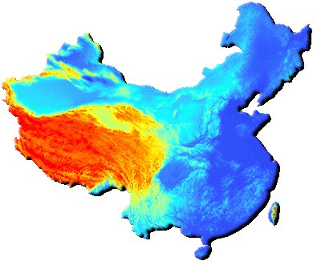
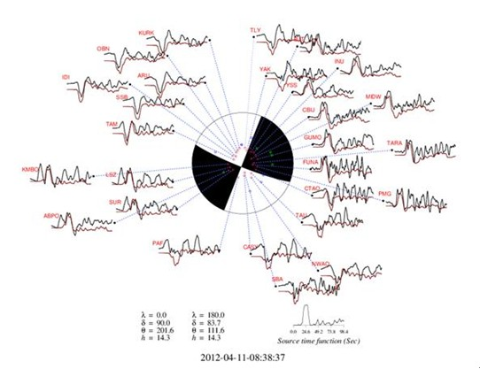
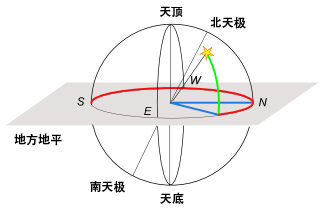
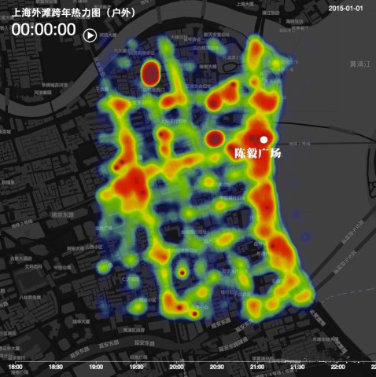
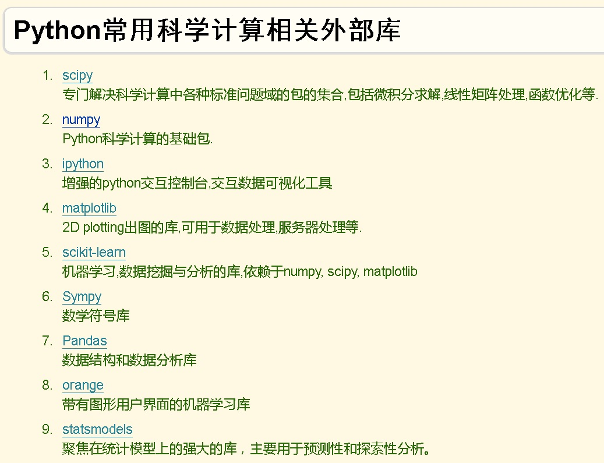
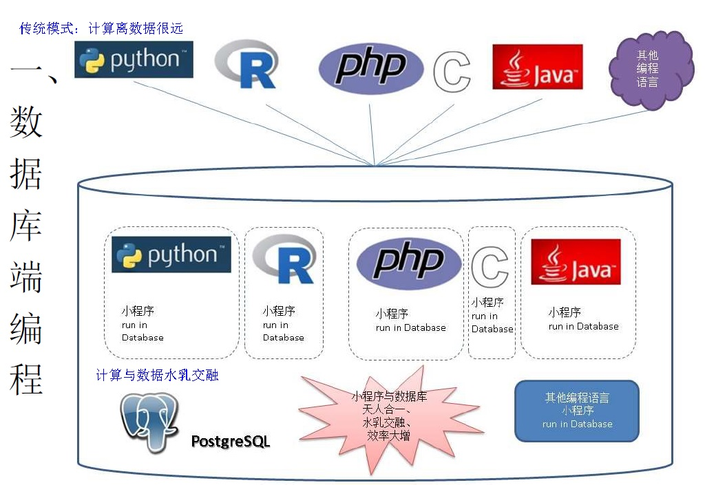
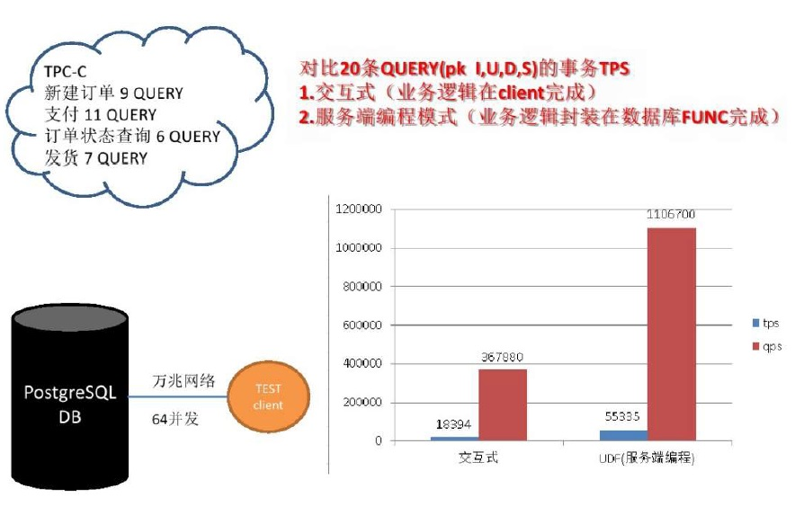
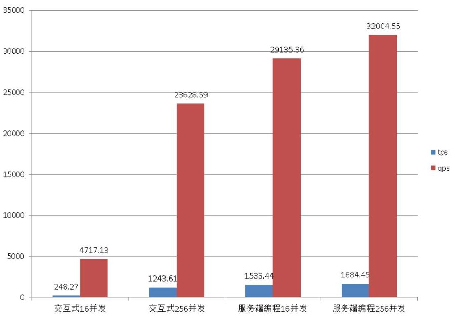
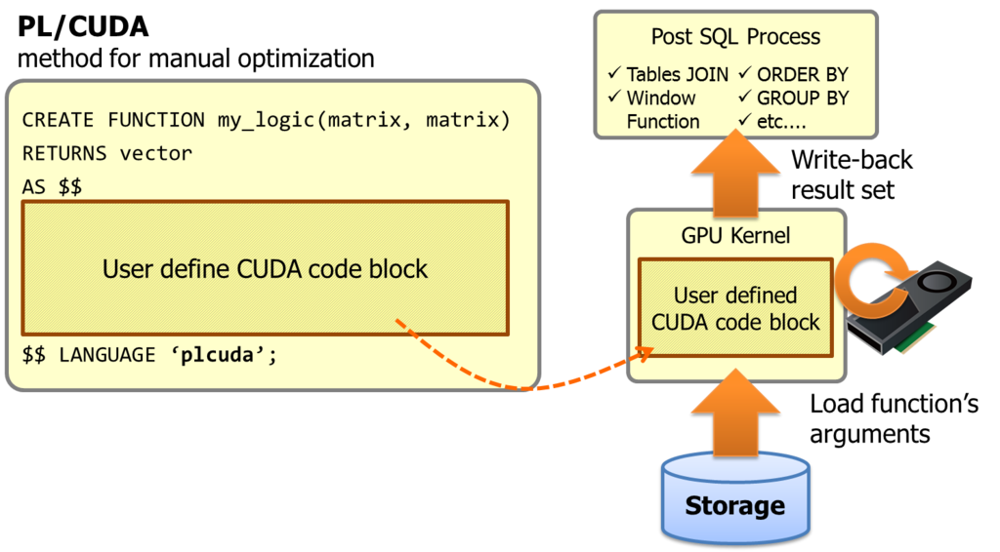
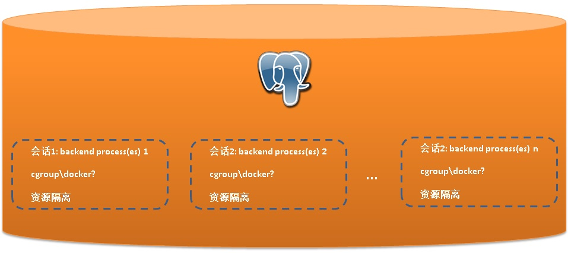

## 数据库任督二脉 - 数据与计算的生态融合    
                                          
### 作者      
digoal      
       
### 日期      
2017-05-26       
             
### 标签      
PostgreSQL , PostGIS , 点云 , GPU , FPGA , CPU , TPU , PL/language , 科研 , 嵌入式计算 , UDF , CUDA , 数据库嵌入式编程 , 流式计算 , 科学计算 , 软硬一体      
      
----      
         
## 背景      
随着技术的普及，越来越多以前需要很高的成本才能获取的数据，现在触手可及。      
    
1\. 点云（点的位置坐标+RGB+其他属性），以前只有军用领域在使用，比如《普罗米修斯》这部电影，通过一些小的飞行器（点云传感器设备）飞入未知的通道后，传回获取的点云数据，从而构建通道的全系影像。       
    
       
    
现在民用领域，也有很多点云的类似应用。例如：扫地机器人，无人车，消防（探测房屋结构），VR（通过点云数据构建全息影像）等等。        
    
       
    
2\. 气象数据 （位置、日照、温度、雨量、风量等），气象数据往往是栅格类型的数据，一个栅格包含了一片区域的日照、温度、雨量、风量等数据，栅格可以切分和聚合。    
    
气象数据的有非常多的用途，例如：    
    
光伏电厂的选址，需要分析某区域某个时间段，日照数据统计。    
    
多个栅格的数据聚合，或者一个栅格数据的部分截取等。比如一个包含了浙江省的栅格数据，如果只需要杭州市区的数据，那么可以在读取时将杭州的区域切分出来。    
    
在时间维度上分析，在地理位置维度上分析，在其他属性维度分析，多个维度的分析。    
    
生成时序动态图等。    
    
历史栅格数据不断的积累，不停的上传新的数据使得历史数据越来越多。    
    
       
    
3\. 地震数据（高频波，傅立叶变换），地震数据是一些包含了地理位置属性的XYZ三个方向的高频波形数据，收到数据后，需要对其进行快速的数据转换，预测和告警。    
    
同时还需要对历史的数据进行挖掘。    
    
        
    
4\. 天文数据（寻天，星系，轨迹比对），从古至今，人类一直没有停止对外太空的探索，天文台就是一个最为直接的探索外太空的设备。    
    
有一个项目叫“寻天”，每天这些望远镜需要对天球坐标进行全方位的拍摄，拍摄的数据以栅格类型存入数据库，以备后续的分析。比如寻址超新星，寻找类太阳系等。其中寻找类太阳系就需要对单个栅格的多个历史数据进行比对，通过行星运行轨迹对光线造成的细微影响找出类太阳系的星体。    
    
涉及到大量的时间、空间维度的运算。    
    
        
    
5\. 室内定位（孤立坐标系、相对坐标系），实际上现在室内定位也非常的成熟了，例如你站在某个商场中，商场有若干个WIFI热点，只要你的手机开启了WIFI，那么通过3个WIFI热点与你的手机之间的信号强弱，就可以定位到你的位置。除了通过WIFI进行定位，还有磁场、声波、视觉等定位方法。定位后，数据以坐标+误差范围的形式存入数据库，这个坐标是相对坐标。    
    
室内定位有什么商业用途呢？例如可以获取某个时间点的人群分布，哪个商场或者站台附近聚集了人群，进行营销效果的挖掘。    
    
又比如，在时间+空间维度上，统计分析人流量，平均的驻留时间等。    
    
       
    
6\. 室外定位（定位方法：GPS、基站信号强弱等），人群踩踏事件预测，非法聚众预测，事件预测，某个位置的人群驻足时间（广告效应报告）等。    
    
       
    
7\. 其他，民用，军用    
    
还有那些喜闻乐见的应用，o2o, 地图, 导航, 位置交友, 都带有很强的时间、空间、业务数据属性。    
    
面向这么多的军用转民用技术，民用的软件技术有没有准备好？数据库有没有准备好接招呢？    
    
## 一、时间、空间、业务数据 - 存储与计算的挑战    
    
1\. 数据类型越来越丰富，例如大多数业务基本上都会包含空间数据。    
    
2\. 大多数的数据具备时序属性，例如金融数据、物联网传感数据、气象数据、天文数据、地震监测数据等。    
    
3\. 数据查询维度（筛选条件）越来越多，（时间、空间、UID等），例如    
    
在2017-01-01 ~ 2017-02-01这个月，某个点附近方圆30公里发生的事件。    
    
在某个时间段，所有区域发生的事件。    
    
在某个时间段，某个区域，某些用户发生的事件。    
    
4\. 数据的计算需求越来越复杂，参与计算的数据量越来越庞大，计算离数据太远导致传输效率浪费。    
    
越来越多计算下推的需求。    
    
5\. 业务对数据计算的时效性越来越高，越来越多的计算被前置（如流计算，数据清洗等）。    
    
6\. 业务对数据深度学习的需求越来越多，而计算与数据的距离使得效率低下。    
    
传统的存储与计算分离，使得整体的计算效率偏低。越来越多的计算前置、计算下推需求，来提升存储计算分离这种架构下的效率。    
    
## 二、数据库如何对接行业Lib生态 - 提升开发、执行效率，降低成本    
每个行业都有各自的特点，每个行业都有对行业理解深厚的ISV（地头蛇），每个行业都有各自的积累（开发框架、Lib库等）。    
    
例如    
    
在科学计算这个领域，有很多的python, R, go, julia语言相关的第三方库。这些行业第三方库是开发人员、科研人员对行业的理解与积累。（这些科学计算Lib库可能被广泛应用于气象预测、地震预测、金融等众多行业。）    
    
如果这些Lib库可以与数据紧密的结合，大大的拉近了计算与数据的距离，直接提升计算效率并且降低了成本，开发人员一定会很高兴。    
    
[<Python常用科学计算相关外部库>](http://gohom.win/2015/08/10/python-good-lib/)    
    
    
    
以往是这样算（数据从数据库拉取到应用程序，应用程序再对其进行计算）：    
    
       
    
现在是这样算（使用科学计算相关的Lib库，就在数据库里面算）：    
    
       
    
数据库与程序开发语言、以及对应的LIB库打通，是一件很美妙的事情。    
    
PostgreSQL的PL框架实现了这一点，目前已支持plcuda, plpython, plr, pljava, plperl, pltcl, C等非常多的内置编程语言，（通过接口，还可以支持更多的地球编程语言）。    
    
PLpythonu用法举例    
    
```  
这个UDF用于获取文件系统的使用情况    
  
create or replace function get_fs_info() returns void as $$  
import os    
import statvfs  
phydevs = []    
f = open("/proc/filesystems", "r")    
for line in f:    
  if not line.startswith("nodev"):    
    phydevs.append(line.strip())    
  retlist = []    
f = open('/etc/mtab', "r")    
for line in f:    
  if line.startswith('none'):    
    continue    
  fields = line.split()    
  device = fields[0]    
  mountpoint = fields[1]    
  fstype = fields[2]    
  if fstype not in phydevs:    
    continue    
  if device == 'none':    
    device = ''    
  vfs=os.statvfs(mountpoint)  
  available=vfs[statvfs.F_BAVAIL]*vfs[statvfs.F_BSIZE]/(1024*1024*1024)  
  capacity=vfs[statvfs.F_BLOCKS]*vfs[statvfs.F_BSIZE]/(1024*1024*1024)  
  used=capacity-available  
  plpy.notice('mountpoint',mountpoint,'capacityGB',capacity,'usedGB',used,'availableGB',available)  
$$ language plpythonu;  
```  
    
使用pl编程后，数据与计算水乳交融，效率大增。    
    
    
    
    
    
    
   
再通过 CPU多核并行、向量计算、JIT、GPU、FPGA等手段扩展单体计算能力。通过sharding、MPP等手段横向扩展。消灭瓶颈。  
     
## 三、数据库如何搭乘硬件发展的快车    
通常我们理解的计算单元就是CPU，然而随着技术的发展，越来越多专业的硬件，例如显卡计算单元GPU，例如可烧录，可编程的FPGA，还有随着AI火起来的面向机器学习的定制芯片TPU。    
    
[谷歌硬件工程师揭秘，TPU为何会比CPU、GPU快30倍？](https://www.leiphone.com/news/201704/55UjF0lafhIZVGJR.html)    
    
[老黄呕心之作，英伟达能凭借Tesla V100技压群雄吗？](https://www.leiphone.com/news/201705/ZTztMk9I6t8lVP2U.html?ulu-rcmd=0_5021df_art_0_a3ba8a6ccd22402199137fed4a3f604a)    
    
[深入理解 CPU 和异构计算芯片 GPU/FPGA/ASIC 1](https://www.qcloud.com/community/article/323436001490098149)    
    
[深入理解 CPU 和异构计算芯片 GPU/FPGA/ASIC 2](https://www.qcloud.com/community/article/35505001490098107)    
    
那么数据库能否跟上这波硬件发展的浪潮呢，或者说如何抓住硬件发展的红利呢？    
    
### 1 PostgreSQL如何与硬件整合    
    
1\. CPU    
    
CPU的发展趋于缓慢，主要包括 :     
    
扩展指令集，（如向量计算指令，已被PostgreSQL利用来加速OLAP数据分析场景，约有10倍的性能提升），例如    
    
[《PostgreSQL 向量化执行插件(瓦片式实现) 10x提速OLAP》](../201702/20170225_01.md)      
    
增加CPU计算单元，（例如PostgreSQL已支持多核并行计算，提升OLAP数据分析场景的性能，多核并行，一条SQL可以充分利用多个CPU核，缩短单条SQL的响应时间，特别适合OLAP业务），例如    
    
[《分析加速引擎黑科技 - LLVM、列存、多核并行、算子复用 大联姻 - 一起来开启PostgreSQL的百宝箱》](../201612/20161216_01.md)      
    
2\. GPU    
    
GPU与CPU的对比如下，GPU在核心数、FFLOPS、内存带宽方面，相比CPU有非常明显的优势。    
    
       
    
PostgreSQL通过pl/cuda语言接口，用户可以在数据库中直接使用GPU的计算能力。    
    
       
    
pl/cuda用法参考：    
    
https://github.com/pg-strom/devel    
    
3\. FPGA    
    
FPGA作为一种高性能、低功耗的可编程芯片，可以根据客户定制来做针对性的算法设计。所以在处理海量数据的时候，FPGA 相比于CPU 和GPU，优势在于：FPGA计算效率更高，FPGA更接近IO。    
    
FPGA不采用指令和软件，是软硬件合一的器件。对FPGA进行编程要使用硬件描述语言，硬件描述语言描述的逻辑可以直接被编译为晶体管电路的组合。所以FPGA实际上直接用晶体管电路实现用户的算法，没有通过指令系统的翻译。    
    
FPGA的英文缩写名翻译过来，全称是现场可编程逻辑门阵列，这个名称已经揭示了FPGA的功能，它就是一堆逻辑门电路的组合，可以编程，还可以重复编程。    
    
PostgreSQL 社区，xilinx都有这方面的结合产品。    
    
https://www.pgcon.org/2015/schedule/track/Hacking/799.en.html    
    
4\. TPU    
    
在Google I/O 2016的主题演讲进入尾声时，Google的CEO皮采提到了一项他们这段时间在AI和机器学习上取得的成果，一款叫做Tensor Processing Unit（张量处理单元）的处理器，简称TPU。在大会上皮采只是介绍了这款TPU的一些性能指标，并在随后的博客中公布了一些使用场景：    
    
Google一直坚信伟大的软件将在伟大的硬件的帮助下更加大放异彩，所以Google便在想，我们可不可以做出一款专用机机器学习算法的专用芯片，TPU便诞生了。     
    
TPU的灵感来源于Google开源深度学习框架TensorFlow，所以目前TPU还是只在Google内部使用的一种芯片。    
    
https://www.leiphone.com/news/201605/xAiOZEWgoTn7MxEx.html    
    
### 2 小结    
PostgreSQL以其扩展接口(pl/language, customscan, operator, type, index扩展)，可以非常方便的对接以上各种硬件计算单元，让数据和计算紧密的结合，提高能效比。    
    
通过利用指令集、多核计算对接CPU，通过PL/CUDA，customscan对接GPU，通过customscan对接FPGA，等等，一切都是为了提升计算能力。    
    
## 四、数据库的发展    
关系数据库发展了几十年，最核心的功能，依旧是支持可靠的数据存取、支持SQL接口。    
    
随着社会的进步，数据库正在添加越来越多的功能，比如GIS就是其中之一。    
    
为什么要将GIS功能添加到数据库中呢？在应用层实现不好吗？    
    
这个问题很有意思，在应用层实现当然是可以的，但不是最好的。    
    
举个例子，我们存储了一批用户、商铺的位置数据，要求某个用户周边的其他商铺，如果要在应用层实现这个功能，需要将位置数据都下载到程序端，然后计算距离，并输出周边的商铺。而用户请求的并发可能较高，请求的位置可能都不一样。在应用层实现这个功能，效率非常低下，因为每一次请求，都需要将数据载入应用层，同时需要计算每条记录的距离。印证了一句古话“远水解不了近渴”。    
    
       
    
在数据库层实现GIS这个功能遵循了两个宗旨：    
    
1\. 数据和计算在一起，每次请求不再需要move data，提升了整体效率。    
    
2\. 让数据库支持GIS类型和GIS索引，让每一次距离查询都可以通过索引检索，提升查询效率。    
    
       
    
可以看出，数据库的发展实际上也是遵循了以上原则，在保证数据库不会成为瓶颈的前提下，让整体的效率得以提升。    
    
### 1 PostgreSQL 哪些手段解决瓶颈问题？    
1\. 提升计算能力    
    
充分利用硬件的能力提升计算能力。例如结合 CPU指令、CPU多核协作、GPU、FPGA。。。    
    
2\. 提升开发效率    
    
SQL标准的兼容性越好，开发用起来越爽。    
    
支持的类型、function、索引越丰富，开发用起来越爽。    
    
支持的编程接口越丰富，开发人员越爽，例如通过plpython对接PyPI，通过plR对接CRAN，通过plcuda对接GPU开发生态。    
    
支持的开发框架越多，开发人员越爽。    
    
3\. 提升扩展能力    
    
分为两个部分的扩展，一部分是计算能力的扩展，另一部分是开发能力的扩展。    
    
扩展计算能力：    
    
通过sharding，水平扩展节点，扩展整体性能。    
    
通过MPP插件，扩展跨库计算能力。    
    
扩展开发能力：    
    
通过扩展接口（类型、索引、PL语言、UDF、解析器、执行器），支持更多的数据类型、索引类型、编程语言等。GIS就是其中一个例子，扩展了GIS类型、索引、UDF等等。    
    
3\.1 如何扩展数据类型？     
    
https://www.postgresql.org/docs/10/static/xtypes.html    
      
3\.2 如何扩展索引？      
    
https://www.postgresql.org/docs/10/static/xindex.html  
    
https://www.postgresql.org/docs/10/static/gist.html  
  
https://www.postgresql.org/docs/10/static/spgist.html  
  
https://www.postgresql.org/docs/10/static/gin.html  
  
https://www.postgresql.org/docs/10/static/brin.html  
    
3\.3 如何嫁接编程语言？    
  
https://www.postgresql.org/docs/10/static/plhandler.html  
    
3\.4 如何扩展操作符？     
  
https://www.postgresql.org/docs/10/static/xoper.html  
    
3\.5 如何扩展UDF？     
  
https://www.postgresql.org/docs/10/static/xfunc.html  
    
3\.6 如何扩展外部数据接口？  
  
https://www.postgresql.org/docs/10/static/fdwhandler.html  
  
3\.7 如何扩展聚合UDF？  
  
https://www.postgresql.org/docs/10/static/xaggr.html  
    
### 2 PostgreSQL 如何提升业务整体效率？    
1\. 计算与数据在一起，减少move data。    
    
前面举的GIS的例子说明了一个问题，频繁的移动数据使得程序的效率低下，如果将计算与数据结合起来，可以大幅的提升效率。    
    
### 3 PostgreSQL 如何融合行业Lib生态    
    
1\. 计算与数据在一起，减少move data。    
    
PostgreSQL内置了许多函数、数据类型、索引类型（已超越ORACLE支持的范畴），可以满足大多数的业务场景需求。    
    
如果内存的数据类型不能满足业务需求，可以通过类型扩展接口，扩展数据类型以及类型配套的操作符、函数、索引等。    
    
如果内置的函数、操作符无法满足业务对数据处理的需求时，用户可以通过plpython, plr, plcuda, pljava, plperl, pltcl等数据库过程语言，不仅扩展了编程能力，同时还对接了编程语言生态。    
    
例如PyPI, CRAN等库，在数据库中完成对数据的一站式处理。    
    
这个章节描写了如何扩展PostgreSQL：类型、函数、操作符、索引、聚合等。    
    
https://www.postgresql.org/docs/10/static/extend.html    
    
2\. SQL接口流计算    
    
pipelinedb是基于PostgreSQL的一个流计算数据库，1.0版本将支持插件化，PostgreSQL用户可以通过安装插件的方式，支持流计算的功能。    
    
SQL流计算有诸多好处，数据库的SQL接口非常成熟，支持非常成熟的统计分析函数，统计分析语法。建立流的过程非常简单。    
    
[《(流式、lambda、触发器)实时处理大比拼 - 物联网(IoT)\金融,时序处理最佳实践》](../201705/20170518_01.md)      
    
[《流计算风云再起 - PostgreSQL携PipelineDB力挺IoT》](../201612/20161220_01.md)      
    
SQL接口的流计算，使用便捷，开发成本低，启动成本低，扩展能力强，效率高。    
    
除此之外，PostgreSQL还整合了CPU\GPU\FPGA等计算能力，整合了PL编程接口，流式处理的能力更加的强大。    
      
比如气象类应用，大量的用到了GIS + 科学计算（plpython）+ 流式计算 + GPU （pl cuda）的处理能力。使用PostgreSQL就非常的恰当。      
      
[《PostgreSQL 支持CUDA编程 pl/cuda》](20170526_01_pdf_001.pdf)    
    
[《PostgreSQL 点云应用》](20170526_01_pdf_002.pdf)    
    
## 五、小结    
对企业来说，数据和计算是两个不可分割的部分。    
    
经历了几十年的发展，数据库在数据的可靠存取、业务连续性方面成就卓越，企业也非常相信数据库这方面的能力，通常会将数据都存入数据库中。    
    
同时企业对数据的计算需求也在膨胀，从最初的简单计算，到现在越来越复杂的计算需求。计算的需求分为两个部分，1、运算能力，2、编程能力。       
    
1\. 数据库在运算方面的能力也在逐渐提高，但是在兼顾数据可靠性的前提下，弹性提升运算能力没有想象中容易，大多数的关系数据库仅仅依赖 CPU\硬盘 等本地硬件能力的提升，运算能力提升非常有限，企业也不能等待数据库在这方面的提升。    
    
2\. 数据库在编程能力方面，有几种提升手段，一种是扩展SQL语法，支持更多的数据类型、函数、索引等。另一种是语言的支持，通常数据库会内置存储过程语言，例如Oracle的PL/SQL，PostgreSQL的plpgsql，但是这些语言的编程能力有限。    
    
所以市场中衍生出适合各种场景的数据库或框架，以牺牲"并发能力、数据可靠性、一致性、易用性、事务、功能等"的某些部分为代价。例如 时序数据库、流计算数据库、NOSQL、大数据框架、分布式数据库 等等。    
    
那么关系数据库到底还能不能提升计算能力呢？    
    
实际上还是和数据库本身的框架有关，PostgreSQL的框架特别有意思，开放了众多的接口，在保证数据库核心功能不妥协的前提下，允许对其进行扩展。包括：    
    
数据库服务端编程语言(PLpython, java, perl, R, ...)、类型、函数、操作符、索引、聚合、外部存储、customScan等。    
    
### 数据库的未来 - HTAP    
Hybrid Transactional/Analytical Processing (HTAP)是gartner提出的一个新名词，代表一种既能处理在线事务，又能处理分析型请求的混合数据库。    
    
https://en.wikipedia.org/wiki/Hybrid_Transactional/Analytical_Processing_(HTAP)    
    
       
    
要实现HTAP，必须打通数据、计算的任督二脉。PostgreSQL在这方面具有天然的优势，从这几年的发展也能看出端倪。    
    
1\. 通过PL(数据库内置编程语言(PLpython, java, perl, R, ...))对接行业生态，让开发者积累的Lib得以传承。    
    
2\. 通过扩展接口对接硬件生态，让CPU,GPU,FPGA,TPU,ASIC等参与垂直的专业计算，提升效率，打破传统的CPU ONLY的模式。    
    
3\. 通过流实现计算前置，解决数据的实时计算需求。    
    
4\. 通过FDW接口，存储接口将计算下推，让更多具备运算能力的单元参与运算，避免集中式运算的局面。提升大数据量的处理能力。    
    
其中的代表包括postgres_fdw, 阿里云的oss_fdw。    
    
5\. 通过sharding技术实现数据库的水平扩展。    
    
6\. 通过MPP提升大规模计算协作能力。    
    
7\. BSD-like许可，已经有非常多的企业以PostgreSQL为基础打造了更多的衍生产生，免去重复造轮子的过程。   
    
8\. 扩展类型、函数、操作符、索引接口，对接垂直行业生态。    
    
PostGIS, 基因类型, 化学类型, 图像特征类型, 全文检索等插件，就是非常典型的例子。支持更多的垂直行业应用。        
    
9\. 当数据库可以无限扩展，具备强大的计算能力时，它已然不是一个传统的只能存取数据的数据库，而是一个提供了编程能力、计算能力、扩展能力的数据平台(或数据工厂)，提升数据的使用效率、节约成本。    
    
10\. 即使数据库可以无限扩展，还有一点需要注意，资源的控制。特别是开放了pl之后，用户写的代码可能把资源用尽。一个比较有效的资源调度：当系统有足够的空闲资源时放开用，当系统资源不足时，按权重调度分配资源的使用。     
    
PostgreSQL是进程模型，这方面可以结合docker, cgroup等手段实现资源的控制。      
    
    
     
## 六、参考      
http://postgis.net/docs/manual-dev/    
    
https://2016.foss4g-na.org/sites/default/files/slides/gbroccolo_FOSS4GNA2016_pointcloud_0.pdf    
    
https://www.slideshare.net/kaigai/pgconfsv2016-plcuda/    
    
https://github.com/pg-strom/devel    
    
http://www.pgconfsv.com/program/schedule    
    
http://kaigai.hatenablog.com/entry/2016/11/17/070708    
    
http://www.pgconfsv.com/plcuda-fusion-hpc-grade-power-database-analytics-0    
    
http://www.pgconf.asia/JP/wp-content/uploads/2016/12/20161203_PGconf.ASIA_PLCUDA.pdf    
    
http://gohom.win/2015/08/10/python-good-lib/    
    
[《PostgreSQL 数据库扩展语言编程 之 plpgsql - 1》](../201701/20170110_01.md)     
    
http://it.sohu.com/20170525/n494441009.shtml    
    
https://www.leiphone.com/news/201704/55UjF0lafhIZVGJR.html    
    
