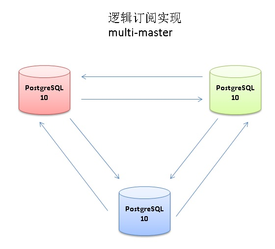

## 使用PostgreSQL逻辑订阅实现multi-master   
              
### 作者              
digoal              
              
### 日期              
2017-06-20             
              
### 标签              
PostgreSQL , multi master , 逻辑订阅        
              
----              
              
## 背景          
很多业务要求多活，但是多活中最难搞定的实际上是数据库，大多数业务通过分流，例如将数据根据UID切分到不同的IDC，同一个UID的数据永远只会写到一个IDC中，然后通过数据复制技术，将对应的数据复制到其他的IDC。  
  
这种形态的多活是比较安全的，即同一条记录不会被多个IDC执行DML。如果同一条记录涉及到多个IDC的DML，那么数据库的一致性会受到极大挑战，比如同一条记录被多个IDC更新，到底以哪个为准？  
  
同时多活还要解决另一个问题，数据的循环问题，例如A写入一条数据，需要复制到B，B写入的数据也要复制给A。如果没有手段防止循环的话，一条记录就可以把多活数据库弄趴下。  
  
multi-master的两个重大课题是解决冲突以及死循环的问题。  
  
PostgreSQL 10引入了逻辑订阅的功能，可以轻松的实现单向复制，同时为双向复制(multi-master)提供了天然的支持，本文将介绍如何利用逻辑订阅实现multi-master。  
  
  
  
## 解决冲突  
解决冲突的方法很多，例如以某个字段的值来判断（例如时间字段，以最大或最小为准）。  
  
针对不同的操作，解法不一。  
  
1、INSERT  
  
建议业务层面保证PK不冲突。  
  
或者以某个字段的最大值为准，或者以某个节点为准，或者使用自定义handler。（建议新增两个字段，一个表示NODE ID，另一个表示记录的创建时间或最后一次修改时间）  
  
可以通过HOOK实现，在内核中INSERT阶段应用以上规则。  
  
2、UPDATE   
  
以某个字段的最大值为准，或者以某个节点为准，或者使用自定义handler。（建议新增两个字段，一个表示NODE ID，另一个表示记录的创建时间或最后一次修改时间）  
  
可以通过HOOK实现，在内核中UPDATE阶段应用以上规则。  
  
3、DELETE   
  
无冲突  
  
4、自由定义冲突handler。  
  
这个是一些multi-cluster提出的，比较人性化，即复制过程中，如果出现报错，自动调用对应的handler对应的function来处理。  
  
例如pglogical, bdr, xDB 都有类似的机制。  
  
PS  
  
目前PG 10在遇到冲突（比如INSERT遇到PK异常，或者任何其他异常），会终止apply，此时需要人为介入，例如SKIP对应的WAL。  
  
1\. 通过修改订阅端的数据，解决冲突。例如insert违反了唯一约束时，可以删除订阅端造成唯一约束冲突的记录先DELETE掉。然后使用ALTER SUBSCRIPTION name ENABLE让订阅继续。    
  
如果是双向复制（multi-master）则不建议使用方法1。    
    
2\. 在订阅端调用pg_replication_origin_advance(node_name text, pos pg_lsn)函数，node_name就是subscription name，pos指重新开始的LSN，从而跳过有冲突的事务。    
    
```    
pg_replication_origin_advance(node_name text, pos pg_lsn)           
    
Set replication progress for the given node to the given position.     
    
This primarily is useful for setting up the initial position or a new position after configuration changes and similar.     
    
Be aware that careless use of this function can lead to inconsistently replicated data.    
```    
    
当前的lsn通过pg_replication_origin_status.remote_lsn查看。    
    
https://www.postgresql.org/docs/devel/static/view-pg-replication-origin-status.html    
  
## 解决死循环  
如果不解决死循环的问题，multi-master的某个节点插入一条记录，这条记录复制到另一个节点后，还会回流到某节点，无限循环。  
  
解决死循环的问题方法比较简单，  
  
1、对需要双向复制的表，添加一个字段（无默认值），表示这条记录是来自PEER节点，还是本地插入、更新、删除的。  
  
为了方便溯源，也可以加一个gtid字段用来分辨记录是来自哪个节点的。(在触发器中体现)  
  
2、对需要双向复制的表，添加一个触发器函数，触发器中需要以下逻辑：  
  
```  
insert or update  
  
  if pid <> replic pid then        -- 本地发起的insert  
    NEW.islocal = true        
  else                             -- 对端节点发起的insert  
    if NEW.islocal = false then    -- 对端也是别人那里复制过来的  
      return NULL;  
    else                           -- 对端是自己产生的  
      NEW.islocal = false          -- 置为对端发来的  
    end if;  
  end if;  
  
  return NEW;  
    
```  
  
## 示例  
### 环境  
3个PostgreSQL 10实例。分别对应端口  
  
```  
1922  
  
1923  
  
1924  
```  
  
### multi-master 实施步骤  
  
1、创建测试表  
  
```  
create table mm(  
  id int primary key,   -- 需要多向复制的表，建议必须有PK，对于multi-master，建议使用序列start val错开。  
  info text,            -- 原始表结构内的字段  
  crt_time timestamp,   -- 原始表结构内的字段  
  islocal boolean,      -- 为复制新建的标记位(表示这条记录是本地发生的，还是复制过来的)  
  last_time timestamp default clock_timestamp()  -- 为复制新建的last timestamp  
);  
  
  
实际生产如下，使用序列start val错开PK，建议这个PK是隐式PK，用户业务不涉及它  
  
create table mm(  
  id int primary key default nextval('seq'::regclass),     
  info text,              
  crt_time timestamp,     
  islocal boolean,        
  last_time timestamp default clock_timestamp()      
);  
  
  
1922  
create sequence seq increment by 16 start with 1;  
  
  
1923  
create sequence seq increment by 16 start with 2;  
  
  
1924  
create sequence seq increment by 16 start with 3;  
```  
  
2、创建触发器函数，解决死循环问题  
  
```  
create or replace function tg() returns trigger as $$  
declare  
  replica_pids int[];  
begin  
  select array(select pid from pg_stat_activity where application_name ~ 'logical replication worker') into replica_pids;  
  
  if array_position(replica_pids, pg_backend_pid()) is null then          -- 本地发起的insert或update  
    NEW.islocal = true ;  
  else                                                                    -- 对端节点发起的insert或update  
    if NEW.islocal = false then                                           -- 判断，发生了循环  
      return null;                                                        -- 跳过  
    else  
      NEW.islocal = false;  
    end if;  
  end if;  
  
  return NEW;  
end;  
$$ language plpgsql strict;  
```  
  
PS，使用pg_stat_activity可以得到logical replication worker的pids.  
  
```  
postgres=# select * from pg_stat_activity where pid=24505;  
-[ RECORD 1 ]----+--------------------------------------------------  
datid            | 13158  
datname          | postgres  
pid              | 24505  
usesysid         | 10  
usename          | postgres  
application_name | logical replication worker for subscription 45109  
client_addr      |   
client_hostname  |   
client_port      |   
backend_start    | 2017-06-22 15:50:33.285954+08  
xact_start       |   
query_start      |   
state_change     | 2017-06-22 16:40:04.983325+08  
wait_event_type  | Activity  
wait_event       | LogicalApplyMain  
state            | idle  
backend_xid      |   
backend_xmin     |   
query            |   
backend_type     | background worker  
```  
  
3、创建触发器  
  
```  
create trigger tg before insert or update on mm for each row execute procedure tg();  
```  
  
4、让触发器在所有连接中，包括replica进程中也生效  
  
```  
alter table mm enable always trigger tg;  
```  
  
5、创建发布  
  
```  
CREATE PUBLICATION pub1 FOR TABLE mm with (publish = 'insert, delete, update');  
  
-- alter publication pub1 add table mm;  
```  
  
前面的操作需要在所有实例执行。  
  
6、创建订阅，不同的实例操作分别如下。  
  
```  
1922  
CREATE SUBSCRIPTION sub1922_1923 CONNECTION 'host=127.0.0.1 port=1923 user=postgres dbname=postgres' PUBLICATION pub1;  
CREATE SUBSCRIPTION sub1922_1924 CONNECTION 'host=127.0.0.1 port=1924 user=postgres dbname=postgres' PUBLICATION pub1;  
  
1923  
CREATE SUBSCRIPTION sub1923_1922 CONNECTION 'host=127.0.0.1 port=1922 user=postgres dbname=postgres' PUBLICATION pub1;  
CREATE SUBSCRIPTION sub1923_1924 CONNECTION 'host=127.0.0.1 port=1924 user=postgres dbname=postgres' PUBLICATION pub1;  
  
1924  
CREATE SUBSCRIPTION sub1924_1922 CONNECTION 'host=127.0.0.1 port=1922 user=postgres dbname=postgres' PUBLICATION pub1;  
CREATE SUBSCRIPTION sub1924_1923 CONNECTION 'host=127.0.0.1 port=1923 user=postgres dbname=postgres' PUBLICATION pub1;  
```  
  
7、压测方法  
  
为了避免插入冲突导致复制中断，使用以下测试方法，3个实例插入的数据确保PK值是不一样的，（实际生产，可以使用序列的start value来错开）。  
  
更新则覆盖所有的值范围。  
  
```  
test1.sql  
  
\set id random(1,300000)  
insert into mm select 3*(random()*100000)::int, 'test', now() on conflict(id) do update set info='new';  
update mm set info='nnnnn' where id=:id;  
  
  
test2.sql  
  
\set id random(1,300000)  
insert into mm select 3*(random()*100000)::int+1, 'test', now() on conflict(id) do update set info='new';  
update mm set info='nnnnn' where id=:id;  
  
  
test3.sql  
  
\set id random(1,300000)  
insert into mm select 3*(random()*100000)::int+2, 'test', now() on conflict(id) do update set info='new';  
update mm set info='nnnnn' where id=:id;  
```  
  
8、压测  
  
```  
pgbench -M prepared -n -r -P 1 -f ./test1.sql -c 10 -j 10 -T 10 -p 1922  
  
pgbench -M prepared -n -r -P 1 -f ./test2.sql -c 10 -j 10 -T 10 -p 1923  
  
pgbench -M prepared -n -r -P 1 -f ./test3.sql -c 10 -j 10 -T 10 -p 1924  
```  
  
9、验证  
  
```  
1922  
postgres=# select sum(hashtext(t.id||t.info||t.crt_time)) from mm t;  
      sum         
----------------  
 -1378199912066  
(1 row)  
  
1923  
postgres=# select sum(hashtext(t.id||t.info||t.crt_time)) from mm t;  
      sum         
----------------  
 -1378199912066  
(1 row)  
  
1924  
postgres=# select sum(hashtext(t.id||t.info||t.crt_time)) from mm t;  
      sum         
----------------  
 -1378199912066  
(1 row)  
```  
  
10、测试删除  
  
```  
多节点复制成功  
  
最终验证结果一致  
```  
  
## 小结  
multi-master的要点，避免冲突（导致流复制中断，需要介入），避免死循环（节点间不停的产生REDO，循环执行）。  
  
本文使用巧妙的方法解决了这两个问题，实现了任意节点的multi-master。  
  
## 参考  
[《PostgreSQL 逻辑订阅 - 给业务架构带来了什么希望？》](../201704/20170413_01.md)    
  
[《PostgreSQL 10.0 preview 逻辑复制 - 原理与最佳实践》](../201702/20170227_01.md)    
  
[《PostgreSQL 10.0 preview 功能增强 - 逻辑订阅端worker数控制参数》](../201704/20170421_05.md)    
  
[《PostgreSQL 10.0 preview 变化 - 逻辑复制pg_hba.conf变化,不再使用replication条目》](../201704/20170405_02.md)    
  
[《PostgreSQL 10.0 preview 功能增强 - 备库支持逻辑订阅,订阅支持主备漂移了》](../201703/20170330_01.md)    
  
[《PostgreSQL 10.0 preview 功能增强 - 逻辑复制支持并行COPY初始化数据》](../201703/20170328_01.md)    
  
https://www.2ndquadrant.com/en/resources/pglogical/  
  
https://www.2ndquadrant.com/en/resources/bdr/  
  
https://www.enterprisedb.com/products-services-training/products-overview/xdb-replication-server-multi-master  
  
https://github.com/postgrespro/postgres_cluster  
  
https://github.com/postgrespro/postgres_cluster/blob/master/contrib/mmts/doc/architecture.md  
