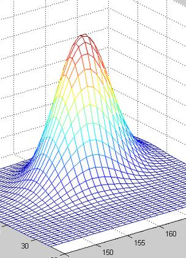
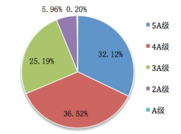
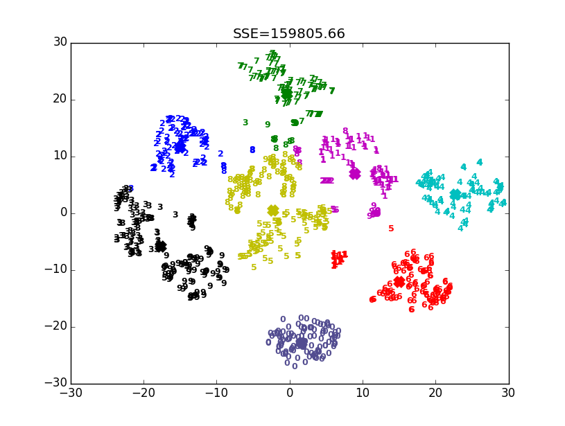

## 人分九等，数有阶梯 - PostgreSQL 阶品（颗粒）分析函数width_bucket, kmean应用    
                   
### 作者                    
digoal                   
                     
### 日期                     
2017-07-15                 
                              
### 标签              
PostgreSQL , width_bucket , 数据分布 , 包裹筛选 , 颗粒度筛选 , Oracle , 阶级分布 , kmean , ntile , 窗口函数              
              
----              
               
## 背景            
从古至今，现实社会中，到处充满了等级划分，例如东汉史学家、文学家班固《汉书》《古今人表》把人分九等。九品量表”之中，分为上（上智）．中（中人）．下（下愚）三等。在每个等级中又分为：上上．上中．上下，中上．中中．中下，以及下上．下中和下下三等。    
    
现代的一些见解：    
    
第一等：圣人。已参破红尘却仍然悲天悯人，已近神界却不孤芳自赏。    
    
第二等：英雄。胸怀远大，智慧超群，忍辱负重，力挽狂澜，解民众于水火。    
    
第三等：才俊。独立性强，才智过人，在科学、艺术领域对人类贡献极大。    
    
第四等：志士。徒有一腔热血，满腹才华，无奈命运多舛，加上自身的局限性，虽也做了一些事情，终是昙花一现。代表人物：屈原、郑和、谭嗣同、鲁迅、遇洛克、原《南方周末》有良知、有骨气的记者及网上有正义感的游侠。    
    
第五等：仁人。善良、纯净，急民之所需，痛民之所痛。 愿意放弃优越生活，去支援贫苦百姓的人。    
    
第六等：大众。善良纯朴，见浅识陋，奔波劳碌，人穷志短。虽有美好意愿，却无正义精神，可为“希望工程”捐款，而遇到邪恶立刻明哲保身。既可推动文明，亦能充当牺牲品或杀人工具。    
    
第七等：贱民。生活在底层，偷鸡摸狗，浑浑噩噩，苟延残喘，着实龌龊。代表人物：妓女、乞丐、骗子。如遇良好教育尚有希望。    
    
第八等：暴君。上帝的玩偶，派来警示人类的。    
    
第九等：小人。轻则小有才华，无病呻吟，蔑视苦难，以丑为美，误导大众，哗众取宠，玷污智慧，成就庸俗，如王家卫、金庸、转型后的张艺谋、明星、娱记、《Vogue》、纨绔子弟太子党，重则奴颜婢膝，胁肩谄笑，口是心非，生性阴暗见不得阳光，如吕后、郭沫若，以及多数中国当代官僚。    
    
    
    
以上参考自[豆瓣](https://www.douban.com/note/16492687/)    
    
除了人分九等，实际上我们还能看到各种的等级分布。例如：    
    
1、对全国高考成绩进行分布透视，你的高考成绩拿出来，会落在第几等呢？    
    
2、气温分布，你所在的城市，全年的平均气温会在全国排第几等呢？    
    
3、雨量分布，你所在的城市，全年的降雨量会在全国排在第几等呢？    
    
4、包裹分拣，按重量、按体积进行分拣，方便物流的运输。    
    
5、商品颗粒筛选，例如大米、枸杞、罗汉果、水果、大闸蟹等商品，按颗粒度的大小，分为不同的等级。    
    
    
    
6、收入等级，你的薪资水平落在第几等呢？是不是戳中小心脏了，是不是又拖全国平均工资后腿了呢？    
    
7、用水用电等级，现在水电都是阶梯价，不同的阶梯，定价都不一样。    
    
8、交税也按收入分等级。    
    
9、按每年接待的游客数分几个档，评选出不同级别的景区。    
    
    
    
10、对玩王者荣耀的时间进行统计，按游戏时长，对人群进行归类。    
    
11、对淘宝店铺的点击率、销量数据进行统计，划分店铺等级。     
    
还有好多分类或分级的例子。分级是为了更好的对数据进行归类，方便数据的透视。    
    
在数据库中，存储的通常是明细数据，如何进行等级划分或者分拣呢？      
    
接下来隆重推出PostgreSQL的两大归类分析利器。    
    
#### 1、width_bucket    
    
1、指定预设边界和等级个数，返回VALUE所处等级。    
    
适合求均匀分布的等级划分，例如超时的商品，按单价进行均匀分布的划分，看看每种商品落在哪个消费区间。    
    
2、指定预设边界数组，返回VALUE所处等级。    
    
适合求非均匀分布的等级划分，例如求收入水平、学习成绩的非均匀分布数据。60分以下为不及格，60-80为中，80-90为良，90-97为优，97以上为拔尖。    
    
#### 2、kmean    
    
一个聚类算法。    
    
    
    
PostgreSQL kmeans插件：    
    
[《K-Means 数据聚集算法》](../201508/20150817_01.md)      
    
## 一、分类利器1 width_bucket    
    
### 例子1    
淘宝店铺每天都有点击率，销量数据。对淘宝店铺在100 ~ 5000次浏览量均匀划分为10个等级，低于100为0等，高于5000为11等。    
    
1、设计表结构    
    
```    
create table test(    
  sid int,   -- 店铺ID    
  cnt_date date,  -- 日期    
  cnt int,  -- 浏览量    
  primary key (sid,cnt_date)  -- 主键约束    
);    
```    
    
2、生成正态分布的销量数据    
    
```    
vi test.sql    
    
\set cnt random_gaussian(0,10000,4)    
\set sid random(1,10000000)    
insert into test values (:sid, '2017-07-15', :cnt) on conflict (sid,cnt_date) do nothing;    
```    
    
写入测试数据    
    
```    
pgbench -M prepared -n -r -P 1 -f ./test.sql -c 32 -j 32 -T 120    
    
    
```    
    
3、等级统计透视    
    
在100 ~ 5000次浏览量均匀划分为10个等级，低于100为0等，高于5000为11等。    
    
```    
postgres=# select sid, cnt_date, cnt, width_bucket(cnt, 100, 5000, 10) as wb from test limit 10;    
   sid   |  cnt_date  | cnt  | wb     
---------+------------+------+----    
 1799658 | 2017-07-15 | 5708 | 11    
 9549703 | 2017-07-15 | 5016 | 11    
 2122532 | 2017-07-15 | 4413 |  9    
 7663952 | 2017-07-15 | 6199 | 11    
 7047657 | 2017-07-15 | 5655 | 11    
 8485951 | 2017-07-15 | 6902 | 11    
 5135164 | 2017-07-15 | 5929 | 11    
 5592226 | 2017-07-15 | 4213 |  9    
 3389938 | 2017-07-15 | 4091 |  9    
 1372024 | 2017-07-15 | 5505 | 11    
(10 rows)    
    
postgres=# select width_bucket(cnt, 100, 5000, 10) as wb, count(*) from test where cnt_date='2017-07-15' group by 1 order by 1;    
 wb |  count      
----+---------    
  0 |     129    
  1 |    1635    
  2 |    6368    
  3 |   21686    
  4 |   62661    
  5 |  155530    
  6 |  332831    
  7 |  610253    
  8 |  961658    
  9 | 1303200    
 10 | 1517335    
 11 | 4975181    
(12 rows)    
```    
    
4、等级占比透视    
    
```    
select wb, cnt, round(100*(cnt/(sum(cnt) over ())), 2)||' %' as ratio from     
  (select width_bucket(cnt, 100, 5000, 10) as wb, count(*) cnt from test where cnt_date='2017-07-15' group by 1) t order by wb;    
    
 wb |   cnt   |  ratio      
----+---------+---------    
  0 |     129 | 0.00 %    
  1 |    1635 | 0.02 %    
  2 |    6368 | 0.06 %    
  3 |   21686 | 0.22 %    
  4 |   62661 | 0.63 %    
  5 |  155530 | 1.56 %    
  6 |  332831 | 3.35 %    
  7 |  610253 | 6.13 %    
  8 |  961658 | 9.67 %    
  9 | 1303200 | 13.10 %    
 10 | 1517335 | 15.25 %    
 11 | 4975181 | 50.01 %    
(12 rows)    
```    
    
### 例子2    
还是以上数据，但是不按等值分布，而是用数组表示自定义区间分布。分布如下：    
    
```    
<100    
    
[100, 500)    
    
[500,1000)    
    
[1000,2000)    
    
[2000,5000)    
    
[5000,8000)    
    
>=8000    
```    
    
```    
postgres=# select width_bucket(cnt, array[100,500,1000,2000,5000,8000]) as wb, count(*) as cnt from test where cnt_date='2017-07-15' group by 1 order by 1;    
 wb |   cnt      
----+---------    
  0 |     129    
  1 |    1152    
  2 |    5245    
  3 |   74644    
  4 | 4892116    
  5 | 4893590    
  6 |   81591    
(7 rows)    
```    
    
```    
select wb, cnt, round(100*(cnt/(sum(cnt) over ())), 2)||' %' as ratio from     
  (select width_bucket(cnt, array[100,500,1000,2000,5000,8000]) as wb, count(*) as cnt from test where cnt_date='2017-07-15' group by 1) t order by wb;    
    
 wb |   cnt   |  ratio      
----+---------+---------    
  0 |     129 | 0.00 %    
  1 |    1152 | 0.01 %    
  2 |    5245 | 0.05 %    
  3 |   74644 | 0.75 %    
  4 | 4892116 | 49.17 %    
  5 | 4893590 | 49.19 %    
  6 |   81591 | 0.82 %    
(7 rows)    
```    
    
## 二、分类利器2 kmeans    
请参考 [《K-Means 数据聚集算法》](../201508/20150817_01.md)  了解背景知识以及PostgreSQL kmeans插件。      
    
### 例子1    
还是使用其那面的测试数据。对店铺销量划分为10类，第一次划分不使用种子，很多点都被归为噪点，所以分级集中在正态数据分布的部分。    
    
```    
postgres=# select sid,cnt_date,cnt,kmeans(array[cnt], 10) over (order by cnt) k from test where cnt_date='2017-07-15' limit 10;    
   sid   |  cnt_date  | cnt  | k     
---------+------------+------+---    
 1799658 | 2017-07-15 | 5708 | 6    
 9549703 | 2017-07-15 | 5016 | 5    
 2122532 | 2017-07-15 | 4413 | 3    
 7663952 | 2017-07-15 | 6199 | 7    
 7047657 | 2017-07-15 | 5655 | 6    
 8485951 | 2017-07-15 | 6902 | 8    
 5135164 | 2017-07-15 | 5929 | 6    
 5592226 | 2017-07-15 | 4213 | 3    
 3389938 | 2017-07-15 | 4091 | 3    
 1372024 | 2017-07-15 | 5505 | 5    
(10 rows)    
    
postgres=# select k, count(*) as cnt from (select sid,cnt_date,cnt,kmeans(array[cnt], 10) over (order by cnt) k from test where cnt_date='2017-07-15') t group by 1 order by 1;    
 k |   cnt       
---+---------    
 0 |  244257    
 1 |  674861    
 2 | 1084717    
 3 | 1399515    
 4 | 1569936    
 5 | 1568358    
 6 | 1399082    
 7 | 1087206    
 8 |  675811    
 9 |  244724    
(10 rows)    
```    
    
第二次划分，使用聚类种子(中心点)。    
    
```    
postgres=# select sid,cnt_date,cnt,kmeans(array[cnt], 6, array[100,500,1000,2000,5000,8000]) over (order by cnt) k from test where cnt_date='2017-07-15' limit 10;    
   sid   |  cnt_date  | cnt  | k     
---------+------------+------+---    
 1799658 | 2017-07-15 | 5708 | 3    
 9549703 | 2017-07-15 | 5016 | 3    
 2122532 | 2017-07-15 | 4413 | 2    
 7663952 | 2017-07-15 | 6199 | 4    
 7047657 | 2017-07-15 | 5655 | 3    
 8485951 | 2017-07-15 | 6902 | 5    
 5135164 | 2017-07-15 | 5929 | 4    
 5592226 | 2017-07-15 | 4213 | 2    
 3389938 | 2017-07-15 | 4091 | 1    
 1372024 | 2017-07-15 | 5505 | 3    
(10 rows)    
    
postgres=# select k, count(*) as cnt from (select sid,cnt_date,cnt,kmeans(array[cnt], 6, array[100,500,1000,2000,5000,8000]) over (order by cnt) k from test where cnt_date='2017-07-15') t group by 1 order by 1;    
 k |   cnt       
---+---------    
 0 |  731010    
 1 | 1788146    
 2 | 2428678    
 3 | 2438930    
 4 | 1813311    
 5 |  748392    
(6 rows)    
```    
    
透视    
    
```    
select k, cnt, round(100*(cnt/(sum(cnt) over ())), 2)||' %' as ratio from     
  (select k, count(*) as cnt from (select sid,cnt_date,cnt,kmeans(array[cnt], 10) over (order by cnt) k from test where cnt_date='2017-07-15') t group by 1) t order by k;    
 k |   cnt   |  ratio      
---+---------+---------    
 0 |  244257 | 2.46 %    
 1 |  674861 | 6.78 %    
 2 | 1084717 | 10.90 %    
 3 | 1399515 | 14.07 %    
 4 | 1569936 | 15.78 %    
 5 | 1568358 | 15.76 %    
 6 | 1399082 | 14.06 %    
 7 | 1087206 | 10.93 %    
 8 |  675811 | 6.79 %    
 9 |  244724 | 2.46 %    
(10 rows)    
    
    
select k, cnt, round(100*(cnt/(sum(cnt) over ())), 2)||' %' as ratio from     
  (select k, count(*) as cnt from (select sid,cnt_date,cnt,kmeans(array[cnt], 6, array[0,100,500,2000,5000,10000]) over (order by cnt) k from test where cnt_date='2017-07-15') t group by 1) t order by k;    
 k |   cnt   |  ratio      
---+---------+---------    
 0 |  731010 | 7.35 %    
 1 | 1788146 | 17.97 %    
 2 | 2428678 | 24.41 %    
 3 | 2438930 | 24.52 %    
 4 | 1813311 | 18.23 %    
 5 |  748392 | 7.52 %    
(6 rows)    
```    
    
## 三、窗口函数ntile
PostgreSQL 2008年发布的8.4版本，添加了对窗口函数的支持。其中ntile用于求按指定列排序时当前记录在窗口中的阶级位置，row_number则用于求精确位置。还有求并列位置、带GAP的并列位置、相对位置的窗口函数。  
  
https://www.postgresql.org/docs/10/static/functions-window.html   
   
Function	|Return Type	|Description
---|---|---
row_number()	|bigint	|number of the current row within its partition, counting from 1
rank()	|bigint	|rank of the current row with gaps; same as row_number of its first peer
dense_rank()	|bigint	|rank of the current row without gaps; this function counts peer groups
percent_rank()	|double precision	|relative rank of the current row: (rank - 1) / (total partition rows - 1)
cume_dist()	|double precision	|cumulative distribution: (number of partition rows preceding or peer with current row) / total partition rows
ntile(num_buckets integer)	|integer	|integer ranging from 1 to the argument value, dividing the partition as equally as possible
lag(value anyelement [, offset integer [, default anyelement ]])	|same type as value	|returns value evaluated at the row that is offset rows before the current row within the partition; if there is no such row, instead return default (which must be of the same type as value). Both offset and default are evaluated with respect to the current row. If omitted, offset defaults to 1 and default to null
lead(value anyelement [, offset integer [, default anyelement ]])	|same type as value	|returns value evaluated at the row that is offset rows after the current row within the partition; if there is no such row, instead return default (which must be of the same type as value). Both offset and default are evaluated with respect to the current row. If omitted, offset defaults to 1 and default to null
first_value(value any)	|same type as value	|returns value evaluated at the row that is the first row of the window frame
last_value(value any)	|same type as value	|returns value evaluated at the row that is the last row of the window frame
nth_value(value any, nth integer)	|same type as value	|returns value evaluated at the row that is the nth row of the window frame (counting from 1); null if no such row
    
## 四、MADlib机器学习库  
  
除了使用kmeans插件进行分类，还可以使用MADlib插件，MADlib插件是PostgreSQL的开源机器学习库。    
    
https://github.com/apache/incubator-madlib    
    
http://madlib.incubator.apache.org/    
    
### Classification  
  
When the desired output is categorical in nature, we use classification methods to build a model that predicts which of the various categories a new result would fall into. The goal of classification is to be able to correctly label incoming records with the correct class for the record.  
  
Example: If we had data that described various demographic data and other features of individuals applying for loans, and we had historical data that included what past loans had defaulted, then we could build a model that described the likelihood that a new set of demographic data would result in a loan default. In this case, the categories are “will default” or “won’t default” which are two discrete classes of output.  
  
### Regression  
  
When the desired output is continuous in nature, we use regression methods to build a model that predicts the output value.  
  
Example: If we had data that described properties of real estate listings, then we could build a model to predict the sale value for homes based on the known characteristics of the houses. This is a regression problem because the output response is continuous in nature, rather than categorical.  
  
### Clustering  
  
Here we are trying to identify groups of data such that the items within one cluster are more similar to each other than they are to the items in any other cluster.  
  
Example: In customer segmentation analysis, the goal is to identify specific groups of customers that behave in a similar fashion, so that various marketing campaigns can be designed to reach these markets. When the customer segments are known in advance this would be a supervised classification task. When we let the data itself identify the segments, this becomes a clustering task.  
  
### Topic Modeling  
  
Topic modeling is similar to clustering in that it attempts to identify clusters of documents that are similar to each other, but it is more specific to the text domain where it is also trying to identify the main themes of those documents.  
  
### Association Rule Mining  
  
Also called market basket analysis or frequent itemset mining, this is attempting to identify which items tend to occur together more frequently than random chance would indicate, suggesting an underlying relationship between the items.  
  
Example: In an online web store, association rule mining can be used to identify what products tend to be purchased together. This can then be used as input into a product recommendation engine to suggest items that may be of interest to the customer and provide upsell opportunities.  
  
### Descriptive Statistics  
  
Descriptive statistics don’t provide a model and thus are not considered a learning method. However, they can be helpful in providing information to an analyst to understand the underlying data, and can provide valuable insights into the data that may influence choice of data model.  
  
Example: Calculating the distribution of data within each variable of a dataset can help an analyst understand which variables should be treated as categorical variables, and which should be treated as continuous variables, including the sort of distribution the values fall in.  
  
### Validation  
  
Using a model without understanding the accuracy of that model can lead to a poor outcome. For that reason, it is important to understand the error of a model and to evaluate the model for accuracy on test data. Frequently in data analysis, a separation is made between training data and test data solely for the purpose of providing statistically valid analysis of the validity of the model, and assessment that the model is not over-fitting the training data. N-fold cross validation is also frequently utilized.  
  
## 五、为什么PostgreSQL比Oracle先进    
    
1、Oracle width_bucket不支持数组，只支持均匀分布透视，不支持非均匀分布的数据透视。    
    
例如高考成绩分布，分数从0分到750分都有，如果只能均匀透视，没法真正区分有意义的等级区间。    
    
而使用PostgreSQL width_bucket数组解决这个问题。例如 array[300, 400, 520, 580, 630, 690] 这样可以根据实际情况进行透视，出来的透视结果是比较有意义的。    
    
2、PostgreSQL支持众多机器学习算法。     
    
3、PostgreSQL 支持生成正态分布，随机分布，泊松分布的测试数据，便于测试。    
    
    
    
https://www.postgresql.org/docs/10/static/pgbench.html    
    
## 更多Mathematical函数    
    
https://www.postgresql.org/docs/10/static/functions-math.html    
    
## 参考    
    
https://www.postgresql.org/docs/10/static/functions-math.html    
    
https://docs.oracle.com/cd/B19306_01/server.102/b14200/functions214.htm    
    
压测数据，正态分布、泊松分布、随机分布      
    
https://www.postgresql.org/docs/9.6/static/pgbench.html    
    
[《在PostgreSQL中如何生成测试kmean算法的数据》](../201606/20160614_04.md)      
    
[《K-Means 数据聚集算法》](../201508/20150817_01.md)      
    
[《生成泊松、高斯、指数、随机分布数据 - PostgreSQL 9.5 new feature - pg_bench improve, gaussian (standard normal) & exponential distribution》](../201506/20150618_01.md)      
    
[《PostgreSQL 9.5 new feature - width_bucket return the bucket number》](../201506/20150616_01.md)      
    
[《PostgreSQL FDW mongo_fdw usage》](../201303/20130319_01.md)    
  
  
  
  
  
  
  
  
  
  
  
  
  
#### [免费领取阿里云RDS PostgreSQL实例、ECS虚拟机](https://free.aliyun.com/ "57258f76c37864c6e6d23383d05714ea")
  
  
#### [digoal's PostgreSQL文章入口](https://github.com/digoal/blog/blob/master/README.md "22709685feb7cab07d30f30387f0a9ae")
  
  

  
  
  
  
  
  
#### 打赏都逃不过老婆的五指山 －_－b  

  
