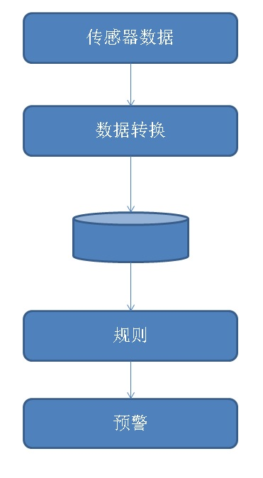
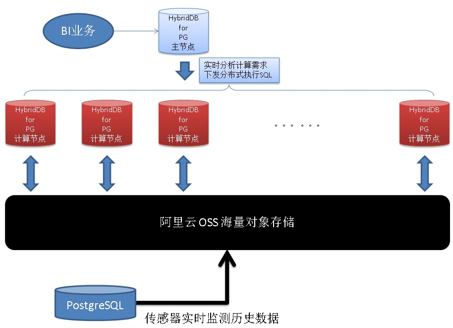

## 医疗大健康行业案例(老人健康实时监测和预警) - 阿里云RDS PostgreSQL最佳实践  
                     
### 作者                      
digoal                     
                       
### 日期                       
2017-07-31                 
                                
### 标签                
PostgreSQL , pipelineDB , 流式计算 , 独立事件相关性 , 舆情分析 , 实时状态分析 , 递归查询 , 时序数据      
                
----                
                 
## 背景          
人的身体和机器差不多，随着年龄的增长，器官逐渐老化，毛病也会越来越多，注意保养是一方面，另一方面也需要注意实时的监测和发出预警，在问题萌芽状态就解决掉。  
  
以往我们检查身体得去医院或专业的体检机构，很麻烦，随着科技的进步，一些健康指标的监测变得更加方便，例如手环也是一个普及很快的监控检测终端（目前已能够检测心跳、温度、运动等各项指标），未来这种终端能实时检测的项目会越来越多。  
  
如果手环算民用领域的健康检测范畴，那么在专业领域，比如一些医院或养老院，他们有更多的传感器，视频，空间检测等手段，可以对医院或养老院的病人或老人进行更多指标的实时监测。  
  
例如：  
  
1、一个人的行为轨迹，在某个范围不动，持续多久预警。  
  
2、一个人在床的空间，躺了12个小时以上，预警。  
  
3、一个人高度低于40公分，持续5分钟，预警（周围有人，不预警）。（比如高血压、小偷）  
  
4、一个人在马桶的狭小空间，超过30分钟，预警。  
  
以上都有传感器支持这样的数据采集。  
  
## 架构   
数据流分为5个部分：  
  
    
  
1、数据（来自传感器）  
  
2、数据转换（格式化、状态化）  
  
可选步骤，数据转换的目的是让数据更容易被识别和处理，可以使用三种方法对数据进行实时转换。  
  
2\.1、转换规则定义在数据库的UDF中，通过触发器或规则进行入库时实时转换。  
  
2\.2、转换规则定义在数据库的UDF中，通过pipeline Transforms进行转换。  
  
2\.3、在应用层进行转换，转换后的数据再入库。  
  
3、定义规则。  
  
定义预警规则，例如前面提到的：  
  
一个人在马桶的狭小空间，超过30分钟，预警。  
  
为了简化访问接口，可以将规则定义到数据库的UDF中，通过视图进行展示。  
  
4、实时规则查询。  
  
查询定义的规则，并预警。  
  
5、预警。  
  
### 优化思路  
1、同一份数据（一条记录可能包含高度、位置、心率等多个维度的属性），可能在多个规则维度上进行计算，例如在心率上有一个预警规则，在位置上又有预警规则。  
  
减少数据扫描量是一个比较通用的优化方法，9.6内核层面也使用了类似的优化方法。  
  
[《PostgreSQL 9.6 内核优化之 聚合代码优化OP复用浅析》](../201610/20161008_01.md)    
  
但是本例更加复杂，因为不同的规则，涉及的记录范围可能不一样，例如在床上这个空间维度可能12小时才预警（可能有上千条记录），而在高度这个维度，可能5分钟就需要预警。  
  
2、同一个传感器的数据，尽量独立存放，减少数据扫描成本。也就是说每个传感器一张表。类似的优化方法参考  
  
[《PostgreSQL 时序最佳实践 - 证券交易系统数据库设计 - 阿里云RDS PostgreSQL最佳实践》](../201704/20170417_01.md)    
  
3、由于预警并不需要保留所有记录，可以使用rotate的方式，将历史数据导出到OSS外部表。（偶尔需要查明细时，可以查询，需要海量分析时，可以直接对接HybridDB for PostgreSQL进行分析）  
  
[《PostgreSQL 数据rotate用法介绍 - 按时间覆盖历史数据》](../201703/20170321_02.md)    
  
  
  
4、动态流计算规则，减少计算量。例如当用户进入某个状态后，才触发对应的规则。例如用户进入马桶的空间后，才进行马桶空间内的流计算规则运算。  
  
## DEMO  
  
以这个例子为例，讲一下如何预警：  
  
一个人在马桶的狭小空间，超过30分钟，预警。  
  
DEMO就不搞这么复杂，不考虑优化因素。  
  
### 建表  
  
```  
create table sensor_info(  
  sid int,   -- 传感器ID  
  pos point, -- 传感器的相对坐标  
  crt_time timestamp  -- 上传时间  
  -- 其他属性略，为演示方便。  
);  
  
create index idx_sensor_info on sensor_info (sid,crt_time desc);  
  
create table userinfo (  
  uid  -- 用户和传感器的对应关系表，略  
  sid  
);  

create table statistic_obj_info (  
  objid  int,    -- 静态对象空间信息，例如床、马桶
  pos_range box  -- 对象的空间范围，如果使用postgis，请使用geometry来表示一个区间。  
);  
```  
  
### 生成数据  
  
```  
insert into sensor_info select random()*1000, point(trunc((random()*10)::numeric,2), trunc((random()*10)::numeric,2)), now()+(id||' second')::interval from generate_series(1,10000000) t(id);  
  
postgres=# select * from sensor_info limit 10;  
 sid |     pos     |          crt_time            
-----+-------------+----------------------------  
 888 | (1.43,5.58) | 2017-07-31 17:23:04.620488  
 578 | (5.6,2.01)  | 2017-07-31 17:23:05.620488  
 186 | (6.98,9.91) | 2017-07-31 17:23:06.620488  
  99 | (4.1,7.46)  | 2017-07-31 17:23:07.620488  
  30 | (6.25,6.07) | 2017-07-31 17:23:08.620488  
 403 | (5.12,6.26) | 2017-07-31 17:23:09.620488  
  60 | (9.8,8)     | 2017-07-31 17:23:10.620488  
 654 | (1.83,5.41) | 2017-07-31 17:23:11.620488  
 731 | (5.72,4.67) | 2017-07-31 17:23:12.620488  
 230 | (4.99,8.3)  | 2017-07-31 17:23:13.620488  
(10 rows)  
```  
  
```  
postgres=# select * from sensor_info where sid=1 order by crt_time desc limit 10;  
 sid |     pos     |          crt_time            
-----+-------------+----------------------------  
   1 | (9.83,6.18) | 2017-11-24 10:40:35.620488  
   1 | (3.18,9.82) | 2017-11-24 10:39:30.620488  
   1 | (1.79,6.24) | 2017-11-24 10:35:15.620488  
   1 | (3.13,8.42) | 2017-11-24 10:21:35.620488  
   1 | (5.11,4.17) | 2017-11-24 10:09:22.620488  
   1 | (9.51,3.41) | 2017-11-24 10:04:00.620488  
   1 | (2.24,2.35) | 2017-11-24 09:50:33.620488  
   1 | (7.2,8.67)  | 2017-11-24 09:44:18.620488  
   1 | (2.32,4.48) | 2017-11-24 08:45:22.620488  
   1 | (0.33,9.33) | 2017-11-24 08:44:50.620488  
(10 rows)  
```  
  
### 定义规则  
  
一个人在马桶的狭小空间，超过30分钟，预警。  
  
每个马桶都定义一个相对坐标区间，当感应到用户进入到某个区间后，对老人进行对应规则的监测。  
  
几何操作请参考  
  
https://www.postgresql.org/docs/10/static/functions-geometry.html  
  
或者  
  
http://postgis.net/documentation/  
  
使用UDF定义规则，输出一个JSON。  
  
```  
create or replace function matong_rule(  
  v_sid int,   -- 传感器ID  
  pos_range box,  -- 空间区间 , 如果使用postgis，请使用geometry来标注一个空间 
  ts interval     -- 持续时间，采用interval类型  
) returns jsonb as $$  
declare  
  v sensor_info;  -- 临时类型  
  e timestamp;    -- 最后时间  
  s timestamp;    -- 最前时间  
begin  
  for v in select * from sensor_info_1 where sid=v_sid order by crt_time desc   
  loop  
    if pos_range @> v.pos then  
      if e is null then e := v.crt_time; end if;  
      s := v.crt_time;  
    else  
      exit;  
    end if;  
  end loop;  
  
  if e-s >= ts then  
     return jsonb_build_object('sid', v_sid, 'pos_range', pos_range, 'start_time', s, 'end_time', e, 'interval', e-s);  
  else  
    return null;  
  end if;  
end;  
$$ language plpgsql strict;  
```  
  
例子，  
  
1为老人身上的传感器ID，中间的BOX为马桶的区间范围，第三个参数为持续时间。  
  
当探测到老人进入了某个需要监测的静态对象空间（例如进入床的空间、进入马桶的空间）时，触发以上规则，进行以上规则的查询。   
  
```  
postgres=# select matong_rule(1,'(10,10),(0,0)','1 sec');  
                                                                           matong_rule                                                                             
-----------------------------------------------------------------------------------------------------------------------------------------------------------------  
 {"sid": 1, "end_time": "2017-11-24T10:40:35.620488", "interval": "115 days 17:08:19", "pos_range": "(10,10),(0,0)", "start_time": "2017-07-31T17:32:16.620488"}  
(1 row)  
  
Time: 23.200 ms  
postgres=# select matong_rule(1,'(10,10),(1,1)','1 sec');  
                                                                      matong_rule                                                                         
--------------------------------------------------------------------------------------------------------------------------------------------------------  
 {"sid": 1, "end_time": "2017-11-24T10:40:35.620488", "interval": "01:55:13", "pos_range": "(10,10),(1,1)", "start_time": "2017-11-24T08:45:22.620488"}  
(1 row)  
  
Time: 11.157 ms  
postgres=# select matong_rule(1,'(10,10),(2,2)','1 sec');  
                                                                      matong_rule                                                                         
--------------------------------------------------------------------------------------------------------------------------------------------------------  
 {"sid": 1, "end_time": "2017-11-24T10:40:35.620488", "interval": "00:01:05", "pos_range": "(10,10),(2,2)", "start_time": "2017-11-24T10:39:30.620488"}  
(1 row)  
  
Time: 11.325 ms  
postgres=# select matong_rule(1,'(10,10),(3,3)','1 sec');  
                                                                      matong_rule                                                                         
--------------------------------------------------------------------------------------------------------------------------------------------------------  
 {"sid": 1, "end_time": "2017-11-24T10:40:35.620488", "interval": "00:01:05", "pos_range": "(10,10),(3,3)", "start_time": "2017-11-24T10:39:30.620488"}  
(1 row)  
  
Time: 11.019 ms  
```  
  
实际上传感器上传的可能并不是相对坐标，而是直接上传静态对象（马桶、床、。。。）的唯一标识，（例如对静态对象全部编号，并且有对应的传感器可以感应到有老人存在这个空间内，并实时上报监控数据。）  
  
这样就更加简单了，连区间判断都不需要，也是更加优雅的做法。但是坏处就是，老人离开监控区间的话，就无法被监控了，还是得靠老人身上的传感器。  
  
这两种形态的总结：  
  
1、轻终端，重服务端。  
  
终端的能力较弱，只是基本的数据采集，全部送到服务端进行计算。  
  
2、重终端，轻服务端。  
  
终端能力较强，可以进行数据采集，并且有部分数据计算能力，同时在大楼内增设一层静态终端（如床、马桶），对进入这个空间的老人（传感器）进行联动，上报更加精准的判断数据。  
  
### 查询规则  
输出所有用户的状态。  
  
例如，查询传感器ID 1-100的老人，在厕所空间内活动的状态。  
  
```  
postgres=# select matong_rule(id ,'(10,10),(3,3)','1 sec') from generate_series(1,10) t(id);  
                                                                      matong_rule                                                                         
--------------------------------------------------------------------------------------------------------------------------------------------------------  
 {"sid": 1, "end_time": "2017-11-24T10:40:35.620488", "interval": "00:01:05", "pos_range": "(10,10),(3,3)", "start_time": "2017-11-24T10:39:30.620488"}  
 {"sid": 2, "end_time": "2017-11-24T10:43:06.620488", "interval": "00:10:36", "pos_range": "(10,10),(3,3)", "start_time": "2017-11-24T10:32:30.620488"}  
   
   
   
   
   
   
   
   
(10 rows)  
  
Time: 115.501 ms  
```  
  
### 预警  
  
有记录返回则预警。  
  
对于PostgreSQL，还有一个很有意思的功能，异步消息，可以用于异步的预警。  
  
[《从电波表到数据库小程序之 - 数据库异步广播(notify/listen)》](../201701/20170116_01.md)    
  
[《从微信小程序 到 数据库"小程序" , 鬼知道我经历了什么》](../201701/20170113_03.md)    
  
[《[转载]postgres+socket.io+nodejs实时地图应用实践》](../201701/20170113_02.md)    
  
而如果你使用的是pipelinedb，那么也可以选择transform的实时预警功能。  
  
http://docs.pipelinedb.com/continuous-transforms.html#built-in-transform-triggers  
  
```
CREATE TABLE t (user text, value int);

CREATE OR REPLACE FUNCTION insert_into_t()
  RETURNS trigger AS
  $$
  BEGIN
    INSERT INTO t (user, value) VALUES (NEW.user, NEW.value);
    RETURN NEW;
  END;
  $$
  LANGUAGE plpgsql;

CREATE CONTINUOUS TRANSFORM ct AS
  SELECT user::text, value::int FROM stream WHERE value > 100
  THEN EXECUTE PROCEDURE insert_into_t();
```
  
### 活动大盘  
轨迹查询，老人在每个场所停留的时间，同一个地方多条记录，在绘制大盘时，只保留两条（到达和离开的时间）。  
  
方法如下。  
  
[《车联网案例，轨迹清洗 - 阿里云RDS PostgreSQL最佳实践 - 窗口函数》](../201707/20170722_02.md)    
  
### 优化点1介绍  
前面提到了一个关于IO放大的优化，将所有的传感器的数据分开存放，可以将IO放大的问题完全消除。我们看看经过IO消除后的性能如何：  
  
```  
postgres=#       create table sensor_info_1 (like sensor_info including all);  
CREATE TABLE  
Time: 1.765 ms  
postgres=# insert into sensor_info_1 select * from sensor_info where sid=1;  
INSERT 0 9835  
Time: 39.805 ms  
postgres=# \d sensor_info_1  
                     Table "postgres.sensor_info_1"  
  Column  |            Type             | Collation | Nullable | Default   
----------+-----------------------------+-----------+----------+---------  
 sid      | integer                     |           |          |   
 pos      | point                       |           |          |   
 crt_time | timestamp without time zone |           |          |   
Indexes:  
    "sensor_info_1_sid_crt_time_idx" btree (sid, crt_time DESC)  
  
postgres=# create or replace function matong_rule(  
postgres(#   v_sid int,   -- 传感器ID  
postgres(#   pos_range box,  -- 空间区间  
postgres(#   ts interval     -- 持续时间，采用interval类型  
postgres(# ) returns jsonb as $$  
postgres$# declare  
postgres$#   v sensor_info;  -- 临时类型  
postgres$#   e timestamp;    -- 最后时间  
postgres$#   s timestamp;    -- 最前时间  
postgres$# begin  
postgres$#   for v in select * from sensor_info_1 where sid=v_sid order by crt_time desc   
postgres$#   loop  
postgres$#     if pos_range @> v.pos then  
postgres$#       if e is null then e := v.crt_time; end if;  
postgres$#       s := v.crt_time;  
postgres$#     else  
postgres$#       exit;  
postgres$#     end if;  
postgres$#   end loop;  
postgres$#   
postgres$#   if e-s >= ts then  
postgres$#      return jsonb_build_object('sid', v_sid, 'pos_range', pos_range, 'start_time', s, 'end_time', e, 'interval', e-s);  
postgres$#   else  
postgres$#     return null;  
postgres$#   end if;  
postgres$# end;  
postgres$# $$ language plpgsql strict;  
CREATE FUNCTION  
Time: 0.469 ms  
postgres=# select matong_rule(1,'(10,10),(3,3)','1 sec');  
                                                                      matong_rule                                                                         
--------------------------------------------------------------------------------------------------------------------------------------------------------  
 {"sid": 1, "end_time": "2017-11-24T10:40:35.620488", "interval": "00:01:05", "pos_range": "(10,10),(3,3)", "start_time": "2017-11-24T10:39:30.620488"}  
(1 row)  
  
Time: 0.620 ms  
```  
  
相比一次查询11毫秒，提升到了0.6毫秒。  
  
## 小结  
养老院是医疗大健康的典型案例之一，里面涉及到大量的空间数据、时间数据、大量的规则。需要一个功能强大的数据库来支撑，否则所有数据都要搬运到APP层面处理，效率低下。  
  
PostgreSQL很好的支撑了养老院老人健康实时检测，健康报告、轨迹查询等场景的应用，同时历史的传感器数据通过OSS可以和HybridDB for PostgreSQL打通，实现一站时预警、分析需求。  
  
## 参考  
[《PostgreSQL 9.6 内核优化之 聚合代码优化OP复用浅析》](../201610/20161008_01.md)    
  
[《车联网案例，轨迹清洗 - 阿里云RDS PostgreSQL最佳实践 - 窗口函数》](../201707/20170722_02.md)    
  
[《潘金莲改变了历史之 - PostgreSQL舆情事件分析应用》](../201703/20170331_02.md)    
  
[《数据入库实时转换 - trigger , rule》](../201706/20170619_02.md)    
  
[《PostgreSQL 时序最佳实践 - 证券交易系统数据库设计 - 阿里云RDS PostgreSQL最佳实践》](../201704/20170417_01.md)    
  
[《PostgreSQL 数据rotate用法介绍 - 按时间覆盖历史数据》](../201703/20170321_02.md)    
  
[《数据保留时间窗口的使用》](../201706/20170612_03.md)    
    
    
  
  
  
  
  
  
  
  
  
  
  
  
  
#### [免费领取阿里云RDS PostgreSQL实例、ECS虚拟机](https://free.aliyun.com/ "57258f76c37864c6e6d23383d05714ea")
  
  
#### [digoal's PostgreSQL文章入口](https://github.com/digoal/blog/blob/master/README.md "22709685feb7cab07d30f30387f0a9ae")
  
  

  
  
  
  
  
  
  
