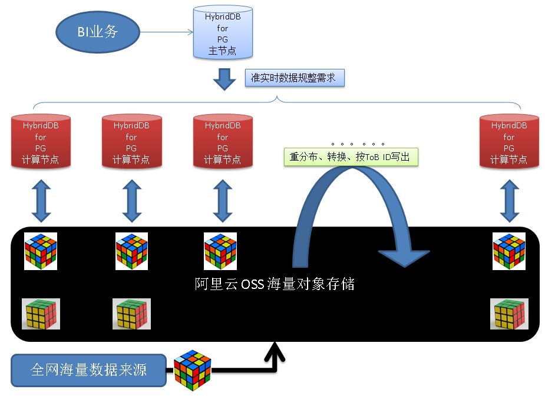

## 记录动态格式化输出(ToB日志转换业务) - 阿里云RDS PostgreSQL, HybridDB for PostgreSQL最佳实践  
                     
### 作者                      
digoal                     
                       
### 日期                       
2017-08-03                 
                                
### 标签                
PostgreSQL , UDF , 动态格式 , format , JOIN , OSS外部表  
                
----                
                 
## 背景     
有一些业务需要将数据归类动态的输出，比如一些公共日志服务，所有用户的日志都被统一的按格式记录到一起，但是每个最终用户关心的字段都不一样，甚至每个用户对数据转换的需求都不一样。  
  
  
  
比如这个业务：  
  
[《日增量万亿+级 实时分析、数据规整 - 阿里云HybridDB for PostgreSQL最佳实践》](../201707/20170726_01.md)    
  
## 一、需求  
1、可以根据ToB的用户的定义，输出不同的格式。  
  
2、每个ToB的用户，写入到一个文件或多个文件。  
  
3、一个文件不能出现两个用户的内容。  
  
其他需求见：  
  
[《日增量万亿+级 实时分析、数据规整 - 阿里云HybridDB for PostgreSQL最佳实践》](../201707/20170726_01.md)    
  
## 二、架构设计  
  
1、采用OSS存储实时载入的海量公共日志。  
  
2、采用HybridDB for PostgreSQL或RDS PostgreSQL的OSS外部表接口，直接并行读取OSS的文件。  
  
3、通过HDB PG的窗口函数，按ToB ID充分发。  
  
4、通过UDF，将公共日志的格式，按ToB ID对应的UDF转换为对应的格式。  
  
5、将转换后的数据，写入OSS。自动按ToB ID切换，绝对保证每个ToB的用户，写入到一个文件或多个文件。一个文件不出现两个用户的内容。  
  
以上功能是阿里云HybridDB for PostgreSQL或RDS PostgreSQL的独有功能。  
  
## 三、DEMO与性能  
这里介绍如何动态的转换数据，其他内容请详见案例：  
  
[《日增量万亿+级 实时分析、数据规整 - 阿里云HybridDB for PostgreSQL最佳实践》](../201707/20170726_01.md)    
  
1、创建公共日志表  
  
```  
create table t1 (tid int, c1 text, c2 text, c3 int, c4 timestamp, c5 numeric);  
```  
  
2、写入一批测试数据  
  
```  
insert into t1 select random()*100, md5(random()::text), 'test', random()*10000, clock_timestamp(), random() from generate_series(1,1000000);  
```  
  
3、创建UDF元信息表，存储每个ToB ID对应的UDF名字  
  
```  
create table t2(tid int, udf name);  
```  
  
4、创建UDF，需要定制格式的ToB ID，创建对应的UDF  
  
```  
create or replace function f1(t1) returns text as $$  
  select format('tid: %L , c2: %L , c4: %L', $1.tid, $1.c2, $1.c4);  
$$ language sql strict;  
  
  
create or replace function f2(t1) returns text as $$  
declare  
  res text := format('%L , %L , %L, %L', $1.tid, upper($1.c2), $1.c4, $1.c3);  
begin  
  return res;  
end;  
$$ language plpgsql strict;  
```  
  
5、创建动态UDF，根据输入，动态调用对应的UDF  
  
```  
create or replace function ff(t1, name) returns text as $$  
declare  
  sql text := format('select %I(%L)', $2, $1);  
  res text;  
begin  
  execute sql into res;  
  return res;  
end;  
$$ language plpgsql strict;  
```  
  
6、写入UDF映射，例如1-100的ID，使用F1进行转换，0的ID使用F2进行转换。  
  
```  
insert into t2 select generate_series(1,100), 'f1';  
insert into t2 values (0, 'f2');  
```  
  
7、动态转换查询如下：  
  
```  
postgres=# select ff(t1, t2.udf) from t1 join t2 on (t1.tid=t2.tid) where t1.tid=0 limit 10;  
                         ff                            
-----------------------------------------------------  
 '0' , 'TEST' , '2017-08-03 18:55:00.48512', '9478'  
 '0' , 'TEST' , '2017-08-03 18:55:00.486426', '9352'  
 '0' , 'TEST' , '2017-08-03 18:55:00.487297', '4026'  
 '0' , 'TEST' , '2017-08-03 18:55:00.488419', '736'  
 '0' , 'TEST' , '2017-08-03 18:55:00.491082', '4334'  
 '0' , 'TEST' , '2017-08-03 18:55:00.491097', '2394'  
 '0' , 'TEST' , '2017-08-03 18:55:00.491839', '2076'  
 '0' , 'TEST' , '2017-08-03 18:55:00.492648', '9935'  
 '0' , 'TEST' , '2017-08-03 18:55:00.493505', '383'  
 '0' , 'TEST' , '2017-08-03 18:55:00.493874', '8546'  
(10 rows)  
  
postgres=# select ff(t1, t2.udf) from t1 join t2 on (t1.tid=t2.tid) where t1.tid=1 limit 10;  
                            ff                              
----------------------------------------------------------  
 tid: '1' , c2: 'TEST' , c4: '2017-08-03 18:55:00.484799'  
 tid: '1' , c2: 'TEST' , c4: '2017-08-03 18:55:00.485209'  
 tid: '1' , c2: 'TEST' , c4: '2017-08-03 18:55:00.485276'  
 tid: '1' , c2: 'TEST' , c4: '2017-08-03 18:55:00.485744'  
 tid: '1' , c2: 'TEST' , c4: '2017-08-03 18:55:00.48582'  
 tid: '1' , c2: 'TEST' , c4: '2017-08-03 18:55:00.485967'  
 tid: '1' , c2: 'TEST' , c4: '2017-08-03 18:55:00.486067'  
 tid: '1' , c2: 'TEST' , c4: '2017-08-03 18:55:00.486281'  
 tid: '1' , c2: 'TEST' , c4: '2017-08-03 18:55:00.486756'  
 tid: '1' , c2: 'TEST' , c4: '2017-08-03 18:55:00.487714'  
(10 rows)  
```  
  
8、HDB PG中的强制充分发：  
  
```
postgres=# select ff(t1, t2.udf) as ff, row_number() over (partition by t1.tid order by c4) from t1 join t2 on (t1.tid=t2.tid) where t1.tid=0 limit 10;
                         ff                          | row_number 
-----------------------------------------------------+------------
 '0' , 'TEST' , '2017-08-03 18:55:00.48512', '9478'  |          1
 '0' , 'TEST' , '2017-08-03 18:55:00.486426', '9352' |          2
 '0' , 'TEST' , '2017-08-03 18:55:00.487297', '4026' |          3
 '0' , 'TEST' , '2017-08-03 18:55:00.488419', '736'  |          4
 '0' , 'TEST' , '2017-08-03 18:55:00.491082', '4334' |          5
 '0' , 'TEST' , '2017-08-03 18:55:00.491097', '2394' |          6
 '0' , 'TEST' , '2017-08-03 18:55:00.491839', '2076' |          7
 '0' , 'TEST' , '2017-08-03 18:55:00.492648', '9935' |          8
 '0' , 'TEST' , '2017-08-03 18:55:00.493505', '383'  |          9
 '0' , 'TEST' , '2017-08-03 18:55:00.493874', '8546' |         10
(10 rows)
```
  
## 四、技术点  
这里只谈本文涉及的技术点。  
  
1、UDF  
  
PostgreSQL支持多种UDF语言（例如C，plpgsql, sql, plpython, pljava, plv8, ......），用户通过UDF定义需要转换的格式。  
  
2、动态调用  
  
用户通过动态调用，可以动态的调用对应的UDF，在一个请求中生成不同的格式。  
  
## 五、云端产品  
  
[阿里云 RDS PostgreSQL](https://www.aliyun.com/product/rds/postgresql)      
    
[阿里云 HybridDB for PostgreSQL](https://www.aliyun.com/product/gpdb)      
    
[阿里云 OSS](https://www.aliyun.com/product/oss)    
  
## 六、类似场景、案例  
[《日增量万亿+级 实时分析、数据规整 - 阿里云HybridDB for PostgreSQL最佳实践》](../201707/20170726_01.md)    
  
## 七、小结  
一些公共日志服务，所有用户的日志都被统一的按格式记录到一起，但是每个最终用户关心的字段都不一样，甚至每个用户对数据转换的需求都不一样。  
  
PostgreSQL支持多种UDF语言（例如C，plpgsql, sql, plpython, pljava, plv8, ......），用户通过UDF定义需要转换的格式。  
  
用户通过动态调用，可以动态的调用对应的UDF，在一个请求中生成不同的格式。  
     
## 八、参考  
[《日增量万亿+级 实时分析、数据规整 - 阿里云HybridDB for PostgreSQL最佳实践》](../201707/20170726_01.md)    
