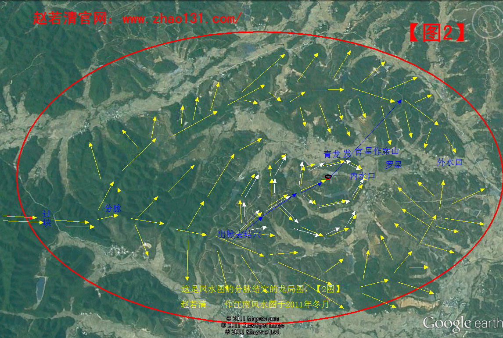
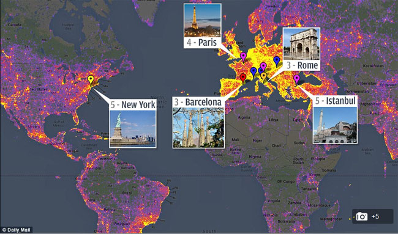
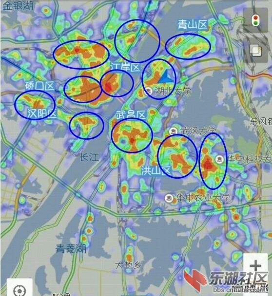
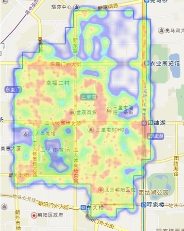
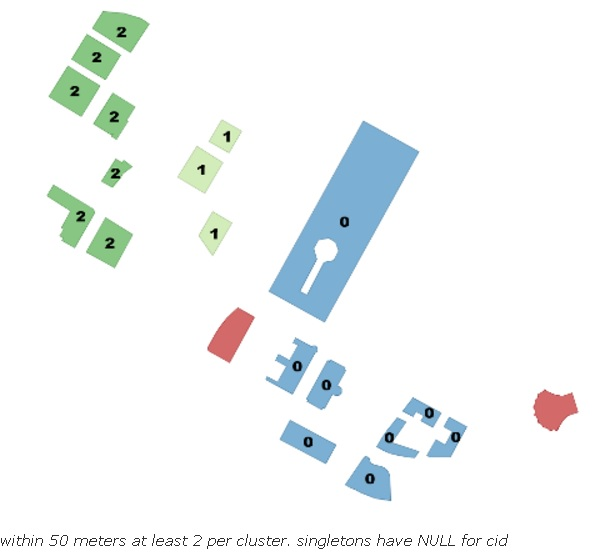
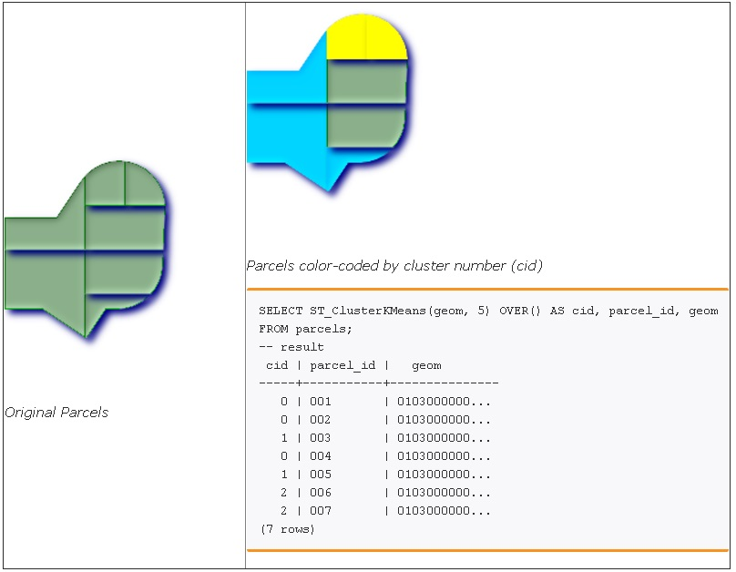
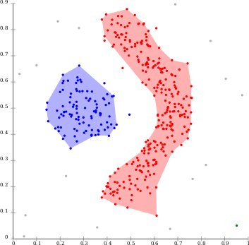

## 数据寻龙点穴（空间聚集分析） - 阿里云RDS PostgreSQL最佳实践        
              
### 作者          
digoal          
          
### 日期           
2017-08-20          
            
### 标签          
PostgreSQL , Greenplum , PostGIS , K-Mean , 热力图        
                      
----                      
                       
## 背景      
最近鬼吹灯热播，胡八一的《十六字阴阳风水秘术》到底是什么武功秘籍？寻龙点穴又是什么？别问我，不知道。    
    
    
    
PS：以下截取自互联网。     
    
寻龙点穴是风水学术语。古人说：三年寻龙，十年点穴。意思就是说，学会寻龙脉要很长的时间，但要懂得点穴，并且点得准则难上加难，甚至须要用“十年”时间。 但是，若没正确方法，就是用百年时间，也不能够点中风水穴心聚气的真点，这样一来，寻龙的功夫也白费了。 准确地点正穴心，并不是一件容易的事，对初学者来说如此，就是久年经验老手，也常常点错点偏。     
    
    
     
寻龙点穴旨在寻找龙气聚集之地，而现实中，我们也有类似需求，比如找的可能是人气聚集之地。       
    
我们要相信科学的力量，如今大数据、AI这么发达，实际上我们可以在海量数据的情况下总结经验，和前人通过古老的夜观星象总结的经验可能会出现惊人的相似。    
    
我们有海量的人物活动数据、汽车活动数据、传感器数据等等。完全可以分析出来什么样的地方适合居住，什么样的地方适合做生意，等等。    
    
扯远了，我们回到主题 - 空间数据寻龙点穴。实际上就是PostGIS 2.3的两个新特性，空间数据的聚集分析。    
    
例如我们有人物活动的点数据组成的海量数据，通过空间聚集分析，可以汇聚出指定时间段，数据聚集的热力图。是不是和寻龙点穴有点相似呢？    
    
    
    
    
    
    
    
## 空间聚集窗口分析函数    
鬼吹灯中有一段关于“龟眠之地”的描述：    
    
我掏出《十六字阴阳风水秘术》翻了翻，找到一段“龟眠之地”的传说，书中记载，当年有人在海边，见到海中突然浮出一座黑山，再细观之，原来是数十只老龟，驮负着一头死去的巨龟自海中而出，这些老龟把死龟驮至一处山崖下地洞穴里藏好，这才陆续离去游回大海，偷偷看到这一切的那个人，擅长相地择穴之术，知道此穴乃是四灵所钟。洞中“龙气冲天”，其时正好他家中有先人故去，于是他探明洞中龟尸的特形后，把自己的先人不用棺椁裸身葬入其中。此后这个人飞黄腾达、平步青云，成就了一方霸业。那处龟眠洞日后就成了他家宗室的专用慕穴，数百年后龙气已尽，地崩，露出尸体无数，当地人争相围观，所有尸身皆生鸟羽龙鳞，被海风吹了一天一夜之后，全部尸体同时化为乌有。    
    
鬼吹灯和数据分析有什么关联呢？必须有啊，你想想，古人为了找到一块“龟眠之地”得费劲多少心思了。而现在我们有了数据，是不是很好找了呢。    
    
假设我们的数据包含这些维度：    
    
1、时间    
    
2、人物位置    
    
3、人物属性（收入、行业、年龄、等等）    
    
好了，想象一下，你是不是可以按人物属性、时间，对数据进行空间聚集分析。生成不同分析维度的人群热力图。颇有寻龙点穴范。    
    
那么怎么做空间数据的聚集分析呢？    
    
PostGIS 2.3 新增了两个窗口函数，就是用于       
    
1、基于[Density-based spatial clustering of applications with noise (DBSCAN)](https://en.wikipedia.org/wiki/DBSCAN) 算法的空间数据聚集分析函数[ST_ClusterDBSCAN](http://postgis.net/docs/manual-dev/ST_ClusterDBSCAN.html)：    
    
    
    
2、基于 [k-means](https://en.wikipedia.org/wiki/K-means_clustering) 算法的空间数据聚集分析函数[ST_ClusterKMeans](http://postgis.net/docs/manual-dev/ST_ClusterKMeans.html)：    
    
    
    
有意思吧。    
    
    
    
### 例子    
1、    
    
```    
 -- Partitioning parcel clusters by type    
SELECT ST_ClusterKMeans(geom,3) over (PARTITION BY type) AS cid, parcel_id, type    
FROM parcels;    
-- result    
 cid | parcel_id |    type    
-----+-----------+-------------    
   1 | 005       | commercial    
   1 | 003       | commercial    
   2 | 007       | commercial    
   0 | 001       | commercial    
   1 | 004       | residential    
   0 | 002       | residential    
   2 | 006       | residential    
(7 rows)    
```    
    
2、    
    
```    
SELECT name, ST_ClusterDBSCAN(geom, eps := 50, minpoints := 2) over () AS cid    
FROM boston_polys    
WHERE name > '' AND building > ''    
        AND ST_DWithin(geom,    
        ST_Transform(    
            ST_GeomFromText('POINT(-71.04054 42.35141)', 4326), 26986),    
           500);    
```    
    
## st_union 空间对象聚合    
前面提到的两个窗口函数只是生产每条记录所属的聚集ID，按这个聚集ID在聚合，就可以聚合成一个个的几何对象（例如点集），通过点集再可以生成sufface。    
    
http://postgis.net/docs/manual-dev/ST_MemUnion.html    
    
http://postgis.net/docs/manual-dev/ST_Union.html    
    
## 凶相洞察 - 流式计算  
人流量大就一定是风水宝地吗？有河流的地方也不一定就是风水宝地。  
  
我们还需要从多个维度分析人流量，同时还需要分析人口的驻留时间，新增人口，流失人口等。  
  
比如地铁站，人流量是非常庞大，但是驻留时间非常短，你在这里开个SUPER MARKT也许就不合适了。但是便利店、奶茶店也许是很棒的。  
  
这些通过流计算+PostGIS很容易实现。  
  
[《流计算风云再起 - PostgreSQL携PipelineDB力挺IoT》](../201612/20161220_01.md)    
  
1、创建多边形（行政区、小区、热区等）表1，这个表可以通过前面讲的空间数据聚合得到。  
  
2、创建流，JOIN表1。  
  
3、创建流视图，根据"多边形+时间窗口"（例如10分钟、30分钟、1小时等多个分组）进行分组，统计"多边形+时间窗口"的 新增人口，流失人口，人口数。  
  
4、往流里写入人口的实时位置数据。  
  
具体的玩法详见pipelinedb手册。(pipelinedb即将成为PostgreSQL 10的一个插件。安装到postgresql 10中即可使用)  
  
http://docs.pipelinedb.com/  
      
## 空间聚集分析业务场景    
空间聚集分析窗口函数，非常有助于基于人物、被检测对象在时间、空间、对象属性等多种维度层面的空间聚集透视。    
    
关于多维数据透视，也可以参考我以前写的文章。    
    
[《时间、空间、对象多维属性 海量数据任意多维 高效检索 - 阿里云RDS PostgreSQL最佳实践》](../201707/20170722_01.md)      
    
实际上除了这两个窗口分析函数，PostgreSQL还提供了[MADlib机器学习库](http://madlib.incubator.apache.org/index.html)，通过SQL接口、R接口（pitovalR）、Python接口可以进行调用，利用数据库的分析能力完成数据透视和编程的易用性（海量数据有MPP，中等体量有PG的多核并行计算、向量计算、JIT等大幅度提升计算能力的特性）。      
    
## 阿里云相关数据库产品      
[阿里云 RDS PostgreSQL](https://www.aliyun.com/product/rds/postgresql)              
            
[阿里云 HybridDB for PostgreSQL](https://www.aliyun.com/product/gpdb)              
      
## 参考    
http://planet.postgis.net/index.html    
    
http://postgis.net/docs/manual-dev/ST_ClusterKMeans.html    
    
https://en.wikipedia.org/wiki/K-means_clustering    
    
http://postgis.net/docs/manual-dev/ST_ClusterDBSCAN.html    
      
http://planet.qgis.org/planet/tag/postgis/     
    
http://2012.ogrs-community.org/2012_papers/d3_10_bonin_presentation.pdf     
    
http://www.waurisa.org/conferences/2009/presentations/Tues/OpenSourceWebModelingAndVisualization_Tues_Vennemann_TerraGIS.pdf     
     
  
<a rel="nofollow" href="http://info.flagcounter.com/h9V1"  ></a>  
  
  
  
  
  
  
## [digoal's 大量PostgreSQL文章入口](https://github.com/digoal/blog/blob/master/README.md "22709685feb7cab07d30f30387f0a9ae")
  
  
## [免费领取阿里云RDS PostgreSQL实例、ECS虚拟机](https://free.aliyun.com/ "57258f76c37864c6e6d23383d05714ea")
  
  

  
