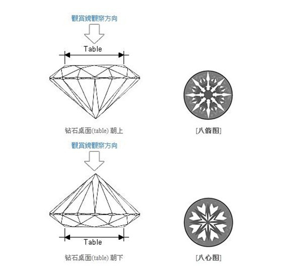
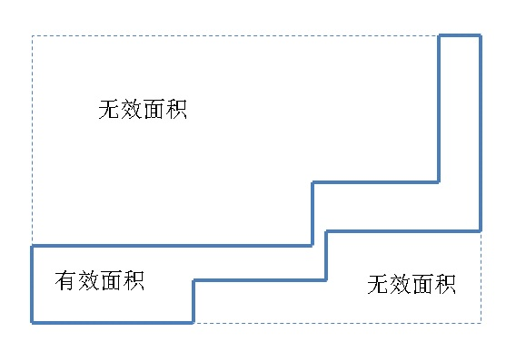

## PostgreSQL 空间切割(st_split)功能扩展 - 空间对象网格化    
                     
### 作者    
digoal    
    
### 日期     
2017-10-05     
      
### 标签    
PostgreSQL , PostGIS , st_split , ST_GeometryN , ST_NumGeometries , ST_XMax , ST_XMin , ST_YMax , ST_YMin , UDF , st_area , ST_MakeBox2D, 面积占比       
                
----                
                 
## 背景        
前面介绍了空间包含(st_contains, st_within)搜索降CPU的优化方法，将长条形（相对于BOUND BOX空间占比很小）的对象切分成多个空间对象，提升相对于bound box的空间占比，从而减少扫描范围，提升命中率。  
  
[《PostgreSQL 空间st_contains，st_within空间包含搜索优化 - 降IO和降CPU(bound box)》](../201710/20171004_01.md)    
  
这种优化方法的关键是SPLIT，PostGIS提供了一种split函数，但是只能支持一次切两片，本文提供一种方法，可以根据用户的需求进行自由切割。（输入被切割的目标对象，横向切割多少刀，纵向切割多少刀，面积占比高于多少时不切割。）  
  
八星八箭有木有：  
  
  
   
空间split，目的是降低无效面积，看看这幅无效面积有多大吧，吓不吓人？  
  
  
  
## 空间切割示例  
  
### 切割逻辑  
  
1、输入被切割的目标对象，横向切割多少刀，纵向切割多少刀，面积占比高于多少时不切割。  
  
2、计算目标对象面积。  
  
2、获取目标对象的bound box边界。计算BOUND BOX面积。  
  
3、判断是否需要切割。  
  
求横向切割线  
  
切割  
  
4、求切割后的geometry coll有几个对象。  
  
5、转换为geo数组输出。  
  
### 切割代码  
  
```  
create or replace function split_geo(  
  i_geo geometry,   -- 被切割的目标对象  
  i_srid int,      -- SRID  
  i_x int2,         -- X方向切多少刀  
  i_y int2,         -- Y方向切多少刀  
  i_aratio float4   -- 面积占比阈值，高于它则不切割  
)   
returns geometry[] as $$  
declare  
  res geometry[];         -- 结果  
  tmp_geo geometry;       -- 切割后的临时对象(geometry collection)  
  split_geos geometry[];  -- 切割线数组  
  split_line geometry;    -- 线段  
  v_area_obj float8;      -- 目标对象面积  
  v_area_box float8;      -- 目标对象的bound box的面积  
  v_xmin float8 := ST_XMin(i_geo);          -- 目标对象BOUND BOX，XMIN  
  v_ymin float8 := ST_YMin(i_geo);          -- 目标对象BOUND BOX，YMIN  
  v_xmax float8 := ST_XMax(i_geo);          -- 目标对象BOUND BOX，XMAX  
  v_ymax float8 := ST_YMax(i_geo);          -- 目标对象BOUND BOX，YMAX  
  v_box geometry;         -- 目标对象的BOUND BOX  
  x_geo geometry;         -- 分解geometry collection临时对象  
begin  
  -- 求边界  
  v_box := st_setsrid(ST_MakeBox2D(st_makepoint(v_xmin,v_ymin), st_makepoint(v_xmax,v_ymax)),i_srid);  
    
  -- 求面积  
  v_area_obj := st_area(i_geo);  
  v_area_box := st_area(v_box);  
  
  -- split 前的空间占比  
  raise notice '%', (v_area_obj/v_area_box);  
    
  -- 计算面积占比，判断是否需要切割  
  if (v_area_obj/v_area_box) > i_aratio then    
    -- 大于面积比，不切割  
    return array[i_geo];  
  else  
    -- 计算切割线段X位点  
    for i in 1..i_x  
    loop  
      split_geos := coalesce  
        (   
        array_append(split_geos, st_setsrid(st_makeline(st_makepoint(v_xmin+i*((v_xmax-v_xmin)/(i_x+1)), v_ymin), st_makepoint(v_xmin+i*((v_xmax-v_xmin)/(i_x+1)), v_ymax)), i_srid))  
        ,   
        array[st_setsrid(st_makeline(st_makepoint(v_xmin+i*((v_xmax-v_xmin)/(i_x+1)), v_ymin), st_makepoint(v_xmin+i*((v_xmax-v_xmin)/(i_x+1)), v_ymax)), i_srid)]   
        );   
    end loop;  
  
    -- 计算切割线段Y位点  
    for i in 1..i_y  
    loop  
      split_geos := coalesce  
        (   
        array_append(split_geos, st_setsrid(st_makeline(st_makepoint(v_xmin, v_ymin+i*((v_ymax-v_ymin)/(i_y+1))), st_makepoint(v_xmax, v_ymin+i*((v_ymax-v_ymin)/(i_y+1)))), i_srid))  
        ,   
        array[st_setsrid(st_makeline(st_makepoint(v_xmin, v_ymin+i*((v_ymax-v_ymin)/(i_y+1))), st_makepoint(v_xmax, v_ymin+i*((v_ymax-v_ymin)/(i_y+1)))), i_srid)]   
        );   
    end loop;  
  
    -- 切割  
    foreach split_line in array split_geos  
    loop  
      tmp_geo := coalesce  
        (  
	st_split(tmp_geo, split_line)  
	,  
        st_split(i_geo, split_line)  
	);  
    end loop;  
  end if;  
  
  -- 将geometry collection转换为geometry数组  
  for i in 1..ST_NumGeometries(tmp_geo)  
  loop  
    res := coalesce(array_append(res, ST_GeometryN(tmp_geo, i)), array[ST_GeometryN(tmp_geo, i)]);  
  end loop;  
  
  -- split 后的空间占比  
  v_area_obj := 0;  
  v_area_box := 0;  
  
  foreach x_geo in array res  
  loop  
    v_area_obj := v_area_obj + st_area(x_geo);  
    v_area_box := v_area_box + st_area(st_setsrid(ST_MakeBox2D(st_makepoint(st_xmin(x_geo),st_ymin(x_geo)), st_makepoint(st_xmax(x_geo),st_ymax(x_geo))),i_srid));  
  end loop;  
  
  -- split 后的空间占比  
  raise notice '%', (v_area_obj/v_area_box);  
  
  return res;  
end;  
$$ language plpgsql strict;  
```  
  
### 验证切割  
1、横向纵向各切2刀，最多得到9个对象。（当刀下去后没有切到有效部位时不返回，因此可能少于9个对象。）  
  
```  
select st_astext(  
unnest(  
split_geo(  
  st_setsrid(st_makepolygon(ST_GeomFromText('LINESTRING(0 0,1 0,1 2.5,6 2.5,6 4,7 4,7 5,5 5,5 3,0 3,0 0)')), 4326),  
  4326::int4,  
  2::int2,  
  2::int2,  
  0.9::float4  
)));  
  
  
NOTICE:  0.242857142857143  
NOTICE:  0.818181818181818  
                                                        st_astext                                                          
-------------------------------------------------------------------------------------------------------------------------  
 POLYGON((2.33333333333333 2.5,1 2.5,1 1.66666666666667,0 1.66666666666667,0 3,2.33333333333333 3,2.33333333333333 2.5))  
 POLYGON((1 1.66666666666667,1 0,0 0,0 1.66666666666667,1 1.66666666666667))  
 POLYGON((2.33333333333333 3,4.66666666666667 3,4.66666666666667 2.5,2.33333333333333 2.5,2.33333333333333 3))  
 POLYGON((4.66666666666667 3,5 3,5 3.33333333333333,6 3.33333333333333,6 2.5,4.66666666666667 2.5,4.66666666666667 3))  
 POLYGON((5 3.33333333333333,5 5,7 5,7 4,6 4,6 3.33333333333333,5 3.33333333333333))  
(5 rows)  
```  
  
切割前后的面积占比分别是24%和82%，一下子提升了好多，如果使用这几个拼接，可以少扫描若干个数据块。  
  
2、横向纵向各切2刀，最多得到9个对象。（当刀下去后没有切到有效部位时不返回，因此可能少于9个对象。）  
  
切割前后的面积占比分别是24%和98%，一下子提升了好多，如果使用这几个拼接，可以少扫描若干个数据块。  
  
```  
postgres=# select st_astext(  
unnest(  
split_geo(  
  st_setsrid(st_makepolygon(ST_GeomFromText('LINESTRING(0 0,1 0,1 2.5,6 2.5,6 4,7 4,7 5,5 5,5 3,0 3,0 0)')), 4326),  
  4326::int4,  
  4::int2,  
  4::int2,  
  0.9::float4  
)));  
  
  
NOTICE:  0.242857142857143  
NOTICE:  0.977011494252874  
                     st_astext                        
----------------------------------------------------  
 POLYGON((1.4 2.5,1 2.5,1 2,0 2,0 3,1.4 3,1.4 2.5))  
 POLYGON((1 2,1 1,0 1,0 2,1 2))  
 POLYGON((1 1,1 0,0 0,0 1,1 1))  
 POLYGON((1.4 3,2.8 3,2.8 2.5,1.4 2.5,1.4 3))  
 POLYGON((2.8 3,4.2 3,4.2 2.5,2.8 2.5,2.8 3))  
 POLYGON((4.2 3,5 3,5.6 3,5.6 2.5,4.2 2.5,4.2 3))  
 POLYGON((5 3,5 4,5.6 4,5.6 3,5 3))  
 POLYGON((5 4,5 5,5.6 5,5.6 4,5 4))  
 POLYGON((5.6 5,7 5,7 4,6 4,5.6 4,5.6 5))  
 POLYGON((6 4,6 3,5.6 3,5.6 4,6 4))  
 POLYGON((6 3,6 2.5,5.6 2.5,5.6 3,6 3))  
(11 rows)  
```  
  
### 切割前后优化对比
  
不切割，扫描1648个数据块，过滤26590条无效数据。  
  
```  
explain (analyze,verbose,timing,costs,buffers)  
select * from f where st_within(pos, st_setsrid(st_makepolygon(ST_GeomFromText('LINESTRING(0 0,1 0,1 2.5,6 2.5,6 4,7 4,7 5,5 5,5 3,0 3,0 0)')), 4326));  
  
  
 Index Scan using idx_f on public.f  (cost=0.42..15026.72 rows=3333 width=40) (actual time=1.519..35.773 rows=8491 loops=1)  
   Output: id, pos  
   Index Cond: ('0103000020E6100000010000000B00000000000000000000000000000000000000000000000000F03F0000000000000000000000000000F03F000000000000044000000000000018400000000000000440000000000000184000000000000010400000000000001C4000000000000010400000000000001C40000000000000144000000000000014400000000000001440000000000000144000000000000008400000000000000000000000000000084000000000000000000000000000000000'::geometry ~ f.pos)  
   Filter: _st_contains('0103000020E6100000010000000B00000000000000000000000000000000000000000000000000F03F0000000000000000000000000000F03F000000000000044000000000000018400000000000000440000000000000184000000000000010400000000000001C4000000000000010400000000000001C40000000000000144000000000000014400000000000001440000000000000144000000000000008400000000000000000000000000000084000000000000000000000000000000000'::geometry, f.pos)  
   Rows Removed by Filter: 26590  
   Buffers: shared hit=1648  
 Planning time: 0.274 ms  
 Execution time: 36.212 ms  
```  
  
切割，扫描610个数据块，过滤1932条无效数据。  
  
```  
explain (analyze,verbose,timing,costs,buffers)  
select * from f where st_within(pos, st_setsrid(st_makepolygon(ST_GeomFromText('LINESTRING(2.33333333333333 2.5,1 2.5,1 1.66666666666667,0 1.66666666666667,0 3,2.33333333333333 3,2.33333333333333 2.5)')), 4326))  
union all  
select * from f where st_within(pos, st_setsrid(st_makepolygon(ST_GeomFromText('LINESTRING(1 1.66666666666667,1 0,0 0,0 1.66666666666667,1 1.66666666666667)')), 4326))  
union all  
select * from f where st_within(pos, st_setsrid(st_makepolygon(ST_GeomFromText('LINESTRING(2.33333333333333 3,4.66666666666667 3,4.66666666666667 2.5,2.33333333333333 2.5,2.33333333333333 3)')), 4326))  
union all  
select * from f where st_within(pos, st_setsrid(st_makepolygon(ST_GeomFromText('LINESTRING(4.66666666666667 3,5 3,5 3.33333333333333,6 3.33333333333333,6 2.5,4.66666666666667 2.5,4.66666666666667 3)')), 4326))  
union all  
select * from f where st_within(pos, st_setsrid(st_makepolygon(ST_GeomFromText('LINESTRING(5 3.33333333333333,5 5,7 5,7 4,6 4,6 3.33333333333333,5 3.33333333333333)')), 4326))  
;  
  
  
 Append  (cost=0.42..75300.24 rows=16665 width=40) (actual time=0.113..11.690 rows=8491 loops=1)  
   Buffers: shared hit=610  
   ->  Index Scan using idx_f on public.f  (cost=0.42..15026.72 rows=3333 width=40) (actual time=0.113..3.365 rows=2053 loops=1)  
         Output: f.id, f.pos  
         Index Cond: ('0103000020E61000000100000007000000A3AAAAAAAAAA02400000000000000440000000000000F03F0000000000000440000000000000F03FBAAAAAAAAAAAFA3F0000000000000000BAAAAAAAAAAAFA3F00000000000000000000000000000840A3AAAAAAAAAA02400000000000000840A3AAAAAAAAAA02400000000000000440'::geometry ~ f.pos)  
         Filter: _st_contains('0103000020E61000000100000007000000A3AAAAAAAAAA02400000000000000440000000000000F03F0000000000000440000000000000F03FBAAAAAAAAAAAFA3F0000000000000000BAAAAAAAAAAAFA3F00000000000000000000000000000840A3AAAAAAAAAA02400000000000000840A3AAAAAAAAAA02400000000000000440'::geometry, f.pos)  
         Rows Removed by Filter: 1142  
         Buffers: shared hit=189  
   ->  Index Scan using idx_f on public.f f_1  (cost=0.42..15026.72 rows=3333 width=40) (actual time=0.084..1.734 rows=1699 loops=1)  
         Output: f_1.id, f_1.pos  
         Index Cond: ('0103000020E61000000100000005000000000000000000F03FBAAAAAAAAAAAFA3F000000000000F03F0000000000000000000000000000000000000000000000000000000000000000BAAAAAAAAAAAFA3F000000000000F03FBAAAAAAAAAAAFA3F'::geometry ~ f_1.pos)  
         Filter: _st_contains('0103000020E61000000100000005000000000000000000F03FBAAAAAAAAAAAFA3F000000000000F03F0000000000000000000000000000000000000000000000000000000000000000BAAAAAAAAAAAFA3F000000000000F03FBAAAAAAAAAAAFA3F'::geometry, f_1.pos)  
         Buffers: shared hit=92  
   ->  Index Scan using idx_f on public.f f_2  (cost=0.42..15026.72 rows=3333 width=40) (actual time=0.075..1.283 rows=1158 loops=1)  
         Output: f_2.id, f_2.pos  
         Index Cond: ('0103000020E61000000100000005000000A3AAAAAAAAAA02400000000000000840AEAAAAAAAAAA12400000000000000840AEAAAAAAAAAA12400000000000000440A3AAAAAAAAAA02400000000000000440A3AAAAAAAAAA02400000000000000840'::geometry ~ f_2.pos)  
         Filter: _st_contains('0103000020E61000000100000005000000A3AAAAAAAAAA02400000000000000840AEAAAAAAAAAA12400000000000000840AEAAAAAAAAAA12400000000000000440A3AAAAAAAAAA02400000000000000440A3AAAAAAAAAA02400000000000000840'::geometry, f_2.pos)  
         Buffers: shared hit=74  
   ->  Index Scan using idx_f on public.f f_3  (cost=0.42..15026.72 rows=3333 width=40) (actual time=0.095..1.214 rows=986 loops=1)  
         Output: f_3.id, f_3.pos  
         Index Cond: ('0103000020E61000000100000007000000AEAAAAAAAAAA12400000000000000840000000000000144000000000000008400000000000001440A3AAAAAAAAAA0A400000000000001840A3AAAAAAAAAA0A4000000000000018400000000000000440AEAAAAAAAAAA12400000000000000440AEAAAAAAAAAA12400000000000000840'::geometry ~ f_3.pos)  
         Filter: _st_contains('0103000020E61000000100000007000000AEAAAAAAAAAA12400000000000000840000000000000144000000000000008400000000000001440A3AAAAAAAAAA0A400000000000001840A3AAAAAAAAAA0A4000000000000018400000000000000440AEAAAAAAAAAA12400000000000000440AEAAAAAAAAAA12400000000000000840'::geometry, f_3.pos)  
         Rows Removed by Filter: 127  
         Buffers: shared hit=68  
   ->  Index Scan using idx_f on public.f f_4  (cost=0.42..15026.72 rows=3333 width=40) (actual time=0.105..3.331 rows=2595 loops=1)  
         Output: f_4.id, f_4.pos  
         Index Cond: ('0103000020E610000001000000070000000000000000001440A3AAAAAAAAAA0A40000000000000144000000000000014400000000000001C4000000000000014400000000000001C400000000000001040000000000000184000000000000010400000000000001840A3AAAAAAAAAA0A400000000000001440A3AAAAAAAAAA0A40'::geometry ~ f_4.pos)  
         Filter: _st_contains('0103000020E610000001000000070000000000000000001440A3AAAAAAAAAA0A40000000000000144000000000000014400000000000001C4000000000000014400000000000001C400000000000001040000000000000184000000000000010400000000000001840A3AAAAAAAAAA0A400000000000001440A3AAAAAAAAAA0A40'::geometry, f_4.pos)  
         Rows Removed by Filter: 663  
         Buffers: shared hit=187  
 Planning time: 0.397 ms  
 Execution time: 12.150 ms  
(32 rows)  
```  
  
## 小结
1、split后，有效面积占比提升，从而降低了无效数据扫描带来的IO和CPU开销，提升了性能。  
  
2、split过多，不同分片的GiST索引的非叶子节点可能被重复扫描，不过基本上都能在CACHE命中的话，可以不CARE这部分开销。   
    
## 参考  
  
[《PostgreSQL 空间st_contains，st_within空间包含搜索优化 - 降IO和降CPU(bound box)》](../201710/20171004_01.md)    
    
本文提到的切割方法还是比较粗糙的，更好的切割算法我们可以继续探讨。  
    
    
