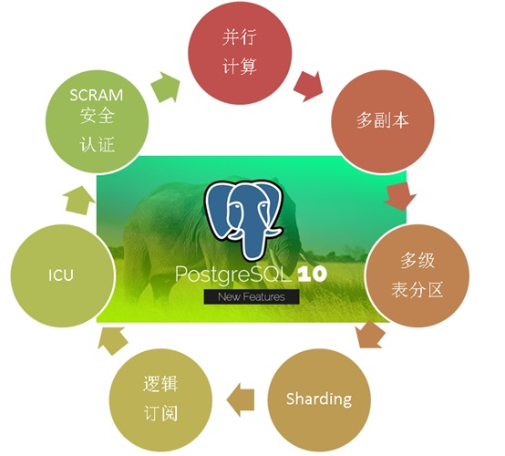

## HTAP数据库 PostgreSQL 场景与性能测试之 7 - (OLTP) 全文检索 - 含索引实时写入     
                                       
### 作者                      
digoal                      
                      
### 日期                       
2017-11-07                      
                        
### 标签                      
PostgreSQL , HTAP , OLTP , OLAP , 场景与性能测试                
                                  
----                                  
                                   
## 背景                    
PostgreSQL是一个历史悠久的数据库，历史可以追溯到1973年，最早由2014计算机图灵奖得主，关系数据库的鼻祖[Michael_Stonebraker](https://en.wikipedia.org/wiki/Michael_Stonebraker) 操刀设计，PostgreSQL具备与Oracle类似的功能、性能、架构以及稳定性。              
              
                
              
PostgreSQL社区的贡献者众多，来自全球各个行业，历经数年，PostgreSQL 每年发布一个大版本，以持久的生命力和稳定性著称。              
              
2017年10月，PostgreSQL 推出10 版本，携带诸多惊天特性，目标是胜任OLAP和OLTP的HTAP混合场景的需求：              
              
[《最受开发者欢迎的HTAP数据库PostgreSQL 10特性》](../201710/20171029_01.md)              
              
1、多核并行增强              
              
2、fdw 聚合下推              
              
3、逻辑订阅              
               
4、分区              
              
5、金融级多副本              
              
6、json、jsonb全文检索              
              
7、还有插件化形式存在的特性，如 **向量计算、JIT、SQL图计算、SQL流计算、分布式并行计算、时序处理、基因测序、化学分析、图像分析** 等。              
              
                
              
在各种应用场景中都可以看到PostgreSQL的应用：              
              
                
              
PostgreSQL近年来的发展非常迅猛，从知名数据库评测网站dbranking的数据库评分趋势，可以看到PostgreSQL向上发展的趋势：              
              
              
              
从每年PostgreSQL中国召开的社区会议，也能看到同样的趋势，参与的公司越来越多，分享的公司越来越多，分享的主题越来越丰富，横跨了 **传统企业、互联网、医疗、金融、国企、物流、电商、社交、车联网、共享XX、云、游戏、公共交通、航空、铁路、军工、培训、咨询服务等** 行业。              
              
接下来的一系列文章，将给大家介绍PostgreSQL的各种应用场景以及对应的性能指标。              
              
## 环境              
环境部署方法参考：              
              
[《PostgreSQL 10 + PostGIS + Sharding(pg_pathman) + MySQL(fdw外部表) on ECS 部署指南(适合新用户)》](../201710/20171018_01.md)                
              
阿里云 ECS：```56核，224G，1.5TB*2 SSD云盘```。      
              
操作系统：```CentOS 7.4 x64```              
              
数据库版本：```PostgreSQL 10```              
              
PS：**ECS的CPU和IO性能相比物理机会打一定的折扣，可以按下降1倍性能来估算。跑物理主机可以按这里测试的性能乘以2来估算。**                
              
## 场景 - 全文检索 - 含索引实时写入 (OLTP)              
              
### 1、背景              
      
字符串搜索是非常常见的业务需求，它包括：  
  
1、前缀+模糊查询。（可以使用b-tree索引）  
  
2、后缀+模糊查询。（可以使用b-tree索引）  
  
3、前后模糊查询。（可以使用pg_trgm和gin索引）  
  
4、全文检索。（可以使用全文检索类型以及gin或rum索引）  
  
5、正则查询。（可以使用pg_trgm和gin索引）  
  
6、相似查询。（可以使用pg_trgm和gin索引）  
  
通常来说，数据库并不具备3以后的加速能力，但是PostgreSQL的功能非常强大，它可以非常完美的支持这类查询的加速。（是指查询和写入不冲突的，并且索引BUILD是实时的。）  
  
用户完全不需要将数据同步到搜索引擎，再来查询，而且搜索引擎也只能做到全文检索，并不你做到正则、相似、前后模糊这几个需求。  
  
使用PostgreSQL可以大幅度的简化用户的架构，开发成本，同时保证数据查询的绝对实时性。  
      
### 2、设计              
              
128个字符的随机字符串，单点写入到全文检索字段。    
  
包含全文检索GIN索引，本CASE主要体现的是BUILD全文索引的同时，写入数据的能力。  
              
### 3、准备测试表       
              
```  
create table t_fts(  
  id int,  
  ts tsvector  
);  
  
create index idx_t_fts_ts on t_fts using gin (ts);  
```  
```    
              
### 4、准备测试函数(可选)              
     
```  
CREATE OR REPLACE FUNCTION public.gen_rand_str(integer)            
 RETURNS text            
 LANGUAGE sql            
 STRICT            
AS $function$            
  select string_agg(a[random()*6+1],'') from generate_series(1,$1), (select array['a','b','c','d','e','f',' ']) t(a);            
$function$;          
```  
    
### 5、准备测试数据              
                  
              
### 6、准备测试脚本              
              
```  
vi test.sql  
  
insert into t_fts values (1, to_tsvector(gen_rand_str(128)));  
```  
              
### 7、测试              
              
```      
CONNECTS=28      
TIMES=300      
export PGHOST=$PGDATA      
export PGPORT=1999      
export PGUSER=postgres      
export PGPASSWORD=postgres      
export PGDATABASE=postgres      
      
pgbench -M prepared -n -r -f ./test.sql -P 5 -c $CONNECTS -j $CONNECTS -T $TIMES      
```           
              
### 8、测试结果              
              
```       
    
```         
              
#### TPS：          
              
#### 平均响应时间：  毫秒         
      
              
## 参考              
[《PostgreSQL、Greenplum 应用案例宝典《如来神掌》 - 目录》](../201706/20170601_02.md)                
              
[《数据库选型之 - 大象十八摸 - 致 架构师、开发者》](../201702/20170209_01.md)                
              
[《PostgreSQL 使用 pgbench 测试 sysbench 相关case》](../201610/20161031_02.md)                
              
[《数据库界的华山论剑 tpc.org》](../201701/20170125_01.md)       
                
https://www.postgresql.org/docs/10/static/pgbench.html                
                
