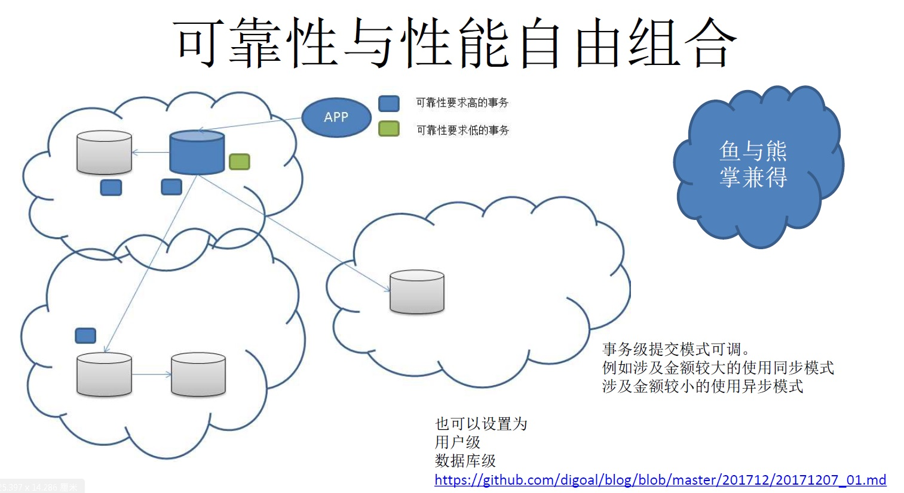

## PostgreSQL - 鱼与熊掌可兼得 - 多副本0丢失与高性能兼得 - 事务级异步、同步开关  
                              
### 作者                              
digoal                              
                              
### 日期                              
2017-12-07                             
                              
### 标签                              
PostgreSQL , synchronous_commit , redo , local , remote_write , remote_apply , on , off     
                              
----                              
                              
## 背景     
大多数的数据库属于IO密集型应用，特别是写繁忙的TP系统，例如账户系统。  
  
为了保证数据的可靠性，事务提交时，需要确保事务产生的REDO落到持久化的存储中。  
  
为了提高响应时间，除了数据库软件本身的优化，例如分组提交（降低IO频次）。还可以通过购买高IOPS能力的硬件来实现RT时延的降低。  
  
当然，将来硬盘的IO延迟如果能和内存到一个级别，实际上就没有REDO什么事了。  
  
实际上，还有一种折中的方法，异步提交。  
  
PostgreSQL的异步提交模式非常多，（PG的异步提交不会导致数据的不一致，并且是专门的进程在调度写出，所以即使异步，基本上涉及事务RECORD丢的可能性也非常少）。 例如：  
  
```  
synchronous_commit  
  
local, remote_write, remote_apply, on, off.  
```  
  
解释  
  
```  
local, 本地fsync  
  
remote_write, 本地fsync + 超阈值个数的 sync standby write   (quorum based sync standby)  
  
on, 本地fsync + 超阈值个数的 sync standby fsync  (quorum based sync standby)  
  
remote_write, 本地fsync + 超阈值个数的 sync standby apply   (quorum based sync standby)  
  
off, 本地write     
```  
  
同时PostgreSQL支持事务级修正synchronous_commit提交模式。  
  
例如，对可靠性要求高的事务，可以设置高等级的模式，可靠性要求低的事务可以使用低等级模式，提高性能。  
  
   
  
## 例子  
即使在同一个事务中，我们也能根据涉及金额的大小来修正synchronous_commit.  
  
例如涉及金额低于10 RMB时，继续使用异步提交，即使真的丢失几笔，赔偿来解决也是没有问题的。有些时候硬件成本远远比赔偿金额还要高。  
  
1、开启事务  
  
```  
postgres=# begin;  
BEGIN  
```  
  
2、执行一些事务内的SQL  
  
```  
postgres=# select 2;  
 ?column?   
----------  
        2  
(1 row)  
```  
  
3、涉及金额小于10，不改变默认的异步模式  
  
```  
postgres=# insert into tbl_charge values (3,1,now());  
INSERT 0 1  
postgres=# show synchronous_commit ;  
 synchronous_commit   
--------------------  
 off  
(1 row)  
```  
  
4、当程序发现涉及金额大于10时，主动设置当前事务的模式为同步模式。确保事务提交后，绝对不丢失。  
  
```  
postgres=# set local synchronous_commit = on;  
SET  
postgres=# show synchronous_commit ;  
 synchronous_commit   
--------------------  
 on  
(1 row)  
  
postgres=# insert into tbl_charge values (4,10000000,now());  
INSERT 0 1  
```  
  
5、结束事务，由于使用了同步模式，绝对不可能丢事务。  
  
```  
postgres=# end;  
COMMIT  
```  
  
6、当前会话当前模式又回到了默认的异步模式。  
  
```  
postgres=# show synchronous_commit ;  
 synchronous_commit   
--------------------  
 off  
(1 row)  
```  
  
## 模式可设置的范围  
1、系统级  
  
2、库级  
  
3、用户级  
  
4、会话级  
  
5、事务级  
  
根据不同的需求，在不同的层级设置即可。  
  
## 小结  
通过提交模式的多种组合，可以达到多种可靠性要求。  
  
通过事务级的设置，可以在不同的事务间，在性能、可靠性方面自由的选择。  
  
使用较低成本的硬件，实现业务对高可靠和高可用的混合需求。  
  
## 参考  
  
[《PostgreSQL 10.0 preview 功能增强 - slave支持WAITLSN 'lsn', time;用于设置安全replay栅栏》](../201703/20170312_18.md)    
  
[《PG多节点(quorum based), 0丢失 HA(failover,switchover)方案》](../201706/20170612_02.md)    
  
[《PostgreSQL 9.6 同步多副本 与 remote_apply事务同步级别》](../201610/20161006_02.md)    
  
  
  
  
  
  
  
  
  
  
  
  
  
  
#### [免费领取阿里云RDS PostgreSQL实例、ECS虚拟机](https://free.aliyun.com/ "57258f76c37864c6e6d23383d05714ea")
  
  
#### [digoal's PostgreSQL文章入口](https://github.com/digoal/blog/blob/master/README.md "22709685feb7cab07d30f30387f0a9ae")
  
  

  
  
  
  
  
  
#### 打赏都逃不过老婆的五指山 －_－b  

  
