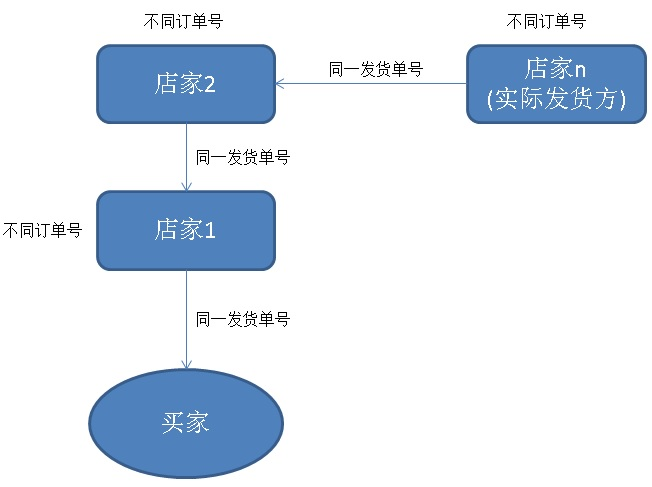
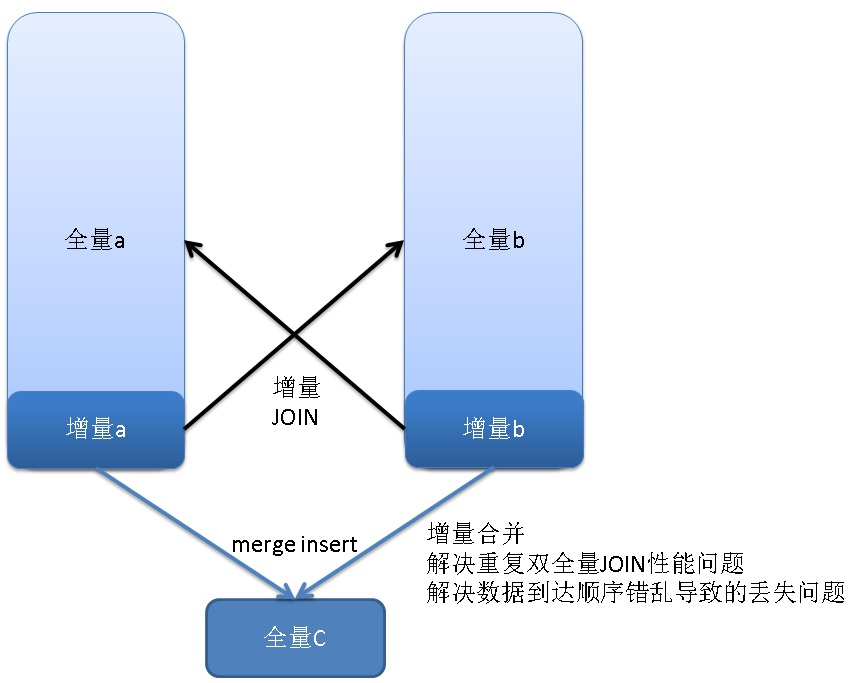

## 电商订单 + 物流信息对称补齐案例 - A, B表，到达时间交叉，增量JOIN补全C数据   
        
### 作者       
digoal         
          
### 日期       
2018-01-15      
                           
### 标签                           
PostgreSQL , 到达时间不确定 , 补齐 , JOIN      
                           
----                           
                           
## 背景     
在电商平台中，分销是非常普遍的现象，你在淘宝上买的东西，很可能并不是商家本身发货的，和你对接的商家，也许只是一个分销商。   
   
因此一个物流信息，可能涉及到多个订单。   
   
   
   
物流、订单表的到达时间可能不完全一致，所以在某一时刻，肯有订单，但是没有物流信息。或者有物流但是没有订单记录。   
   
如果A表代表订单表，B表代表物流表。实际上A,B是多对多的关系。（多条订单对应一个物流单号，每一个物流单号有多条记录（不同的物流状态））。   
   
由于到达时间的差异，A,B表的补齐需要注意，防止“丢失”信息的现象。   
   
## 业务需求与查询举例   
   
1、长时间未签收订单预警   
   
2、查询物流轨迹   
   
3、查询分销链路   
   
4、合并订单 与 物流信息   
   
## DEMO   
### 订单表：   
   
```   
create table a (   
  id int8,    -- 订单号   
  tid int8,   -- 物流ID   
  info text,  -- 订单信息，用一个TEXT字段代替（略）   
  crt_time timestamp   -- 时间   
);   
   
create index idx_a_1 on a(id);   
create index idx_a_2 on a(tid);   
```   
   
### 物流信息表：   
   
```   
create table b (   
  tid int8,   -- 物流ID   
  info text,  -- 物流其他属性，例如轨迹，用一个TEXT字段代替（略）   
  status int,   -- 物流状态(比如 0，揽件，1，已发出，2，已送达，3，已签收，。。。。。使用最大的号代表最终状态)   
  crt_time timestamp   -- 时间   
);    
   
create index idx_b_1 on b (tid, status);   
```   
   
### 合并信息表：   
   
```   
create table c (   
  id int8 primary key,   -- 订单号   
  tb b[],    -- 物流轨迹聚合   
  info text,    -- 订单信息，用一个TEXT字段代替（略）   
  crt_time timestamp -- 时间   
);   
   
create index idx_c_final on c (id) where get_status(tb) <> 3;   
```   
   
### 一些函数：   
   
```   
-- 通过物流单号得到相关订单，返回数组   
   
create or replace function get_id (int8) returns int8[] as $$   
  select array_agg(id) from a where tid=$1;   
$$ language sql strict;   
```   
   
```   
-- 通过物流单号得到物流轨迹数据，返回物流表数组   
   
create or replace function get_tid (int8) returns b[] as $$   
  select array_agg(b) from b where tid=$1;   
$$ language sql strict;   
```   
   
```   
-- 通过物流轨迹，得到物流最终状态   
create or replace function get_status(b[]) returns int as $$   
  select max(unnest) from (select (unnest($1)).status as unnest) t;   
$$ language sql strict immutable;   
```   
   
### 1、查询某个订单的物流轨迹   
   
```   
select unnest(get_tid(订单号));   
```   
   
### 2、查询某个订单的分销链路   
   
```   
select id from a where tid in (select tid from a where id=订单号);   
```   
   
### 3、合并订单 与 物流信息   
#### 方法1：   
   
```   
-- 存在重复劳动   
   
insert into c (id, tb, info, crt_time)   
select a.id, b.tb, a.info, a.crt_time from    
  a    
join    
  (select tid, array_agg(b order by status) as tb from b group by tid) b    
using (tid)   
on conflict (id)   
do update set   
  tb=excluded.tb, info=excluded.info, crt_time=excluded.crt_time   
where   
  c.tb<>excluded.tb or c.info=excluded.info or c.crt_time=excluded.crt_time;   
```   
   
#### 方法2：   
   
a,b的新增数据持续写入a1,b1。   
   
需要注意的是，结构的一致性，并保持一致。   
   
   
  
同时有两张a2,b2用于合并时的切换表。   
   
```   
-- 结构务必保持一致，而且将来改动a,b结构的时候a1,b1,a2,b2也要保持一致。

create table a1(like a);   
create table b1(like b);   
   
create table a2(like a);   
create table b2(like b);   
```   
   
DEMO，在一个事务中一气呵成:   
   
```   
-- 1、切换

begin;   
set lock_timeout ='1s';   
   
-- 切换表名   
alter table a1 rename to a3;   
alter table b1 rename to b3;   
   
alter table a2 rename to a1;   
alter table b2 rename to b1;   

end;

-- 2、增量合并

begin;   
set lock_timeout ='1s';   

lock table a3 in ACCESS EXCLUSIVE mode;
lock table b3 in ACCESS EXCLUSIVE mode;

-- 写入增量到主表   
insert into a select * from a3;   
insert into b select * from b3;   
   
-- 将a表的增量合并到C   
insert into c (id, tb, info, crt_time)   
select a.id, b.tb, a.info, a.crt_time from    
  a3 a    
join    
  (select tid, array_agg(b order by status) as tb from b group by tid) b    
using (tid)   
on conflict (id)   
do update set   
  tb=c.tb||excluded.tb, info=excluded.info, crt_time=excluded.crt_time;   
   
-- 将b表的增量合并到C   
insert into c (id, tb, info, crt_time)   
select a.id, b.tb, a.info, a.crt_time from    
  a   
join    
  (select tid, array_agg(row(b.*)::b order by status) as tb from b3 b group by tid) b    
using (tid)   
on conflict (id)   
do update set   
  tb=c.tb||excluded.tb, info=excluded.info, crt_time=excluded.crt_time;   
   
-- 清除临时表增量数据   
truncate a3;   
truncate b3;   
   
-- 切换表名   
alter table a3 rename to a2;   
alter table b3 rename to b2;   
end;   
```   
   
### 4、长时间未签收订单预警   
   
```   
select id from c where  get_status(tb) <> 3;   
   
-- 极速   
postgres=# explain select id from c where  get_status(tb) <> 3;   
                                 QUERY PLAN                                     
-----------------------------------------------------------------------------   
 Index Only Scan using idx_c_final on c  (cost=0.12..20.79 rows=746 width=8)   
(1 row)   
```   
   
## 参考   
[《超时流式处理 - 没有消息流入的数据异常监控》](../201712/20171222_02.md)     
  
  
  
  
  
  
  
  
  
  
  
  
  
#### [免费领取阿里云RDS PostgreSQL实例、ECS虚拟机](https://free.aliyun.com/ "57258f76c37864c6e6d23383d05714ea")
  
  
#### [digoal's PostgreSQL文章入口](https://github.com/digoal/blog/blob/master/README.md "22709685feb7cab07d30f30387f0a9ae")
  
  

  
  
#### 老婆的钱袋子：可以打赏哦^_^  

  
