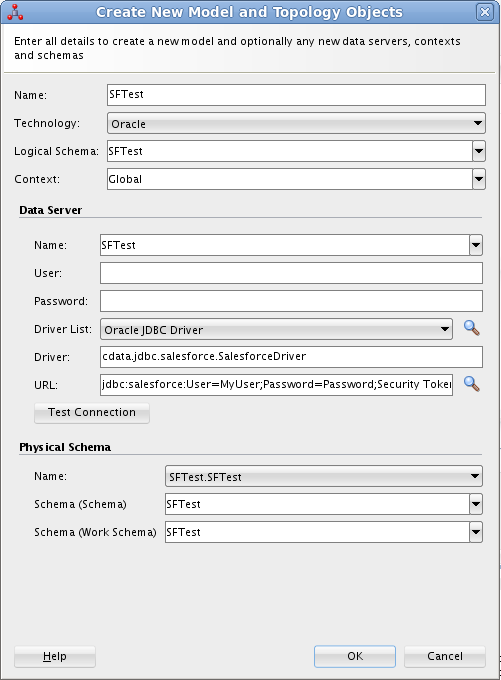
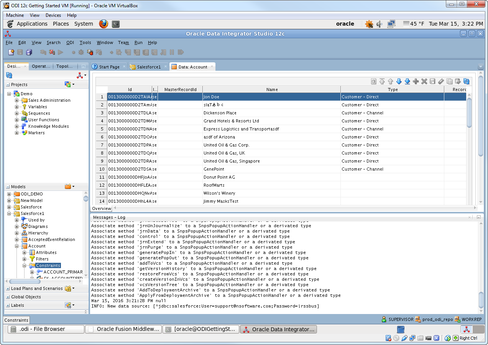
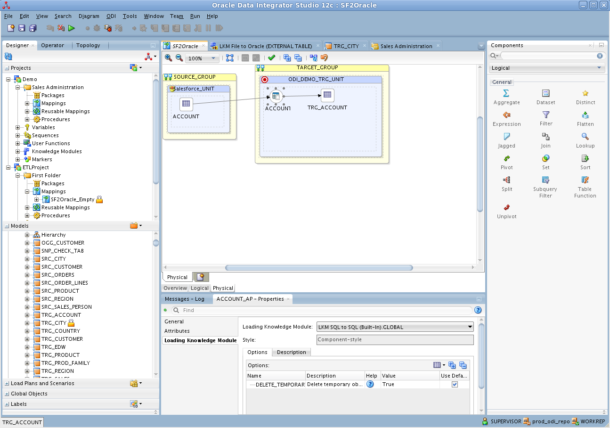

## ETL for Oracle to PostgreSQL 1 - Oracle Data Integrator (ODI)  
                                                           
### 作者                                                           
digoal                                                           
                                                           
### 日期                                                           
2018-05-05                                                         
                                                           
### 标签                                                           
PostgreSQL , Oracle , ETL , Oracle Data Integrator , ODI  
                                                           
----                                                           
                                                           
## 背景       
## 原文  
https://www.cdata.com/kb/tech/postgresql-jdbc-odi.rst  
  
## 正文  
  
## ETL PostgreSQL in Oracle Data Integrator  
***This article shows how to transfer PostgreSQL data into a data warehouse using Oracle Data Integrator.***  
  
Leverage existing skills by using the JDBC standard to read and write to PostgreSQL: Through drop-in integration into ETL tools like Oracle Data Integrator (ODI), the CData JDBC Driver for PostgreSQL connects real-time PostgreSQL data to your data warehouse, business intelligence, and Big Data technologies.  
  
JDBC connectivity enables you to work with PostgreSQL just as you would any other database in ODI. As with an RDBMS, you can use the driver to connect directly to the PostgreSQL APIs in real time instead of working with flat files.  
  
This article walks through a JDBC-based ETL -- PostgreSQL to Oracle. After reverse engineering a data model of PostgreSQL entities, you will create a mapping and select a data loading strategy -- since the driver supports SQL-92, this last step can easily be accomplished by selecting the built-in SQL to SQL Loading Knowledge Module.  
  
## Install the Driver  
To install the driver, copy the driver JAR and .lic file, located in the installation folder, into the ODI userlib directory:  
  
On Unix:  
  
```  
~/.odi/oracledi/userlib  
```  
  
On Windows:  
  
```  
%APPDATA%\Roaming\odi\oracledi\userlib  
```  
  
Restart ODI to complete the installation.  
  
## Reverse Engineer a Model  
Reverse engineering the model retrieves metadata about the driver's relational view of PostgreSQL data. After reverse engineering, you can query real-time PostgreSQL data and create mappings based on PostgreSQL tables.  
  
1、In ODI, connect to your repository and click New -> Model and Topology Objects.  
  
2、On the Model screen of the resulting dialog, enter the following information:  
  
* Name: Enter PostgreSQL.  
* Technology: Select Generic SQL.  
* Logical Schema: Enter PostgreSQL.  
* Context: Select Global.  
  
3、On the Data Server screen of the resulting dialog, enter the following information:  
  
* Technology: Select Oracle.  
* Name: Enter PostgreSQL.  
* Driver List: Select Oracle JDBC Driver.  
* Driver: Enter cdata.jdbc.postgresql.PostgreSQLDriver  
* URL: Enter the JDBC URL containing the connection string. Below is a typical connection string:  
```  
jdbc:postgresql:User=postgres;Password=admin;Database=postgres;Server=127.0.0.1;Port=5432  
```  
To connect to PostgreSQL, set the Server, Port (the default port is 5432), and Database connection properties and set the User and Password you wish to use to authenticate to the server. If the Database property is not specified, the data provider connects to the user's default database.  
  
4、On the Physical Schema screen, enter the following information:  
  
* Schema (Schema): Enter PostgreSQL.  
* Schema (Work Schema): Enter PostgreSQL.  
  
  
5、In the opened model click Reverse Engineer to retrieve the metadata for PostgreSQL tables.  
  
## Edit and Save PostgreSQL Data  
After reverse engineering you can now work with PostgreSQL data in ODI. To edit and save PostgreSQL data, expand the Models accordion in the Designer navigator, right-click a table, and click Data. Click Refresh to pick up any changes to the data. Click Save Changes when you are finished making changes.  
  
  
  
## Create an ETL Project  
Follow the steps below to create an ETL from PostgreSQL. You will load Orders entities into the sample data warehouse included in the ODI Getting Started VM.  
  
1、Open SQL Developer and connect to your Oracle database. Right-click the node for your database in the Connections pane and click new SQL Worksheet.  
  
Alternatively you can use SQLPlus. From a command prompt enter the following:  
  
```  
sqlplus / as sysdba  
```  
  
2、Enter the following query to create a new target table in the sample data warehouse, which is in the ODI_DEMO schema. The following query defines a few columns that match the Orders table in PostgreSQL:  
  
```  
CREATE TABLE ODI_DEMO.TRG_ORDERS (SHIPCITY NUMBER(20,0),ShipName VARCHAR2(255));  
```  
  
3、In ODI expand the Models accordion in the Designer navigator and double-click the Sales Administration node in the ODI_DEMO folder. The model is opened in the Model Editor.  
  
4、Click Reverse Engineer. The TRG_ORDERS table is added to the model.  
  
5、Right-click the Mappings node in your project and click New Mapping. Enter a name for the mapping and clear the Create Empty Dataset option. The Mapping Editor is displayed.  
  
6、Drag the TRG_ORDERS table from the Sales Administration model onto the mapping.  
  
7、Drag the Orders table from the PostgreSQL model onto the mapping.  
  
8、Click the source connector point and drag to the target connector point. The Attribute Matching dialog is displayed. For this example, use the default options. The target expressions are then displayed in   
the properties for the target columns.  
  
9、Open the Physical tab of the Mapping Editor and click ORDERS_AP in TARGET_GROUP.  
  
10、In the ACCOUNT_AP properties, select LKM SQL to SQL (Built-In) on the Loading Knowledge Module tab.  
  
  
  
You can then run the mapping to load PostgreSQL data into Oracle. (反之亦可)  
  
  
  
  
  
  
  
  
  
  
  
  
  
#### [免费领取阿里云RDS PostgreSQL实例、ECS虚拟机](https://free.aliyun.com/ "57258f76c37864c6e6d23383d05714ea")
  
  
#### [digoal's PostgreSQL文章入口](https://github.com/digoal/blog/blob/master/README.md "22709685feb7cab07d30f30387f0a9ae")
  
  

  
  
  
  
  
  
#### 打赏都逃不过老婆的五指山 －_－b  

  
