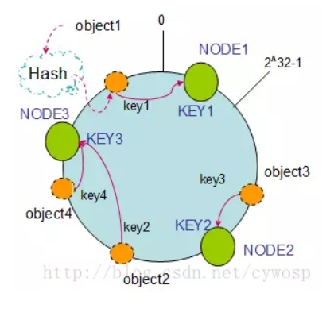
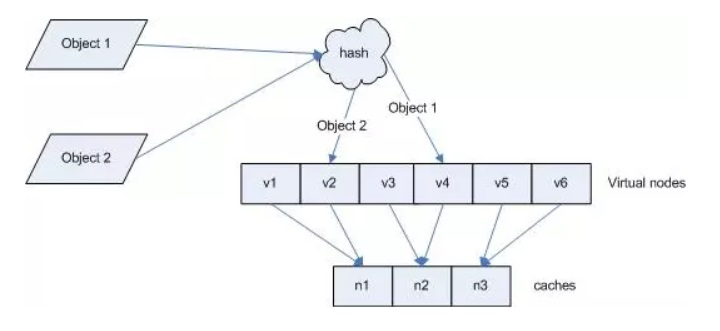

## [转载] 什么是一致性哈希算法  
                                                                                         
### 作者                                                                                         
digoal                                                                                         
                                                                                         
### 日期                                                                                         
2018-05-20                                                                                       
                                                                                         
### 标签                                                                                         
PostgreSQL , 一致性哈希                            
                                                                                         
----                                                                                         
                                                                                         
## 背景               
## 原文  
https://mp.weixin.qq.com/s/bCH-aU8cKS3uT6PwRYNJtA  
  
## 正文  
  
#### 1，对于待存储的海量数据，如何将它们分配到各个机器中去？---数据分片与路由  
  
当数据量很大时，通过改善单机硬件资源的纵向扩充方式来存储数据变得越来越不适用，而通过增加机器数目来获得水平横向扩展的方式则越来越流行。因此，就有个问题，如何将这些海量的数据分配到各个机器中？数据分布到各个机器存储之后，又如何进行查找？这里主要记录一致性Hash算法如何将数据分配到各个机器中去。  
  
#### 2，衡量一致性哈希算法好处的四个标准  
  
- ①平衡性。平衡性是指哈希的结果能够尽可能分布到所有的缓冲中去，这样可以使得所有的缓冲空间都得到利用。  
  
- ②单调性。单调性是指如果已经有一些数据通过哈希分配到了相应的机器上，又有新的机器加入到系统中。哈希的结果应能够保证原有已分配的内容可以被映射到原有的或者新的机器中去，而不会被映射到旧的机器集合中的其他机器上。这里再解释一下：就是原有的数据要么还是呆在它所在的机器上不动，要么被迁移到新的机器上，而不会迁移到旧的其他机器上。  
  
- ③分散性。  
  
- ④负载。  
  
  参考这里：https://blog.csdn.net/cywosp/article/details/23397179  
  
#### 3，一致性哈希的原理  
  
由于一般的哈希函数返回一个int（32bit）型的hashCode。因此，可以将该哈希函数能够返回的hashCode表示成一个范围为0---（2^32）-1 环。  
  
  
将机器的标识（如：IP地址）作为哈希函数的Key映射到环上。如：  
  
hash(Node1) =Key1，hash(Node2) = Key2，借用一张图如下：  
  
  
  
同样，数据也通过相同的哈希函数映射到环上。这样，按照顺时针方向，数据存放在它所在的顺时针方向上的那个机器上。这就是一致性哈希算法分配数据的方式！  
  
#### 4，JAVA实现一致性哈希算法的代码分析  
  
1、设计哈希函数  
  
这里采用了MD5算法，主要是用来保证平衡性，即能够将机器均衡地映射到环上。貌似用Jdk中String类的hashCode并不能很好的保证平衡性。  
  
```  
import java.security.MessageDigest;  
import java.security.NoSuchAlgorithmException;  
  
/*  
* 实现一致性哈希算法中使用的哈希函数,使用MD5算法来保证一致性哈希的平衡性  
*/  
public class HashFunction {  
   private MessageDigest md5 = null;  
  
   public long hash(String key) {  
       if (md5 == null) {  
           try {  
               md5 = MessageDigest.getInstance("MD5");  
           } catch (NoSuchAlgorithmException e) {  
               throw new IllegalStateException("no md5 algrithm found");  
           }  
       }  
  
       md5.reset();  
       md5.update(key.getBytes());  
       byte[] bKey = md5.digest();  
       //具体的哈希函数实现细节--每个字节 & 0xFF 再移位  
       long result = ((long) (bKey[3] & 0xFF) << 24)  
               | ((long) (bKey[2] & 0xFF) << 16  
                       | ((long) (bKey[1] & 0xFF) << 8) | (long) (bKey[0] & 0xFF));  
       return result & 0xffffffffL;  
   }  
}  
```  
  
2、实现一致性哈希算法  
  
**①为什么要引入虚拟机器节点？它的作用是什么？**  
  
引入虚拟机器节点，其目的就是为了解决数据分配不均衡的问题。因为，在将实际的物理机器映射到环上时，有可能大部分机器都映射到环上的某一个部分(比如左半圆上)，而通过引入虚拟机器节点，在进行机器hash映射时，不是映射具体机器，而是映射虚拟机器，并保证虚拟机器对应的物理机器是均衡的---每台实际的机器对应着相等数目的Virtual nodes。如下图：  
  
  
  
**②如何解决集群中添加或者删除机器上需要迁移大量数据的问题？**  
  
假设采用传统的哈希取模法，设有K台物理机，H(key)=hash(key) mod K 即可实现数据分片。但当K变化时（如新增一台机器），所有已经映射好的数据都需要重新再映射。H(key)=hash(key) mod (K+1)。  
  
一致性哈希采用的做法如下：引入一个环的概念，如上面的第一个图。先将机器映射到这个环上，再将数据也通过相同的哈希函数映射到这个环上，数据存储在它顺时针走向的那台机器上。以环为中介，实现了数据与机器数目之间的解藕。这样，当机器的数目变化时，只会影响到增加或删除的那台机器所在的环的邻接机器的数据存储，而其他机器上的数据不受影响。  
  
   
在具体JAVA实现代码中，定义了一个TreeMap<k, V>用来保存虚拟机器节点到实际的物理机器的映射。机器以字符串形式来标识，故hash函数的参数为String。  
  
```  
for (int i = 0; i < numberOfReplicas; i++)  
   // 对于一个实际机器节点 node, 对应 numberOfReplicas 个虚拟节点  
   /*  
    * 不同的虚拟节点(i不同)有不同的hash值,但都对应同一个实际机器node  
    * 虚拟node一般是均衡分布在环上的,数据存储在顺时针方向的虚拟node上  
    */  
   circle.put(hashFunction.hash(node.toString() + i), node);  
```  
  
而对于 数据的存储而言，逻辑上是按顺时针方向存储在虚拟机器节点中，虚拟机器节点通过TreeMap知道它实际需要将数据存储在哪台物理机器上。此外，TreeMap中的Key是有序的，而环也是顺时针有序的，这样才能当数据被映射到两台虚拟机器之间的弧上时，通过TreeMap的 tailMap()来寻找顺时针方向上的下一台虚拟机。  
  
```  
if (!circle.containsKey(hash)) {  
  
//数据映射在两台虚拟机器所在环之间,就需要按顺时针方向寻找机器  
   SortedMap<Long, T> tailMap = circle.tailMap(hash);  
   hash = tailMap.isEmpty() ? circle.firstKey() : tailMap.firstKey();  
  
}  
```  
  
完整代码：  
  
```  
import java.util.Collection;  
import java.util.HashSet;  
import java.util.Iterator;  
import java.util.Set;  
import java.util.SortedMap;  
import java.util.SortedSet;  
import java.util.TreeMap;  
import java.util.TreeSet;  
  
public class ConsistentHash<T> {  
   private final HashFunction hashFunction;  
   private final int numberOfReplicas;  
   // 节点的复制因子,实际节点个数 * numberOfReplicas =虚拟节点个数  
   private final SortedMap<Long, T> circle = new TreeMap<Long, T>();  
   // 存储虚拟节点的hash值到真实节点的映射  
  
   public ConsistentHash(HashFunction hashFunction, int numberOfReplicas,  
           Collection<T> nodes) {  
       this.hashFunction = hashFunction;  
       this.numberOfReplicas = numberOfReplicas;  
       for (T node : nodes)  
           add(node);  
   }  
  
   public void add(T node) {  
       for (int i = 0; i < numberOfReplicas; i++)  
           // 对于一个实际机器节点 node, 对应 numberOfReplicas 个虚拟节点  
           /*  
            * 不同的虚拟节点(i不同)有不同的hash值,但都对应同一个实际机器node  
            * 虚拟node一般是均衡分布在环上的,数据存储在顺时针方向的虚拟node上  
            */  
           circle.put(hashFunction.hash(node.toString() + i), node);  
   }  
  
   public void remove(T node) {  
       for (int i = 0; i < numberOfReplicas; i++)  
           circle.remove(hashFunction.hash(node.toString() + i));  
   }  
  
   /*  
    * 获得一个最近的顺时针节点,根据给定的key 取Hash  
    * 然后再取得顺时针方向上最近的一个虚拟节点对应的实际节点  
    * 再从实际节点中取得 数据  
    */  
   public T get(Object key) {  
       if (circle.isEmpty())  
           return null;  
       long hash = hashFunction.hash((String) key);  
       // node 用String来表示,获得node在哈希环中的hashCode  
       if (!circle.containsKey(hash)) {  
       //数据映射在两台虚拟机器所在环之间,就需要按顺时针方向寻找机器  
           SortedMap<Long, T> tailMap = circle.tailMap(hash);  
           hash = tailMap.isEmpty() ? circle.firstKey() : tailMap.firstKey();  
       }  
       return circle.get(hash);  
   }  
  
   public long getSize() {  
       return circle.size();  
   }  
     
   /*  
    * 查看MD5算法生成的hashCode值---表示整个哈希环中各个虚拟节点位置  
    */  
   public void testBalance(){  
       Set<Long> sets  = circle.keySet();  
       //获得TreeMap中所有的Key  
       SortedSet<Long> sortedSets= new TreeSet<Long>(sets);  
       //将获得的Key集合排序  
       for(Long hashCode : sortedSets){  
           System.out.println(hashCode);  
       }  
         
       System.out.println("----each location 's distance are follows: ----");  
       /*  
        * 查看用MD5算法生成的long hashCode 相邻两个hashCode的差值  
        */  
       Iterator<Long> it = sortedSets.iterator();  
       Iterator<Long> it2 = sortedSets.iterator();  
       if(it2.hasNext())  
           it2.next();  
       long keyPre, keyAfter;  
       while(it.hasNext() && it2.hasNext()){  
           keyPre = it.next();  
           keyAfter = it2.next();  
           System.out.println(keyAfter - keyPre);  
       }  
   }  
     
   public static void main(String[] args) {  
       Set<String> nodes = new HashSet<String>();  
       nodes.add("A");  
       nodes.add("B");  
       nodes.add("C");  
         
       ConsistentHash<String> consistentHash = new ConsistentHash<String>(new HashFunction(), 2, nodes);  
       consistentHash.add("D");  
         
       System.out.println("hash circle size: " + consistentHash.getSize());  
       System.out.println("location of each node are follows: ");  
       consistentHash.testBalance();  
   }  
     
}  
```  
  
## 参考  
  
http://blog.csdn.net/cywosp/article/details/23397179  
  
http://blog.csdn.net/sparkliang/article/details/5279393  
  
http://cnblogs.com/hupengcool/p/3659016.html  
  
  
<a rel="nofollow" href="http://info.flagcounter.com/h9V1"  ></a>  
  
  
  
  
## [digoal's PostgreSQL文章入口](https://github.com/digoal/blog/blob/master/README.md "22709685feb7cab07d30f30387f0a9ae")
  
