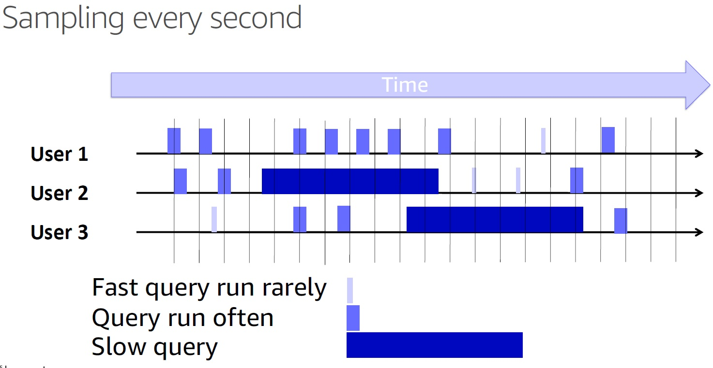
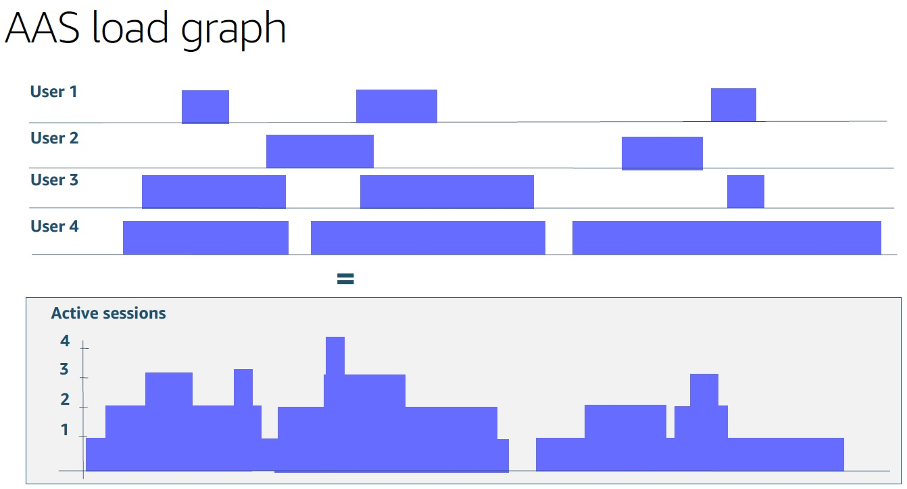
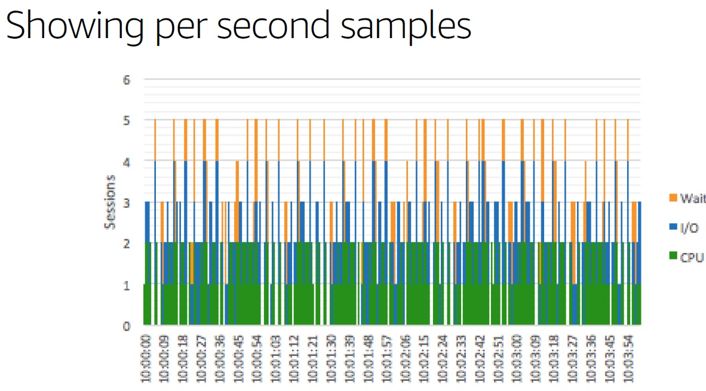
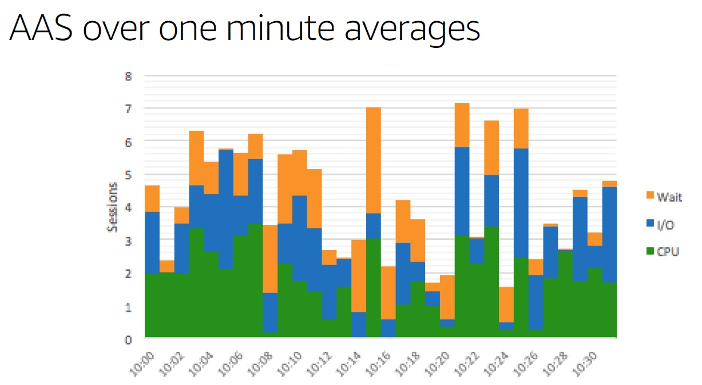
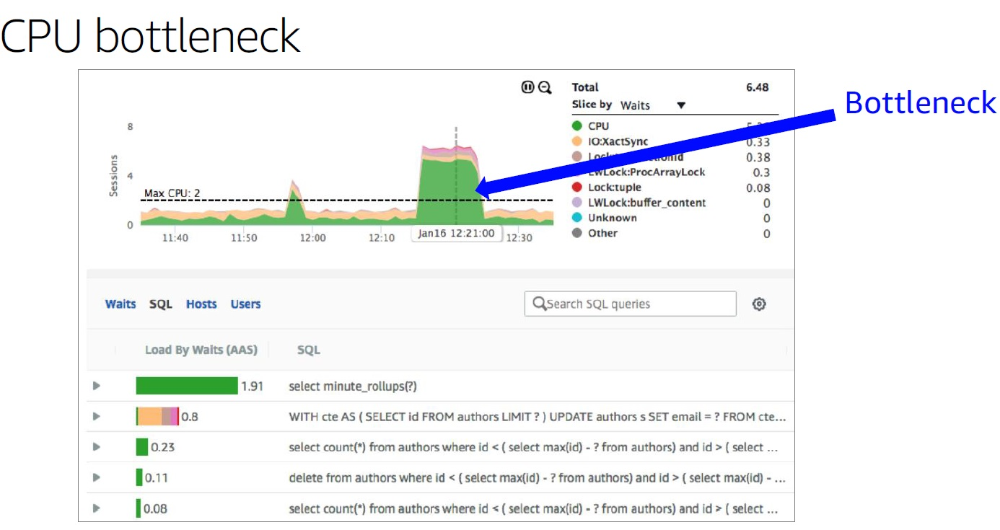
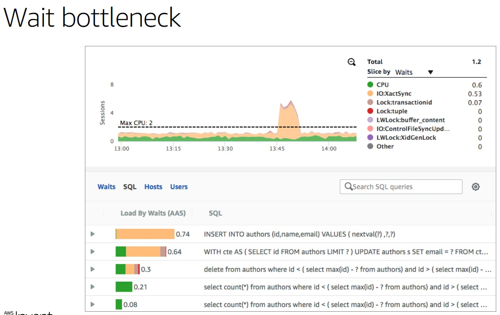
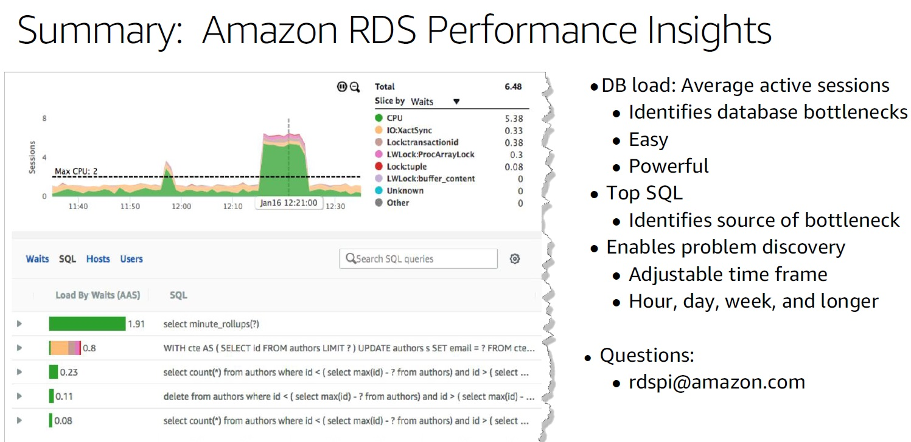

## PostgreSQL Oracle 兼容性之 - performance insight - AWS performance insight 理念与实现解读 - 珍藏级  
                                  
### 作者                                  
digoal                                  
                                  
### 日期                                  
2019-01-25                                  
                                  
### 标签                                  
PostgreSQL , perf insight , 等待事件 , 采样 , 发现问题     
                              
----                            
                              
## 背景    
传统的监控方法通常是从数据库本身的特性触发，需要对数据库具备非常深刻的理解，才能做出好的监控和诊断系统。属于专家型或叫做经验型的监控和诊断系统。  
  
[《[未完待续] PostgreSQL 一键诊断项 - 珍藏级》](../201806/20180613_05.md)    
  
[《PostgreSQL 实时健康监控 大屏 - 低频指标 - 珍藏级》](../201806/20180613_04.md)    
  
[《PostgreSQL 实时健康监控 大屏 - 高频指标(服务器) - 珍藏级》](../201806/20180613_03.md)    
  
[《PostgreSQL 实时健康监控 大屏 - 高频指标 - 珍藏级》](../201806/20180613_02.md)    
  
[《PostgreSQL pgmetrics - 多版本、健康监控指标采集、报告》](../201810/20181001_03.md)    
  
[《PostgreSQL pg_top pgcenter - 实时top类工具》](../201810/20181003_01.md)    
  
[《PostgreSQL、Greenplum 日常监控 和 维护任务 - 最佳实践》](../201709/20170913_01.md)    
  
[《PostgreSQL 如何查找TOP SQL (例如IO消耗最高的SQL) (包含SQL优化内容) - 珍藏级》](../201704/20170424_06.md)    
  
[《PostgreSQL 锁等待监控 珍藏级SQL - 谁堵塞了谁》](../201705/20170521_01.md)    
  
然而数据库在不断的演进，经验型的诊断系统好是好，但是不通用，有没有更加通用，有效的发现系统问题的方法？  
  
AWS与Oracle perf insight的思路非常不错，实际上就是等待事件的统计追踪，作为性能诊断的方法。  
  
https://docs.aws.amazon.com/AmazonRDS/latest/UserGuide/USER_PerfInsights.html  
  
[《AWS performance insight》](20190125_02_pdf_001.pdf)     
  
简单来说就是对系统不停的打点，例如每秒一个采样，仅记录这一秒数据库活跃的会话（包括等待中的会话），等待事件，QUERY，时间，用户，数据库。这几个指标。  
  
活跃度会话，不管是在耗费CPU，还是在等待（锁，IO）或者其他，实际上都是占用了资源的。可以算出平均的活跃会话（例如10秒的平均值，5秒的平均值）(avg active sessions)。  
  
这个avg active sessions是一个值，这个值和数据库实例的CPU个数进行比较，就可以衡量出系统是否存在瓶颈（当avg active sessions超过CPU个数时，说明存在瓶颈）。  
  
当某个时间窗口存在瓶颈，瓶颈在哪里，则可以通过这个时间窗口内的打点明细，进行统计。等待事件，QUERY，用户，数据库。  
  
PostgreSQL打点的方法也很多：  
  
1、（推荐）通过pg_stat_activity 内存中的动态视图获取，每秒取一次ACTIVE的内容（例如：会话ID，等待事件，QUERY，时间，用户，数据库）。  
  
https://www.postgresql.org/docs/11/monitoring-stats.html#MONITORING-STATS-VIEWS  
  
2、（不推荐）开启审计日志，在审计日志中获取，这个在高并发系统中，不太好用。并且审计日志是在结束时打印，一个QUERY的中间执行过程并不完全是占用CPU或其他资源的，所以审计日志获取的信息对于perf insight并没有什么效果。  
  
## perf insight 实现讲解  
  
  
  
  
  
  
  
  
  
  
  
  
  
  
### 举例1  
会话1  
  
```  
postgres=# begin;  
BEGIN  
postgres=# lock table abc in access exclusive mode ;  
LOCK TABLE  
```  
  
会话2  
  
```  
postgres=# select * from abc;  
```  
  
从pg_stat_activity获取状态，可以看到会话2在等待，会话处于active状态，这种消耗需要被记录到avg active session中，用来评估资源消耗指标。  
  
```  
postgres=# select now(),state,datname,usename,wait_event_type,wait_event,query from pg_stat_activity where state in ('active', 'fastpath function call');  
              now              | state  | datname  | usename  | wait_event_type | wait_event |                                           query                                              
-------------------------------+--------+----------+----------+-----------------+------------+--------------------------------------------------------------------------------------------  
 2019-01-25 21:17:28.540264+08 | active | postgres | postgres |                 |            | select datname,usename,query,state,wait_event_type,wait_event,now() from pg_stat_activity;  
 2019-01-25 21:17:28.540264+08 | active | postgres | postgres | Lock            | relation   | select * from abc;  
(2 rows)  
```  
  
### 举例2  
使用pgbench压测数据库，每秒打点，后期进行可视化展示  
  
```  
pgbench -i -s 100  
```  
  
1、压测只读  
  
```  
pgbench -M prepared -n -r -P 1 -c 64 -j 64 -T 300 -S  
```  
  
2、查看压测时的活跃会话状态  
  
```  
postgres=# select now()::timestamp(0),state,datname,usename,wait_event_type,wait_event,query from pg_stat_activity where state in ('active', 'fastpath function call') and pid<>pg_backend_pid();  
         now         | state  | datname  | usename  | wait_event_type | wait_event |                         query                           
---------------------+--------+----------+----------+-----------------+------------+-------------------------------------------------------  
 2019-01-25 21:28:52 | active | postgres | postgres |                 |            | SELECT abalance FROM pgbench_accounts WHERE aid = $1;  
 2019-01-25 21:28:52 | active | postgres | postgres |                 |            | SELECT abalance FROM pgbench_accounts WHERE aid = $1;  
 2019-01-25 21:28:52 | active | postgres | postgres |                 |            | SELECT abalance FROM pgbench_accounts WHERE aid = $1;  
 2019-01-25 21:28:52 | active | postgres | postgres |                 |            | SELECT abalance FROM pgbench_accounts WHERE aid = $1;  
 2019-01-25 21:28:52 | active | postgres | postgres |                 |            | SELECT abalance FROM pgbench_accounts WHERE aid = $1;  
 2019-01-25 21:28:52 | active | postgres | postgres | Client          | ClientRead | SELECT abalance FROM pgbench_accounts WHERE aid = $1;  
 2019-01-25 21:28:52 | active | postgres | postgres | Client          | ClientRead | SELECT abalance FROM pgbench_accounts WHERE aid = $1;  
 2019-01-25 21:28:52 | active | postgres | postgres |                 |            | SELECT abalance FROM pgbench_accounts WHERE aid = $1;  
 2019-01-25 21:28:52 | active | postgres | postgres |                 |            | SELECT abalance FROM pgbench_accounts WHERE aid = $1;  
 2019-01-25 21:28:52 | active | postgres | postgres | Client          | ClientRead | SELECT abalance FROM pgbench_accounts WHERE aid = $1;  
 2019-01-25 21:28:52 | active | postgres | postgres | Client          | ClientRead | SELECT abalance FROM pgbench_accounts WHERE aid = $1;  
 2019-01-25 21:28:52 | active | postgres | postgres |                 |            | SELECT abalance FROM pgbench_accounts WHERE aid = $1;  
 2019-01-25 21:28:52 | active | postgres | postgres | Client          | ClientRead | SELECT abalance FROM pgbench_accounts WHERE aid = $1;  
 2019-01-25 21:28:52 | active | postgres | postgres |                 |            | SELECT abalance FROM pgbench_accounts WHERE aid = $1;  
 2019-01-25 21:28:52 | active | postgres | postgres | Client          | ClientRead | SELECT abalance FROM pgbench_accounts WHERE aid = $1;  
 2019-01-25 21:28:52 | active | postgres | postgres |                 |            | SELECT abalance FROM pgbench_accounts WHERE aid = $1;  
 2019-01-25 21:28:52 | active | postgres | postgres |                 |            | SELECT abalance FROM pgbench_accounts WHERE aid = $1;  
 2019-01-25 21:28:52 | active | postgres | postgres |                 |            | SELECT abalance FROM pgbench_accounts WHERE aid = $1;  
 2019-01-25 21:28:52 | active | postgres | postgres |                 |            | SELECT abalance FROM pgbench_accounts WHERE aid = $1;  
 2019-01-25 21:28:52 | active | postgres | postgres | Client          | ClientRead | SELECT abalance FROM pgbench_accounts WHERE aid = $1;  
 2019-01-25 21:28:52 | active | postgres | postgres |                 |            | SELECT abalance FROM pgbench_accounts WHERE aid = $1;  
 2019-01-25 21:28:52 | active | postgres | postgres |                 |            | SELECT abalance FROM pgbench_accounts WHERE aid = $1;  
 2019-01-25 21:28:52 | active | postgres | postgres |                 |            | SELECT abalance FROM pgbench_accounts WHERE aid = $1;  
 2019-01-25 21:28:52 | active | postgres | postgres |                 |            | SELECT abalance FROM pgbench_accounts WHERE aid = $1;  
 2019-01-25 21:28:52 | active | postgres | postgres |                 |            | SELECT abalance FROM pgbench_accounts WHERE aid = $1;  
 2019-01-25 21:28:52 | active | postgres | postgres |                 |            | SELECT abalance FROM pgbench_accounts WHERE aid = $1;  
 2019-01-25 21:28:52 | active | postgres | postgres |                 |            | SELECT abalance FROM pgbench_accounts WHERE aid = $1;  
 2019-01-25 21:28:52 | active | postgres | postgres |                 |            | SELECT abalance FROM pgbench_accounts WHERE aid = $1;  
 2019-01-25 21:28:52 | active | postgres | postgres |                 |            | SELECT abalance FROM pgbench_accounts WHERE aid = $1;  
 2019-01-25 21:28:52 | active | postgres | postgres |                 |            | SELECT abalance FROM pgbench_accounts WHERE aid = $1;  
 2019-01-25 21:28:52 | active | postgres | postgres | Client          | ClientRead | SELECT abalance FROM pgbench_accounts WHERE aid = $1;  
 2019-01-25 21:28:52 | active | postgres | postgres | Client          | ClientRead | SELECT abalance FROM pgbench_accounts WHERE aid = $1;  
 2019-01-25 21:28:52 | active | postgres | postgres | Client          | ClientRead | SELECT abalance FROM pgbench_accounts WHERE aid = $1;  
 2019-01-25 21:28:52 | active | postgres | postgres |                 |            | SELECT abalance FROM pgbench_accounts WHERE aid = $1;  
 2019-01-25 21:28:52 | active | postgres | postgres | Client          | ClientRead | SELECT abalance FROM pgbench_accounts WHERE aid = $1;  
 2019-01-25 21:28:52 | active | postgres | postgres |                 |            | SELECT abalance FROM pgbench_accounts WHERE aid = $1;  
 2019-01-25 21:28:52 | active | postgres | postgres |                 |            | SELECT abalance FROM pgbench_accounts WHERE aid = $1;  
 2019-01-25 21:28:52 | active | postgres | postgres | Client          | ClientRead | SELECT abalance FROM pgbench_accounts WHERE aid = $1;  
 2019-01-25 21:28:52 | active | postgres | postgres |                 |            | SELECT abalance FROM pgbench_accounts WHERE aid = $1;  
 2019-01-25 21:28:52 | active | postgres | postgres |                 |            | SELECT abalance FROM pgbench_accounts WHERE aid = $1;  
 2019-01-25 21:28:52 | active | postgres | postgres |                 |            | SELECT abalance FROM pgbench_accounts WHERE aid = $1;  
 2019-01-25 21:28:52 | active | postgres | postgres |                 |            | SELECT abalance FROM pgbench_accounts WHERE aid = $1;  
 2019-01-25 21:28:52 | active | postgres | postgres |                 |            | SELECT abalance FROM pgbench_accounts WHERE aid = $1;  
 2019-01-25 21:28:52 | active | postgres | postgres |                 |            | SELECT abalance FROM pgbench_accounts WHERE aid = $1;  
 2019-01-25 21:28:52 | active | postgres | postgres |                 |            | SELECT abalance FROM pgbench_accounts WHERE aid = $1;  
 2019-01-25 21:28:52 | active | postgres | postgres |                 |            | SELECT abalance FROM pgbench_accounts WHERE aid = $1;  
(46 rows)  
```  
  
3、为了方便统计，可以在本地建表，用于收集pg_stat_activity的内容，实际的生产中，可以把这个信息读走，存到其他地方。  
  
```  
postgres=# create unlogged table perf_insight as select now()::timestamp(0) as ts,state,datname,usename,wait_event_type||'_'||wait_event as waiting ,query from pg_stat_activity where state in ('active', 'fastpath function call') and pid<>pg_backend_pid();  
SELECT 48  
```  
  
4、试着写入当时pg_stat_activity状态  
  
```  
postgres=# insert into perf_insight select now()::timestamp(0),state,datname,usename,wait_event_type||'_'||wait_event,query from pg_stat_activity where state in ('active', 'fastpath function call') and pid<>pg_backend_pid();  
INSERT 0 42  
```  
  
5、每秒打一个点  
  
```  
postgres=# \watch 1  
```  
  
6、压测结果  
  
```  
pgbench -M prepared -n -r -P 1 -c 64 -j 64 -T 300 -S  
  
transaction type: <builtin: select only>  
scaling factor: 100  
query mode: prepared  
number of clients: 64  
number of threads: 64  
duration: 300 s  
number of transactions actually processed: 390179555  
latency average = 0.049 ms  
latency stddev = 0.026 ms  
tps = 1300555.237752 (including connections establishing)  
tps = 1300584.885231 (excluding connections establishing)  
statement latencies in milliseconds:  
         0.001  \set aid random(1, 100000 * :scale)  
         0.049  SELECT abalance FROM pgbench_accounts WHERE aid = :aid;  
```  
  
7、接下来，开启一个读写压测  
  
  
```  
pgbench -M prepared -n -r -P 1 -c 64 -j 64 -T 300   
  
  
  
transaction type: <builtin: TPC-B (sort of)>  
scaling factor: 100  
query mode: prepared  
number of clients: 64  
number of threads: 64  
duration: 300 s  
number of transactions actually processed: 28371829  
latency average = 0.677 ms  
latency stddev = 0.413 ms  
tps = 94569.412707 (including connections establishing)  
tps = 94571.934011 (excluding connections establishing)  
statement latencies in milliseconds:  
         0.002  \set aid random(1, 100000 * :scale)  
         0.001  \set bid random(1, 1 * :scale)  
         0.001  \set tid random(1, 10 * :scale)  
         0.001  \set delta random(-5000, 5000)  
         0.045  BEGIN;  
         0.108  UPDATE pgbench_accounts SET abalance = abalance + :delta WHERE aid = :aid;  
         0.069  SELECT abalance FROM pgbench_accounts WHERE aid = :aid;  
         0.091  UPDATE pgbench_tellers SET tbalance = tbalance + :delta WHERE tid = :tid;  
         0.139  UPDATE pgbench_branches SET bbalance = bbalance + :delta WHERE bid = :bid;  
         0.068  INSERT INTO pgbench_history (tid, bid, aid, delta, mtime) VALUES (:tid, :bid, :aid, :delta, CURRENT_TIMESTAMP);  
         0.153  END;  
```  
  
8、perf insight 可视化的素材  
  
时间、状态、数据库名、用户名、等待事件、查询  
  
当然，我们可以再细化，例如增加会话ID字段，可以针对一个会话来进行展示和统计。  
  
```  
postgres=# \d perf_insight   
                   Unlogged table "public.perf_insight"  
 Column  |              Type              | Collation | Nullable | Default   
---------+--------------------------------+-----------+----------+---------  
 ts      | timestamp(0) without time zone |           |          |   
 state   | text                           |           |          |   
 datname | name                           |           |          |   
 usename | name                           |           |          |   
 waiting | text                           |           |          |   
 query   | text                           |           |          |   
```  
  
9、查看perf insight素材内容  
  
```  
postgres=# select * from perf_insight limit 10;  
         ts          | state  | datname  | usename  |      waiting      |                         query                           
---------------------+--------+----------+----------+-------------------+-------------------------------------------------------  
 2019-01-25 21:39:23 | active | postgres | postgres |                   | SELECT abalance FROM pgbench_accounts WHERE aid = $1;  
 2019-01-25 21:39:23 | active | postgres | postgres |                   | SELECT abalance FROM pgbench_accounts WHERE aid = $1;  
 2019-01-25 21:39:23 | active | postgres | postgres |                   | SELECT abalance FROM pgbench_accounts WHERE aid = $1;  
 2019-01-25 21:39:23 | active | postgres | postgres |                   | SELECT abalance FROM pgbench_accounts WHERE aid = $1;  
 2019-01-25 21:39:23 | active | postgres | postgres |                   | SELECT abalance FROM pgbench_accounts WHERE aid = $1;  
 2019-01-25 21:39:23 | active | postgres | postgres | Client_ClientRead | SELECT abalance FROM pgbench_accounts WHERE aid = $1;  
 2019-01-25 21:39:23 | active | postgres | postgres | Client_ClientRead | SELECT abalance FROM pgbench_accounts WHERE aid = $1;  
 2019-01-25 21:39:23 | active | postgres | postgres | Client_ClientRead | SELECT abalance FROM pgbench_accounts WHERE aid = $1;  
 2019-01-25 21:39:23 | active | postgres | postgres |                   | SELECT abalance FROM pgbench_accounts WHERE aid = $1;  
 2019-01-25 21:39:23 | active | postgres | postgres | Client_ClientRead | SELECT abalance FROM pgbench_accounts WHERE aid = $1;  
(10 rows)  
```  
  
10、在这段时间中，有多少种等待事件  
  
```  
postgres=# select distinct waiting from perf_insight ;  
         waiting            
--------------------------  
 LWLock_wal_insert  
   
 LWLock_XidGenLock  
 Lock_extend  
 LWLock_ProcArrayLock  
 Lock_tuple  
 Lock_transactionid  
 LWLock_lock_manager  
 Client_ClientRead  
 IPC_ProcArrayGroupUpdate  
 LWLock_buffer_content  
 IPC_ClogGroupUpdate  
 LWLock_CLogControlLock  
 IO_DataFileExtend  
(14 rows)  
```  
  
  
### perf insight 可视化,统计  
n秒求一个平均值(分不同维度)，得到一个图形：  
  
  
1、总 avg active sessions ， 用于告警。   
  
2、其他维度，用于分析造成瓶颈问题的权重：  
  
2\.1、等待事件维度(NULL表示无等待，为纯CPU time) avg active sessions   
  
2\.2、query 维度 avg active sessions   
  
2\.3、数据库维度 avg active sessions   
  
2\.4、用户维度 avg active sessions   
  
  
例如，对于一个64线程的系统：  
  
avg active sessions 在64以下时，可以认为是没有问题的。  
  
#### 1 总 avg active sessions ， 用于告警。   
5秒统计间隔。  
  
```  
select coalesce(t1.ts,t2.ts) ts, coalesce(avg_active_sessions,0) avg_active_sessions   
from   
(select to_timestamp((extract(epoch from ts))::int8/5*5) ts, count(*)/5::float8 avg_active_sessions from perf_insight group by 1) t1  
full outer join   
(select generate_series(to_timestamp((extract(epoch from min(ts)))::int8/5*5),to_timestamp((extract(epoch from max(ts)))::int8/5*5),interval '5 s') ts from perf_insight) t2  
on (t1.ts=t2.ts);  
  
  
           ts           | avg_active_sessions   
------------------------+---------------------  
 2019-01-26 05:39:20+08 |                14.2  
 2019-01-26 05:39:25+08 |                30.4  
 2019-01-26 05:39:30+08 |                35.8  
 2019-01-26 05:39:35+08 |                41.8  
 2019-01-26 05:39:40+08 |                38.6  
 2019-01-26 05:39:45+08 |                38.2  
 2019-01-26 05:39:50+08 |                34.6  
 2019-01-26 05:39:55+08 |                35.6  
 2019-01-26 05:40:00+08 |                42.4  
 2019-01-26 05:40:05+08 |                36.8  
 2019-01-26 05:40:10+08 |                36.2  
 2019-01-26 05:40:15+08 |                39.4  
 2019-01-26 05:40:20+08 |                  40  
 2019-01-26 05:40:25+08 |                35.8  
 2019-01-26 05:40:30+08 |                37.2  
 2019-01-26 05:40:35+08 |                36.4  
 2019-01-26 05:40:40+08 |                40.6  
 2019-01-26 05:40:45+08 |                39.2  
 2019-01-26 05:40:50+08 |                36.6  
 2019-01-26 05:40:55+08 |                37.4  
 2019-01-26 05:41:00+08 |                  38  
 2019-01-26 05:41:05+08 |                38.6  
 2019-01-26 05:41:10+08 |                38.4  
 2019-01-26 05:41:15+08 |                40.4  
 2019-01-26 05:41:20+08 |                35.8  
 2019-01-26 05:41:25+08 |                40.6  
 2019-01-26 05:41:30+08 |                39.4  
 2019-01-26 05:41:35+08 |                37.4  
 2019-01-26 05:41:40+08 |                36.6  
 2019-01-26 05:41:45+08 |                39.6  
 2019-01-26 05:41:50+08 |                36.2  
 2019-01-26 05:41:55+08 |                37.4  
 2019-01-26 05:42:00+08 |                37.8  
 2019-01-26 05:42:05+08 |                  39  
 2019-01-26 05:42:10+08 |                36.2  
 2019-01-26 05:42:15+08 |                  37  
 2019-01-26 05:42:20+08 |                36.4  
 2019-01-26 05:42:25+08 |                  36  
 2019-01-26 05:42:30+08 |                37.6  
 2019-01-26 05:42:35+08 |                   0  
 2019-01-26 05:42:40+08 |                   0  
 2019-01-26 05:42:45+08 |                   0  
 2019-01-26 05:42:50+08 |                 8.4  
 2019-01-26 05:42:55+08 |                40.6  
 2019-01-26 05:43:00+08 |                42.4  
 2019-01-26 05:43:05+08 |                37.4  
 2019-01-26 05:43:10+08 |                44.8  
 2019-01-26 05:43:15+08 |                36.2  
 2019-01-26 05:43:20+08 |                39.6  
 2019-01-26 05:43:25+08 |                41.4  
 2019-01-26 05:43:30+08 |                34.2  
 2019-01-26 05:43:35+08 |                41.8  
 2019-01-26 05:43:40+08 |                37.4  
 2019-01-26 05:43:45+08 |                30.2  
 2019-01-26 05:43:50+08 |                36.6  
 2019-01-26 05:43:55+08 |                  36  
 2019-01-26 05:44:00+08 |                33.8  
 2019-01-26 05:44:05+08 |                37.8  
 2019-01-26 05:44:10+08 |                39.2  
 2019-01-26 05:44:15+08 |                36.6  
 2019-01-26 05:44:20+08 |                39.8  
 2019-01-26 05:44:25+08 |                35.2  
 2019-01-26 05:44:30+08 |                35.8  
 2019-01-26 05:44:35+08 |                42.8  
 2019-01-26 05:44:40+08 |                40.8  
 2019-01-26 05:44:45+08 |                39.4  
 2019-01-26 05:44:50+08 |                  40  
 2019-01-26 05:44:55+08 |                40.2  
 2019-01-26 05:45:00+08 |                41.2  
 2019-01-26 05:45:05+08 |                41.6  
 2019-01-26 05:45:10+08 |                40.6  
 2019-01-26 05:45:15+08 |                33.8  
 2019-01-26 05:45:20+08 |                35.8  
 2019-01-26 05:45:25+08 |                42.2  
 2019-01-26 05:45:30+08 |                37.8  
 2019-01-26 05:45:35+08 |                37.6  
 2019-01-26 05:45:40+08 |                40.2  
 2019-01-26 05:45:45+08 |                37.4  
 2019-01-26 05:45:50+08 |                38.2  
 2019-01-26 05:45:55+08 |                39.6  
 2019-01-26 05:46:00+08 |                41.6  
 2019-01-26 05:46:05+08 |                  36  
 2019-01-26 05:46:10+08 |                34.6  
 2019-01-26 05:46:15+08 |                37.8  
 2019-01-26 05:46:20+08 |                40.8  
 2019-01-26 05:46:25+08 |                  42  
 2019-01-26 05:46:30+08 |                36.4  
 2019-01-26 05:46:35+08 |                44.6  
 2019-01-26 05:46:40+08 |                38.8  
 2019-01-26 05:46:45+08 |                  35  
 2019-01-26 05:46:50+08 |                36.2  
 2019-01-26 05:46:55+08 |                37.2  
 2019-01-26 05:47:00+08 |                  36  
 2019-01-26 05:47:05+08 |                38.2  
 2019-01-26 05:47:10+08 |                37.2  
 2019-01-26 05:47:15+08 |                42.8  
 2019-01-26 05:47:20+08 |                  32  
 2019-01-26 05:47:25+08 |                  41  
 2019-01-26 05:47:30+08 |                  44  
 2019-01-26 05:47:35+08 |                37.4  
 2019-01-26 05:47:40+08 |                36.2  
 2019-01-26 05:47:45+08 |                  39  
 2019-01-26 05:47:50+08 |                27.8  
(103 rows)  
```  
  
10秒统计间隔的SQL  
  
```  
select coalesce(t1.ts,t2.ts) ts, coalesce(avg_active_sessions,0) avg_active_sessions   
from   
(select to_timestamp((extract(epoch from ts))::int8/10*10) ts, count(*)/10::float8 avg_active_sessions from perf_insight group by 1) t1  
full outer join   
(select generate_series(to_timestamp((extract(epoch from min(ts)))::int8/10*10),to_timestamp((extract(epoch from max(ts)))::int8/10*10),interval '10 s') ts from perf_insight) t2  
on (t1.ts=t2.ts);  
  
  
           ts           | avg_active_sessions   
------------------------+---------------------  
 2019-01-26 05:39:20+08 |                22.3  
 2019-01-26 05:39:30+08 |                38.8  
 2019-01-26 05:39:40+08 |                38.4  
 2019-01-26 05:39:50+08 |                35.1  
 2019-01-26 05:40:00+08 |                39.6  
 2019-01-26 05:40:10+08 |                37.8  
 2019-01-26 05:40:20+08 |                37.9  
 2019-01-26 05:40:30+08 |                36.8  
 2019-01-26 05:40:40+08 |                39.9  
 2019-01-26 05:40:50+08 |                  37  
 2019-01-26 05:41:00+08 |                38.3  
 2019-01-26 05:41:10+08 |                39.4  
 2019-01-26 05:41:20+08 |                38.2  
 2019-01-26 05:41:30+08 |                38.4  
 2019-01-26 05:41:40+08 |                38.1  
 2019-01-26 05:41:50+08 |                36.8  
 2019-01-26 05:42:00+08 |                38.4  
 2019-01-26 05:42:10+08 |                36.6  
 2019-01-26 05:42:20+08 |                36.2  
 2019-01-26 05:42:30+08 |                18.8  
 2019-01-26 05:42:40+08 |                   0  
 2019-01-26 05:42:50+08 |                24.5  
 2019-01-26 05:43:00+08 |                39.9  
 2019-01-26 05:43:10+08 |                40.5  
 2019-01-26 05:43:20+08 |                40.5  
 2019-01-26 05:43:30+08 |                  38  
 2019-01-26 05:43:40+08 |                33.8  
 2019-01-26 05:43:50+08 |                36.3  
 2019-01-26 05:44:00+08 |                35.8  
 2019-01-26 05:44:10+08 |                37.9  
 2019-01-26 05:44:20+08 |                37.5  
 2019-01-26 05:44:30+08 |                39.3  
 2019-01-26 05:44:40+08 |                40.1  
 2019-01-26 05:44:50+08 |                40.1  
 2019-01-26 05:45:00+08 |                41.4  
 2019-01-26 05:45:10+08 |                37.2  
 2019-01-26 05:45:20+08 |                  39  
 2019-01-26 05:45:30+08 |                37.7  
 2019-01-26 05:45:40+08 |                38.8  
 2019-01-26 05:45:50+08 |                38.9  
 2019-01-26 05:46:00+08 |                38.8  
 2019-01-26 05:46:10+08 |                36.2  
 2019-01-26 05:46:20+08 |                41.4  
 2019-01-26 05:46:30+08 |                40.5  
 2019-01-26 05:46:40+08 |                36.9  
 2019-01-26 05:46:50+08 |                36.7  
 2019-01-26 05:47:00+08 |                37.1  
 2019-01-26 05:47:10+08 |                  40  
 2019-01-26 05:47:20+08 |                36.5  
 2019-01-26 05:47:30+08 |                40.7  
 2019-01-26 05:47:40+08 |                37.6  
 2019-01-26 05:47:50+08 |                13.9  
(52 rows)  
```  
  
#### 2 具体到一个时间段内，是什么问题  
  
例如2019-01-26 05:45:20+08，这个时间区间，问题钻取：  
  
1、数据库维度的资源消耗时间占用  
  
```  
postgres=# select datname,count(*)/10::float8 cnt from perf_insight where to_timestamp((extract(epoch from ts))::int8/10*10)='2019-01-26 05:45:20+08' group by 1 order by cnt desc;  
 datname  | cnt   
----------+-----  
 postgres |  39  
(1 row)  
```  
  
2、用户维度的资源消耗时间占用  
  
```  
postgres=# select usename,count(*)/10::float8 cnt from perf_insight where to_timestamp((extract(epoch from ts))::int8/10*10)='2019-01-26 05:45:20+08' group by 1 order by cnt desc;  
 usename  | cnt   
----------+-----  
 postgres |  39  
(1 row)  
```  
  
3、等待事件维度的资源消耗时间占用  
  
```  
postgres=# select coalesce(waiting, 'CPU_TIME') waiting,count(*)/10::float8 cnt from perf_insight where to_timestamp((extract(epoch from ts))::int8/10*10)='2019-01-26 05:45:20+08' group by 1 order by cnt desc;  
         waiting          | cnt    
--------------------------+------  
 CPU_TIME                 | 15.3  
 Client_ClientRead        | 10.6  
 IPC_ProcArrayGroupUpdate |  6.1  
 Lock_transactionid       |  5.4  
 Lock_tuple               |  0.5  
 LWLock_wal_insert        |  0.3  
 LWLock_ProcArrayLock     |  0.2  
 LWLock_buffer_content    |  0.2  
 IPC_ClogGroupUpdate      |  0.2  
 LWLock_lock_manager      |  0.1  
 LWLock_CLogControlLock   |  0.1  
(11 rows)  
```  
  
4、SQL维度的资源消耗时间占用  
  
```  
postgres=# select query,count(*)/10::float8 cnt from perf_insight where to_timestamp((extract(epoch from ts))::int8/10*10)='2019-01-26 05:45:20+08' group by 1 order by cnt desc;  
                                                 query                                                 | cnt    
-------------------------------------------------------------------------------------------------------+------  
 END;                                                                                                  | 11.5  
 UPDATE pgbench_branches SET bbalance = bbalance + $1 WHERE bid = $2;                                  | 11.3  
 UPDATE pgbench_accounts SET abalance = abalance + $1 WHERE aid = $2;                                  |  6.8  
 UPDATE pgbench_tellers SET tbalance = tbalance + $1 WHERE tid = $2;                                   |  4.5  
 INSERT INTO pgbench_history (tid, bid, aid, delta, mtime) VALUES ($1, $2, $3, $4, CURRENT_TIMESTAMP); |  2.3  
 SELECT abalance FROM pgbench_accounts WHERE aid = $1;                                                 |  2.1  
 BEGIN;                                                                                                |  0.5  
(7 rows)  
```  
  
5、单条QUERY在不同等待事件上的资源消耗时间占用  
  
```  
postgres=# select query,coalesce(waiting, 'CPU_TIME') waiting,count(*)/10::float8 cnt from perf_insight where to_timestamp((extract(epoch from ts))::int8/10*10)='2019-01-26 05:45:20+08' group by 1,2 order by 1,cnt desc; 
                                                 query                                                 |         waiting          | cnt   
-------------------------------------------------------------------------------------------------------+--------------------------+-----  
 BEGIN;                                                                                                | Client_ClientRead        | 0.3  
 BEGIN;                                                                                                | CPU_TIME                 | 0.2  
 END;                                                                                                  | CPU_TIME                 | 4.6  
 END;                                                                                                  | IPC_ProcArrayGroupUpdate | 3.7  
 END;                                                                                                  | Client_ClientRead        | 3.1  
 END;                                                                                                  | IPC_ClogGroupUpdate      | 0.1  
 INSERT INTO pgbench_history (tid, bid, aid, delta, mtime) VALUES ($1, $2, $3, $4, CURRENT_TIMESTAMP); | CPU_TIME                 |   1  
 INSERT INTO pgbench_history (tid, bid, aid, delta, mtime) VALUES ($1, $2, $3, $4, CURRENT_TIMESTAMP); | Client_ClientRead        | 0.6  
 INSERT INTO pgbench_history (tid, bid, aid, delta, mtime) VALUES ($1, $2, $3, $4, CURRENT_TIMESTAMP); | IPC_ProcArrayGroupUpdate | 0.6  
 INSERT INTO pgbench_history (tid, bid, aid, delta, mtime) VALUES ($1, $2, $3, $4, CURRENT_TIMESTAMP); | IPC_ClogGroupUpdate      | 0.1  
 SELECT abalance FROM pgbench_accounts WHERE aid = $1;                                                 | CPU_TIME                 | 1.2  
 SELECT abalance FROM pgbench_accounts WHERE aid = $1;                                                 | Client_ClientRead        | 0.6  
 SELECT abalance FROM pgbench_accounts WHERE aid = $1;                                                 | Lock_transactionid       | 0.3  
 UPDATE pgbench_accounts SET abalance = abalance + $1 WHERE aid = $2;                                  | CPU_TIME                 | 3.8  
 UPDATE pgbench_accounts SET abalance = abalance + $1 WHERE aid = $2;                                  | Client_ClientRead        | 2.9  
 UPDATE pgbench_accounts SET abalance = abalance + $1 WHERE aid = $2;                                  | LWLock_wal_insert        | 0.1  
 UPDATE pgbench_branches SET bbalance = bbalance + $1 WHERE bid = $2;                                  | Lock_transactionid       |   4  
 UPDATE pgbench_branches SET bbalance = bbalance + $1 WHERE bid = $2;                                  | CPU_TIME                 | 2.5  
 UPDATE pgbench_branches SET bbalance = bbalance + $1 WHERE bid = $2;                                  | Client_ClientRead        | 2.1  
 UPDATE pgbench_branches SET bbalance = bbalance + $1 WHERE bid = $2;                                  | IPC_ProcArrayGroupUpdate | 1.7  
 UPDATE pgbench_branches SET bbalance = bbalance + $1 WHERE bid = $2;                                  | Lock_tuple               | 0.5  
 UPDATE pgbench_branches SET bbalance = bbalance + $1 WHERE bid = $2;                                  | LWLock_buffer_content    | 0.2  
 UPDATE pgbench_branches SET bbalance = bbalance + $1 WHERE bid = $2;                                  | LWLock_ProcArrayLock     | 0.2  
 UPDATE pgbench_branches SET bbalance = bbalance + $1 WHERE bid = $2;                                  | LWLock_wal_insert        | 0.1  
 UPDATE pgbench_tellers SET tbalance = tbalance + $1 WHERE tid = $2;                                   | CPU_TIME                 |   2  
 UPDATE pgbench_tellers SET tbalance = tbalance + $1 WHERE tid = $2;                                   | Lock_transactionid       | 1.1  
 UPDATE pgbench_tellers SET tbalance = tbalance + $1 WHERE tid = $2;                                   | Client_ClientRead        |   1  
 UPDATE pgbench_tellers SET tbalance = tbalance + $1 WHERE tid = $2;                                   | IPC_ProcArrayGroupUpdate | 0.1  
 UPDATE pgbench_tellers SET tbalance = tbalance + $1 WHERE tid = $2;                                   | LWLock_CLogControlLock   | 0.1  
 UPDATE pgbench_tellers SET tbalance = tbalance + $1 WHERE tid = $2;                                   | LWLock_lock_manager      | 0.1  
 UPDATE pgbench_tellers SET tbalance = tbalance + $1 WHERE tid = $2;                                   | LWLock_wal_insert        | 0.1  
(31 rows)  
```  
  
6、点中单条QUERY，在不同等待事件上的资源消耗时间占用  
  
通过4，发现占用最多的是END这条SQL，那么这条SQL的等待时间分布如何？是什么等待引起的？  
  
```  
postgres=# select coalesce(waiting, 'CPU_TIME') waiting,count(*)/10::float8 cnt from perf_insight where to_timestamp((extract(epoch from ts))::int8/10*10)='2019-01-26 05:45:20+08' and query='END;' group by 1 order by cnt desc;  
         waiting          | cnt   
--------------------------+-----  
 CPU_TIME                 | 4.6  
 IPC_ProcArrayGroupUpdate | 3.7  
 Client_ClientRead        | 3.1  
 IPC_ClogGroupUpdate      | 0.1  
(4 rows)  
```  
  
#### 3 开启一个异常压测，直接发现问题  
  
1、开启640个并发，读写压测，由于数据量小，并发高，直接导致了ROW LOCK冲突的问题，使用perf insight一下就发现了  
  
```  
pgbench -M prepared -n -r -P 1 -c 640 -j 640 -T 300   
```  
  
```  
postgres=# select query,coalesce(waiting, 'CPU_TIME') waiting,count(*)/10::float8 cnt from perf_insight where to_timestamp((extract(epoch from ts))::int8/10*10)='2019-01-26 06:38:20+08' group by 1,2 order by 1,cnt desc;
                                       query                                                 |         waiting          |  cnt    
-------------------------------------------------------------------------------------------------------+--------------------------+-------  
 BEGIN;                                                                                                | Lock_transactionid       |   0.3  
 BEGIN;                                                                                                | Lock_tuple               |   0.3  
 BEGIN;                                                                                                | LWLock_lock_manager      |   0.1  
 END;                                                                                                  | IPC_ProcArrayGroupUpdate |  29.5  
 END;                                                                                                  | CPU_TIME                 |  14.1  
 END;                                                                                                  | Lock_transactionid       |    13  
 END;                                                                                                  | Client_ClientRead        |   8.4  
 END;                                                                                                  | Lock_tuple               |   8.1  
 END;                                                                                                  | LWLock_lock_manager      |     3  
 END;                                                                                                  | LWLock_ProcArrayLock     |   0.4  
 END;                                                                                                  | LWLock_buffer_content    |   0.3  
 END;                                                                                                  | IPC_ClogGroupUpdate      |   0.1  
 END;                                                                                                  | LWLock_wal_insert        |   0.1  
 INSERT INTO pgbench_history (tid, bid, aid, delta, mtime) VALUES ($1, $2, $3, $4, CURRENT_TIMESTAMP); | IPC_ProcArrayGroupUpdate |   1.3  
 INSERT INTO pgbench_history (tid, bid, aid, delta, mtime) VALUES ($1, $2, $3, $4, CURRENT_TIMESTAMP); | CPU_TIME                 |   0.4  
 INSERT INTO pgbench_history (tid, bid, aid, delta, mtime) VALUES ($1, $2, $3, $4, CURRENT_TIMESTAMP); | Lock_transactionid       |   0.3  
 INSERT INTO pgbench_history (tid, bid, aid, delta, mtime) VALUES ($1, $2, $3, $4, CURRENT_TIMESTAMP); | Lock_tuple               |   0.2  
 INSERT INTO pgbench_history (tid, bid, aid, delta, mtime) VALUES ($1, $2, $3, $4, CURRENT_TIMESTAMP); | Client_ClientRead        |   0.2  
 INSERT INTO pgbench_history (tid, bid, aid, delta, mtime) VALUES ($1, $2, $3, $4, CURRENT_TIMESTAMP); | LWLock_lock_manager      |   0.1  
 SELECT abalance FROM pgbench_accounts WHERE aid = $1;                                                 | Lock_tuple               |   0.9  
 SELECT abalance FROM pgbench_accounts WHERE aid = $1;                                                 | Lock_transactionid       |   0.9  
 SELECT abalance FROM pgbench_accounts WHERE aid = $1;                                                 | IPC_ProcArrayGroupUpdate |   0.4  
 SELECT abalance FROM pgbench_accounts WHERE aid = $1;                                                 | Client_ClientRead        |   0.3  
 SELECT abalance FROM pgbench_accounts WHERE aid = $1;                                                 | CPU_TIME                 |   0.1  
 UPDATE pgbench_accounts SET abalance = abalance + $1 WHERE aid = $2;                                  | Lock_transactionid       |   1.7  
 UPDATE pgbench_accounts SET abalance = abalance + $1 WHERE aid = $2;                                  | IPC_ProcArrayGroupUpdate |   1.4  
 UPDATE pgbench_accounts SET abalance = abalance + $1 WHERE aid = $2;                                  | Lock_tuple               |   0.9  
 UPDATE pgbench_accounts SET abalance = abalance + $1 WHERE aid = $2;                                  | LWLock_lock_manager      |   0.1  
 UPDATE pgbench_accounts SET abalance = abalance + $1 WHERE aid = $2;                                  | CPU_TIME                 |   0.1  
 UPDATE pgbench_branches SET bbalance = bbalance + $1 WHERE bid = $2;                                  | Lock_transactionid       | 161.5  # 突出问题在这里  
 UPDATE pgbench_branches SET bbalance = bbalance + $1 WHERE bid = $2;                                  | IPC_ProcArrayGroupUpdate |  27.2  
 UPDATE pgbench_branches SET bbalance = bbalance + $1 WHERE bid = $2;                                  | Lock_tuple               |  27.2  
 UPDATE pgbench_branches SET bbalance = bbalance + $1 WHERE bid = $2;                                  | LWLock_lock_manager      |  19.6  
 UPDATE pgbench_branches SET bbalance = bbalance + $1 WHERE bid = $2;                                  | CPU_TIME                 |  12.3  
 UPDATE pgbench_branches SET bbalance = bbalance + $1 WHERE bid = $2;                                  | Client_ClientRead        |     4  
 UPDATE pgbench_branches SET bbalance = bbalance + $1 WHERE bid = $2;                                  | LWLock_buffer_content    |   3.3  
 UPDATE pgbench_branches SET bbalance = bbalance + $1 WHERE bid = $2;                                  | LWLock_ProcArrayLock     |   0.3  
 UPDATE pgbench_branches SET bbalance = bbalance + $1 WHERE bid = $2;                                  | LWLock_wal_insert        |   0.1  
 UPDATE pgbench_branches SET bbalance = bbalance + $1 WHERE bid = $2;                                  | IPC_ClogGroupUpdate      |   0.1  
 UPDATE pgbench_tellers SET tbalance = tbalance + $1 WHERE tid = $2;                                   | Lock_transactionid       | 178.4  # 突出问题在这里  
 UPDATE pgbench_tellers SET tbalance = tbalance + $1 WHERE tid = $2;                                   | Lock_tuple               |  83.7  # 突出问题在这里  
 UPDATE pgbench_tellers SET tbalance = tbalance + $1 WHERE tid = $2;                                   | CPU_TIME                 |   5.6  
 UPDATE pgbench_tellers SET tbalance = tbalance + $1 WHERE tid = $2;                                   | IPC_ProcArrayGroupUpdate |   5.3  
 UPDATE pgbench_tellers SET tbalance = tbalance + $1 WHERE tid = $2;                                   | LWLock_lock_manager      |   3.8  
 UPDATE pgbench_tellers SET tbalance = tbalance + $1 WHERE tid = $2;                                   | Client_ClientRead        |     2  
 UPDATE pgbench_tellers SET tbalance = tbalance + $1 WHERE tid = $2;                                   | LWLock_ProcArrayLock     |   0.1  
 UPDATE pgbench_tellers SET tbalance = tbalance + $1 WHERE tid = $2;                                   | LWLock_buffer_content    |   0.1  
(47 rows)  
```  
  
  
```
postgres=# select coalesce(waiting, 'CPU_TIME') waiting,count(*)/10::float8 cnt from perf_insight where to_timestamp((extract(epoch from ts))::int8/10*10)='2019-01-26 06:38:20+08' group by 1 order by cnt desc;
         waiting          |  cnt  
--------------------------+-------
 Lock_transactionid       | 356.1
 Lock_tuple               | 121.3
 IPC_ProcArrayGroupUpdate |  65.1
 CPU_TIME                 |  32.6
 LWLock_lock_manager      |  26.7
 Client_ClientRead        |  14.9
 LWLock_buffer_content    |   3.7
 LWLock_ProcArrayLock     |   0.8
 LWLock_wal_insert        |   0.2
 IPC_ClogGroupUpdate      |   0.2
(10 rows)
```
  
## perf insight 的基准线  
如果要设置一个基准线，用于报警。那么：  
  
基准线跟QPS没什么关系。  
  
基准线跟avg active sessions有莫大关系。  
  
  
## perf insight 也不是万能的  
perf insight 发现当时的问题是非常迅速的。  
  
神医华佗说，不治已病治未病才是最高境界，perf insight实际上是发现已病，而未病是发现不了的。  
  
未病还是需要对引擎的深刻理解和丰富的经验积累。例如：  
  
1、年龄  
  
2、FREEZE风暴  
  
3、sequence耗尽  
  
4、索引推荐  
  
5、膨胀  
  
6、安全风险  
  
7、不合理索引  
  
8、增长趋势  
  
9、碎片  
  
10、分区建议  
  
11、冷热分离建议  
  
12、TOP SQL诊断与优化  
  
等。  
  
除此之外，perf insight对于这类情况也是发现不了的：  
  
1、long query （waiting (ddl, block one session)），当long query比较少，总体avg active session低于基准水位时，实际上long query的问题就无法暴露。  
  
然而long query是有一些潜在问题的，例如可能导致膨胀。  
  
  
**perf insight + 经验型监控、诊断，可以使得你的数据库监测系统更加强壮。**  
  
  
## 参考  
[《[未完待续] PostgreSQL 一键诊断项 - 珍藏级》](../201806/20180613_05.md)    
  
[《PostgreSQL 实时健康监控 大屏 - 低频指标 - 珍藏级》](../201806/20180613_04.md)    
  
[《PostgreSQL 实时健康监控 大屏 - 高频指标(服务器) - 珍藏级》](../201806/20180613_03.md)    
  
[《PostgreSQL 实时健康监控 大屏 - 高频指标 - 珍藏级》](../201806/20180613_02.md)    
  
[《PostgreSQL pgmetrics - 多版本、健康监控指标采集、报告》](../201810/20181001_03.md)    
  
[《PostgreSQL pg_top pgcenter - 实时top类工具》](../201810/20181003_01.md)    
  
[《PostgreSQL 如何查找TOP SQL (例如IO消耗最高的SQL) (包含SQL优化内容) - 珍藏级》](../201704/20170424_06.md)    
  
[《PostgreSQL、Greenplum 日常监控 和 维护任务 - 最佳实践》](../201709/20170913_01.md)    
  
[《PostgreSQL 锁等待监控 珍藏级SQL - 谁堵塞了谁》](../201705/20170521_01.md)    
  
  
https://docs.aws.amazon.com/AmazonRDS/latest/UserGuide/USER_PerfInsights.html  
  
https://github.com/postgrespro/pg_wait_sampling  
  
  
  
  
   
  
<a rel="nofollow" href="http://info.flagcounter.com/h9V1"  ></a>  
  
  
## [digoal's 大量PostgreSQL文章入口](https://github.com/digoal/blog/blob/master/README.md "22709685feb7cab07d30f30387f0a9ae")
  
  
## [免费领取阿里云RDS PostgreSQL实例、ECS虚拟机](https://free.aliyun.com/ "57258f76c37864c6e6d23383d05714ea")
  
