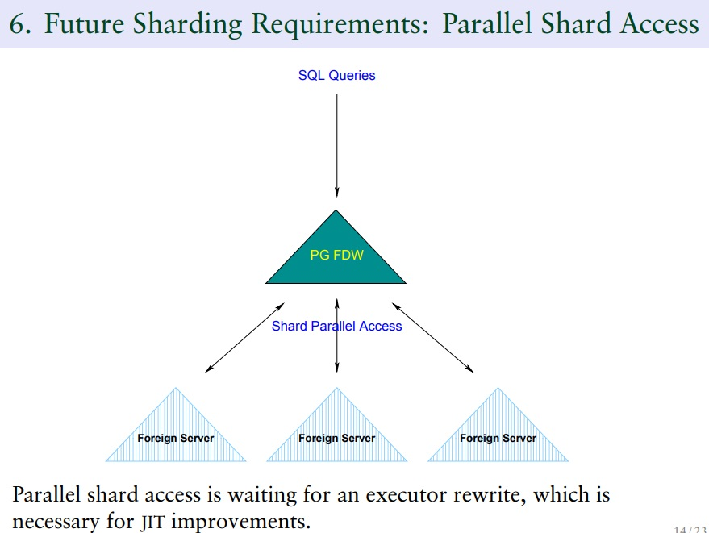
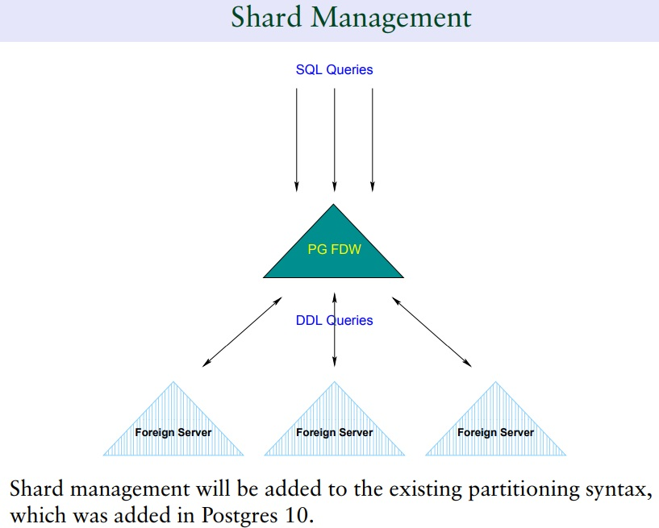
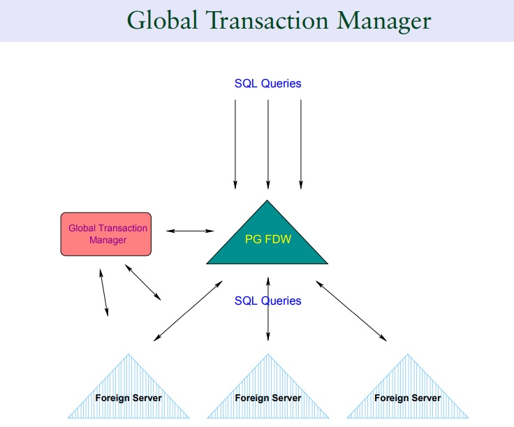

## PostgreSQL 12 内置 sharding 进展(fdw)  
                                                                                                                                                          
### 作者                                                                                                                                                          
digoal                                                                                                                                                          
                                                                                                                                                          
### 日期                                                                                                                                                          
2019-06-07                                                                                                                                                          
                                                                                                                                                          
### 标签                                                                                                                                                          
PostgreSQL , sharding , fdw   
                                                                         
----                                                                                                                                                    
                                                                                                                                                      
## 背景       
PostgreSQL 的sharding方法非常的多。目前流行的包括  
  
plproxy，开源的language。需要使用存储过程接口。性能最好，应用侵入最大。  
  
citus，开源的PG sharding插件，已经被微软收购，但是会继续开源。有开源版和企业版两种发行版本。目前发展最快，同时与PG数据库解耦，PG发行大版本时可以很快的发行CITUS的插件适配大版本。很不错。前景看好。  
  
pg-xc/xl，基于PG改造的一款SHARDING数据库，目前分布式的功能最完善。但是没有很好的商业化运作，导致社区版本发展并不是特别好，反而是基于PG-XC/XL的一些数据库发展更好，例如antdb, xz, 等。  
  
greenplum，基于PG改的一款面向OLAP的数据库，应该是目前DW应用领域最好的开源MPP数据库。有非常大面积的应用。  
  
pg_shardman，PostgresPRO开源的，基于fdw接口的sharding插件。  
  
PostgreSQL 社区也在基于fdw接口演进sharding功能，bruce momjian分享了pg sharding的演进情况。  
  
http://momjian.us/main/writings/pgsql/sharding.pdf  
  
https://wiki.postgresql.org/wiki/Built-in_Sharding  
  
[sharding](20190607_03_doc_001.pdf)  
  
## PG 内置 Sharding 功能的演进  
1、目前PG已经可以通过fdw外部表接口实现的功能包括  DML, query。   
  
2、fdw 下推支持：sort, filter, agg, join  
  
3、支持fdw分区表  
  
实际上已经具备了pg sharding的雏形。    
  
只不过目前从完备性来讲还需要改进的包括：  
  
1、目前fdw分区是串行运行的，分区多，并且查询涉及多分区时，性能是没有线性的。(而实际上plproxy, citus, pg-xc, greenplum都已经支持了异步并行，所以多分区操作，性能是线性的)  
  
sharding 的异步并行在研发中  
  
  
  
在PG 11的版本中，我们使用HINT可以让多个分区并行。未来可能会支持得更好。  
  
[《PostgreSQL 并行计算解说 之25 - parallel FDW scan (并行访问多个外部表) with parallel append (FDW must with IsForeignScanParallelSafe)》](../201903/20190317_18.md)    
  
[《PostgreSQL 并行计算解说 之23 - parallel union all》](../201903/20190317_16.md)    
  
  
2、replica table(支持join with replica table，优化器支持)  
  
  
  
3、支持 shard 语法   
  
  
  
4、支持gsm (Global Snapshot Manager)  
  
  
  
     
    
## 参考    
http://momjian.us/main/writings/pgsql/sharding.pdf  
  
https://wiki.postgresql.org/wiki/Built-in_Sharding  
  
[sharding](20190607_03_doc_001.pdf)  
  
[《PostgreSQL 并行计算解说 之25 - parallel FDW scan (并行访问多个外部表) with parallel append (FDW must with IsForeignScanParallelSafe)》](../201903/20190317_18.md)    
  
[《PostgreSQL 并行计算解说 之23 - parallel union all》](../201903/20190317_16.md)    
      
  
  
  
  
  
  
  
  
  
#### [免费领取阿里云RDS PostgreSQL实例、ECS虚拟机](https://free.aliyun.com/ "57258f76c37864c6e6d23383d05714ea")
  
  
#### [digoal's PostgreSQL文章入口](https://github.com/digoal/blog/blob/master/README.md "22709685feb7cab07d30f30387f0a9ae")
  
  

  
  
#### 老婆的钱袋子：可以打赏哦^_^  

  
