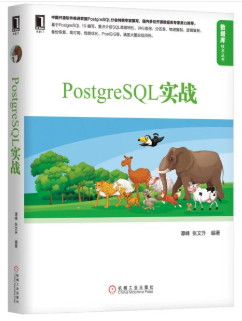
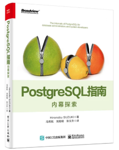

## PostgreSQL 一条简单、“有人情味”的抽随机奖SQL      
            
### 作者                                                                                                                                                                                  
digoal                                                                                                                                                                                  
                                                                                                                                                                                  
### 日期                                                                                                                                                                                  
2019-06-13                                                                                                                                                                                  
                                                                                                                                                                                  
### 标签                                                                                                                                                                                
PostgreSQL , 抽奖 , 权重 , 随机 , 排序           
                                                                                               
----                                                                                                                                                                          
                                                                                                                                                                            
## 背景     
最近正在搞PG天天象上-武汉站的推广和分享有奖的活动。  
  
https://yq.aliyun.com/event/481  
  
分享报名链接，点赞数超过24即可参与抽奖。奖品是最近的PG新书《PostgreSQL 内幕指南》。  
    
  
  
  
  
本着细水长流的原则，每个月都有PG天天象上的活动，活动围绕PG相关的技术、生态进行全国性的巡讲，每个月一座城市。所以每个月都会搞抽奖，每次例如抽出3名中奖者，送出一本《PostgreSQL 内幕指南》何乐不为呢。  
  
为了保证大伙的积极性，抽奖会考虑两个原则：  
  
1、优先达到24个点赞数的同学，中奖权重要高一点。  
  
2、所有人都有机会中奖，使用随机分布进行排序。  
  
The random function generates values using a uniform distribution, that is all the values are drawn within the specified range with equal probability.  
  
衍生一下，pgbench是PG的压测软件，支持的随机分布方法有多种：  
  
random_zipfian  
  
random_gaussian  
  
random_exponential  
  
random  
  
言归正传，为了达到以上两个“有人情味”的抽奖要求，怎样的SQL可以呢？  
  
## 纯离散，所有人概率都一样  
例如有20个人达到了24个赞，抽出5个人。  
  
```  
postgres=# select i from generate_series(1,20) i order by i*random();  
 i    
----  
 11  
  3  
  1  
  4  
 19  
  2  
  6  
  8  
  5  
  7  
 20  
 13  
 14  
 16  
 12  
  9  
 10  
 18  
 15  
 17  
(20 rows)  
```  
  
如果取前5，那么就是第11,3,1,4,19位达到点赞数的几位获奖。  
  
## 权重分段  
例如，有20位达到点赞数，要抽出5位中奖者，将权重分为5段。  
  
SQL如下  
  
```  
postgres=# select ceil(i/(20/5)::numeric),i from generate_series(1,20) i;  
 ceil | i    
------+----  
    1 |  1  
    1 |  2  
    1 |  3  
    1 |  4  
    2 |  5  
    2 |  6  
    2 |  7  
    2 |  8  
    3 |  9  
    3 | 10  
    3 | 11  
    3 | 12  
    4 | 13  
    4 | 14  
    4 | 15  
    4 | 16  
    5 | 17  
    5 | 18  
    5 | 19  
    5 | 20  
(20 rows)  
```  
  
1,2,3,4属于第一段.以此类推。  
  
在排序时，将段位作为权重，按随机数乘以段位顺序排序，这样的话段位低的，中奖的概率可能会高一点。  
  
  
```  
postgres=# select ceil(i/(20/5)::numeric),i from generate_series(1,20) i order by ceil(i/(20/5)::numeric)*random();  
 ceil | i    
------+----  
    4 | 15  
    1 |  1  
    1 |  2  
    3 | 11  
    1 |  3  
    3 | 10  
    2 |  6  
    5 | 20  
    1 |  4  
    5 | 17  
    4 | 14  
    5 | 18  
    3 | 12  
    2 |  7  
    2 |  8  
    3 |  9  
    2 |  5  
    5 | 19  
    4 | 13  
    4 | 16  
(20 rows)  
```  
  
如果取前5，那么就是第15,1,2,11,3位达到点赞数的几位获奖。  
  
## 小结  
1、不分段加权排序，排名越前，被抽中的概率越高。但是参与人数越多，越后面的人机会就越渺茫，因为权重相差太大了。  
  
```  
postgres=# select i from generate_series(1,20) i order by i*random() limit 5;  
 i    
----  
  1  
 12  
  2  
  4  
 15  
(5 rows)  

postgres=# select i from generate_series(1,2000) i order by i*random() limit 5;
  i  
-----
 229
 167
   8
   5
  42
(5 rows)
```  
  
2、分段加权排序，同样排名越前，被抽中的概率越高，但是只分了N个段，相比不分段排序，排名靠后的还是很有机会中奖滴，因为权重值不会相差太大，还是很有温度的。  
  
```  
postgres=# select ceil(i/(20/5)::numeric),i from generate_series(1,20) i order by ceil(i/(20/5)::numeric)*random() limit 5;  
 ceil | i    
------+----  
    1 |  3  
    1 |  1  
    4 | 13  
    1 |  4  
    2 |  5  
(5 rows)  

postgres=# select ceil(i/(2000/5)::numeric),i from generate_series(1,2000) i order by ceil(i/(20/5)::numeric)*random() limit 5;  
 ceil |  i   
------+------
    1 |   16
    4 | 1529
    1 |   11
    1 |  181
    1 |   78
(5 rows)
```  
  
3、纯随机，任何人机会都一样  
  
```  
postgres=# select i from generate_series(1,20) i order by random() limit 5; 
 i  
----
 10
 14
 20
 17
 18
(5 rows)

postgres=# select i from generate_series(1,2000) i order by random() limit 5; 
  i   
------
 1852
  678
 1133
  626
  589
(5 rows)  
```  
  
## 参考
其他随机相关用法和优化   
  
[《PostgreSQL 随机记录返回 - 300倍提速实践 (随机数组下标代替order by random())》](../201810/20181009_01.md)    
  
[《PostgreSQL 内容随机推荐系统开发实践 - 文章随机推荐》](../201808/20180810_01.md)    
  
[《随机记录并发查询与更新(转移、删除)的"无耻"优化方法》](../201501/20150129_01.md)    
  
[《PostgreSQL 随机查询优化》](../201102/20110212_01.md)    
  
[《PostgreSQL 随机数据生成(tablefunc.normal_rand 指定mean stddev)》](../201807/20180714_01.md)    
  
[《PostgreSQL 生成随机身份证ID》](../201710/20171016_02.md)    
  
[《大规模数据存储集群数据存放的设计，分布式shardid的生成 - 如何指定范围随机数, 分组随机数》](../201707/20170706_02.md)    
  
[《PostgreSQL 中生成随机汉字》](../201704/20170425_01.md)   
  
[《生成泊松、高斯、指数、随机分布数据 - PostgreSQL 9.5 new feature - pgbench improve, gaussian (standard normal) & exponential distribution》](../201506/20150618_01.md)    
   
  
  
  
  
  
  
  
  
  
#### [免费领取阿里云RDS PostgreSQL实例、ECS虚拟机](https://free.aliyun.com/ "57258f76c37864c6e6d23383d05714ea")
  
  
#### [digoal's PostgreSQL文章入口](https://github.com/digoal/blog/blob/master/README.md "22709685feb7cab07d30f30387f0a9ae")
  
  

  
  
  
  
  
  
  
