## 阿里云RDS PG 11，因你而来，改变不止一点点     
                                                                 
### 作者                                                                 
digoal                                                                 
                                                                 
### 日期                                                                 
2019-07-02                                                               
                                                                 
### 标签                                                                 
PostgreSQL , 阿里云     
                                                                 
----                                                                 
                                                                 
## 背景       
阿里云RDS PG，基于ECS和云盘重新构建，功能大改版。重磅推出改版后的10,11 ECS+云盘的跨可用区高可用版。    
    
阿里云RDS PG 11，因你而来，改变不止一点点。重大的改进例如：    
    
1、支持ESSD，最大可达100万IOPS，32TB，同时价格不变。    
    
2、支持了存储云盘加密功能。提高了数据安全性。    
    
3、支持SSL链路、风控点。    
    
4、支持了三种保护模式（最大保护，最高性能，最高可用）。用户可以在数据可靠性、可用性之间进行权衡，选择对应的模式。    
    
5、支持了任意小版本管理    
    
未来的版本也会继续基于这个架构来构建。    
    
## 1 主可用区可定义    
支持主可用区选择，业务与数据库放在同一可用区，确保网络延迟最低。    
    
实例发生切换后，如果与购买时选择的主可用区不一致，会发出告警，同时用户可以切回主可用区。    
    
    
    
## 2 支持PG 10 11两个版本    
目前只支持10，11。未来会快速的支持新版本，例如12。    
    
    
    
## 3 支持SSD和ESSD双存储，存储与规格解绑    
支持ESSD存储，最高可达100万IOPS。    
    
普通云盘最大6TB，ESSD最大32TB。    
    
同时存储空间和实例规格完全解绑，4核也能卖32T的空间了。    
    
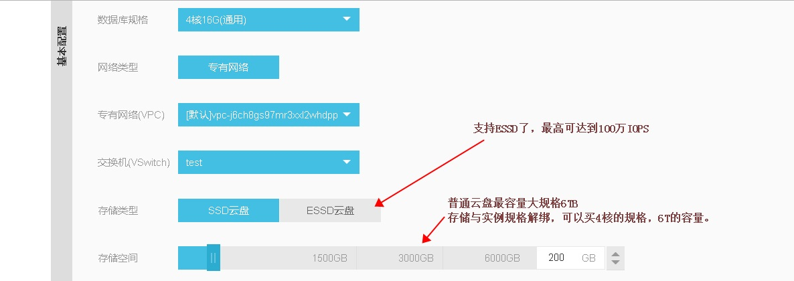    
    
    
    
## 4 数据存储更安全，支持云盘加密，支持BYOK    
    
数据盘支持了全盘存储，加密KEY可以由用户提供，也可以由KMS服务生成。    
    
    
    
## 支持只读锁定功能    
例如，用户要做割接，迁移，或者要做一些维护任务时。想把数据库置为只读，避免有数据写入。    
    
将实例设置为只读，可以确保不会有数据写入实例。同时还能继续为只读的业务提供服务。    
    
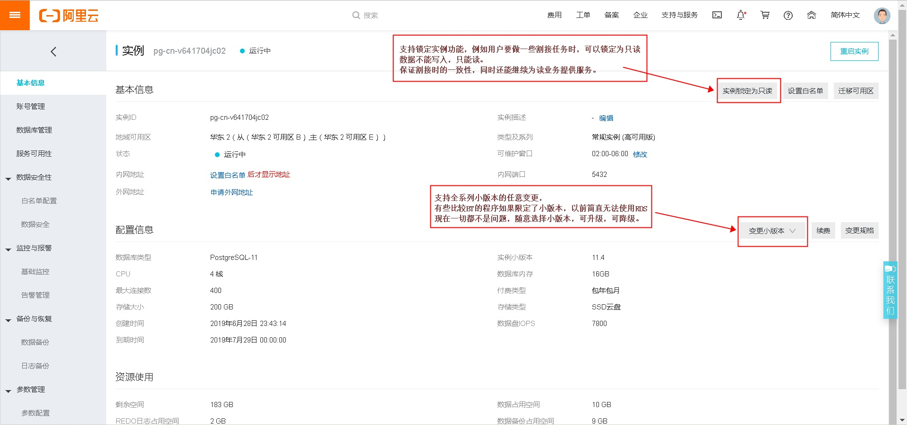    
    
## 5 支持任意小版本管理    
只要是打包了的小版本，都可以升级、可以回退小版本。    
    
例如有一些业务可能会限定小版本，有了版本管理的功能，再也不用担心回不到以前的版本了。    
    
## 6 支持数据可靠性、可用性级别配置（保护模式配置）    
    
RDS PG内核支持了自动降级和自动升级功能。    
    
用户可选三种数据保护模式：    
    
1、最大保护，主从复制采用全同步模式，确保主从切换时，数据0丢失（RPO=0）    
    
2、最高可用，从库正常的情况下，采用同步复制模式。从库异常时，自动降级为异步模式，保证可用性。    
    
这种模式确保尽可能的数据0丢失，降级后则与异步模式一样，主从切换如果发生在异步模式时，最多丢失60S。主从切换如果发生在同步模式时，数据0丢失。    
    
3、最高性能，主从采用异步模式同步数据，主从切换如果发生在异步模式时，最多丢失60S。    
    
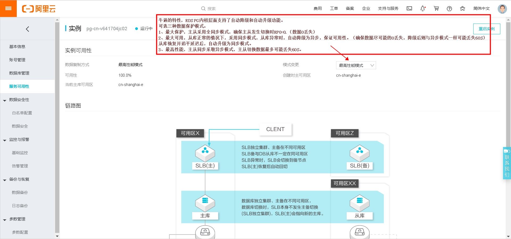    
    
用户可以根据业务对数据库的实际需求选择几种模式。    
    
## 7 更健壮的架构    
    
1、保证SLB的主节点与用户选择的主可用区一致，确保用户到SLB再到数据库主节点的网络链路最优。    
    
2、云盘与实例主可用区一致，确保IO链路的延迟最低。    
    
3、云盘快照备份，保证了备份的高效率。支持增量备份，最大可以支持32TB数据。    
    
4、备份数据最终会上传到OSS集群，OSS集群与存储集群完全独立，确保了备份数据的冗余性，提供备份的可靠性。    
    
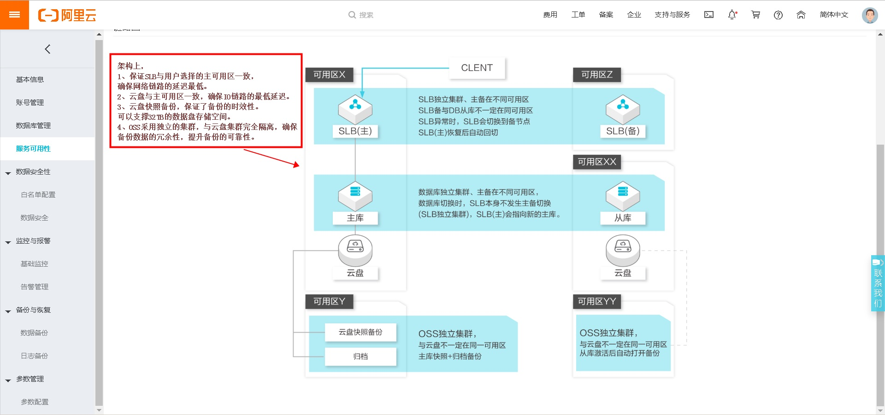    
    
## 8 SSL数据链路与存储加密 ， 安全双管齐下    
    
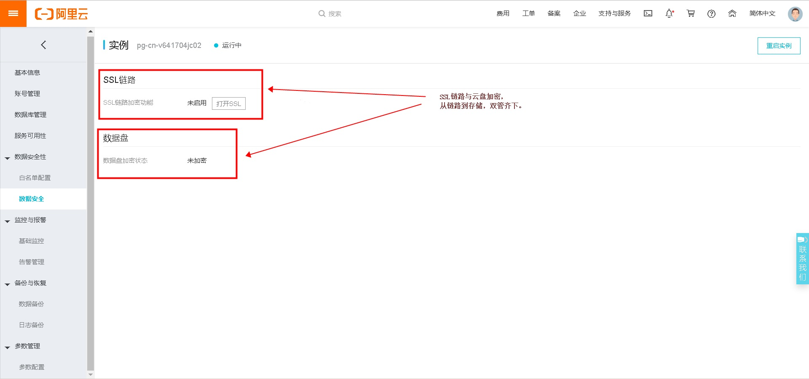    
    
## 9 更丰富的监控指标    
    
tps    
    
操作行数    
    
连接    
    
膨胀点    
    
慢查询    
    
长事务    
    
2PC    
    
空间使用    
    
主从延迟，SLOT延迟    
    
数据盘IOPS    
    
数据盘吞吐    
    
数据盘 空间、INODE 使用率    
    
CPU    
    
网络    
    
内存    
    
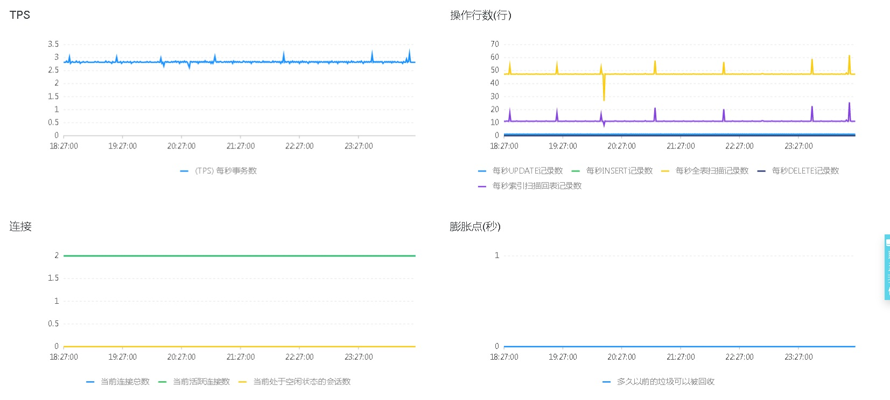    
    
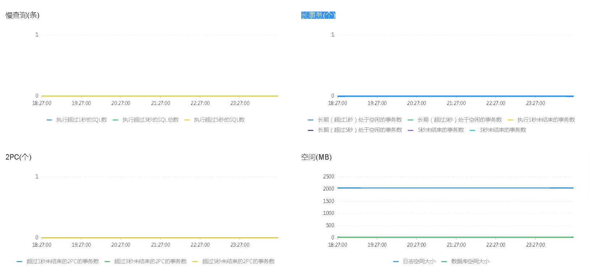    
    
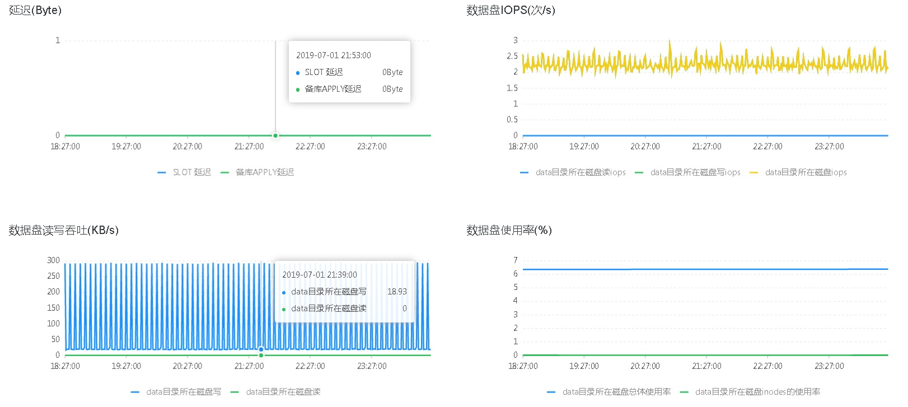    
    
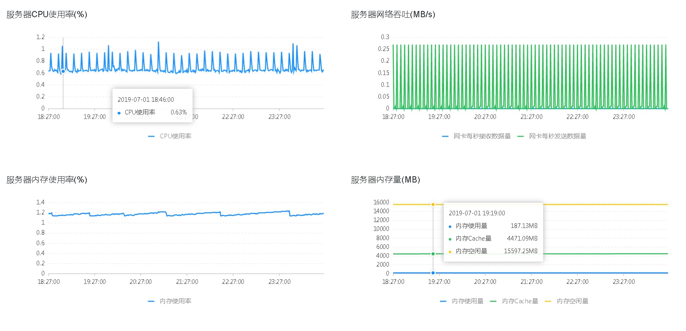    
    
## 10 告警默认指标更加丰富有效    
    
CPU使用率    
    
inode使用率    
    
iops使用率    
    
平均活跃连接    
    
磁盘使用率    
    
连接使用率    
    
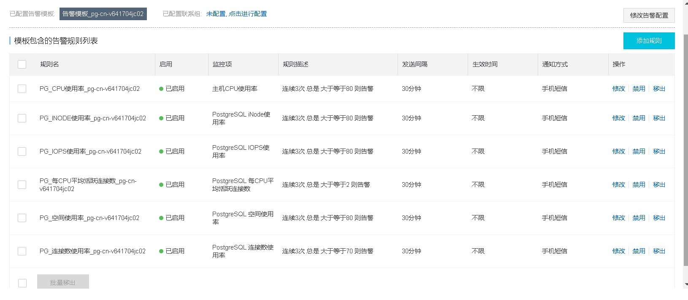    
    
## 11 备份更高效、省成本    
由于使用了存储快照备份，所以    
    
1、更快    
    
2、更省空间（块级增量备份）    
    
3、恢复更快    
    
4、克隆更方便    
    
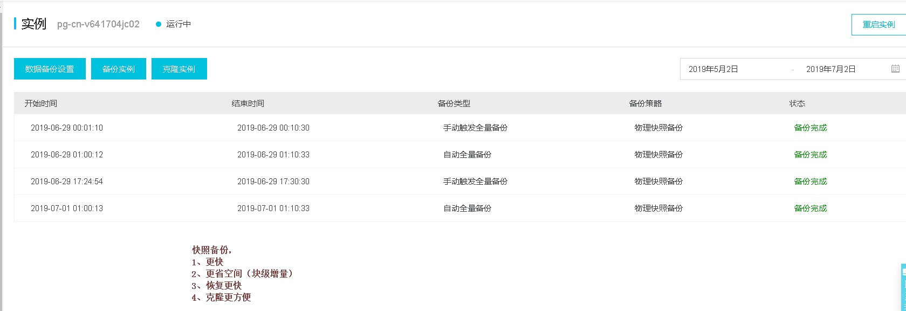    
    
## 12 克隆时可以更换可用区、更新磁盘类型（ssd、essd）    
如果一开始使用的是SSD，想更换到ESSD，克隆时可以更换。    
    
克隆时，还可以更换可用区、规格等信息。    
    
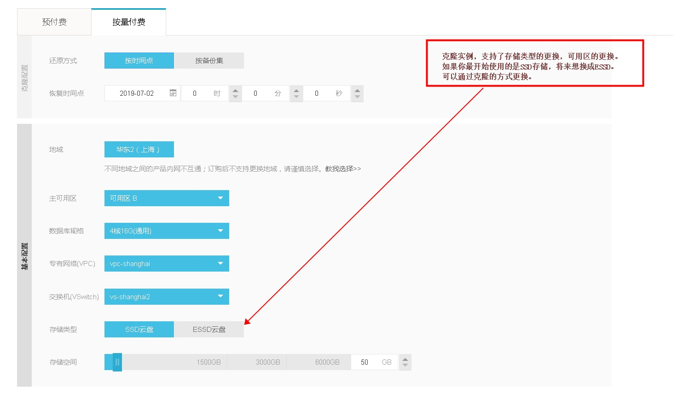    
    
## 13 用户可自定义参数更加安全    
    
虽然RDS PG 11的默认参数更加合理，但是为了满足用户定制化的需求，依旧会开放一些参数的设定。    
    
筛选了用户最常见的自定义参数，同时对参数的可设置范围进行了安全限定，大幅度降低用户因为参数设置有误导致的问题。    
    
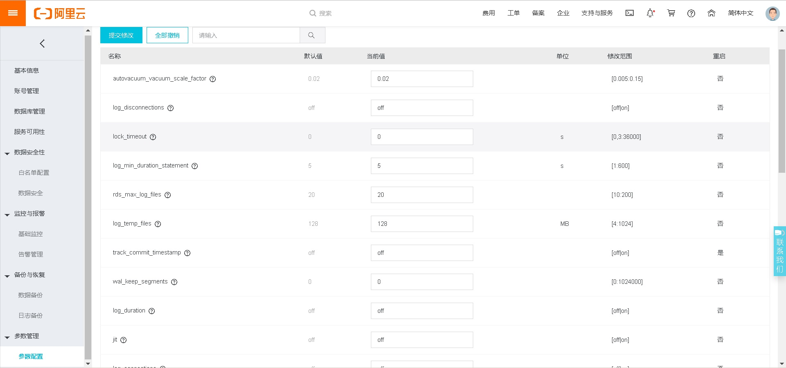    
    
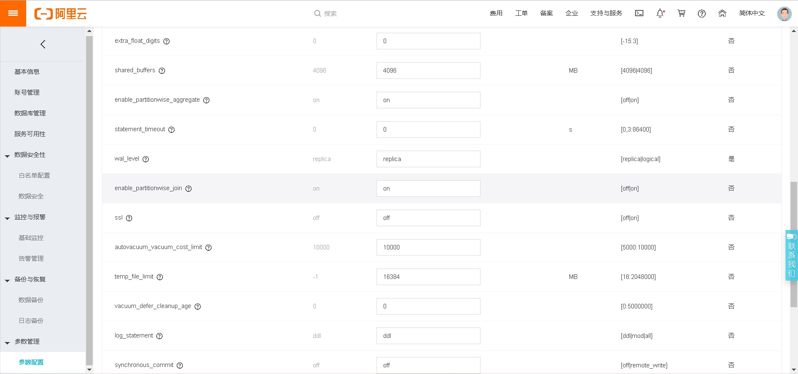    
    
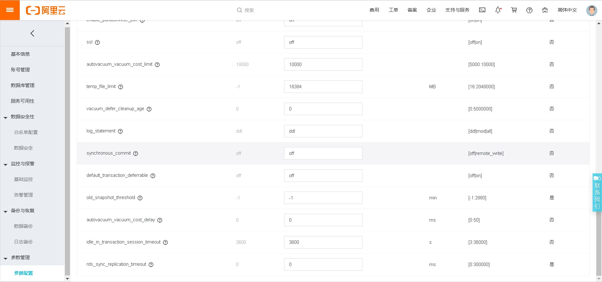    
    
## 14 增加了更多的风控点    
    
控制台操作和API操作，和用户操作数据库一样，都有可能出现误操作，为了尽可能降低用户误操作带来的损失，我们增加了一些风控点。    
    
在风控点的操作，都必须短信验证才能继续。    
    
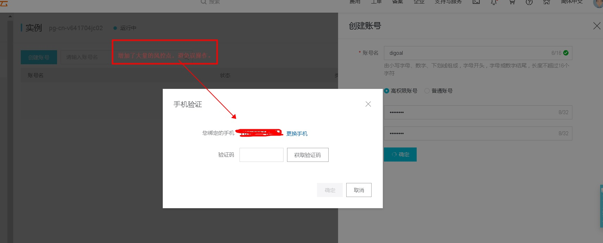    
    
## 15 账号和数据库管理更加的人性化    
    
1、允许创建任意个超级或普通账号    
    
2、允许用户锁定账号，例如因为员工离职，或者某些情况下要锁定账号而不是删除账号的功能。锁定的账号，账号OWN的对象还在，经过SQL授权可以继续被其他账号访问。    
    
3、允许用户删除账号。    
    
4、允许用户创建数据库，同时指定数据库的encodding, lc等信息。    
    
## just do it  
将来会基于这个架构继续演进，支持更多用户需要的功能。快速的迭代新的版本。支持更多的插件。支持更多的网络特性(例如可通过FDW，EXTENSION等对接云端其他产品)。等等，总之一切为了更好的为用户服务。     
    
购买链接如下：    
    
https://postgresql.console.aliyun.com/cn-shanghai/instance    
    
  
  
  
  
## [digoal's 大量PostgreSQL文章入口](https://github.com/digoal/blog/blob/master/README.md "22709685feb7cab07d30f30387f0a9ae")
  
  
## [免费领取阿里云RDS PostgreSQL实例、ECS虚拟机](https://free.aliyun.com/ "57258f76c37864c6e6d23383d05714ea")
  
